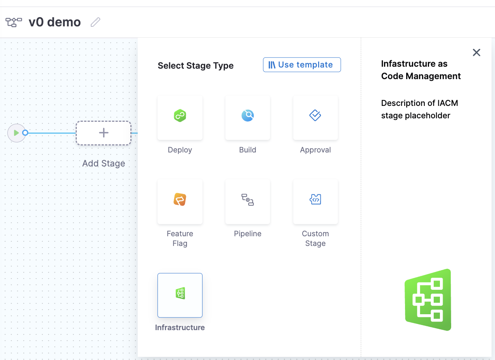

After you create a workspace, you can perform operations against the configuration, such as provisioning and destroying. You must use a Harness pipeline to provision or destroy a workspace. 

## Provision a workspace

You can use the Harness Visual Editor or YAML to provision a workspace.


```mdx-code-block
import Tabs from '@theme/Tabs';
import TabItem from '@theme/TabItem';
```
```mdx-code-block
<Tabs>
  <TabItem value="Visual" label="Visual">
```

1. In the Harness project pane, select **Pipelines**.
2. Select **+ Create a Pipeline** and set up a pipeline. 
3. Select **Add Stage**, and then on the **Select Stage Type** pane, select **Infrastructure**.

    

4. Enter a stage name and an optional description and tag. Select **Set Up Stage**. 

5. On the **Workspace** tab, select an existing workspace or select **+ Create New Workspace** to create a new workspace. A workspace can also be determined during execution if the value is set to be `runtime input`.

6. Select the **Execution** tab, and then from **Common Operations**, select **Provision**.

7. Select **Use Strategy**.

  Init, plan, and apply steps are added. You can also customize the pipeline and add more steps.

8. Select **Save**, and then select **Run Pipeline**. 

9. After the plan is created, switch to the **Resources** tab to see all the resources and Terraform outputs that will be generated once the plan is applied. You can see which resources will be added, changed, or removed from the state. 

10. Select **Resources** to see the attribute details. 

    The execution was completed, and the state was created. Harness IaCM provides state management, so the state was saved in the Harness backend. This implicit step happens behind the scenes during pipeline execution; you don’t need to configure it. 

    You can also define a trigger for the pipeline to be executed when there is a change in the Terraform configuration.

```mdx-code-block
  </TabItem>
  <TabItem value="YAML" label="YAML" default>
```
Use the following sample and update the areas in brackets. 

```yaml
pipeline:
  name: <<PIPELINE NAME>>
  identifier: <<PIPELINE IDENTIFIER>>
  projectIdentifier: <<PROJECT IDENTIFIER>>
  orgIdentifier: <<ORG IDENTIFER>>
  tags: {}
  stages:
    - stage:
        name: testiacm
        identifier: testiacm
        description: ""
        type: IACM
        spec:
          platform:
            os: Linux
            arch: Amd64
          runtime:
            type: Cloud
            spec: {}
          workspace: <<WORKSPACE ID>>
          execution:
            steps:
              - step:
                  type: IACMTerraformPlugin
                  name: init
                  identifier: init
                  timeout: 5m
                  spec:
                    command: init
              - step:
                  type: IACMTerraformPlugin
                  name: plan
                  identifier: plan
                  timeout: 5m
                  spec:
                    command: plan
              - step:
                  type: IACMTerraformPlugin
                  name: apply
                  identifier: apply
                  timeout: 5m
                  spec:
                    command: apply
        tags: {}
```

```mdx-code-block
  </TabItem>
</Tabs>
```

## Destory a workspace

You can use the Harness Visual Editor or YAML to create a pipeline that will tear down (destroy) a workspace. 


```mdx-code-block
<Tabs>
  <TabItem value="Visual" label="Visual">
```

1. In the Harness project pane, select **Pipelines**.
2. Select **+ Create a Pipeline** and set up a pipeline. 
3. Select **Add Stage**, and then on the **Select Stage Type** pane, select **Infrastructure**.
4. Enter a stage name and an optional description and tag. Select **Set Up Stage**. 
5. On the **Workspace** tab, select an existing workspace or select **+ Create New Workspace** to create a new workspace. A workspace can also be determined during execution if the value is set to be `runtime input`.
6. On the **Execution** tab, in **Common Operations**, select **Destroy**.
7. Select **Use Strategy**.

  Init, plan, and destroy steps are added. You can also customize the pipeline and add more steps.

8. Select **Save**, and then select **Run Pipeline**. 

* The plan-destroy step generates a Terraform plan. This Terraform plan is accessible to all the steps after the IaCM Terraform plan, and can be referenced using the expression `<+pipeline.stages.STAGE_ID.spec.execution.steps.STEP_ID.output.outputVariables.parsedPlan>`.

9. After the plan is created, switch to the **Resources** tab to see all the resources and Terraform outputs that will be generated once the plan is applied. You can see which resources will be removed from the state. 

10. Select **Resources** to see the attribute details. 

```mdx-code-block
  </TabItem>
  <TabItem value="YAML" label="YAML" default>
```
Use the following sample and update the areas in brackets. 

```yaml
pipeline:
  name: <<PIPELINE NAME>>
  identifier: <<PIPELINE IDENTIFIER>>
  projectIdentifier: <<PROJECT IDENTIFIER>>
  orgIdentifier: <<ORG IDENTIFER>>
  tags: {}
  stages:
    - stage:
        name: iacstage
        identifier: iacstage
        description: ""
        type: IACM
        spec:
          workspace: <<WORKSPACE ID>>
          platform:
            os: Linux
            arch: Amd64
          runtime:
            type: Cloud
            spec: {}
          execution:
            steps:
              - step:
                  type: IACMTerraformPlugin
                  name: init
                  identifier: init
                  spec:
                    command: init
                  timeout: 5m
              - step:
                  type: IACMTerraformPlugin
                  name: plan
                  identifier: plandestroy
                  spec:
                    command: plan-destroy
                  description: plan destroy
              - step:
                  type: IACMTerraformPlugin
                  name: destroy
                  identifier: destroy
                  spec:
                    command: destroy
                  description: destroy
                  timeout: 5m
        tags: {}
```

```mdx-code-block
  </TabItem>
</Tabs>
```
