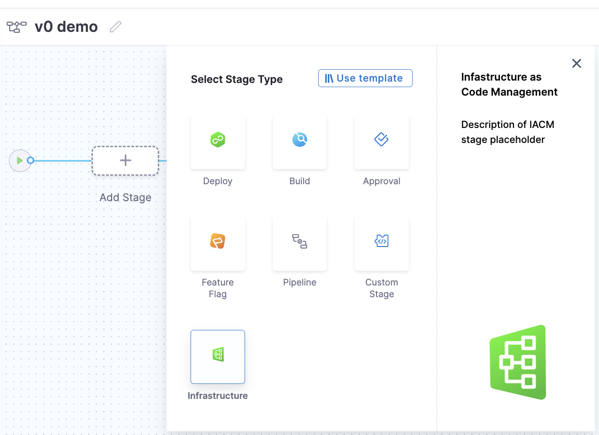

import Tabs from '@theme/Tabs';
import TabItem from '@theme/TabItem';
import { Troubleshoot } from '@site/src/components/AdaptiveAIContent';

After you create a workspace, you can perform operations against the configuration, including provisioning. This guide walks you through how to create a provision pipeline to run the `init`, `plan` and `apply` commands with OpenTofu or Terraform.

---

## Before you begin

Before you create a provision pipeline in your workspace, ensure you have the following:

- **IaCM-enabled Harness account:** You need Infrastructure as Code Management available in your Harness project. Go to [Get started with IaCM](/docs/infra-as-code-management/get-started) to set up your account and enable the module.
- **Workspace:** You need an existing workspace to provision. Go to [Create a workspace](/docs/infra-as-code-management/workspaces/create-workspace) to set one up before running a provision pipeline.
- **Pipeline permissions:** You need **View**, **Create/Edit**, and **Execute** permissions on Pipelines. Go to [RBAC in Harness](/docs/platform/role-based-access-control/rbac-in-harness) to configure roles, and go to the [Permissions reference](/docs/platform/role-based-access-control/permissions-reference) to review the required permissions.

---

<Tabs>
<TabItem value="Interactive" label="Interactive Guide" default>
<iframe 
    src="https://app.tango.us/app/embed/c80ce1fe-cc35-45a4-9c7d-b36451567a97" 
    title="Provision workspaces" 
    style={{ minHeight: '640px' }}
    width="100%" 
    height="100%"
    referrerpolicy="strict-origin-when-cross-origin"
    frameborder="0"
    webkitallowfullscreen="true"
    mozallowfullscreen="true"
    allowfullscreen="true"
></iframe>
</TabItem>
<TabItem value="Step-by-Step" label="Step-by-Step">
Follow these instructions to provision a workspace within the Harness Visual Editor.

1. In the Harness project pane, select **Pipelines**.
2. Click **+ Create a Pipeline** to set up a new pipeline.
3. Click **Add Stage** and select **Infrastructure** from the **Select Stage Type** pane.

    

4. Enter a stage name, optional description, and tag, then select **Set Up Stage**.
5. On the **Workspace** tab, select an existing workspace or click **+ Create New Workspace** to create one.
:::note runtime input
If set to `runtime input`, you can specify the workspace at execution time.
:::
6. Go to the **Execution** tab. Under **Common Operations**, select **Provision**. Go to [Pipeline operations](/docs/infra-as-code-management/pipelines/operations-overview) to learn about other available operations such as drift detection and PR automation.
7. Optionally, select **Use Strategy** to automatically add `init`, `plan`, and `apply` steps, or customize the pipeline by adding steps manually.
8. Click **Save** and then **Run Pipeline** to execute.
</TabItem>
<TabItem value="YAML" label="YAML">
To provision a workspace via YAML, use the template below. Replace bracketed placeholders as needed.

```yaml
pipeline:
  name: <<PIPELINE NAME>>
  identifier: <<PIPELINE IDENTIFIER>>
  projectIdentifier: <<PROJECT IDENTIFIER>>
  orgIdentifier: <<ORG IDENTIFIER>>
  tags: {}
  stages:
    - stage:
        name: Provision Stage
        identifier: provision_stage
        type: IACM
        spec:
          workspace: <<WORKSPACE ID>>
          platform:
            os: Linux
            arch: Amd64
          runtime:
            type: Cloud
            spec: {}
          execution:
            steps:
              - step:
                  type: IACMTerraformPlugin
                  name: init
                  identifier: init
                  spec:
                    command: init
              - step:
                  type: IACMTerraformPlugin
                  name: plan
                  identifier: plan
                  spec:
                    command: plan
              - step:
                  type: IACMTerraformPlugin
                  name: apply
                  identifier: apply
                  spec:
                    command: apply
        tags: {}
```
:::note
`IACMTerraformPlugin` is the step type for both Terraform and OpenTofu workspaces. Use the same step type regardless of which provisioner your workspace is configured to use.
:::
</TabItem>
</Tabs>

---

## Add guardrails before apply

To prevent unverified or non-compliant changes from reaching your infrastructure, you can add some guardrails in your provisioning pipeline.

- **Approval step:** Add a manual approval step after the diff review step so a reviewer can confirm planned changes, policy results, and cost estimates before infrastructure changes apply. Without this gate, unverified changes apply automatically. Go to [Pipeline operations](/docs/infra-as-code-management/pipelines/operations-overview) to add an approval step to your provisioning pipeline.

- **OPA (Open Policy Agent) policies:** Apply OPA policies to warn or fail the pipeline when a change violates your rules, such as version requirements, resource tagging, or connector restrictions. Without policy enforcement, a non-compliant change reaches production before anyone reviews it. Go to [OPA policies for workspaces](/docs/infra-as-code-management/policies-governance/opa-workspace) to configure policy enforcement.

- **Cost checks (not supported for AWS CDK workspaces):** Enable cost estimation and cost policies so a plan that exceeds a cost threshold stops before apply. Without cost controls, a large or mistyped change provisions expensive resources before you see the impact. Go to [cost estimation](/docs/infra-as-code-management/workspaces/cost-estimation) to enable cost visibility, and go to [plan and cost policies](/docs/infra-as-code-management/policies-governance/terraform-plan-cost-policy) to set thresholds that block apply.

---

## Troubleshooting

<Troubleshoot
  issue="Harness IaCM provision pipeline plan step fails with connector or authentication error"
  mode="docs"
  fallback="Verify that the connector attached to your workspace has valid credentials and the correct permissions for your cloud provider. Go to the workspace Variables and Connectors tab to inspect and update the connector."
/>

<Troubleshoot
  issue="Harness IaCM provision pipeline apply step times out or fails mid-run"
  mode="docs"
  fallback="Check the apply step logs for the specific resource that failed. Common causes are insufficient cloud provider permissions, resource conflicts, or a state lock held by another run. Resolve the underlying error and re-run the pipeline."
/>

<Troubleshoot
  issue="IaCM approval step does not show cost estimates after plan"
  mode="docs"
  fallback="Verify that cost estimation is enabled on the workspace Configuration tab. Cost estimates only appear when a plan step precedes the approval step and cost estimation is toggled on for the workspace."
/>

---

:::tip review resources
After the pipeline completes, go to the workspace **Resources** tab to view all provisioned resources, data sources, and outputs managed by your workspace.
:::

---

## Next steps

Your workspace is now provisioned. You can monitor and manage infrastructure changes with the following operations.

- Go to [Pipeline operations](/docs/infra-as-code-management/pipelines/operations-overview) to add drift detection, PR automation, and queue steps to your pipelines.
- Go to [Default pipelines](/docs/infra-as-code-management/pipelines/default-pipelines) to set a shared provision pipeline across all workspaces in a project.
- Go to [Delete a workspace](/docs/infra-as-code-management/workspaces/delete-workspace) to destroy and remove a workspace when it is no longer needed.
