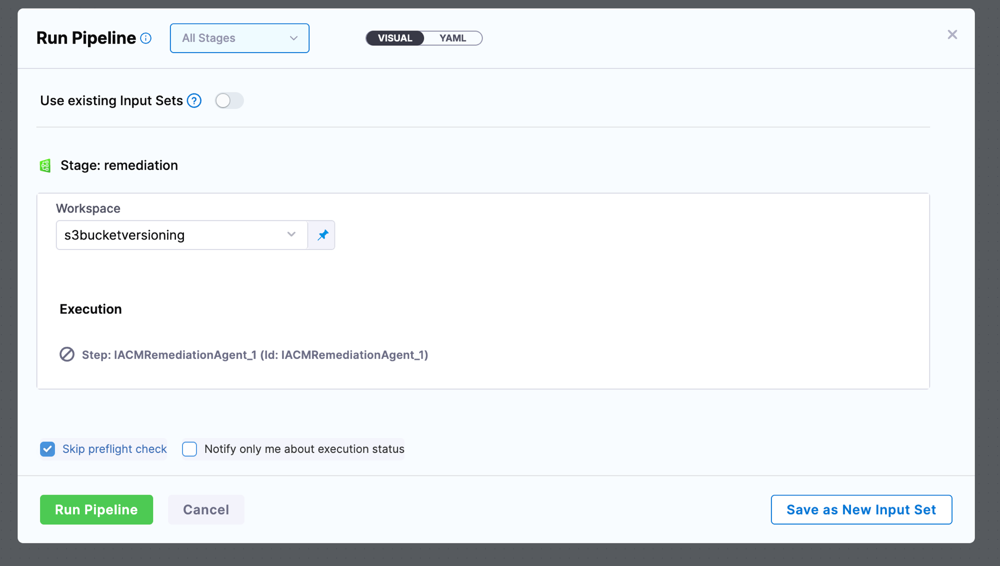

import { Troubleshoot } from '@site/src/components/AdaptiveAIContent';

:::warning Beta
The IaCM Remediation Agent is currently **pending release**. Contact [Harness Support](mailto:support@harness.io) to request access.
:::

When Harness IaCM detects that a resource has drifted from your OpenTofu or Terraform configuration, the Remediation Agent helps you close that gap. It analyzes the drift insight and generates a pull request with recommended configuration changes, which you launch from the [Insights](/docs/infra-as-code-management/workspaces/insights) tab of a workspace.

The agent does not change your infrastructure directly. It generates a pull request so you can review the proposed changes before they become part of your IaC configuration, which keeps your Git repository the source of truth.

---

## How remediation works

Remediation runs on the project's default remediation pipeline. You configure this pipeline once for the project in the IaCM Defaults, and it then applies to every workspace in the project. Harness does not remediate drift automatically; you start each remediation from an insight. From detection to a merged fix, the flow is:

1. Harness IaCM detects a drift insight for a resource in your workspace.
2. You click **Apply with agent** on the Insights tab.
3. Harness runs the project's default remediation pipeline, which contains a single Remediation Agent step.
4. The agent generates a pull request with recommended IaC changes for the drifted resource.
5. You review and merge the pull request, then provision the workspace to apply the change.

---

## Before you begin

Before you launch remediation, confirm the following are in place:

- **A workspace with an open drift insight:** Drift insights appear on the Insights tab. Go to [Drift detection](/docs/infra-as-code-management/pipelines/operations/drift-detection) to configure drift detection.
- **A default remediation pipeline:** Configure the remediation pipeline for the project in the IaCM Defaults. Go to [Default pipelines](/docs/infra-as-code-management/pipelines/default-pipelines) to review how defaults are configured.
- **Permission to run the pipeline and merge the pull request:** Execute permission on the remediation pipeline and write access to the connected repository. Go to [Workspace RBAC](/docs/infra-as-code-management/workspaces/workspace-rbac) to review IaCM permissions.

---

## Remediate an insight

Once drift appears as an insight, you remediate it from the Insights tab in a few steps.

1. Navigate to your workspace and select the **Insights** tab.
2. Locate the open insight you want to remediate, then click **Apply with agent**.

   

3. In the **Run Pipeline** panel, confirm the workspace, then click **Run Pipeline**.

   

4. When the pipeline completes, open the execution output and click the pull request link.
5. Review the proposed changes in your repository, then merge the pull request to bring the resource back in line with your configuration.

The insight moves from **Open** to **Applied** once the remediation pipeline generates the pull request, so **Applied** means a fix has been proposed, not that your infrastructure has changed yet.

---

## Cloud Cost Management recommendations

Drift is not the only insight the agent can act on. If Cloud Cost Management is connected to the workspace, the agent also folds in applicable cost recommendations when it generates the pull request. To connect it, go to [Workspace Overview](/docs/infra-as-code-management/workspaces/workspace-overview) and enable the **Cloud Cost Management Integration** toggle for your workspace.

---

## Troubleshoot remediation

If remediation does not behave as expected, the following cases cover the most common causes.

<Troubleshoot
  issue="The Apply with agent button is missing from a drift insight in Harness IaCM"
  mode="general"
  fallback="The IaCM Remediation Agent is a pending-release Beta feature gated by a feature flag. Contact Harness Support to request access, and confirm a default remediation pipeline is configured for the project in the IaCM Defaults."
/>

<Troubleshoot
  issue="The IaCM remediation pipeline finished but no pull request was created"
  mode="general"
  fallback="Open the Remediation Agent step logs in the execution output. If the agent found no changes to recommend for the drifted resource, it does not generate a pull request."
/>

<Troubleshoot
  issue="The IaCM remediation pull request contains more changes than expected for the drifted resource"
  mode="general"
  fallback="The agent bases its pull request on the current drift insight and, when Cloud Cost Management is connected, any applicable cost recommendations. Review the diff before merging, and disable the Cloud Cost Management Integration on the workspace if you want the pull request to cover drift only."
/>

---

## Next steps

With remediation configured, you can act on drift as soon as it surfaces.

- Go to [Insights](/docs/infra-as-code-management/workspaces/insights) to review the insights you can remediate.
- Go to [Drift detection](/docs/infra-as-code-management/pipelines/operations/drift-detection) to understand how Harness IaCM detects drift.
- Go to [Default pipelines](/docs/infra-as-code-management/pipelines/default-pipelines) to configure the remediation pipeline for your project.
