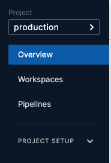
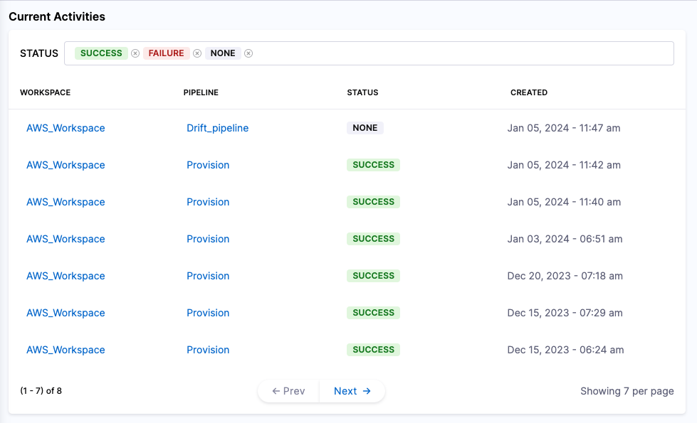
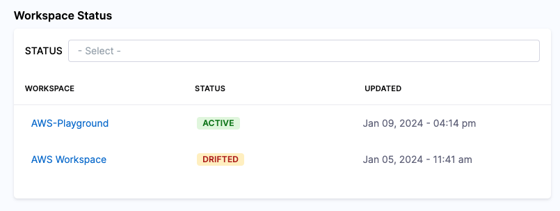
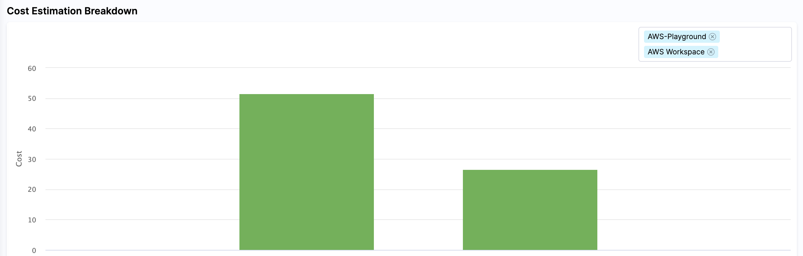

IaCM gives a useful overview of the resources that are being managed. You can access the reports by clicking on the 'Overview' tab.

The report is broken into three different widgets.

## Current Activities
This widget shows all the provisioning activities performed within the selected timeframe.  
You can filter the activities by the following status: Success, Failure, Running, and Required Approval.

## Workspace Status

This widget shows the status of all the Workspaces defined in the project.
You can filter the displayed Workspaces by the following statuses: Active, Inactive, Provisioning, Destroying, Failed, Drifted, and Unknown.

## Cost Estimation Breakdown

This widget shows a breakdown of all workspaces and the expected monthly cost for each Workspace. 
You can filter the report only to show specific Workspaces (all Workspaces will be displayed by default)

