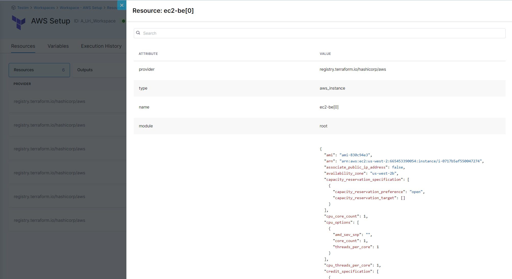
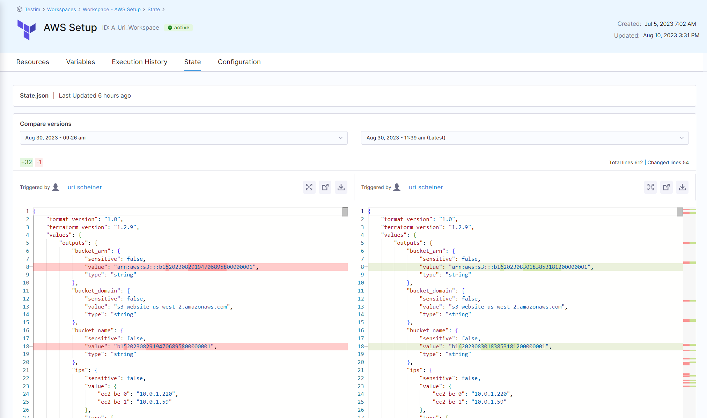

Once you have created the workspace and performed an update, you should see how it helps you manage its encapsulated resources. 

1. Navigate to the workspace you created, and then select the **Resource** tab. You can see the following details:

    * All the resources. Selecting each resource shows you the attributes of that resource. 

    * All the output variables that were generated and the values.

    

2. Select the **State** tab, where you can see the state file and compare the differences between former revisions. This can be very useful if you want to track resource changes.

    

3. Select the **Execution History** tab, where you can see the execution details of the pipeline and the status of the provision.
