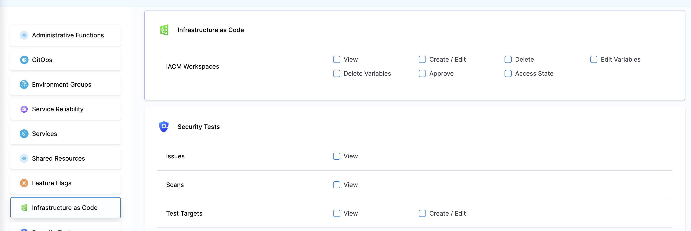

Users are able to control who have different types of access to the Workspace in a project. in order to do that, create/edit a Role, and select the "Infrastructure as Code Management" section

For each Role, you can define the following set of permissions:

1. **View** - Giving users the permission to view thw Workspaces in the project
2. **Create/Edit** - Giving users the permission to create and edit Workspaces in the project
3. **Delete** - Giving users the permission to delete Workspaces in the project
4. **Edit Variables** - Giving users the permission to create and edit Environment and Terraform variables
5. **Delete Variables** - Giving users the permission to delete Environment and Terraform variables
6. **Approve** - Giving users the permission to approve Infrastructure Stage (using the approval step)
7. **Access State** - Giving users the permissions to view the state (including historical revisions)

:::info
Please note that Workspace don't support Resource Groups at the moment
:::