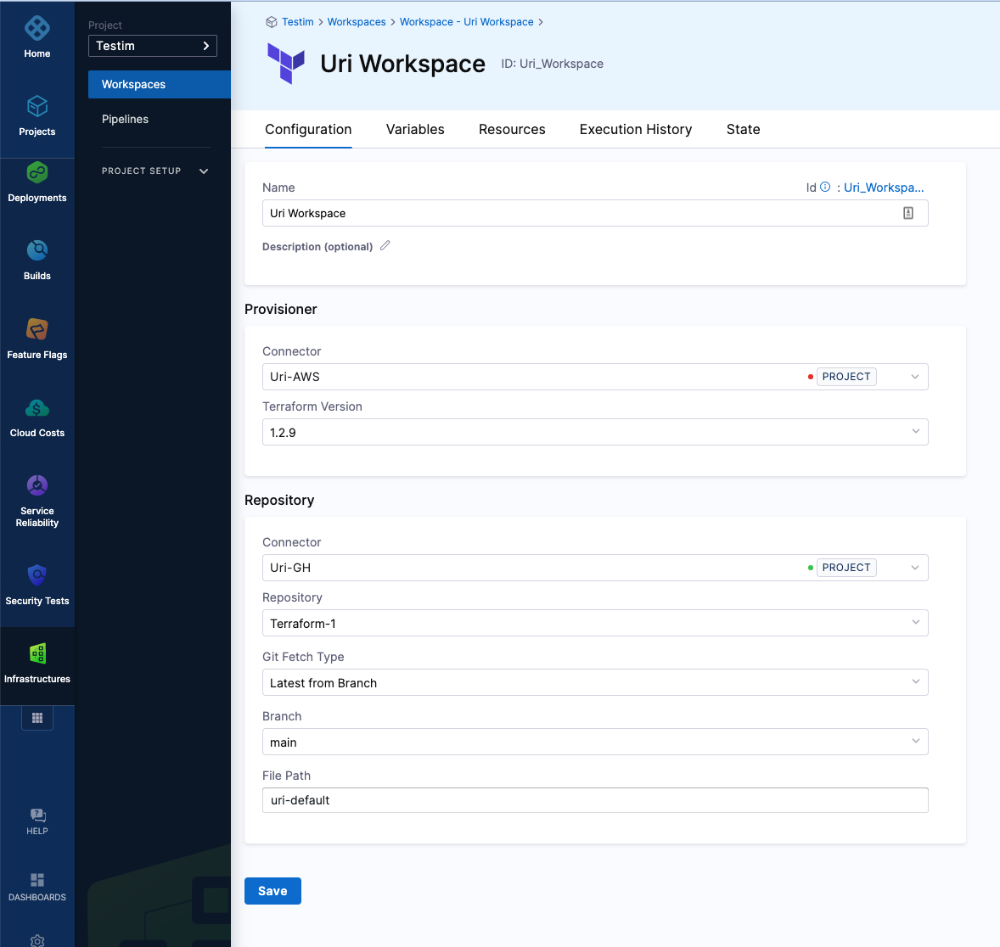
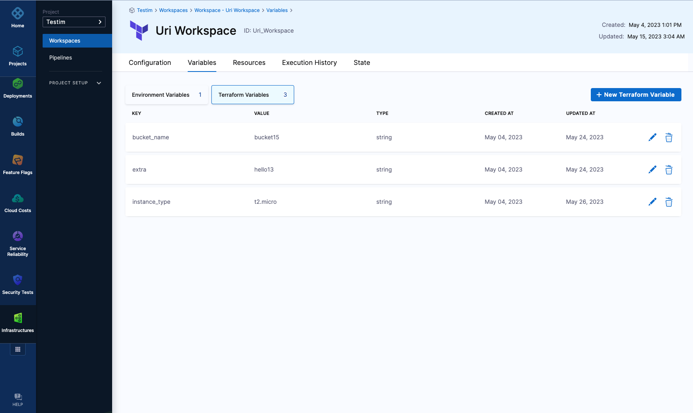
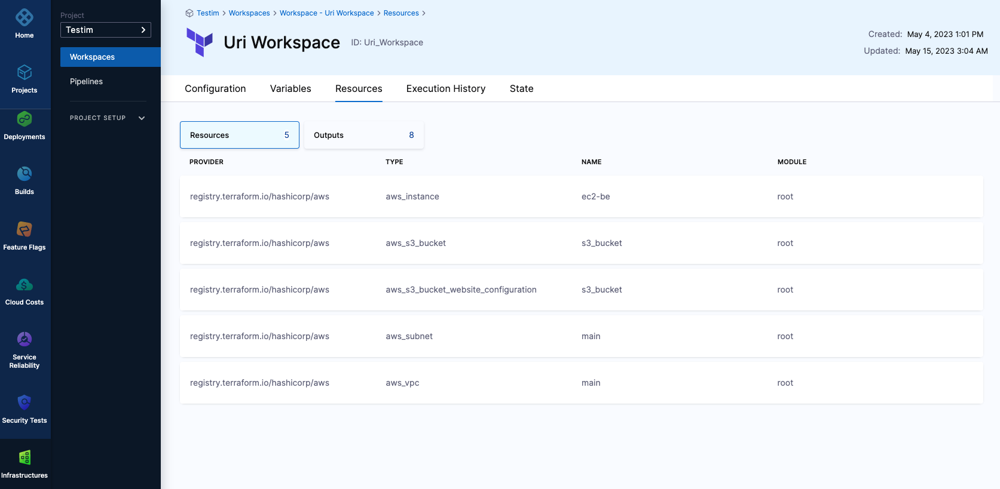
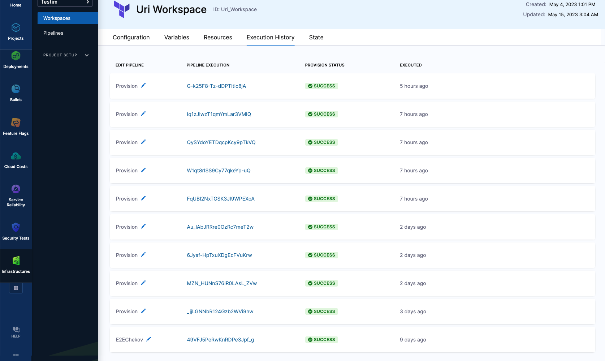
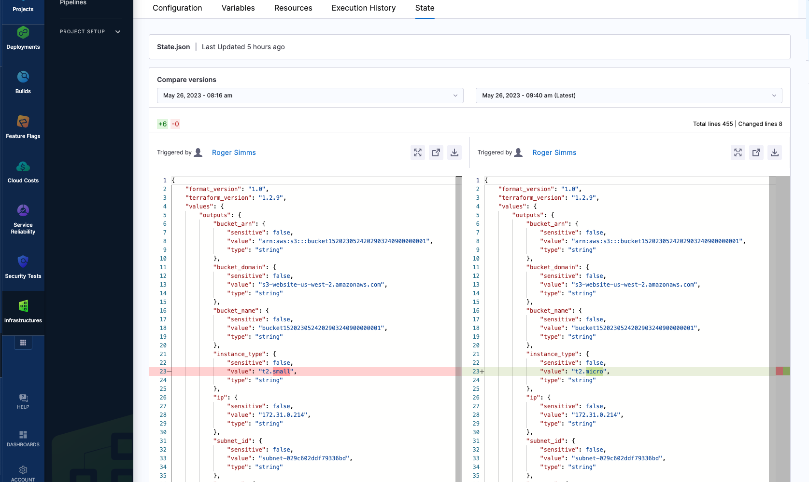
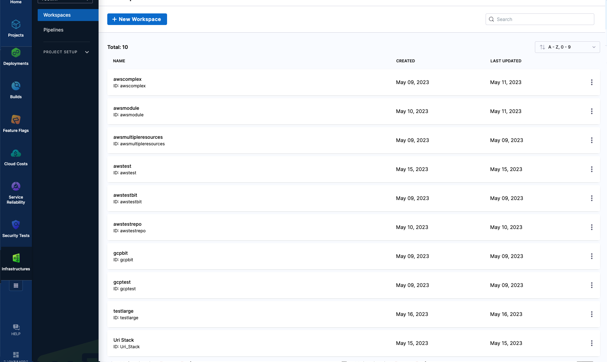
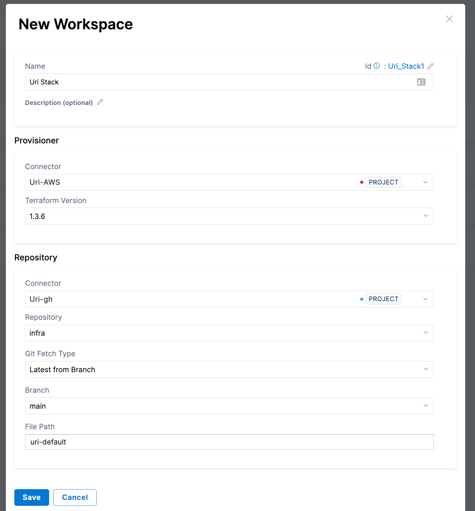
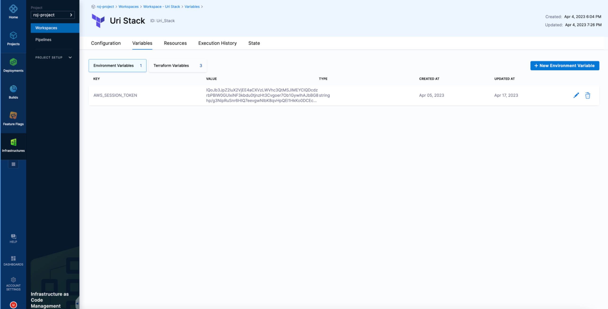

This topic provides an overview of "Infrastrcuture as Code Management" module", including basic concepts, definitions and set up.

# Workspace 

A workspace is a named environment that stores Terraform configurations, variables, state, and other resources necessary to manage infrastructure. Each workspace is mapped to a single state and allow you to manage set of resources that share the same lifecycle (for example - they get provisioned, or updated altogether)

Every Workspace have the following configuration and data about the resources that it manage. This incude the following:
* Cloud credential to use, when applying a chance to cloud resources 
* git configuration of the Terraform resources
* Terraform and Environment variables
* The manage resources and their attributes
* History of executions and changes that were made against the resources
* Manage resources state and its revisions 

Users can assign Terraform configuration with multiple workspaces to enforce the same desired configuration. Each workspace will create a different state from configuration and independent lifecycle. For example, users can have terraform configuration to set up a k8s cluster and use it with different workspaces, resulting in different clusters. The configuration that is unique to each workspace and can be managed through Environment/Terraform variables.

## Workspace overview

Workspace have the following tabs, representing different aspects of the resources that it manage

### Configuration

This tab contains all configuration that is needed to set up the Workspace

* Workspace name

* Description (optional)

* Connector - The Cloud connector to use during provisioning. This should provide the cloud credentials to use during execution. You can read [here](https://developer.harness.io/docs/category/cloud-providers) about how to set up a connector

* Terraform Version - specify which Terraform version the configuration requires. This will be used to determine which version of Terraform to use during execution.

* Repository - specify the git configuration for the terraform configuration files. You should specify the git connector, repository branch, and file path. You can read [here](https://developer.harness.io/docs/category/code-repositories) about how to set up a reportisry connector

### Variables

You can manage Terrafrom and Environments variables in a scope of each workspace, and they will be used during command execution. In case there are variables defined in git, the value in the workspace will take precedence.

Each variable can be of the following types:

* String (plain text)
* Secret - You can read [here](https://developer.harness.io/docs/category/secrets-management) about how to use secrets 

### Resources

Here you can view all the resources and output variables that the Workspace manage. For each resource, you can see the current attritbues and values (as in the state file), and for each Tarraform output, you can see the value

### Execution History
This tab will allow you to see all the history of previous executions that were made. For each execution, you can see its status and you have the abiity to drill into the pipeline execution to see more details (which steps were executed, result, etc.). 

### State
Harness keep the state for each Workspace, along with all its historical revision - each update to the state is saved, giving you the abiliy to track changes of the resources across different updates. You can also select different revisions to see what has changed between them (similar to "Code Diff")

## Create a Workspace

To crete a new Workspace, follow these steps:

1. Naviage to the "Workspace" pahge and cliek "New Workspace" **replace before publish**

2. Fill out the Workspace details

* Workspace name

* Connector - The Cloud connector to use during provisioning. This should provide the cloud credentials to use during execution (AWS and GCP are supported out of the box, Azure needs to be complemented with Environment variables).

* Terraform Version - specify which Terraform version the configuration requires. This will be used to determine which version of Terraform to use during execution.

* Repository - specify the git configuration for the terraform configuration files. You should specify the git connector, repository branch, and file path.

**replace before publish**
 

4. Navigate to the “Variables” tab if you need to use either Environment or Terraform variables during execution. If Terraform variables are defined and set in git, then values defined in the Workspace will take precedence. A good best practice would be to skip managing Terraform variables in git, and set them in the Workspace. This will keep the git configuration clean and allow you to use the same git definitions for multiple Workspaces. 

**replace before publish**
 

