**Workflows** turn Harness pipelines into self-service actions in the Internal Developer Portal. This page outlines repeatable patterns many platform teams automate (onboarding, infrastructure, feature flags, secrets, and Kubernetes operations), with example inputs, typical pipeline steps, and links to the Harness docs that define each step.

For rollout and adoption context, see the [IDP adoption playbook](/docs/internal-developer-portal/adoption/adoption-playbook). For hands-on setup, see the [Self-Service Workflows overview](/docs/internal-developer-portal/flows/overview), [configure the Harness pipeline backend](/docs/internal-developer-portal/flows/create-workflow/harness-pipeline), the [Workflow YAML reference](/docs/internal-developer-portal/flows/worflowyaml), and [Managing workflows](/docs/internal-developer-portal/flows/manage-workflow-2o).

## Common workflow use cases

Use workflows for recurring tasks that need consistency and auditability, such as onboarding or offboarding, new services, infrastructure requests, and routine operational changes.

Below are seven examples this page expands on:

1. [Service onboarding](#service-onboarding)  
2. [Infrastructure provisioning](#infrastructure-provisioning)  
3. [Toggling feature flags](#flipping-a-feature-flag)  
4. [Rotating secrets](#rotating-a-token)  
5. [Rolling back deployments](#rolling-back-a-deployment)  
6. [Scaling for traffic](#scaling-for-traffic)  
7. [Restarting services](#restarting-a-service)

## Service onboarding

Service onboarding is one of the highest-value IDP use cases: scaffolding repositories, standard Dockerfiles, tests, configs, and layout before application code lands. A follow-on Harness pipeline can standardize build, test, scan, and deploy.

A common pattern is a **pipeline that creates a pipeline**: scaffold the repo, register the service in the IDP catalog, create a CI/CD pipeline (often via the Harness Terraform provider through a **Create Resource** step), and notify the team on Slack.

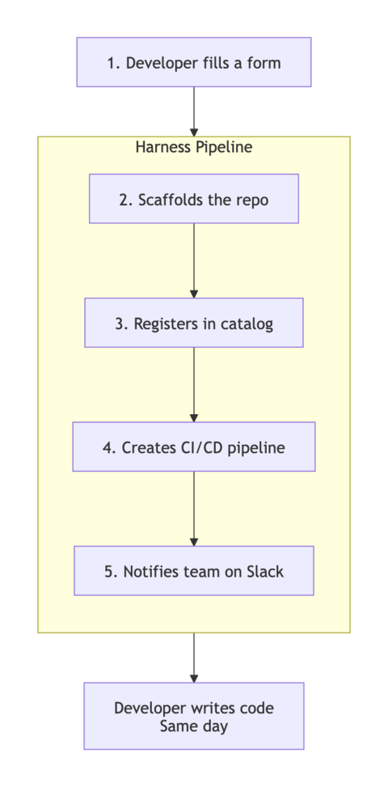

**Harness pipeline**

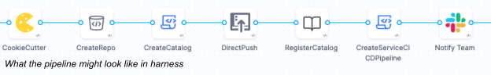

**Pipeline steps**

| Step | Harness step (`type`) | Description |
| :---- | :---- | :---- |
| Cookiecutter | [`CookieCutter`](/docs/internal-developer-portal/flows/create-workflow/harness-pipeline#2-cookiecutter) | Scaffold repo code from a template |
| CreateRepo | [`CreateRepo`](/docs/internal-developer-portal/flows/create-workflow/harness-pipeline#3-create-repo) | Create the repository in your Git provider |
| CreateCatalog | [`CreateCatalog`](/docs/internal-developer-portal/flows/create-workflow/harness-pipeline#4-create-catalog) | Create `catalog-info.yaml` for catalog registration |
| DirectPush | [`DirectPush`](/docs/internal-developer-portal/flows/create-workflow/harness-pipeline#5-direct-push) | Push generated code to Git |
| RegisterCatalog | [`RegisterCatalog`](/docs/internal-developer-portal/flows/create-workflow/harness-pipeline#6-register-catalog) | Register the entity in Harness IDP |
| Create pipeline for service | [`CreateResource`](/docs/internal-developer-portal/flows/create-workflow/harness-pipeline#8-create-resource) | Run an OpenTofu module (Harness Terraform provider) to create a CI/CD pipeline or other Harness entities; often from a template |
| Notify Team | [`SlackNotify`](/docs/internal-developer-portal/flows/create-workflow/harness-pipeline#7-slack-notify) | Post a Slack message (for example, using outputs from prior IDP steps) |

**Example workflow form fields**

| Project Name | Name of project |
| :---- | :---- |
| Repository type | Public or Private |
| Repository description | Description |
| Email for notification | Email for Slack notification |
| Template url | Cookiecutter template url |
| owner | Repo owner (Harness User/Group) |
| stack | Tech Stack |

**Example workflow (IDP)**

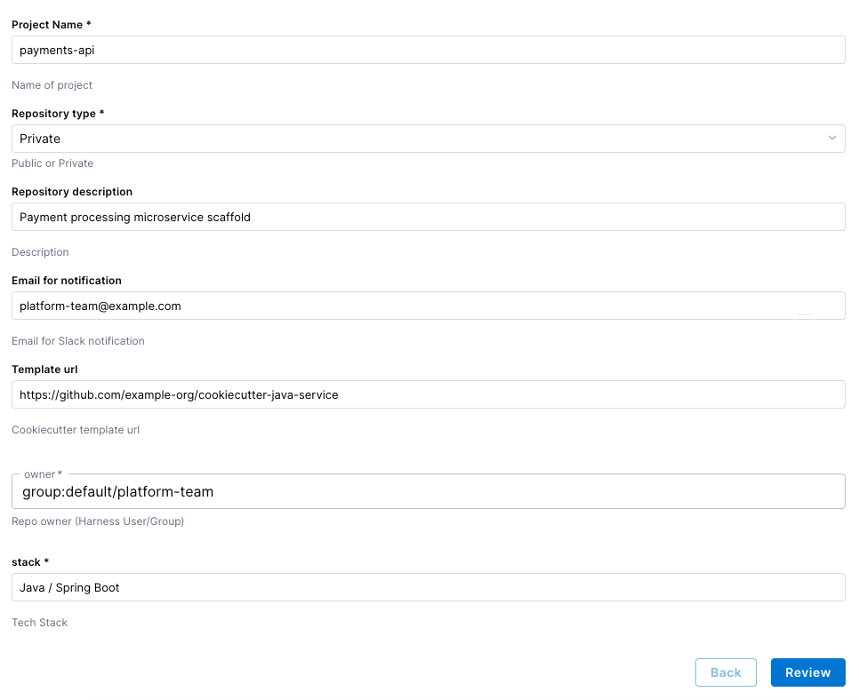

**Related documentation:** [Onboard a GitHub repository with a workflow](/docs/internal-developer-portal/flows/workflows-tutorials/github-repo-onb), [Service onboarding with the IDP stage](/docs/internal-developer-portal/tutorials/service-onboarding-with-idp-stage), [Create a Service from a workflow](/docs/internal-developer-portal/flows/workflows-tutorials/create-a-service), and [Set up the Harness IDP pipeline](/docs/internal-developer-portal/flows/create-workflow/harness-pipeline).

## Infrastructure provisioning

Infrastructure provisioning is a natural fit for IDP: it replaces ad hoc tickets and manual checks with a governed pipeline while preserving approvals and audit history.

A typical flow creates a change ticket, runs Terraform through **IaCM**, gates on approval, evaluates policy on the plan output, and updates the ticket. You might add scheduled runs to review or tear down resources.

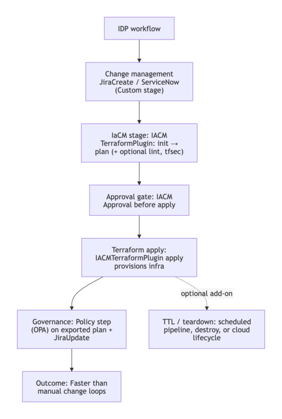

**Harness pipeline**

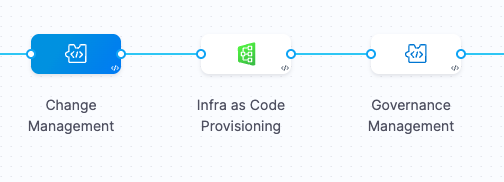

**Pipeline steps**

| Stage | Diagram | Harness step (`type`) | Description |
| :---- | :---- | :---- | :---- |
| Change Management | 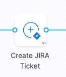 | [`JiraCreate`](/docs/internal-developer-portal/flows/workflows-tutorials/provision-infrastructure-using-idp) | Create a Jira issue for traceability (see tutorial YAML) |
| Infra as Code Provisioning (plan) | 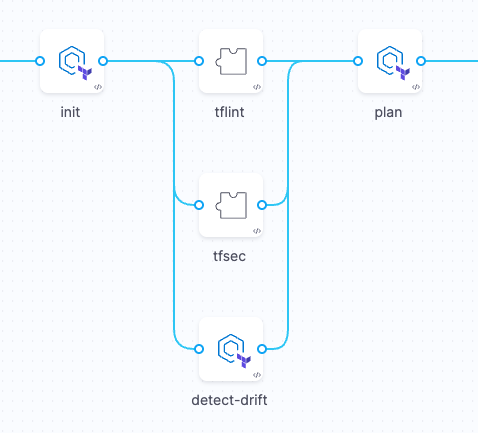 | [`IACM`](/docs/internal-developer-portal/flows/workflows-tutorials/provision-infrastructure-using-idp) stage: [`IACMTerraformPlugin`](/docs/infra-as-code-management/cli-commands/terraform-plugins), optional lint [`Plugin`](/docs/infra-as-code-management/cli-commands/terraform-plugins) (for example tfsec) | Init, lint, security scan, drift detection, and Terraform plan in the IaCM workspace as in the [provision tutorial](/docs/internal-developer-portal/flows/workflows-tutorials/provision-infrastructure-using-idp) |
| Infra as Code Provisioning (apply) | 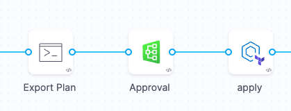 | [`Run`](/docs/continuous-integration/use-ci/run-step-settings) (export plan), [`IACMApproval`](/docs/internal-developer-portal/flows/workflows-tutorials/provision-infrastructure-using-idp), [`IACMTerraformPlugin`](/docs/infra-as-code-management/cli-commands/terraform-plugins) (apply) | Export the plan for downstream checks, gate on approval, then apply infrastructure changes as in the [provision tutorial](/docs/internal-developer-portal/flows/workflows-tutorials/provision-infrastructure-using-idp) |
| Governance Management | 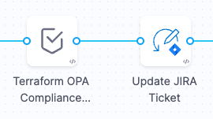 | [`Policy`](/docs/platform/governance/policy-as-code/add-a-governance-policy-step-to-a-pipeline), [`JiraUpdate`](/docs/internal-developer-portal/flows/workflows-tutorials/provision-infrastructure-using-idp) | Evaluate OPA on the exported plan payload; update Jira with results |

**Example workflow form fields**

| Owner | Harness User/Group |
| :---- | :---- |
| `iacm_workspace` | IaCM Workspace |
| Jira Project | Jira Project |
| Jira Issue Summary | Jira Issue Summary for infrastructure |
| Cloud Provider | GCP, AWS, etc |
| Instance Type | Enum for supported instances |
| AMI | Amazon Machine Image |
| Subnet | Deployed Subnet |
| VPC | Deployed VPC  |
| Instance Count | Instance count |

**Example workflow (IDP)**

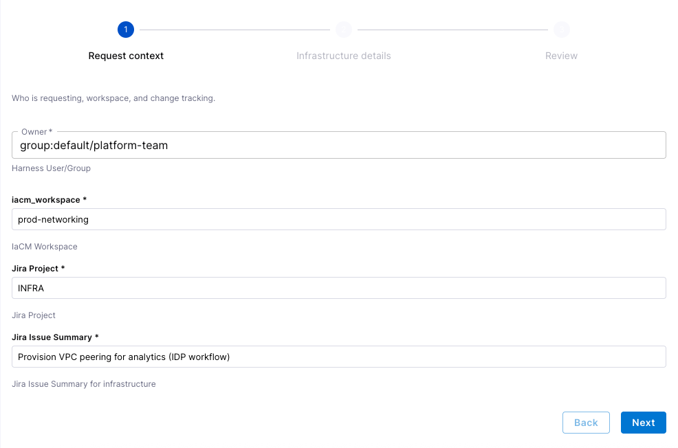

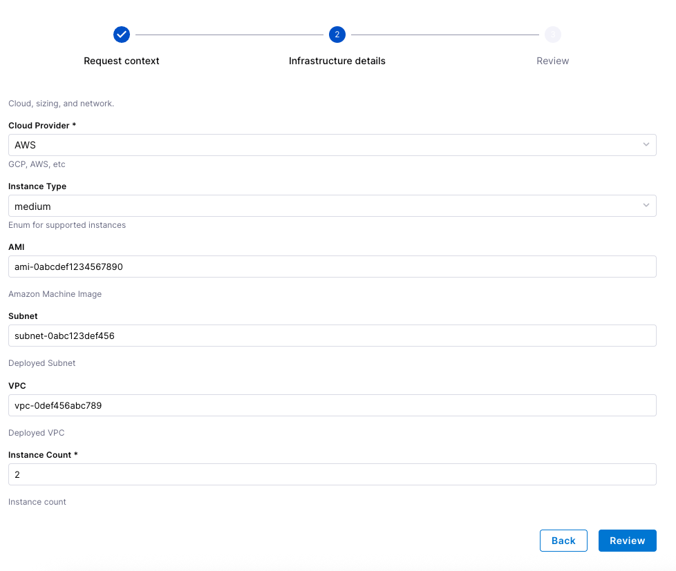

**Related documentation:** [Provision infrastructure using IDP and IaCM](/docs/internal-developer-portal/flows/workflows-tutorials/provision-infrastructure-using-idp), [Policy as code in IDP](/docs/internal-developer-portal/governance/policy-as-a-code), and the [Jira plugin](/docs/internal-developer-portal/plugins/available-plugins/jira).

## Examples

These are smaller, frequent operations that benefit from the same guardrails: [workflow RBAC](/docs/internal-developer-portal/rbac/workflow-rbac), approvals, and a single place to see execution history.

### Flipping a feature flag

Changing a feature flag or its targeting is simple in the UI, but you may still want an auditable path: OPA on save, workflow RBAC, and pipeline checks so only allowed users change production targeting.

Harness [Feature Management & Experimentation (FME)](/docs/feature-management-experimentation/getting-started/overview) provides first-class pipeline steps for flag operations; combine them with a [`Policy`](/docs/platform/governance/policy-as-code/add-a-governance-policy-step-to-a-pipeline) step when you need to validate workflow inputs. See [FME and Harness pipelines](/docs/feature-management-experimentation/pipelines).

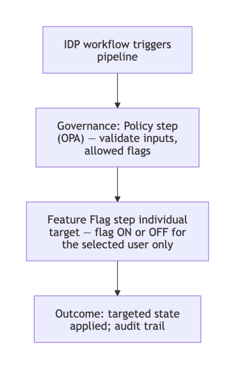

**Harness pipeline**

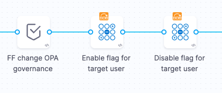

**Pipeline steps**

| Step | Harness step (`type`) | Description |
| :---- | :---- | :---- |
| Flag change governance | [`Policy`](/docs/platform/governance/policy-as-code/add-a-governance-policy-step-to-a-pipeline) | Validate workflow parameters (custom payload) against policy |
| Enable flag for target user | [`FmeFlagAddRemoveIndividualTargets`](/docs/feature-management-experimentation/pipelines#addremove-individual-targets) | Conditionally add an individual target |
| Disable flag for target user | [`FmeFlagAddRemoveIndividualTargets`](/docs/feature-management-experimentation/pipelines#addremove-individual-targets) | Conditionally remove an individual target |

**Example workflow inputs**

| Input | Description |
| :---- | :---- |
| Flag name | Feature flag identifier in your project |
| Target user key | Target id (for example, user or account key) |
| action | Enum for enable/disable |
| environment | [FME environment](/docs/feature-management-experimentation/environments) for the change |

**Example workflow (IDP)**

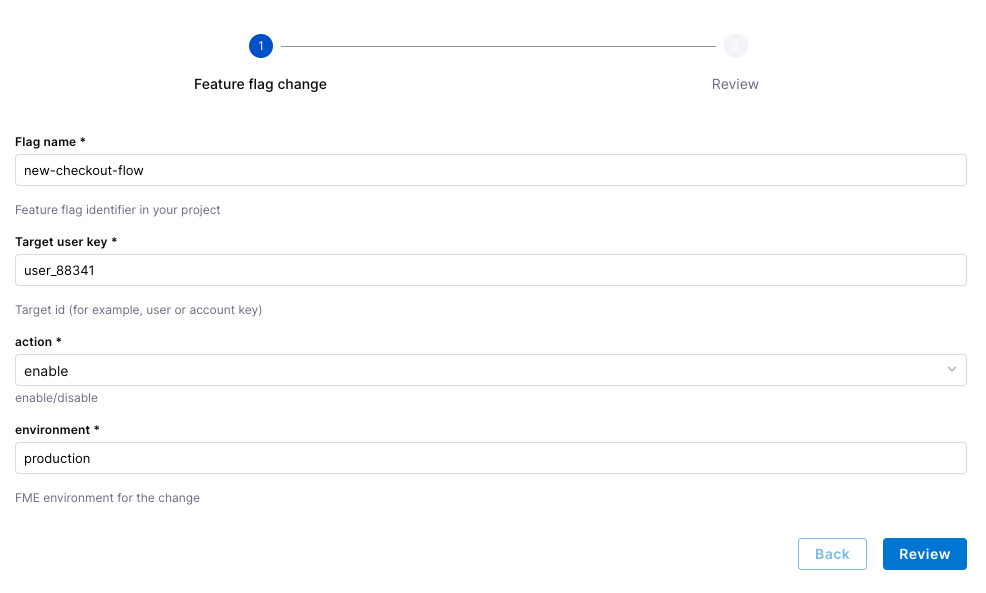

**Related documentation:** [FME overview](/docs/feature-management-experimentation/getting-started/overview), [Feature flags and pipelines](/docs/feature-management-experimentation/pipelines), [Targeting](/docs/feature-management-experimentation/feature-management/targeting), [Policy as Code for FME](/docs/platform/governance/policy-as-code/using-harness-policy-engine-for-fme), and [FME policies](/docs/feature-management-experimentation/policies).

### Rotating a token

Token rotation fits the same pattern: an approval, an [`Http`](/docs/continuous-delivery/x-platform-cd-features/cd-steps/utilities/http-step) call to your identity or API provider, then another HTTP call (or script) to store the new value in Harness [secrets](/docs/platform/secrets/add-use-text-secrets).

Using Harness HTTP steps you can mirror the feature-flag workflow: wrap sensitive API actions with governance and controls.

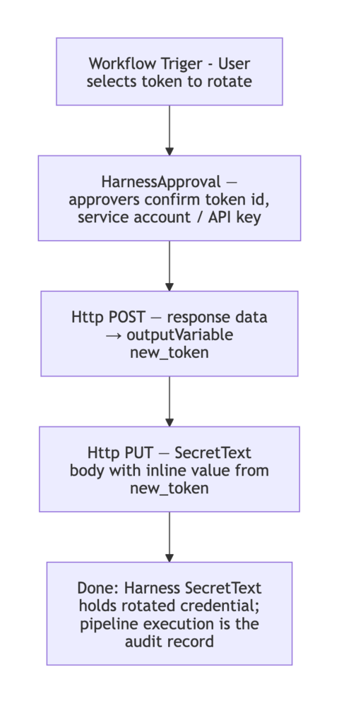

**Harness pipeline**

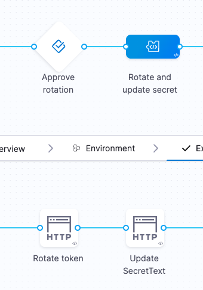

**Pipeline steps**

| Step | Harness step (`type`) | Description |
| :---- | :---- | :---- |
| Approve Rotation | [`HarnessApproval`](/docs/platform/approvals/approvals-tutorial) | Require human approval before rotation |
| Rotate Token | [`Http`](/docs/continuous-delivery/x-platform-cd-features/cd-steps/utilities/http-step) | Call the provider API to rotate or issue a new token |
| Update secretText | [`Http`](/docs/continuous-delivery/x-platform-cd-features/cd-steps/utilities/http-step) | Call the Harness API (or your process) to update the stored secret value |

**Workflow inputs (account- or org-scoped secrets example)**

| Input | Description |
| :---- | :---- |
| Token identifier | Logical name or id for the token being rotated |
| Org for rotation API | Harness org id (or scope) used in the rotation API call |
| Service account identifier | Service account or principal the token belongs to |
| API Key identifier | API key or client id used to authenticate the rotation request |
| Secret identifier | Harness secret identifier to update after rotation |
| Secret scoped org | Org id when the secret is org-scoped |
| Secret display name | Human-readable name shown in the UI |

**Example workflow (IDP)**

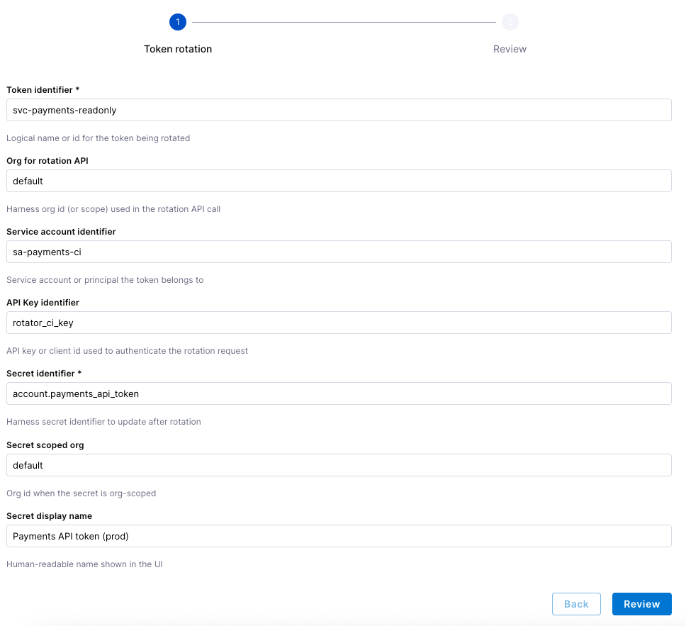

**Related documentation:** [Using a short-lived secret to trigger a workflow](/docs/internal-developer-portal/tutorials/using-secret-as-an-input), [HTTP step](/docs/continuous-delivery/x-platform-cd-features/cd-steps/utilities/http-step), and [Add and use text secrets](/docs/platform/secrets/add-use-text-secrets).

### Rolling back a deployment

When deployments are frequent, teams need a controlled rollback path. IDP can expose rollback to the right people with approvals and full execution history instead of ad hoc `kubectl` or UI-only changes.

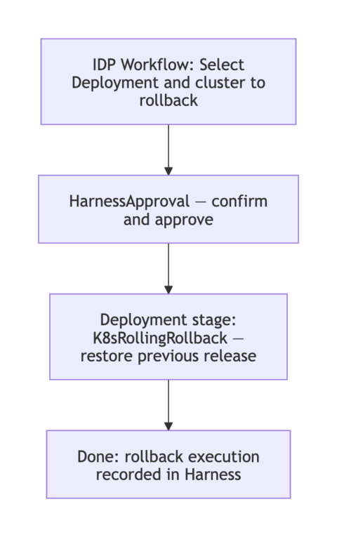

**Harness pipeline**

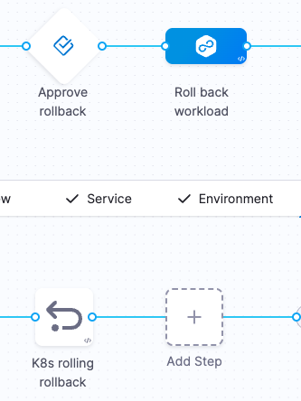  
**Pipeline steps**

| Step | Harness step (`type`) | Description |
| :---- | :---- | :---- |
| Approve rollback | [`HarnessApproval`](/docs/platform/approvals/approvals-tutorial) | Approve rollback of the selected workload |
| K8s rolling rollback | [`K8sRollingRollback`](/docs/continuous-delivery/manage-deployments/rollback-deployments) | Roll back the Kubernetes workload to the last successful release |

**Example workflow inputs**

| Service Identifier | Service |
| :---- | :---- |
| Environment Identifier | Deployment Environment |
| Infradef | Infrastructure for environment |

**Example workflow (IDP)**

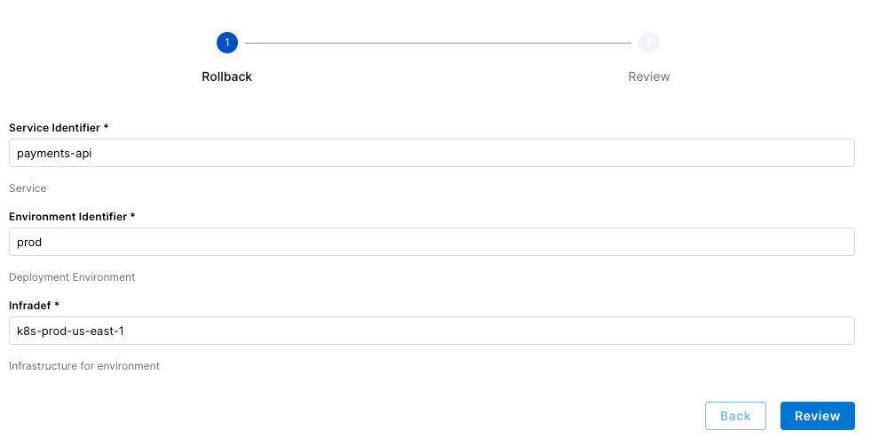

**Related documentation:** [Rollback deployments](/docs/continuous-delivery/manage-deployments/rollback-deployments) and [Kubernetes rollback](/docs/continuous-delivery/deploy-srv-diff-platforms/kubernetes/cd-k8s-ref/kubernetes-rollback).

### Scaling for traffic

Scaling workloads is another good workflow candidate: one standard pipeline, RBAC on who can run it, and traceability for every change.

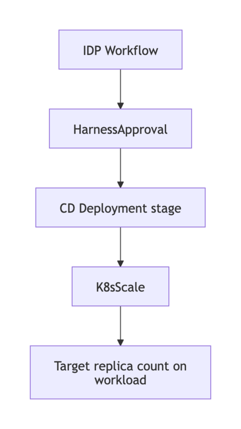

**Harness pipeline**

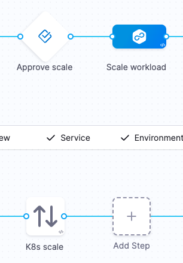  
**Pipeline steps**

| Step | Harness step (`type`) | Description |
| :---- | :---- | :---- |
| Approve scale | [`HarnessApproval`](/docs/platform/approvals/approvals-tutorial) | Approve changing replica count |
| K8s Scale | [`K8sScale`](/docs/continuous-delivery/deploy-srv-diff-platforms/kubernetes/kubernetes-executions/scale-kubernetes-replicas) | Scale the workload in or out |

**Example workflow inputs**

| Service Identifier | Pipeline service identifier |
| :---- | :---- |
| Environment Identifier | Pipeline environment identifier |
| Infrastructure Definition | Pipeline infrastructure definition |
| Namespace | `[namespace/]Kind/Name` |
| Target Replicas | Desired replica count |

**Example workflow (IDP)**

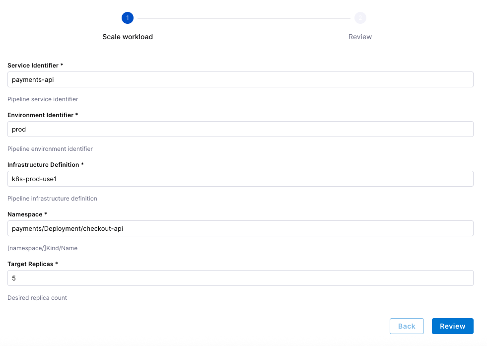

**Related documentation:** [Scale Kubernetes replicas](/docs/continuous-delivery/deploy-srv-diff-platforms/kubernetes/kubernetes-executions/scale-kubernetes-replicas).

### Restarting a service

Restarting is similar to scaling: approval plus a Kubernetes step that refreshes pods without a full redeploy.

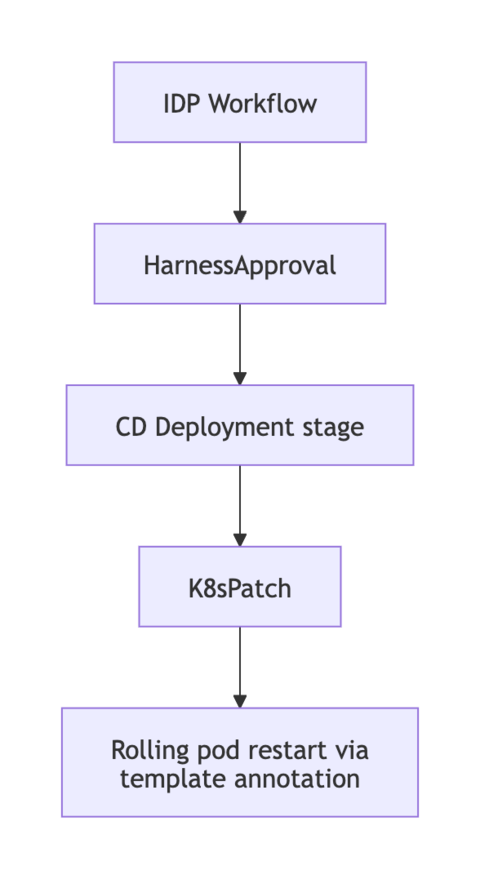

**Harness pipeline**

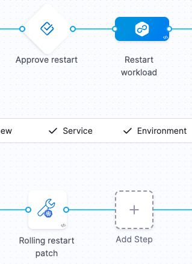  
**Pipeline steps**

| Step | Harness step (`type`) | Description |
| :---- | :---- | :---- |
| Approve restart | [`HarnessApproval`](/docs/platform/approvals/approvals-tutorial) | Approve the restart |
| Rolling restart | [`K8sRollout`](/docs/continuous-delivery/deploy-srv-diff-platforms/kubernetes/cd-k8s-ref/kubernetes-rollout-restart) (`command: restart`) or [`K8sPatch`](/docs/continuous-delivery/deploy-srv-diff-platforms/kubernetes/cd-k8s-ref/kubernetes-patch-step) | Rolling restart or patch-based refresh of the workload |

**Example workflow inputs**

| Service Identifier | Pipeline service identifier |
| :---- | :---- |
| Environment Identifier | Pipeline environment identifier |
| Infrastructure Definition | Pipeline infrastructure definition |
| Namespace | `[namespace/]Kind/Name` |

**Example workflow (IDP)**

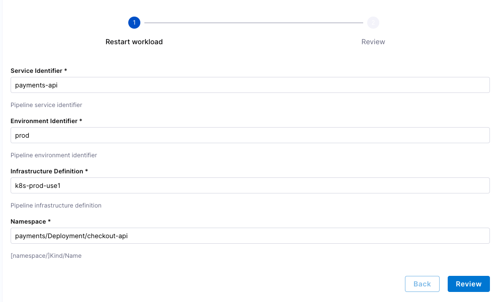

**Related documentation:** [Kubernetes Rollout restart](/docs/continuous-delivery/deploy-srv-diff-platforms/kubernetes/cd-k8s-ref/kubernetes-rollout-restart) and [Kubernetes Patch step](/docs/continuous-delivery/deploy-srv-diff-platforms/kubernetes/cd-k8s-ref/kubernetes-patch-step).
