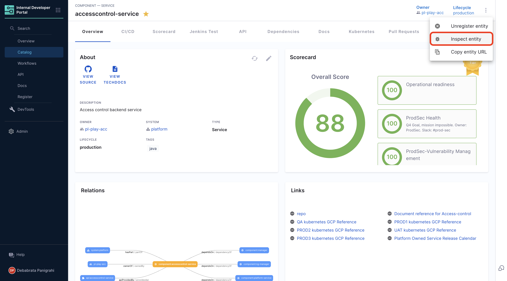
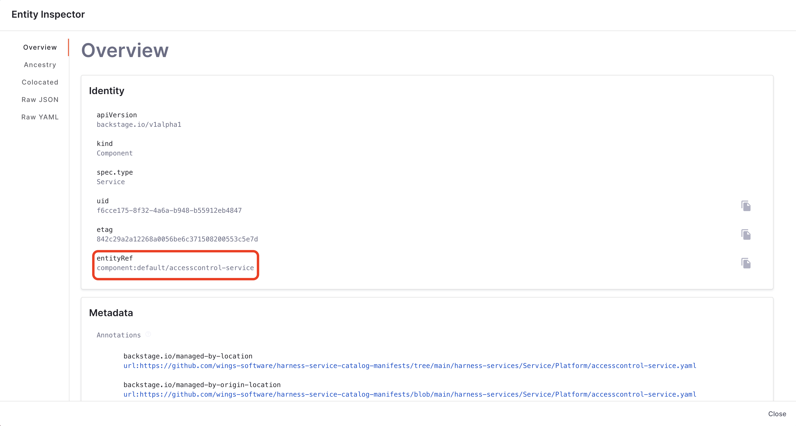

The following are the list of Backstage APIs supported by IDP. 

:::info
The APIs listed here are [Backstage APIs](https://backstage.io/docs/features/software-catalog/software-catalog-api) exposed through Harness Platform and you could find all other APIs for [IDP mentioned in openapi specs](https://apidocs.harness.io/tag/AppConfig)
:::

In order to use the APIs in Harness platform, you need to generate a Harness API Key as described in [Manage API keys](https://developer.harness.io/docs/platform/automation/api/add-and-manage-api-keys)


## Catalog API

#### Endpoint

Register Software Component in Harness Catalog.

#### HTTP Method

`POST`

#### URL 

```bash
https://idp.harness.io/{ACCOUNT_IDENTIFIER}/idp/api/catalog/locations
```
#### URL Parameters

`ACCOUNT_IDENTIFIER`: Your Harness account ID.

You can find your account ID in any Harness URL, for example:

```bash
https://app.harness.io/ng/account/ACCOUNT_ID/idp/overview
```

#### Headers
- `x-api-key`: Your Harness API token.
- `Harness-Account`: Your Harness account ID.

#### Request Body

```json
{
  "type": "url",
  "target": "Path to IDP YAML in your git provider"
}
```

### cURL Example

```cURL
curl --location 'https://idp.harness.io/{ACCOUNT_IDENTIFIER}/idp/api/catalog/locations' \
--header 'x-api-key: {X_API_KEY}' \
--header 'Harness-Account: {ACCOUNT_IDENTIFIER}'
--data-raw '{"type":"url","target":"https://github.com/harness-community/idp-samples/blob/main/catalog-info.yaml"}'
```
#### Response:
The response will register a software component in your IDP catalog as defined in the `catalog-info.yaml` or `idp.yaml` file from the specified git repository.


## Catalog Refresh API

#### Endpoint

Syncs the component with the latest version of `catalog-info.yaml` stored in git providers.

#### HTTP Method

`POST`

#### URL 

```bash
https://idp.harness.io/{ACCOUNT_IDENTIFIER}/idp/api/catalog/refresh
```
#### URL Parameters

`ACCOUNT_IDENTIFIER`: Your Harness account ID.

You can find your account ID in any Harness URL, for example:

```bash
https://app.harness.io/ng/account/ACCOUNT_ID/idp/overview
```

#### Headers
- `x-api-key`: Your Harness API token.
- `Harness-Account`: Your Harness account ID.

### cURL Example

```cURL
curl 'https://idp.harness.io/{HARNESS_ACCOUNT_IDENTIFIER}/idp/api/catalog/refresh' \
  -H 'Content-Type: application/json' \
  -H 'x-api-key: {HARNESS_X_API_KEY}' \
  --data-raw '{"entityRef":"{ENTITY_REF}"}'
```

`ENTITY_REF` needs to be replaced with the entity path, for e.g., `component:default/idp-service` (kind:namespace/name format)

Here are the steps to get the `entityRef`:

Go to **Inspect Entity** on the component page and under **Identity** in Overview you can find the `entityRef`






#### Response:

The response will immediately sync the mentioned component in the entity ref with the `catalog-info.yaml` stored in the git provider

## Catalog Entities Delete API

### Delete Using Location ID

#### Endpoint

Delete Software Component from Harness Catalog.

#### HTTP Method

`DELETE`

#### URL 

```bash
https://idp.harness.io/{ACCOUNT_IDENTIFIER}/idp/api/catalog/locations/{LOCATION_ID}
```
#### URL Parameters

`ACCOUNT_IDENTIFIER`: Your Harness account ID.

You can find your account ID in any Harness URL, for example:

```bash
https://app.harness.io/ng/account/ACCOUNT_ID/idp/overview
```

`LOCATION_ID`: To get the Location ID, use the cURL command given below to fetch all the Locations for the account and `grep` your component name and the ID mentioned there is the Location ID to be used.

```cURL
curl 'https://idp.harness.io/{ACCOUNT_IDENTIFIER}/idp/api/catalog/locations' \
--header 'x-api-key: {X_API_KEY}' \
--header 'Harness-Account: {ACCOUNT_IDENTIFIER}'
```

The Response of the above cURL would be as shown below and the `id` mentioned is the **Location ID**, search for the component name in the response and pick the `id`

```json
[
...
    {
        "data": {
            "id": "0c82da82-dc1c-4176-99fa-a4711dcd01f5",
            "target": "https://github.com/sathish-soundarapandian/onboarding-test/blob/main/harness-services-zeaak/Project/prannoy.yaml",
            "type": "url"
        }
    },
...
]
```

#### Headers
- `x-api-key`: Your Harness API token.
- `Harness-Account`: Your Harness account ID.

### cURL Example

```cURL
curl --location --request DELETE 'https://idp.harness.io/{ACCOUNT_ID}/idp/api/catalog/locations/{LOCATION_ID}' \
--header 'x-api-key: <API-KEY>' \
--header 'Harness-Account: {ACCOUNT_ID}'
```
#### Response:
The response will remove the software component along the with the locations from your IDP catalog as defined in the location provided.


### Delete Using `metadata.uid` for Orphaned Entities

#### Endpoint

Deletes an entity by its `metadata.uid` field value. 

#### HTTP Method

`DELETE`

#### URL 

```bash
https://idp.harness.io/ACCOUNT_ID/idp/api/catalog/entities/by-uid/{uid}
```
#### URL Parameters

`ACCOUNT_IDENTIFIER`: Your Harness account ID.

You can find your account ID in any Harness URL, for example:

```bash
https://app.harness.io/ng/account/ACCOUNT_ID/idp/overview
```

`udi`: To get the uid, use the cURL command given below to fetch all the Locations for the account and `grep` your component name and the `metadata.uid` mentioned there is the `uid` to be used.

```cURL
curl --location 'https://idp.harness.io/ACCOUNT_ID/idp/api/catalog/entities/by-query?filter=kind=location' \
--header 'x-api-key: {X_API_KEY}' \
--header 'Harness-Account: {ACCOUNT_IDENTIFIER}'
```

The Response of the above cURL would be as shown below and the `metadata.uid` mentioned is the **uid**, search for the component name in the response and pick the `uid`

```json
[
...

    "metadata": {
        "namespace": "default",
        "annotations": {
            "backstage.io/managed-by-location": "url:https://github.com/catalog.yaml",
            "backstage.io/managed-by-origin-location": "url:https://github.com/catalog.yaml",
            "backstage.io/view-url": "https://github.com/blob/catalog.yaml",
            "backstage.io/edit-url": "https://github.com/edit/BT-5923-1/catalog.yaml",
            "backstage.io/source-location": "url:https://github.com/BT-5923-1/"
        },
        "name": "generated-655f8beb6a07f85e045",
        "uid": "0a-f27c-43-bd29-492975453",
        "etag": "054f1b3204b3965e741"
    }
...
]
```

#### Headers
- `x-api-key`: Your Harness API token.
- `Harness-Account`: Your Harness account ID.

### cURL Example

```cURL
curl --location --request DELETE 'https://idp.harness.io/ACCOUNT_ID/idp/api/catalog/entities/by-uid/{uid}' \
--header 'x-api-key: <API-KEY>' \
--header 'Harness-Account: {ACCOUNT_ID}'
```
#### Response:
The response will remove the locations from your IDP catalog as defined in the `uid`.


## Catalog Entities API

#### Endpoint

Retrieves catalog entities that match a specific filter from the Harness IDP.

#### HTTP Method

`GET`

#### URL 

```bash
https://idp.harness.io/{ACCOUNT_IDENTIFIER}/idp/api/catalog/entities
```
#### URL Parameters

1. `ACCOUNT_IDENTIFIER`: Your Harness account ID.

You can find your account ID in any Harness URL, for example:

```bash
https://app.harness.io/ng/account/ACCOUNT_ID/idp/overview
```

2. Lists entities. Supports the following **query parameters**, described in sections below:

`filter`, for selecting only a subset of all entities
`fields`, for selecting only parts of the full data structure of each entity
`offset`, `limit`, and `after` for pagination

#### Filtering
You can pass in one or more filter sets that get matched against each entity. Each filter set is a number of conditions that all have to match for the condition to be true (conditions effectively have an AND between them). At least one filter set has to be true for the entity to be part of the result set (filter sets effectively have an OR between them).

Example:

```bash
/entities?filter=kind=user,metadata.namespace=default&filter=kind=group,spec.type

  Return entities that match

    Filter set 1:
      Condition 1: kind = user
                   AND
      Condition 2: metadata.namespace = default

    OR

    Filter set 2:
      Condition 1: kind = group
                   AND
      Condition 2: spec.type exists
```

- **Example: Filter `components` based on `system` name**

```cURL
curl --location 'https://idp.harness.io/ACCOUNT_ID/idp/api/catalog/entities?filter=kind=component,relations.partOf=system:default/SYSTEM_NAME' \
--header 'x-api-key: X_API_KEY' \
--header 'Harness-Account: ACCOUNT_ID'
```
In the above example since the `system` name is mentioned under `relations` in component's definition YAML, hence we have used the filter `relations.partOf=system:default/SYSTEM_NAME`. Here's the mention of `system` in component's YAML. 

```YAML {17, 19}
## Example IDP YAML
...
relations:
  - type: dependsOn
    targetRef: component:default/ng-manager
    target:
      kind: component
      namespace: default
      name: ng-manager
  - type: ownedBy
    targetRef: group:default/ccmplayacc
    target:
      kind: group
      namespace: default
      name: ccmplayacc
  - type: partOf
    targetRef: system:default/ccm
    target:
      kind: system
      namespace: default
      name: ccm
...
```

#### Headers
- `x-api-key`: Your Harness API token.
- `Harness-Account`: Your Harness account ID.

### cURL Example

```cURL
curl 'https://idp.harness.io/{ACCOUNT_IDENTIFIER}/idp/api/catalog/entities?filter=kind=template' \
--header 'x-api-key: {X_API_KEY}' \
--header 'Harness-Account: {ACCOUNT_IDENTIFIER}'
```


#### Response:
The response will include a list of catalog entities that match the specified filter criteria.
