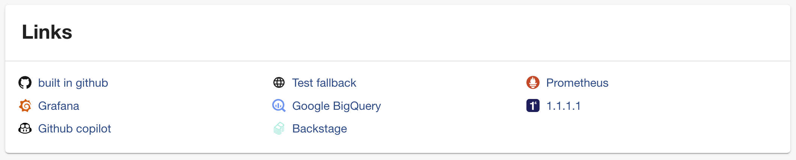

<DocsTag  backgroundColor= "#cbe2f9" text="Tutorial"  textColor="#0b5cad"  />

## Introduction
In this tutorial we will explore how to add links associated with the Software Components which could be dashboards, support pages, runbooks, email groups, Slack channels, etc. Each link is an arbitrary name and URL pair, which can be accompanied by an icon for visual representation.

Once you register a Software Component in the Catalog this is a sample of how your overview section would look based on your IDP yaml. 


In the depicted image, you'll notice a **Links Card** that serves as a navigational tool. These links can be anything. Here are some examples -

- User and Group Management
- Infrastructure and Cloud
- Operational Dashboards
- Support and Help
- General Web and Information
- Notifications and Alerts

and many more which would function as a quick bookmark for the developers corresponding to the software component. 

Follow the steps below to effectively integrate such links into your software components in the catalog.

## Steps to add Links
 
1. Click on the edit icon on the overview page, which will redirect you to the IDP yaml.


2. Now add **links** to the IDP yaml as shown in the example below.

## Link Attributes

### URL

This is the actual web address or URL that the link points to. It's the destination users will be directed to when they click on the link.

### Title 

This serves as the display name or label for the link. It gives users a brief idea of what to expect when they click on the link or where it might lead them.

### Icons

An optional attribute, you can select from a category of supported icons (**Admin** -> **Layout** -> **Icons**) that provide a visual representation or hint about the nature or category of the link. These icons are part of [SimpleIcons](https://simpleicons.org/). The name of the icon can be copied from the **Icons** page under **Layout in Admin** by clicking on the icon.

```YAML
apiVersion: backstage.io/v1alpha1
kind: Component
metadata:
  name: artist-lookup
  description: Artist Lookup
  tags:
    - java
    - data
  links:
    - url: https://example.com/user
      title: Examples Users
      icon: user
    - title: Prometheus
      url: https://google.ch
      icon: prometheus
    - title: Grafana
      url: https://google.ch
      icon: grafana
    - title: Google BigQuery
      url: https://google.ch
      icon: googlebigquery
    - title: 1.1.1.1
      url: https://google.ch
      icon: 1dot1dot1dot1
    - url: https://example.com/web
      title: Website
      icon: web
    - url: https://example.com/alert
      title: Alerts
      icon: alert
  annotations:
    backstage.io/linguist: 'https://github.com/backstage/backstage/tree/master/plugins/playlist'
spec:
  type: service
  lifecycle: experimental
  owner: team-a
  system: artist-engagement-portal
  dependsOn: ['resource:artists-db']
  apiConsumedBy: ['component:www-artist']
```



## Conclusion

 Together, the attributes under link not only provide essential information but also enhance the user experience by making navigation more intuitive and visually appealing. By categorizing and visually representing links, users can quickly find and access the resources they're interested in.