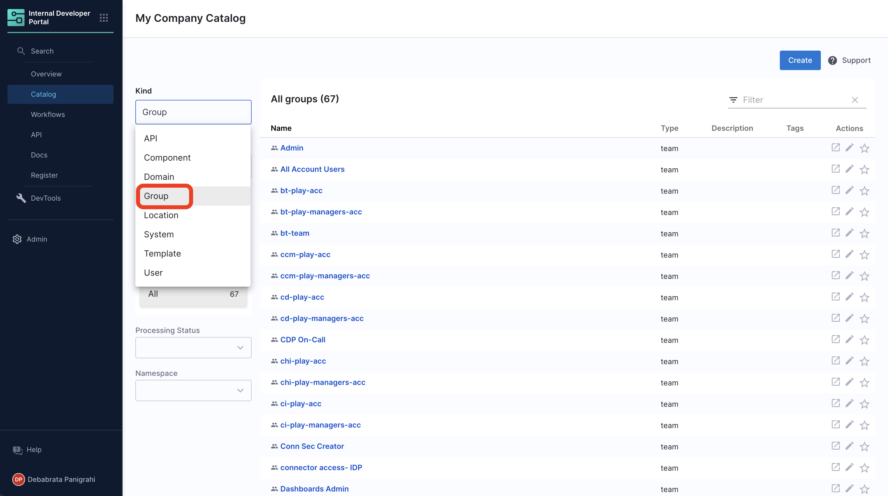
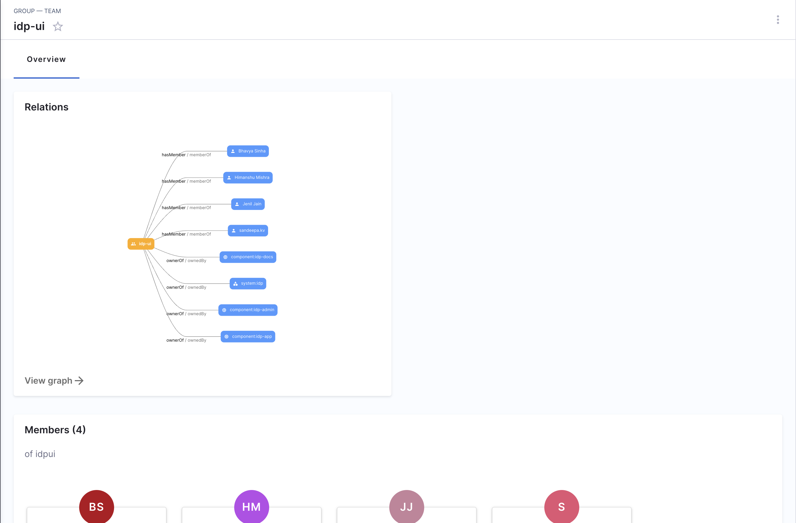

Harness IDP now supports addition of [organizational entities](https://backstage.io/docs/features/software-catalog/system-model#organizational-entities) like **groups** directly in your catalog independent of their presence in Harness Platform. These entities could be registered as `kind: Group` in the catalog as an YAML. 

:::info

The groups registered as entities in Catalog directly aren't synced with Harness Platform, hence the groups you add in IDP won't be available as a [Harness Platform User-Group](https://developer.harness.io/docs/platform/role-based-access-control/add-user-groups), but the opposite is true. 

:::

## Kind: Group

A group describes an organizational entity, such as for example a team, a business unit, or a loose collection of people in an interest group. Members of these groups are modeled in the catalog as `kind: User`. 

Descriptor files for this kind may look as follows, where `apiVersion`, `kind`, `spec.type` and `spec.children` are **required** fields. 

```YAML
apiVersion: backstage.io/v1alpha1
kind: Group
metadata:
  name: infrastructure
  description: The infra business unit
spec:
  type: business-unit
  profile:
    displayName: Infrastructure
    email: infrastructure@example.com
    picture: https://example.com/groups/bu-infrastructure.jpeg
  parent: ops
  children: [backstage, other]
  members: [jdoe]
```

At present we sync all your [user-groups](https://developer.harness.io/docs/platform/role-based-access-control/add-user-groups/) added in Harness Platform to IDP and you could find them under catalog page. 



Here's and example of how a group is displayed as a Team page in IDP.



