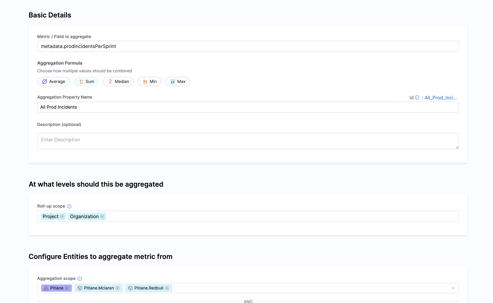
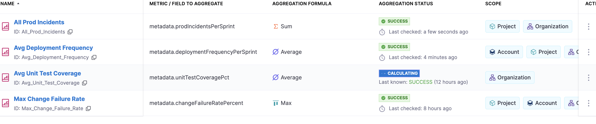

Aggregation rules allow you to roll up metrics from lower-level entities to higher levels in the organizational hierarchy. This enables you to view aggregated metrics at account, organization, and project levels, providing insights into performance across your entire platform.

:::info
Aggregation Rules are behind a feature flag. Contact your Harness representative to enable this feature.
:::

## Overview

Aggregation rules compute aggregate values (sum, average, maximum, minimum, median) from entity properties and display them on hierarchy entities. 

:::note
Aggregations are always computed from the source entities (typically components) to hierarchy entities. When you select multiple roll-up scopes (project, organization, account), the aggregation is calculated from all matching source entities at each level, not by aggregating the already-aggregated values.
:::

**Example use cases:**

- Aggregate DORA metrics (deployment frequency, change failure rate) from service components to project, organization, and account entities
- Roll up test coverage metrics from service components to organization and account levels
- Compute account-wide metrics by aggregating from all service components across the account

:::note
These are just examples. Aggregation rules work with any custom metric or property you've added to your entities, not just DORA or test coverage metrics.
:::

The aggregated values are stored as metadata properties on hierarchy entities and can be displayed using [hierarchy entity layouts](/docs/internal-developer-portal/layout-and-appearance/catalog#hierarchy-entity-layouts).

## Accessing Aggregation Rules

Navigate to **Configure** → **Integrations** → **Aggregation Rules** to view and manage your aggregation rules.


## Creating an Aggregation Rule


Click **New Aggregation Rule** to open the aggregation rule form. The form is organized into two main sections:




### Section 1: Basic Details

Configure the metric and how it should be aggregated:

#### Metric / Field to Aggregate

Enter the property path in the entity YAML (e.g., `metadata.changeFailureRatePercent`).

**Finding the field path:**

To find the correct field path, view the YAML of an entity that has the property you want to aggregate. The field path is the dot-notation path to that property.

Example: If your entity YAML has:
```yaml
metadata:
  changeFailureRatePercent: 10
```

The field path is: `metadata.changeFailureRatePercent`

#### Aggregation Formula

Choose how multiple values should be combined:

- **Average** - Calculate the mean of all values
- **Sum** - Add all values together
- **Median** - Take the middle value
- **Min** - Take the lowest value
- **Max** - Take the highest value

#### Aggregation Property Name

Enter a name for the aggregated property. This will become the property name on hierarchy entities (e.g., `Max Change Failure Rate`).

#### Description (optional)

Provide an optional description for the aggregation rule.

### Section 2: At What Levels Should This Be Aggregated

Configure where and from which entities the aggregation should be computed:

#### Roll-up Scope

Select at which hierarchy levels you want to see the aggregated value:

- **Project** - Display aggregated value on project entities
- **Organization** - Display aggregated value on organization entities
- **Account** - Display aggregated value on account entities
- **System** - Display aggregated value on system entities


:::info
You can select multiple levels. At each level, the aggregation is computed from all matching source entities (defined by your entity filters), not by aggregating the values from the level below.
For example, if you select Project, Organization, and Account:
- Project entities will show the aggregate of all matching components in that project
- Organization entities will show the aggregate of all matching components across all projects in that organization
- Account entities will show the aggregate of all matching components across the entire account
:::

#### Configure Entities to Aggregate Metric From

Define which entities to include in the aggregation. All filters are combined with AND logic:

- **Aggregation Scope** - Filter by scope (e.g., select specific account/org/project or leave as default for all)
- **Entity Kind** - Select the kind of entities to aggregate (e.g., `Component` or `hierarchy`)
- **Entity Type** - Filter by entity type (e.g., `service`, or select `all`)
- **Owners** (optional) - Filter by entity owners
- **Tags** (optional) - Filter by entity tags
- **Lifecycle** (optional) - Filter by lifecycle stage


## Aggregation Use Cases

### Use Case 1: DORA Metrics from CD Integration

Aggregate DORA metrics that are ingested from CD integration to hierarchy entities.

**Example:** Roll up deployment frequency and change failure rate from service components to projects, organizations, and account.

```yaml
Field to Aggregate: metadata.changeFailureRatePercent
Rule Name: Max Change Failure Rate
Formula: Maximum
Roll-up Scope: Project, Organization, Account
Entity Kind: Component
Type: service
```

**Result:** The maximum change failure rate across all services will be displayed on project, organization, and account entities as `metadata.Max Change Failure Rate`.

### Use Case 2: Custom Ingested Properties

Aggregate custom properties that you've ingested into entities using the [Catalog Ingestion API](/docs/internal-developer-portal/catalog/integrate-tools/catalog-ingestion-api).

**Example:** Aggregate MTTR (Mean Time To Recovery) from service components.

```yaml
Field to Aggregate: metadata.mttr
Rule Name: Max MTTR
Formula: Maximum
Roll-up Scope: Project, Organization
Entity Kind: Component
Type: service
```

**Result:** The maximum MTTR value will be available as `metadata.Max MTTR` on project and organization entities.

### Use Case 3: Hierarchical Aggregation

Aggregate properties from hierarchy entities (projects) to higher levels (organizations, account).

**Example:** Roll up test coverage from projects to organizations.

```yaml
Field to Aggregate: metadata.qa.integrationTestCoverage
Rule Name: Avg Unit Test Coverage
Formula: Average
Roll-up Scope: Organization, Account
Entity Kind: hierarchy
Type: project
```

**Result:** The average test coverage across all projects will be displayed on organization and account entities as `metadata.Avg Unit Test Coverage`.

## Managing Aggregation Rules

### Compute on Demand

Click the **⋮** (three dots) menu next to an aggregation rule and select **Compute** to manually trigger computation. This is useful when you want to see updated values immediately.



### Edit an Aggregation Rule

1. Click the **⋮** menu next to the rule
2. Select **Edit**
3. Make your changes
4. Click **Save**

The rule will be recomputed automatically after saving.

### Delete an Aggregation Rule

1. Click the **⋮** menu next to the rule
2. Select **Delete**
3. Confirm the deletion

:::warning
When you delete an aggregation rule, all aggregated values created by that rule will be removed from hierarchy entities. If you have layout components referencing the deleted property, they will show a dash (-) or empty value.
:::
