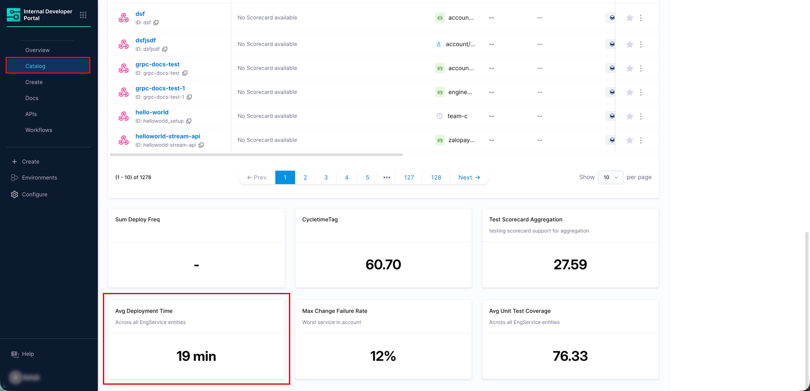
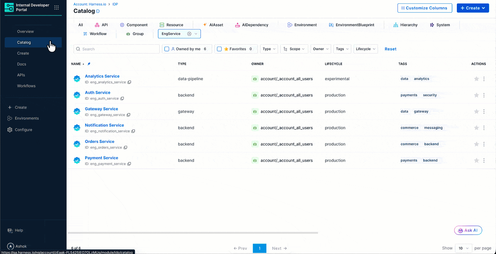
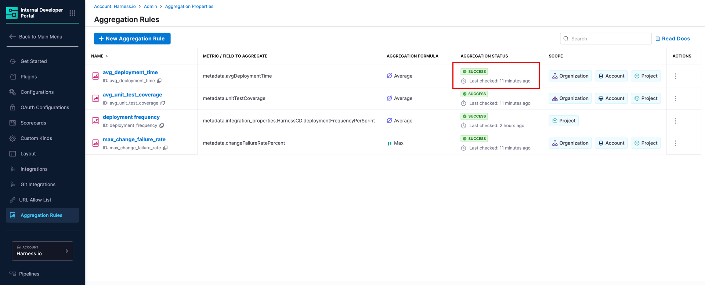
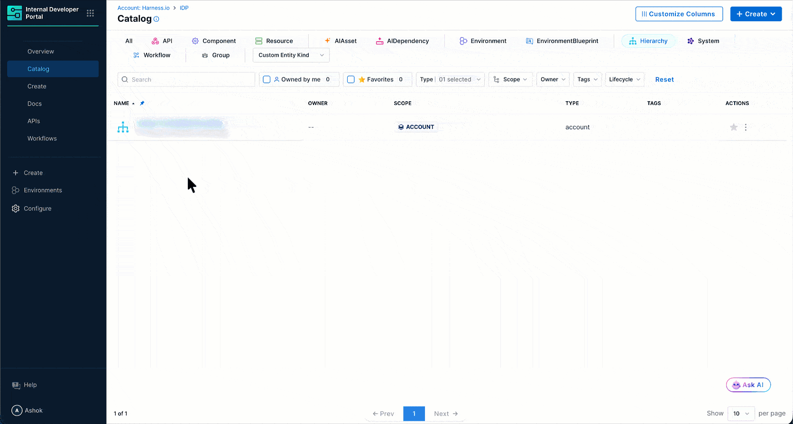
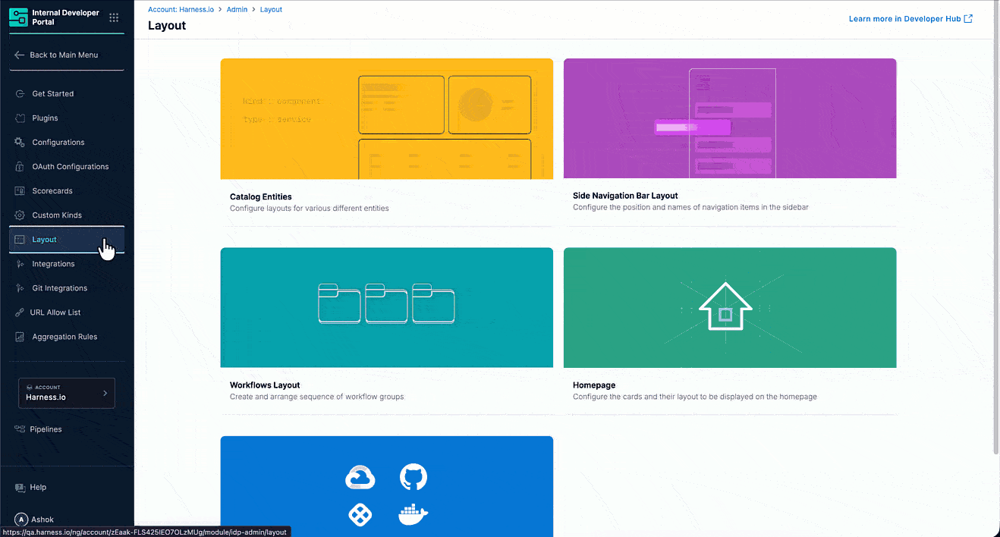
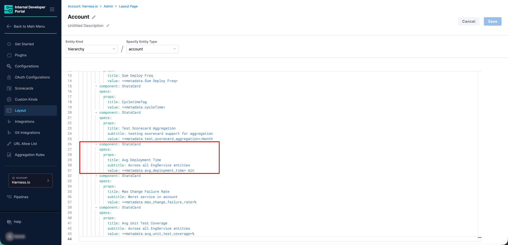

Metric aggregation rules roll up a raw numeric field stored in entity metadata to higher levels in your organizational hierarchy. The aggregated value is ingested as a new metadata property on the target hierarchy entity.



**Common sources for metric fields:**
- Properties ingested via the [Catalog Ingestion API](/docs/internal-developer-portal/catalog/integrate-tools/catalog-ingestion-api)
- DORA metrics synced from a CD integration (e.g. `metadata.integration_properties.HarnessCD.changeFailureRatePercent`, `metadata.integration_properties.HarnessCD.deploymentFrequencyPerSprint`)
- Custom properties defined in entity YAML

Metric aggregation works with any entity kind, including [custom kinds](/docs/internal-developer-portal/custom-kinds/overview).

:::info
If a metadata field does not exist on a given entity, that entity is skipped during aggregation.
:::

---

## Create a Metric Aggregation Rule

### Step 1: Confirm the field exists on your source entities

Open any source entity in the catalog, click **View YAML**, and check **Raw YAML** or **Ingested Properties** for the field you intend to aggregate.



If the field is missing, ingest it first via the [Catalog Ingestion API](/docs/internal-developer-portal/catalog/integrate-tools/catalog-ingestion-api) or a CD integration.

**Finding the correct field path:** Use the dot-notation key exactly as it appears in the YAML, including casing. For example:

```yaml
metadata:
  avgDeploymentTime: 45
```

The field path would be `metadata.avgDeploymentTime`. Field paths are case-sensitive.

### Step 2: Fill in the rule form

Navigate to **Configure** → **Aggregation Rules** and click **+ New Aggregation Rule**.


| Field | Required | Description |
|---|---|---|
| **Aggregation Type** | Yes | Select `METRIC` |
| **Metric / Field to Aggregate** | Yes | Dot-notation path from Step 1, e.g. `metadata.avgDeploymentTime` |
| **Aggregation Formula** | Yes | Choose the operation: **Average** (mean across all), **Sum** (total), **Min** (lowest), **Max** (highest), **Median** (middle value) |
| **Aggregation Property Name** | Yes | Name of the new property written to hierarchy entities, e.g. `avg_deployment_time` |
| **Description** | No | Write a brief description about the rule you create |

#### Roll-up Scope

Select the hierarchy levels where the aggregated value should be stored. You can select multiple levels simultaneously.


| Level | Aggregates from |
|---|---|
| **Account** | All matching entities in the entire account |
| **Organization** | All matching entities within each organization |
| **Project** | All matching entities within each project |
| **System** | All matching entities associated with each system |

:::info
Each level is computed independently from the source entities. The account value is never derived by averaging project values. It is always computed fresh from source entities directly.
:::

#### Configure Entities to Aggregate From

All filters are combined with AND logic.

| Filter | Required | Description |
|---|---|---|
| **Aggregation Scope** | No | Restrict to a specific account, org, or project. Leave blank (`*`) for all. |
| **Entity Kind** | No | e.g. `Component` or `hierarchy` |
| **Entity Type** | No | e.g. `service` |
| **Owners** | No | Filter by owner |
| **Tags** | No | Filter by tags |
| **Lifecycle** | No | Filter by lifecycle stage |

Click **Save**. The rule appears in your Aggregation Rules list with a **SUCCESS** status once the first computation completes.



### Step 3: Verify the value is ingested

Open the hierarchy entity where the aggregated value should appear (for example, the account entity). Click **View YAML** → **Ingested Properties** and confirm the new property is present.



```yaml
metadata:
  avg_deployment_time: 19.0
```

If the property is missing, check that:
- The field path in your rule exactly matches the key in entity metadata (casing matters).
- At least one entity in your aggregation scope has the field present.
- The rule status is **SUCCESS**. If it shows an error, click **Compute** from the three-dot menu to trigger a fresh run.

### Step 4: Surface the value in the catalog layout

The aggregated value is stored as a metadata property but does not appear on the entity page automatically. Add a `StatsCard` to the hierarchy entity's catalog layout to display it.

:::info
This is intentional. Harness IDP gives you control over which values appear on which pages and how they are labeled. The same property can appear on multiple layouts with different titles for different audiences.
:::

Navigate to **Configure** → **Layout** → **Catalog Entities** → **Hierarchy** → select the entity type → **Edit Layout**.



Add a `StatsCard` referencing the aggregated property using `<+metadata.propertyName>` syntax given below:

```yaml
- component: StatsCard
  specs:
    props:
      title: Avg Deployment Time
      subtitle: Across all services
      value: <+metadata.avg_deployment_time> min
```



Save the layout. The aggregated value now appears as a card on the hierarchy entity page.


---

## Use Cases

### Use Case 1: DORA Metrics from CD Integration

```yaml
Aggregation Type: Metric
Field to Aggregate: metadata.integration_properties.HarnessCD.changeFailureRatePercent
Aggregation Property Name: max_change_failure_rate
Formula: Maximum
Roll-up Scope: Project, Organization, Account
Entity Kind: Component
Type: service
```

**Result:** `metadata.Max Change Failure Rate` is available on project, organization, and account entities.

### Use Case 2: Custom Ingested Properties

Aggregate any custom property ingested via the [Catalog Ingestion API](/docs/internal-developer-portal/catalog/integrate-tools/catalog-ingestion-api).

```yaml
Aggregation Type: Metric
Field to Aggregate: metadata.mttr
Aggregation Property Name: max_MTTR
Formula: Maximum
Roll-up Scope: Project, Organization
Entity Kind: Component
Type: service
```

**Result:** `metadata.max_MTTR` is available on project and organization entities.

### Use Case 3: Hierarchical Aggregation

```yaml
Aggregation Type: Metric
Field to Aggregate: metadata.qa.integrationTestCoverage
Aggregation Property Name: avg_unit_test_coverage
Formula: Average
Roll-up Scope: Organization, Account
Entity Kind: hierarchy
Type: project
```

**Result:** `metadata.avg_unit_test_coverage` is available on organization and account entities.

---

## Frequently Asked Questions

<details>
<summary>My metric field is not showing up in the aggregated value. Why?</summary>
<div>

Check the following in order:

1. **Field path casing**: The path in your rule must exactly match the key as it appears in the entity's Ingested Properties YAML, including casing. `metadata.avgDeploymentTime` and `metadata.AvgDeploymentTime` are treated as different fields.
2. **Field presence**: Open the Entity Inspector on one of your source entities and confirm the field exists under Ingested Properties. If it is missing, the data has not been ingested yet.
3. **Rule status**: If the rule shows an error status rather than SUCCESS, click **Compute** from the three-dot menu to trigger a fresh run.
4. **Entity filters**: Confirm the Entity Kind, Type, and Aggregation Scope in your rule match the entities that carry the field. If your filters are too narrow, no entities may qualify.

</div>
</details>

<details>
<summary>For more FAQs, see the <a href="/docs/internal-developer-portal/catalog/aggregation-rules">Aggregation Rules Overview</a>.</summary>
<div>

The overview page covers shared questions including where aggregated values live, how to restrict aggregation to a subset of projects, and how to display values in the catalog layout.

</div>
</details>
