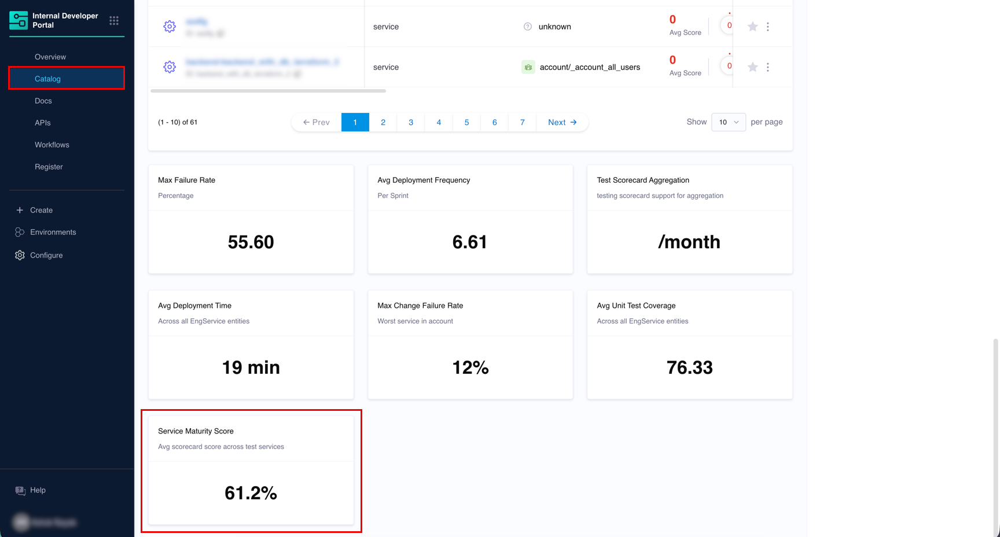
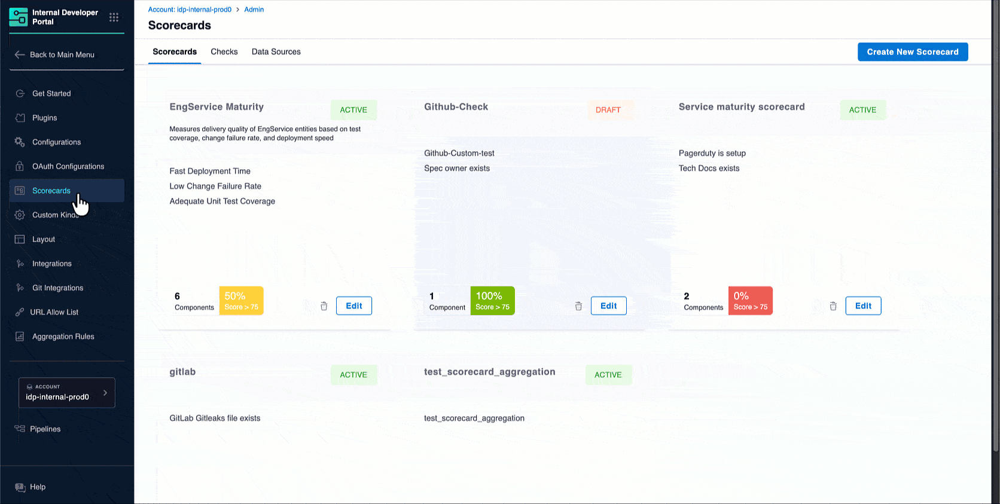
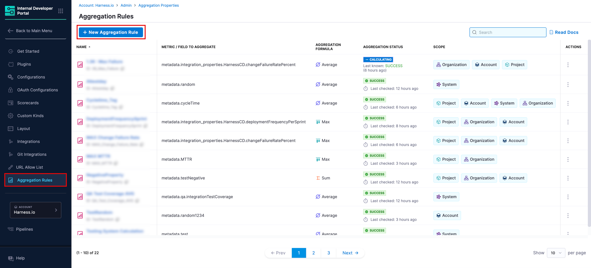
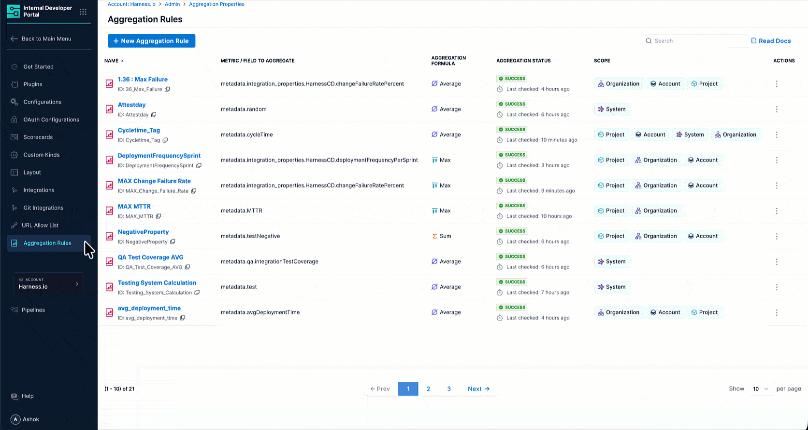
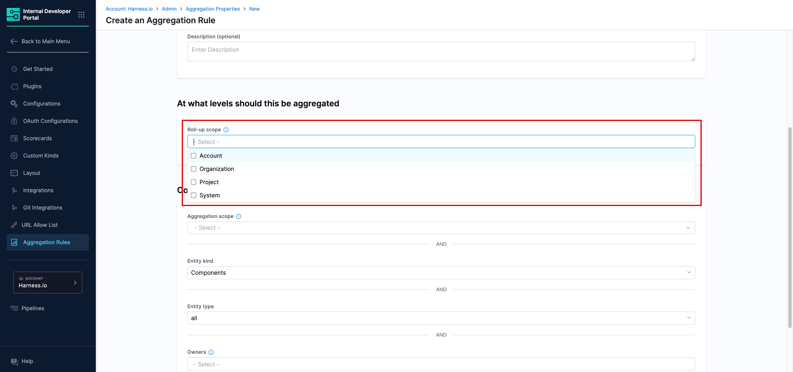
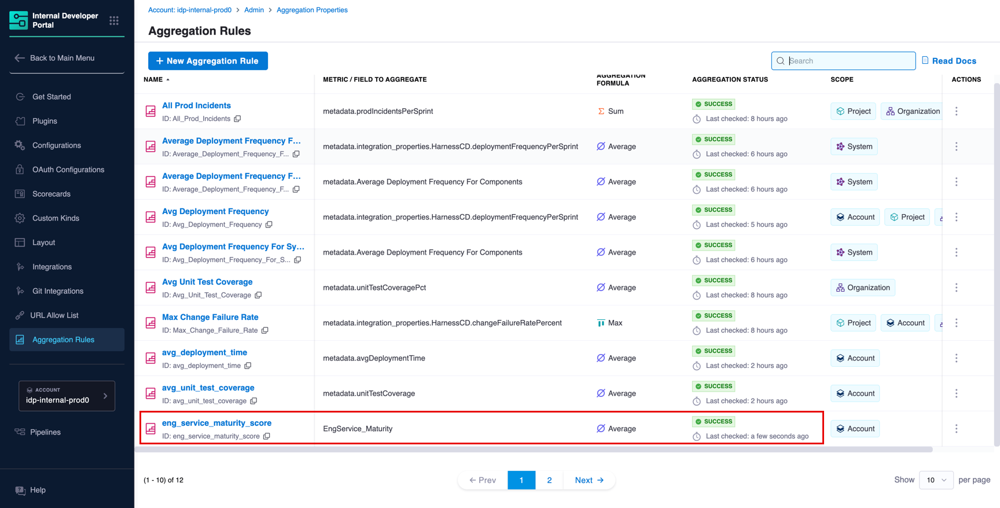
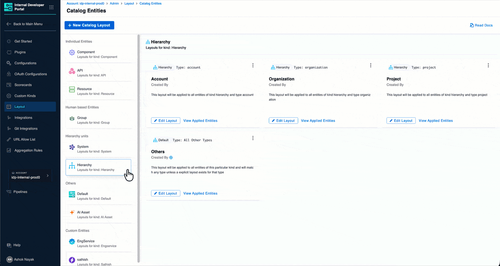
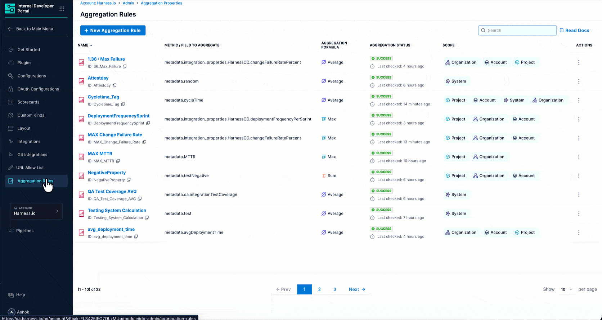
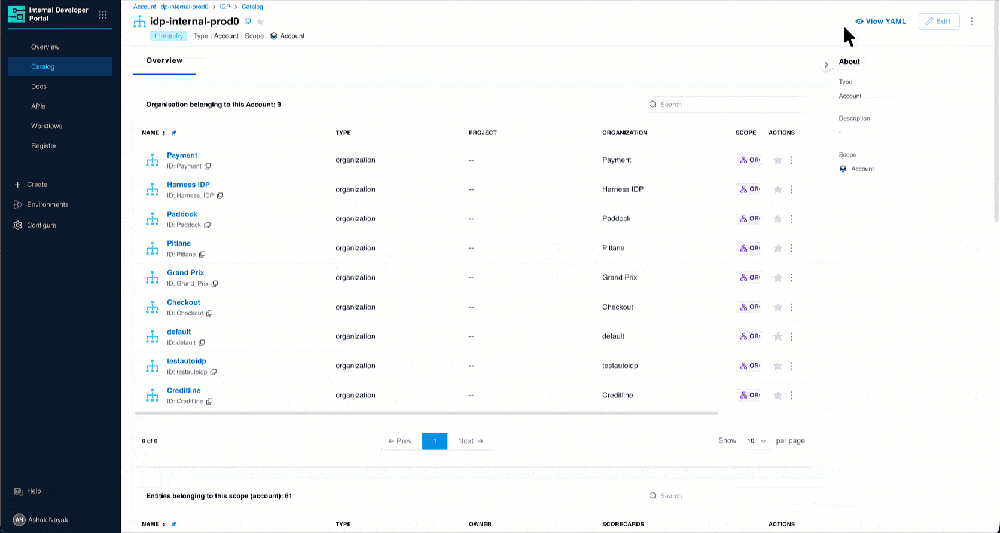

Scorecard aggregation rules let you roll up an existing scorecard's computed scores from source entities to higher levels in your hierarchy (account, org, project, or system) and display them on hierarchy entity pages.



:::caution Prerequisite
You need an active [scorecard](/docs/internal-developer-portal/scorecards/scorecard) that is already configured and running on your entities before creating a scorecard aggregation rule.
:::

---

## Create a Scorecard Aggregation Rule

### Step 1: Confirm your scorecard is active and has run

Navigate to **Configure** → **Scorecards** and confirm the scorecard you want to aggregate is **Active** and has run at least once (a last-run timestamp is visible on the scorecard page).



If the scorecard has never computed scores, open the scorecard, navigate to an entity it applies to, go to the **Scorecard** tab, and click **Rerun Checks**. Then check **Ingested Properties** on that entity to confirm the score has been written there before proceeding.

### Step 2: Fill in the rule form

Navigate to **Configure** → **Aggregation Rules** and click **+ New Aggregation Rule**.



| Field | Required | Description |
|---|---|---|
| **Aggregation Type** | Yes | Select `SCORECARD` |
| **Scorecard to Aggregate** | Yes | Select the scorecard from the dropdown |
| **Aggregation Formula** | Yes | Choose the operation: **Average** (mean across all), **Sum** (total), **Min** (lowest), **Max** (highest), **Median** (middle value) |
| **Aggregation Property Name** | Yes | Name of the new property written to hierarchy entities, e.g. `service_maturity` |
| **Description** | No | Write a brief description about the rule you create |



#### Roll-up Scope

Select the hierarchy levels where the aggregated value should be stored. You can select multiple levels simultaneously.



| Level | Aggregates from |
|---|---|
| **Account** | All matching entities in the entire account |
| **Organization** | All matching entities within each organization |
| **Project** | All matching entities within each project |
| **System** | All matching entities associated with each system |

:::info
Each level is computed independently from the source entities. The account value is never derived by averaging project values. It is always computed fresh from source entities directly.
:::

#### Configure Entities to Aggregate From

All filters are combined with AND logic.

| Filter | Required | Description |
|---|---|---|
| **Aggregation Scope** | No | Restrict to a specific account, org, or project. Leave blank (`*`) for all. |
| **Entity Kind** | No | Can be a built-in kind, e.g. `Component` or a [custom kind](/docs/internal-developer-portal/custom-kinds/overview) |
| **Entity Type** | No | e.g. `service` |
| **Owners** | No | Filter by owner |
| **Tags** | No | Filter by tags |
| **Lifecycle** | No | Filter by lifecycle stage |

Click **Save**. The rule appears in your Aggregation Rules list with a **SUCCESS** status once the first computation completes.



### Step 3: Verify the value is ingested

Open the hierarchy entity where the aggregated value should appear (for example, the account entity). Click **View YAML** → **Ingested Properties** and confirm the new property is present.



```yaml
metadata:
  service_maturity: 17.5
```

If the property is missing, check that:
- The scorecard has run on source entities and scores are visible in their **Ingested Properties** (not just the Scorecard tab).
- The Entity Kind filter in your rule matches the kind of entities the scorecard is applied to.
- The Aggregation Scope shows `*` and is not restricted to a specific project or org that excludes your source entities.
- The rule status is **SUCCESS**. If it shows an error, click **Compute** from the three-dot menu to trigger a fresh run.

### Step 4: Surface the value in the catalog layout

The aggregated value is stored as a metadata property but does not appear on the entity page automatically. Add a `StatsCard` to the hierarchy entity's catalog layout to display it.

:::info
This is intentional. Harness IDP gives you control over which values appear on which pages and how they are labeled. The same property can appear on multiple layouts with different titles for different audiences.
:::

* Navigate to **Configure** → **Layout** → **Catalog Entities** → **Hierarchy** → select the entity type → **Edit Layout**.

* Add a `StatsCard` referencing the aggregated property using `<+metadata.propertyName>` syntax given below:

  ```yaml
  - component: StatsCard
    specs:
      props:
        title: Service Maturity Score
        subtitle: Avg scorecard score across all services
        value: <+metadata.service_maturity>%
  ```

  

* Save the layout. The aggregated scorecard score now appears as a card on the hierarchy entity page.

  

---

## Use Cases

### Use Case 1: Service Maturity Roll-up

```yaml
Aggregation Type: Scorecard
Scorecard to Aggregate: Service maturity scorecard
Aggregation Property Name: service_maturity
Formula: Average
Roll-up Scope: Organization, Account
Entity Kind: Component
Type: service
```

**Result:** `metadata.service_maturity` is available on organization and account entities.

### Use Case 2: Compliance Posture Across Projects

```yaml
Aggregation Type: Scorecard
Scorecard to Aggregate: Compliance scorecard
Aggregation Property Name: avg_compliance_score
Formula: Average
Roll-up Scope: Project, Organization
Entity Kind: Component
Type: service
```

**Result:** `metadata.avg_compliance_score` is available on project and organization entities.

### Use Case 3: Production Readiness by System

```yaml
Aggregation Type: Scorecard
Scorecard to Aggregate: Production readiness scorecard
Aggregation Property Name: min_production_readiness
Formula: Minimum
Roll-up Scope: System
Entity Kind: Component
Type: service
```

**Result:** `metadata.min_production_readiness` is available on system entities.

---

## Frequently Asked Questions

<details>
<summary>The scorecard score is visible on the entity's Scorecard tab but the aggregation rule writes nothing. Why?</summary>
<div>

The aggregation engine reads from **Ingested Properties**, not from the Scorecard tab. Open one of your source entities, click **View YAML** → **Ingested Properties**, and check whether the scorecard score appears there.

</div>
</details>

<details>
<summary>The scorecard score hasn't updated. Why?</summary>
<div>

Scorecard checks run twice a day. If you need a fresh value before the next automatic run, navigate to **Configure** → **Scorecards**, open the scorecard, go to an entity it covers, and click **Rerun Checks** on the Scorecard tab. Then return to **Aggregation Rules** and click **⋮** → **Compute** on the rule.

</div>
</details>

<details>
<summary>For more FAQs, see the <a href="/docs/internal-developer-portal/catalog/aggregation-rules">Aggregation Rules Overview</a>.</summary>
<div>

The overview page covers shared questions including where aggregated values live, how to restrict aggregation to a subset of projects, and how to display values in the catalog layout.

</div>
</details>
