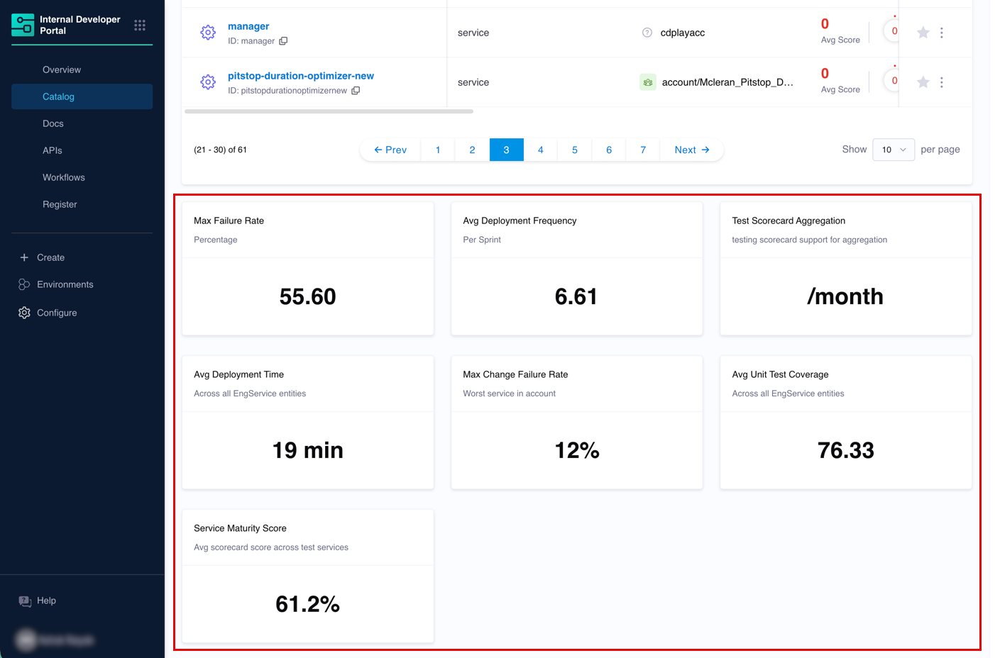
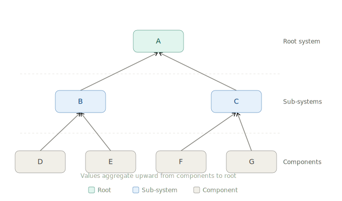
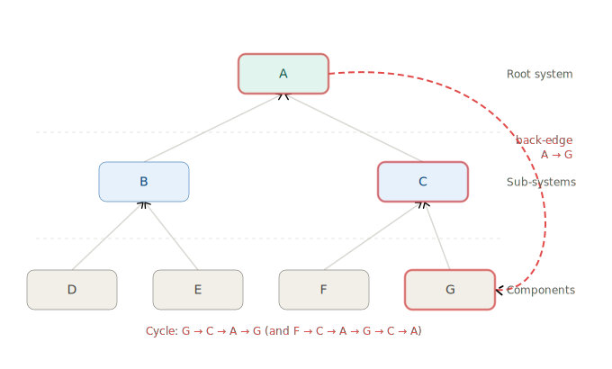

## Introduction

Aggregation rules roll up data from lower-level entities (such as services and components) to higher levels in your organizational hierarchy: project, organization, account, or system. The result is ingested as a new metadata property on the target hierarchy entity, which you can surface using a [StatsCard](/docs/internal-developer-portal/layout-and-appearance/catalog#statscard) in the catalog layout.

For each rule, you define what to aggregate, the formula (average, sum, median, min, or max), the hierarchy levels to roll up to, and the entity filters that determine which entities contribute.

:::info
This feature requires the **`IDP_AGGREGATION_RULES`** feature flag to be enabled. Contact [Harness Support](mailto:support@harness.io) to enable it.
:::

---

## Aggregation Types

You can aggregate two types of data, both resulting in a new metadata property on the target hierarchy entity.

- **[Metric Aggregation](/docs/internal-developer-portal/catalog/aggregation-rules/aggregation-rules-metric)** - A raw numeric field from entity metadata, such as `metadata.avgDeploymentTime` or `metadata.integration_properties.HarnessCD.changeFailureRatePercent`. Works with any entity kind including [custom kinds](/docs/internal-developer-portal/custom-kinds/overview).
- **[Scorecard Aggregation](/docs/internal-developer-portal/catalog/aggregation-rules/aggregation-rules-scorecard)** - The latest computed score of an existing scorecard. Use this to surface team-wide quality or maturity signals without defining separate rules for each individual check.

If you are tracking a specific engineering measurement, use Metric. If a scorecard already condenses multiple checks into one score and you want that at a hierarchy level, use Scorecard. Many teams use both.

---

## System-of-Systems Hierarchy

When you select **System** as a roll-up scope and the entities being aggregated are themselves systems (not just components), the aggregation supports **system-of-systems** hierarchies.

In the example below, A, B, and C are all systems. D, E, F, and G are their child systems or components. Aggregation flows upward through the entire subtree: B collects from D and E, C collects from F and G, and A collects from the full tree below it.

:::warning Avoid cyclic dependencies in system hierarchies
If a back-edge exists (for example, A pointing back to G), the hierarchy is no longer a tree and traversal has no single starting point. The aggregation will not error out, but computed values at one or more nodes will be incorrect.

The diagram below shows the problematic back-edge from A to G. Nodes A, C, and G are all caught in the resulting cycles.
:::

Always configure your system-of-systems hierarchy as a directed acyclic graph. If you are unsure whether your hierarchy has cycles, review your system definitions before creating aggregation rules that target the System roll-up scope.

---

## Manage Aggregation Rules

Navigate to **Configure** → **Aggregation Rules** to view, edit, and manage all rules.

### Compute on Demand

Click the **⋮** menu next to a rule and select **Compute** to trigger a manual recomputation. This is useful before a demo or review when you want the latest values without waiting for the next automatic run.

### Edit a Rule

1. Click **⋮** → **Edit**.
2. Make your changes.
3. Click **Save**.

The rule recomputes automatically after saving.

### Delete a Rule

1. Click **⋮** → **Delete**.
2. Confirm the deletion.

:::warning
Deleting an aggregation rule removes all aggregated values that rule created from hierarchy entities. Any `StatsCard` or `AggregatedTable` layout components referencing the deleted property will show a dash or empty value.
:::

---

## Frequently Asked Questions

Where does the aggregated value actually live?

It is stored as a metadata property on the target hierarchy entity and is visible under **Entity Inspector** → **Ingested Properties**. For technical users it appears as a key in the entity's ingested YAML. For non-technical users it appears as a card value in the catalog layout once you configure the `StatsCard`.

Can I aggregate from only a subset of projects?

Yes. In the **Aggregation Scope** field of the rule, select the specific projects you want to pull from. The aggregation will collect values or scores from entities within those projects only.

Can I display the aggregated value on a service page?

Aggregated values are written to **hierarchy** entities (account, org, project, system), not to individual component entities. To display them, configure the layout for the relevant hierarchy entity type via **Configure** → **Layout** → **Catalog Entities** → **Hierarchy**.

What is the difference between rolling up a metric vs. rolling up a scorecard?

A metric roll-up reads a raw number stored in an entity's metadata field. A scorecard roll-up reads the latest computed score from a scorecard applied to an entity. Both produce the same end result, a new metadata property on the hierarchy entity that you can display using a `StatsCard`.

The key difference is intent. Use metric aggregation when you want to track a specific engineering signal at scale. Use scorecard aggregation when you want to track overall quality or maturity that a scorecard already condenses into one number.

