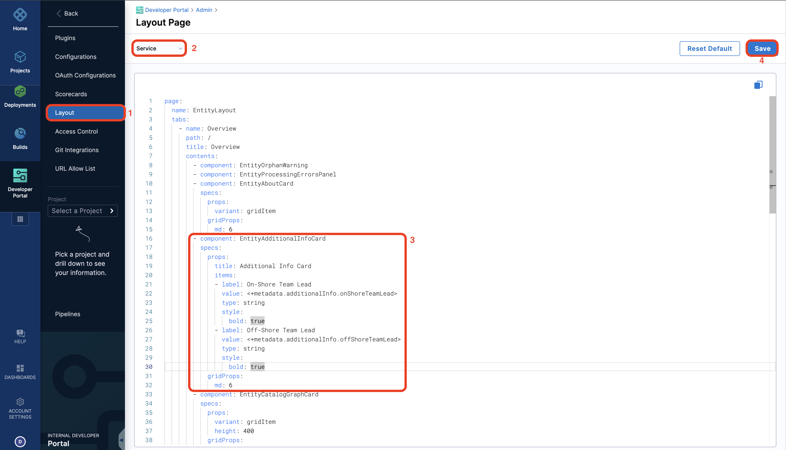

<DocsTag  backgroundColor= "#cbe2f9" text="Tutorial"  textColor="#0b5cad"  />

## Introduction

In this tutorial we will be using the catalog metadata ingestion APIs to add additional metadata for the software components in the catalog, display them in the component overview page using [additional info card](/docs/internal-developer-portal/catalog/custom-card) and use the same data to input values in workflows using [Workflow UI Pickers](/docs/internal-developer-portal/flows/custom-extensions).

<DocImage path={require('./static/ccp-usecase.png')} />

## Pre-requisites

1. You must have components registered in your software catalog. If you don't have any components registered, follow this [tutorial](/docs/internal-developer-portal/catalog/register-software-component) to register one. We recommend you to register [this software component](https://github.com/harness-community/idp-samples/blob/main/example-catalog-info/cataog-info-ccp.yaml) for this tutorial.

## Add a new metadata

1. Now using the following cURL command add a new metadata `onShoreTeamLead` in all your software component of type `services` and using the tag `java`

```cURL
curl --location 'https://app.harness.io/gateway/v1/catalog/custom-properties' \
--header 'Harness-Account: <Add_YOUR_Account_ID>' \
--header 'Content-Type: application/json' \
--header 'x-api-key: <Add your key>' \
--data '{
    "properties": [
        {
            "field": "metadata.additionalInfo.onShoreTeamLead",
            "filter": {
                "kind": "Component",
                "type": "service",
                "owners": [
                    "Add the User Group Owning the services"
                ],
                "lifecycle": [
                    "experimental",
                    "production"
                ],
                "tags": [
                    "java"
                ]
            },
            "value": "John Doe"
        }
    ]
}'
```

import Tabs from '@theme/Tabs';
import TabItem from '@theme/TabItem';

<Tabs queryString="Use the Metadata Information ">
<TabItem value="display-additional-info-card" label="Additional Info Card">

In case you want to display the same information you have ingested on your Overview page as an additional card, follow the steps below.

1. Go to the **Layout Page** and under **Admin** and add the following for **Services** and **Save** it.

```YAML
- component: EntityAdditionalInfoCard
    specs:
    props:
        title: Additional Info Card
        items:
        - label: On-Shore Team Lead
        value: <+metadata.additionalInfo.onShoreTeamLead>
        type: string
        style:
            bold: true
        - label: Off-Shore Team Lead
        value: <+metadata.additionalInfo.offShoreTeamLead>
        type: string
        style:
            bold: true
    gridProps:
        md: 6
```



:::info

We had already added the `offShoreTeamLead` in the [`catalog-info.yaml`](https://github.com/harness-community/idp-samples/blob/main/example-catalog-info/cataog-info-ccp.yaml) as we have recommended above under the pre-requisites, if you haven't used the same, you'll get a data not found error for the field.

:::

2. Now go to the **FoodService** Software Component in the **Catalog** and you'll find an additional info card populated with information we ingested using the API above. You can read more about [additional info card](/docs/internal-developer-portal/catalog/custom-card)


</TabItem>
<TabItem value="use-value-in-workflows" label="Workflows UI Picker">

In case you need to use the data present in your catalog as an input for the workflows, you can do so by using the [EntityFieldPicker](https://developer.harness.io/docs/internal-developer-portal/flows/custom-extensions#entityfieldpicker).

Here's an example workflow template that uses the `onShoreTeamLead` as Owner for the new service being created.

```YAML
## Example template.yaml
...
owner:
    title: Owner
    type: string
    description: Team Lead the owner of this service
    ui:field: EntityFieldPicker
    ui:displayField: metadata.additionalInfo.onShoreTeamLead
    ui:options:
        catalogFilter:
            kind:
            - Component
            - Service
...
```

The `ui:displayField` fetches all the `onShoreTeamLead` names from the catalog.

```YAML
### Complete Example of a service onboarding template.yaml

apiVersion: scaffolder.backstage.io/v1beta3
kind: Template
# some metadata about the template itself
metadata:
  name: react-app
  title: Create a new service
  description: A template to create a new service
  tags:
    - nextjs
    - react
    - javascript
# these are the steps which are rendered in the frontend with the form input
spec:
  owner: debabrata.panigrahi@harness.io
  type: service
  parameters:
    - title: Service Details
      required:
        - template_type
        - public_template_url
        - owner
      properties:
        template_type:
          title: Type of the Template
          type: string
          description: Type of the Template
        public_template_url:
          title: Give a Public template URL
          type: string
          description: Give a Public Cookiecutter Template
        owner:
            title: Owner
            type: string
            description: Team Lead the owner of this service
            ui:field: EntityFieldPicker
            ui:displayField: metadata.additionalInfo.onShoreTeamLead
            ui:options:
                catalogFilter:
                    kind:
                    - Component
                    - Service
        # This field is hidden but needed to authenticate the request to trigger the pipeline
        token:
          title: Harness Token
          type: string
          ui:widget: password
          ui:field: HarnessAuthToken
  # here's the steps that are executed in series in the scaffolder backend
  steps:
    - id: trigger
      name: Creating your react app
      action: trigger:harness-custom-pipeline
      input:
        url: "Your PIPELINE URL"
        inputset:
          service_owner: ${{ parameters.owner }}
          template_type: ${{ parameters.template_type }}
          public_template_url: ${{ parameters.public_template_url }}
        apikey: ${{ parameters.token }}
  # some outputs which are saved along with the job for use in the frontend
  output:
    links:
      - title: Pipeline Details
        url: ${{ steps.trigger.output.PipelineUrl }}
```

</TabItem>
</Tabs>

## Conclusion

Using the Catalog Metadata Ingestion API, you can source information into your catalog from internal systems such as cost trackers, service health checkers, security scans, or even from simple spreadsheets tracking personnel details and use them to just display the information to users as wells as use them as an input for workflows.
