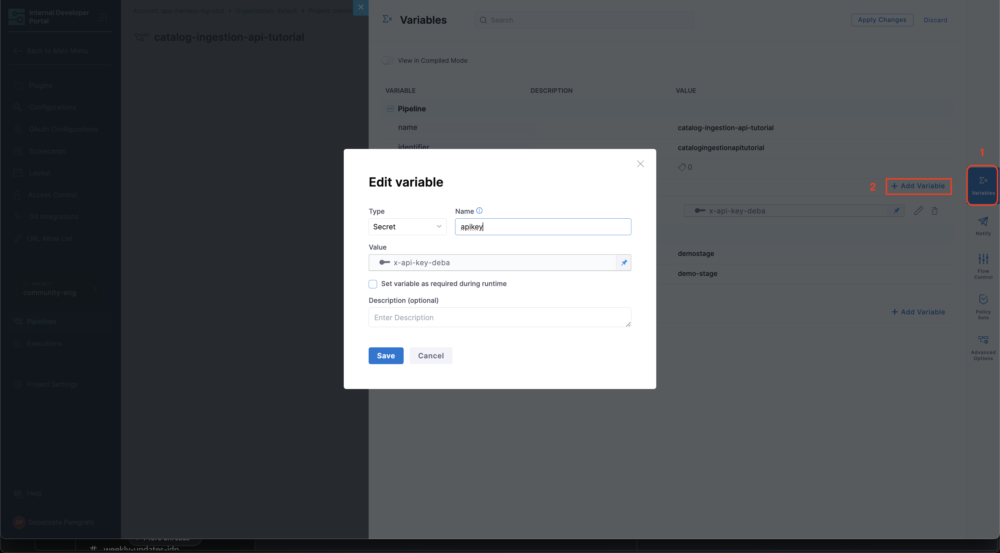
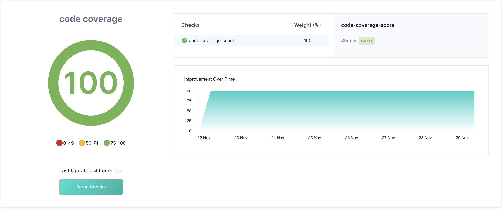
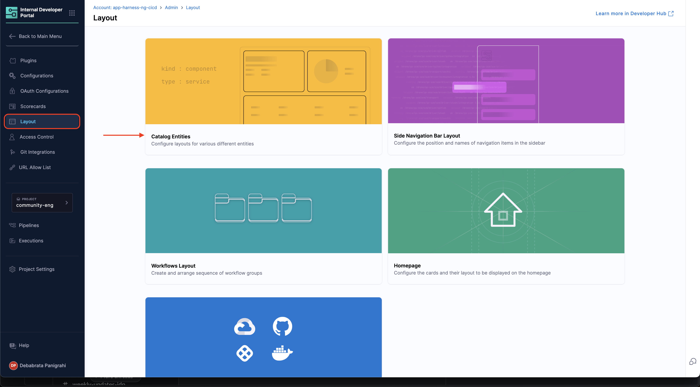
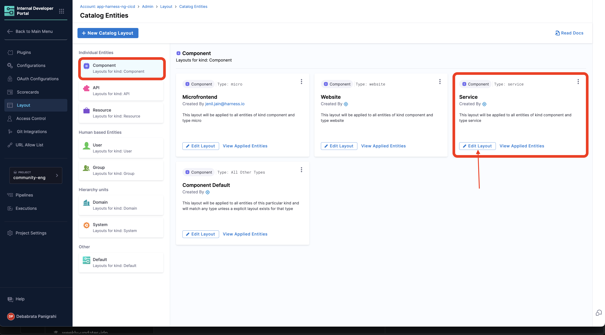
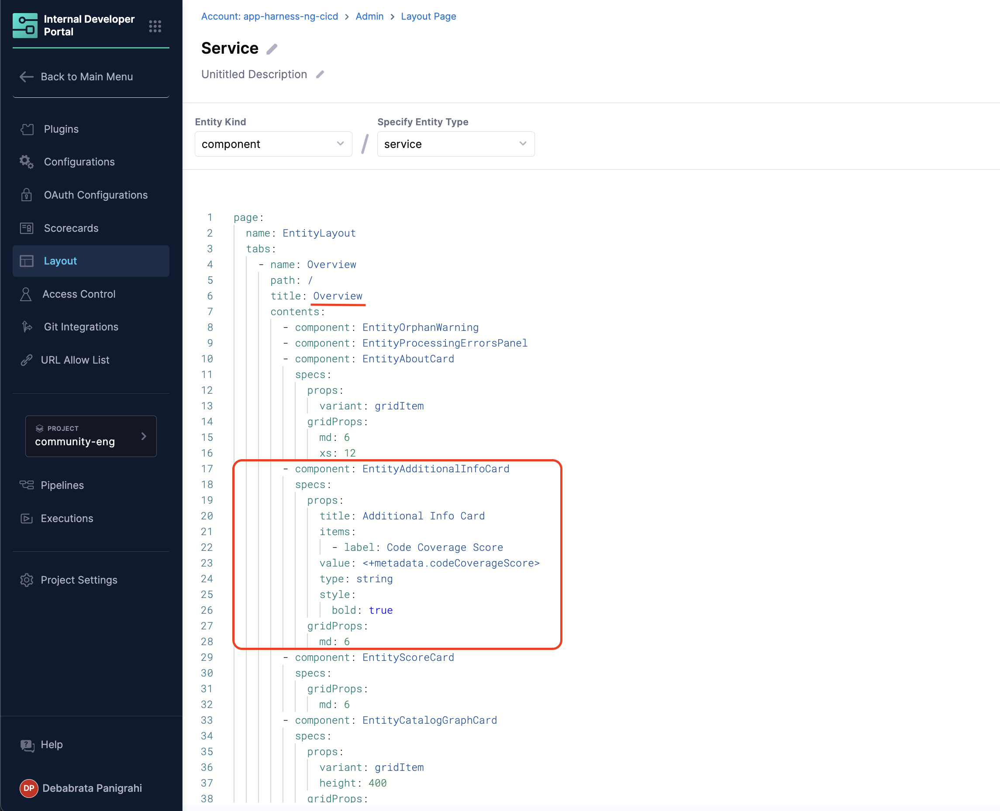
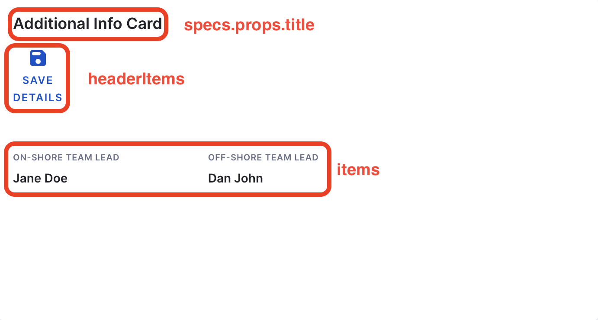

<DocsTag  backgroundColor= "#cbe2f9" text="Tutorial"  textColor="#0b5cad"  />

## Introduction

In this tutorial we will be using the catalog metadata ingestion APIs to add additional metadata for the software components in the catalog, display them in the component overview page using [additional info card](/docs/internal-developer-portal/catalog/custom-card) and track the values ingested using [Scorecard](https://developer.harness.io/docs/internal-developer-portal/scorecards/custom-data-sources). 

<DocImage path={require('./static/ccp-usecase.png')} />

<DocVideo src="https://www.youtube.com/embed/MB-IWGoYjOo?si=y87PPJlPdVYeqd99" />

## Pre-requisites

1. You must have components registered in your software catalog. If you don't have any components registered, follow this [tutorial](/docs/internal-developer-portal/catalog/register-software-component) to register one. We recommend you to register [this software component](https://github.com/harness-community/idp-samples/blob/main/example-catalog-info/tutorial-catalog-ingestion.yaml) for this tutorial.

## Add a new metadata

1. We use the following Harness Pipeline to add a new metadata `codeCoverageScore` to the `warehouse` component. While using the following pipeline YAML make sure to add the `x-api-key` as pipeline variable of type secret and name `apikey`. 

<details>
<summary>Harness Pipeline</summary>

```YAML
pipeline:
  name: catalog-ingestion-api-tutorial
  identifier: catalogingestionapitutorial
  projectIdentifier: <PROJECT_ID>
  orgIdentifier: <ORG_ID>
  tags: {}
  stages:
    - stage:
        name: demo-stage
        identifier: demostage
        description: ""
        type: IDP
        spec:
          platform:
            os: Linux
            arch: Amd64
          runtime:
            type: Cloud
            spec: {}
          execution:
            steps:
              - step:
                  type: Run
                  name: Run_1
                  identifier: Run_1
                  spec:
                    shell: Python
                    command: |-
                      import requests
                      import random

                      # Define the API endpoint and headers
                      url = 'https://app.harness.io/gateway/v1/catalog/custom-properties/entity'
                      headers = {
                          'Harness-Account': '<+account.identifier>',
                          'Content-Type': 'application/json',
                          'x-api-key': '<+pipeline.variables.apikey>'  # Replace with your actual API key
                      }

                      # Fetch the product data from the API
                      product_url = 'https://dummyjson.com/products'
                      response = requests.get(product_url)

                      # Check if the response is successful
                      if response.status_code == 200:
                          data = response.json()

                          # Extract stock data
                          products = data.get("products", [])
                          total_stock = sum(product.get("stock", 0) for product in products)

                          # Introduce variability
                          random_max_possible_stock = random.randint(500, 2000)  # Randomize max stock
                          random_factor = random.uniform(0.5, 1.5)  # Random multiplier for variation

                          # Calculate base score and apply randomness
                          base_score = (total_stock / random_max_possible_stock) * 100
                          code_coverage_score = min(base_score * random_factor, 100)  # Ensure < 100

                          print(f"Code Coverage Score: {code_coverage_score:.2f}")

                          # Prepare the data to update the code coverage score
                          data_payload = {
                              "entity_ref": "warehouse",
                              "property": "metadata.codeCoverageScore",
                              "value": round(code_coverage_score, 2)  # Send as a number, not a string
                          }

                          # Make the POST request to update the value
                          update_response = requests.post(url, headers=headers, json=data_payload)

                          # Check the response from the update request
                          if update_response.status_code == 200:
                              print("Code coverage score updated successfully!")
                              print("Response:", update_response.json())
                          else:
                              print(f"Failed to update the code coverage score. HTTP Status Code: {update_response.status_code}")
                              print("Response:", update_response.text)
                      else:
                          print(f"Failed to fetch product data. HTTP Status Code: {response.status_code}")
        tags: {}
  variables:
    - name: apikey
      type: Secret
      description: ""
      required: false
      value: x-api-key
```
</details>



## Update the metadata

Use a trigger to update the data ingested using the above pipeline. Create a pipeline trigger of type **Cron** to schedule an hourly trigger.


import Tabs from '@theme/Tabs';
import TabItem from '@theme/TabItem';


<Tabs queryString="use-metadata-info">
<TabItem value="scorecard" label="Code Coverage Scorecard">

## Code Coverage Scorecard \{#code-coverage-scorecard}

In case you want to track the information you have ingested using Scorecards, follow the steps below.

1. Go to the **Scorecards** and under **Admin** and select **Checks** from the top nav.

2. Now select **Create Custom Check** and add a New Custom Check to check the code coverage score, select the data source as **Catalog Info YAML** and data point as **Evaluate Expression(JEXL)**. 

3. Add the **jexl** to be evaluated as `<+metadata.codeCoverageScore>` and **operator** `Greater than or equal to` from the dropdown and add the **value** as `50` 


4. Now you can create a scorecard using the Custom Check you have created above. 


2. Now go to the **Warehouse** Software Component in the **Catalog**, and you'll find the Code Coverage Scorecard under Scorecards tab and on the overview page. You can read more about it [here](https://developer.harness.io/docs/internal-developer-portal/scorecards/custom-data-sources)



</TabItem>
<TabItem value="card" label="Additional Info Card">

## Additional Info Card \{#additional-info-card}

In case you want to display the same information you have ingested on your Overview page as an additional card, follow the steps below.

1. Go to the **Layout Page** and under **Admin** and select **Catalog Entities**.



2. Now Select **Edit Layout** for component **Service** and add the following under Overview card. 



```YAML
- component: EntityAdditionalInfoCard
    specs:
    props:
        title: Additional Info Card
        items:
        - label: Code Coverage Score
        value: <+metadata.codeCoverageScore>
        type: string
        style:
        bold: true
    gridProps:
        md: 6
```




2. Now go to the **Warehouse** Software Component in the **Catalog**, and you'll find an additional info card populated with information we ingested using the API above. You can read more about [additional info card](/docs/internal-developer-portal/catalog/custom-card)



</TabItem>
</Tabs>

## Conclusion

Using the Catalog Metadata Ingestion API, you can source information into your catalog from internal systems such as cost trackers, service health checkers, security scans, or even from simple spreadsheets tracking personnel details and use them to just display the information to users as wells as use them as an input for workflows.

Check out [other examples of the Catalog Ingestion API](./catalog-ingestion-api.md).
