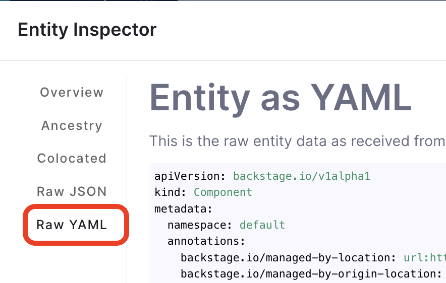

## Introduction

Software Catalog in Harness IDP supports modifying metadata associated with the services, libraries, websites and any other entities registered in the Catalog, without having to manually edit the `catalog-info.yaml`. This allows integrations with many systems such as cost trackers, service health checkers, security scans or even simple spreadsheets tracking personnel details like who is on-call this week.

The ingested data can be used to display on the UI, can be consumed in [Custom Plugins](../../plugins/custom-plugins/overview.md) and measured in Scorecard Checks. 

<DocImage title="Architecture Diagram of Catalog Ingestion" path={require('./static/catalog-custom-property.png')} />

## Use Cases - API Quick Overview

### 1. Update a Single Property of a Single Catalog Entity

```
POST /catalog/custom-properties/entity
```

```json title="Payload"
{
  "entity_ref": "boutique-service",
  "property": "metadata.teamLead",
  "value": "David John"
}
```

### 2. Update Multiple Properties of a Single Catalog Entity

```
POST /catalog/custom-properties/entity
```

```json title="Payload"
{
  "entity_ref": "boutique-service",
  "properties": [
    {
      "property": "metadata.teamLead",
      "value": "David John"
    },
    {
      "property": "metadata.teamOwner",
      "value": "Grace"
    }
  ]
}
```

### 3. Update a Single Property of Multiple Catalog Entities

```
POST /catalog/custom-properties/property
```

```json title="Payload"
{
  "property": "metadata.releaseVersion",
  "entity_refs": [
    {
      "entity_ref": "component:default/order-service",
      "value": 1.2.0
    },
    {
      "entity_ref": "component:default/idp-service",
    },
    {
      "entity_ref": "component:default/pipeline-service",
    }
  ],
  "value": 1.5.0,
}
```

### 4. Update a Single Property of Multiple Unspecified Catalog Entities using Filters

```
POST /catalog/custom-properties
```

```json title="Payload"
{
  "property": "metadata.teamLead",
  "filter": {
    "kind": "Component",
    "type": "service"
  },
  "value": "Jane Doe"
}
```

### 5. Update a Single Property of a Catalog Entity Without Replacing Existing Values

```http
POST /catalog/custom-properties/entity
```

```json title="Payload" {9}
{
  "entity_ref": "boutique-service",
  "property": "metadata.tags",
  "value": [
    "python",
    "java",
    "c++"
  ],
  "mode": "append"
}
```

> **Note**: `append` only works with data types that can hold multiple values, such as arrays or maps. It does not apply to simple data types like strings.


## Common API Request Details

### API Base URL

`https://app.harness.io/gateway/v1/`

### Headers

```
X-API-KEY: Harness API Key
Harness-Account: YOUR ACCOUNT ID
Content-Type: application/json
```

You can generate your Harness API Keys by following the [Harness API Key docs](https://developer.harness.io/docs/platform/automation/api/add-and-manage-api-keys/).

You can find your account ID in any of your Harness URLs, for example: `https://app.harness.io/ng/account/<ACCOUNT_ID>/idp/overview`.

## Detailed API Usage and Examples

### Update a Single Property of a Single Catalog Entity

#### cURL Example

```sh
curl \
--location 'https://app.harness.io/gateway/v1/catalog/custom-properties/entity' \
--header 'Harness-Account: ADD_YOUR_ACCOUNT_ID' \
--header 'Content-Type: application/json' \
--header 'x-api-key: ADD_YOUR_API_KEY' \
--data '{
    "entity_ref": "boutique-service",
    "property": "metadata.codeCoverageScore",
    "value": "83"
}'
```

#### Endpoint

**HTTP Method**

`POST`

**URL**

```
https://app.harness.io/gateway/v1/catalog/custom-properties/entity
```

#### Request Body

```json
{
  "entity_ref": "boutique-service",
  "property": "metadata.codeCoverageScore",
  "value": "83"
}
```

In the above example, we update/add **only** the `metadata.codeCoverageScore` **property** for the mentioned **entity** `boutique-service`.

<details>
  <summary>What is Entity Ref?</summary>

[Entity ref](https://backstage.io/docs/features/software-catalog/references/) is a stringified way of referencing a Catalog entity with the format `[<kind>:][<namespace>/]<name>`. `namespaces` are optional and are usually `default`. `kind` is often optional too and is assumed to be either `Component`, `API` or `Group` depending upon the context. The simplest way to represent a component is to use the name field `metadata.name`. For example

- `boutique-service`

This internally translates into `component:default/boutique-frontend` which means the entity is of `kind: Component` in the `default` namespace.

Here are some other examples of valid `entity_refs` -

- `component:order-service`
- `api:petstore`
- `group:my-team`
- `component:default/my-service`

Entity Refs are case-insensitive. [Read More](/docs/internal-developer-portal/catalog/entity-ref) on the Entity Reference. 

</details>

<details>

<summary>How to check the final entity?</summary>

You can use the Entity Inspector to view the final Raw YAML.




```YAML title="Example Processed Entity YAML as displayed in Harness IDP"

apiVersion: backstage.io/v1alpha1
kind: Component
metadata:
  name: my-new-service
  description: Description of my new service
  annotations:
       harness.io/project-url: https://app.harness.io/ng/account/vpCkHK/module/idp-admin/orgs/default/projects/Backstage/pipelines/Releasenpm/
  codeCoverageScore: 83
...
```

</details>

<!-- TODO (about mode): Add an example with mode. Push an array in metadata.custom_tags and then use mode:append and push an extra item. Currently this is broken https://harness.atlassian.net/browse/IDP-3734 -->

### Update Multiple Properties of a Single Catalog Entity

#### cURL Example

```sh
curl \
--location 'https://app.harness.io/gateway/v1/catalog/custom-properties/entity' \
--header 'Harness-Account: ADD_YOUR_ACCOUNT_ID' \
--header 'Content-Type: application/json' \
--header 'x-api-key: ADD_YOUR_API_KEY' \
--data '{
  "entity_ref": "boutique-service"
  "properties": [
    {
      "property": "metadata.codeCoverageScore",
      "value": "83"
    },
    {
      "property": "metadata.cloudCost",
      "value": "$2400",
    }
  ]
}'
```

<!-- See "TODO" Comment above.


:::info
`mode` is optional and is in use when the property holds an **array** like `tags`, `relations`, etc. For arrays, the **default** mode value is `replace` e.g. if you post a new tag, it will replace the existing tags added in the entity.
::: -->

#### Endpoint

#### HTTP Method

`POST`

#### URL

```
https://app.harness.io/gateway/v1/catalog/custom-properties/entity
```

#### Request Body

```json
{
  "entity_ref": "boutique-service",
  "properties": [
    {
      "property": "metadata.codeCoverageScore",
      "value": "83"
    },
    {
      "property": "metadata.cloudCost",
      "value": "$2400"
    }
  ]
}
```

In the above example, we add the `metadata.codeCoverageScore` & `metadata.cloudCost` properties for the mentioned `boutique-service`.

<details>
  <summary>What is Entity Ref?</summary>

[Entity ref](https://backstage.io/docs/features/software-catalog/references/) is a stringified way of referencing a Catalog entity with the format `[<kind>:][<namespace>/]<name>`. `namespaces` are optional and are usually `default`. `kind` is often optional too and is assumed to be either `Component`, `API` or `Group` depending upon the context. The simplest way to represent a component is to use the name field `metadata.name`. For example

- `boutique-service`

This internally translates into `component:default/boutique-frontend` which means the entity is of `kind: Component` in the `default` namespace.

Here are some other examples of valid `entity_refs` -

- `component:order-service`
- `api:petstore`
- `group:my-team`
- `component:default/my-service`

Entity Refs are case-insensitive.

</details>

<!-- See TODO comment above on Mode.
- **mode:**`mode` is optional, takes value `append/replace` and is in use when the property holds an **array** like `tags`, `relations`, etc. For arrays, the **default** mode value is `replace` e.g. if you post a new tag, it will replace the existing tags added in the entity. -->

<details>

<summary>How to check the final entity?</summary>

You can use the Entity Inspector to view the final Raw YAML.


```YAML title="Example Processed Entity YAML as displayed in Harness IDP"

apiVersion: backstage.io/v1alpha1
kind: Component
metadata:
  name: my-new-service
  description: Description of my new service
  annotations:
       harness.io/project-url: https://app.harness.io/ng/account/vpCkHK/module/idp-admin/orgs/default/projects/Backstage/pipelines/Releasenpm/
  codeCoverageScore: 83
...
```

</details>

### Update a Single Property of Multiple Catalog Entities

#### cURL Example

```sh
curl --location 'https://app.harness.io/gateway/v1/catalog/custom-properties/entity' \
--header 'Harness-Account: ADD_YOUR_ACCOUNT_ID' \
--header 'Content-Type: application/json' \
--header 'x-api-key: ADD_YOUR_API_KEY' \
--data '{
  "property": "metadata.releaseVersion",
  "entity_refs": [
    {
      "entity_ref": "component:default/order-service",
      "value": 1.2.0
    },
    {
      "entity_ref": "component:default/idp-service",
    },
    {
      "entity_ref": "component:default/pipeline-service",
    }
  ],
  "value": 1.5.0,
}'
```

:::info
You can skip the corresponding values of some entities in the `entity_refs` array and provide the default value under root `value` field of the payload. Value field is optional if all entities have a corresponding value specified.
:::

<!-- See TODO comment above on Mode
- `mode` is optional and is in use when the property holds an **array** like `tags`, `relations`, etc. For arrays, the **default** mode value is `replace` e.g. if you post a new tag, it will replace the existing tags added in the entity. -->

<details>

<summary>How to check the final entity?</summary>

You can use the Entity Inspector to view the final Raw YAML.


```YAML title="Example Processed Entity YAML as displayed in Harness IDP"

apiVersion: backstage.io/v1alpha1
kind: Component
metadata:
  name: my-new-service
  description: Description of my new service
  annotations:
       harness.io/project-url: https://app.harness.io/ng/account/vpCkHK/module/idp-admin/orgs/default/projects/Backstage/pipelines/Releasenpm/
  codeCoverageScore: 83
...
```

</details>

#### Endpoint

#### HTTP Method

`POST`

#### URL

```
https://app.harness.io/gateway/v1/catalog/custom-properties/entity
```

#### Request Body

```json
{
  "property": "metadata.releaseVersion",
  "entity_refs": [
    {
      "entity_ref": "component:default/order-service",
      "value": 1.2.0
    },
    {
      "entity_ref": "component:default/idp-service",
    },
    {
      "entity_ref": "component:default/pipeline-service",
    }
  ],
  "value": 1.5.0,
}
```

In the above example, we add the `metadata.releaseVersion` **property** for the mentioned **entities**.

<details>
  <summary>What is Entity Ref?</summary>

[Entity ref](https://backstage.io/docs/features/software-catalog/references/) is a stringified way of referencing a Catalog entity with the format `[<kind>:][<namespace>/]<name>`. `namespaces` are optional and are usually `default`. `kind` is often optional too and is assumed to be either `Component`, `API` or `Group` depending upon the context. The simplest way to represent a component is to use the name field `metadata.name`. For example

- `boutique-service`

This internally translates into `component:default/boutique-frontend` which means the entity is of `kind: Component` in the `default` namespace.

Here are some other examples of valid `entity_refs` -

- `component:order-service`
- `api:petstore`
- `group:my-team`
- `component:default/my-service`

Entity Refs are case-insensitive.

</details>

<details>

<summary>How to check the final entity?</summary>

You can use the Entity Inspector to view the final Raw YAML.


```YAML title="Example Processed Entity YAML as displayed in Harness IDP"

apiVersion: backstage.io/v1alpha1
kind: Component
metadata:
  name: my-new-service
  description: Description of my new service
  annotations:
       harness.io/project-url: https://app.harness.io/ng/account/vpCkHK/module/idp-admin/orgs/default/projects/Backstage/pipelines/Releasenpm/
  codeCoverageScore: 83
...
```

</details>

<!-- See TODO comment above on Mode
- **mode:**`mode` is optional, takes value `append/replace` and is in use when the property holds an **array** like `tags`, `relations`, etc. For arrays, the **default** mode value is `replace` e.g. if you post a new tag, it will replace the existing tags added in the entity. -->

### Update a Single Property of Multiple Unspecified Catalog Entities using Filters

#### HTTP Method

`POST`

#### URL

```bash
https://app.harness.io/gateway/v1/catalog/custom-properties
```

#### Request Body

```json
{
  "property": "metadata.teamLead",
  "filter": {
    "kind": "Component",
    "type": "service"
  },
  "skip_entity_refs": ["idp-service"],
  "value": "Jane Doe"
}
```

- **skip_entity_refs:** (Optional) Entities mentioned in this array are not modified with this request.

<details>
  <summary>What is Entity Ref?</summary>

[Entity ref](https://backstage.io/docs/features/software-catalog/references/) is a stringified way of referencing a Catalog entity with the format `[<kind>:][<namespace>/]<name>`. `namespaces` are optional and are usually `default`. `kind` is often optional too and is assumed to be either `Component`, `API` or `Group` depending upon the context. The simplest way to represent a component is to use the name field `metadata.name`. For example

- `boutique-service`

This internally translates into `component:default/boutique-frontend` which means the entity is of `kind: Component` in the `default` namespace.

Here are some other examples of valid `entity_refs` -

- `component:order-service`
- `api:petstore`
- `group:my-team`
- `component:default/my-service`

Entity Refs are case-insensitive.

</details>

- **field:** It contains the information on the metadata name to be added, here in the above example it would ingest the `teamLead` under metadata. **This won't append your catalog-info.yaml stored in your git**, rather you could view the changes on IDP.

:::info

We need to add escape character for any field has an additional `DOT` in the path like `metadata.annotation.harness.io/idp-test` , that part needs to be escaped with `\"` like this `metadata.annotations.\"harness.io/idp-test\"`

:::

- **filter:** This is used to identify the software components where you want to ingest the new entity, you can filter through `kind`, `type`, `owners`, `lifecycle` and `tags`. **Where only `kind` is the mandatory fields.**

:::info

**Error Handling**: We validate the body of the API and certain fields like `kind`, `metadata`, `metadata.name`, `metadata.namespace`, are uneditable and if you try to change these, the endpoint returns an Error Code 400. Also make sure your metadata updates adhere to the [backstage schema](https://github.com/backstage/backstage/tree/master/packages/catalog-model/src/schema)

:::

<details>

<summary>How to check the final entity?</summary>

You can use the Entity Inspector to view the final Raw YAML.


```YAML title="Example Processed Entity YAML as displayed in Harness IDP"

apiVersion: backstage.io/v1alpha1
kind: Component
metadata:
  name: my-new-service
  description: Description of my new service
  annotations:
       harness.io/project-url: https://app.harness.io/ng/account/vpCkHK/module/idp-admin/orgs/default/projects/Backstage/pipelines/Releasenpm/
  codeCoverageScore: 83
...
```

</details>

### Update a Single Property of a Catalog Entity Without Replacing Existing Values

#### cURL Example

```sh
curl --location 'https://app.harness.io/gateway/v1/catalog/custom-properties/entity' \
--header 'Harness-Account: ADD_YOUR_ACCOUNT_ID' \
--header 'Content-Type: application/json' \
--header 'x-api-key: ADD_YOUR_API_KEY' \
--data '{
  "entity_ref": "boutique-service",
  "property": "metadata.tags",
  "value": [
    "python",
    "java",
    "c++"
  ],
  "mode": "append"
}'
```

#### Endpoint

#### HTTP Method

`POST`

#### URL

```
https://app.harness.io/gateway/v1/catalog/custom-properties/entity
```

#### Request Body

```json
{
  "entity_ref": "boutique-service",
  "property": "metadata.tags",
  "value": [
    "python",
    "java",
    "c++"
  ],
  "mode": "append"
}
```

When you want to update a specific property of a catalog entity, you can use different modes to control how the update behaves. The default mode is `replace`, which completely overwrites the existing value. However, you can use other modes like `append` for complex datatype like array to preserve the existing values while adding new ones.

#### Available Modes:
- **replace** (default): Completely replaces the existing value with the new one provided in the `value` field.
- **append**: Adds new values to the existing array (or other appendable types like maps or key-value pairs).

> **Note**: `append` only works with data types that can hold multiple values, such as arrays or maps. It does not apply to simple data types like strings.

---

#### Example 1: Creating the First Entity (No Mode Specified)

By default, when you add a property to an entity, it uses the `replace` mode to set the value.

```http
POST /catalog/custom-properties/entity
```

```json title="Payload"
{
  "entity_ref": "boutique-service",
  "property": "metadata.tags",
  "value": [
    "scala"
  ]
}
```
This sets the `metadata.tags` for `boutique-service` to `"scala"` replacing the existing values

#### Example 1: Creating the First Entity (No Mode Specified)

To add new tags without replacing the existing ones, you can use the `append` mode.

```http
POST /catalog/custom-properties/entity
```

```json title="Payload" {9}
{
  "entity_ref": "boutique-service",
  "property": "metadata.tags",
  "value": [
    "python",
    "java",
    "c++"
  ],
  "mode": "append"
}
```
Result: The `metadata.tags` property will now be `["scala", "python", "java", "c++"]`, with the new values added to the existing ones.

#### When to Use Each Mode:

- `replace`: Use when you want to completely replace the value of a property. For example, if the existing tags are outdated, and you want to set new ones.

- `append`: Use when you want to add new values without losing the current values, applicable to array or map types. This is useful for incremental updates like **adding a new annotation** to the `catalog-info.yaml`. 

```json title="Payload" 
{
  "entity_ref": "boutique-service",
  "property": "metadata.annotations",
  "value": [
    {
      "pagerduty.com/integration-key": "AS567G"
    }
  ],
  "mode": "append"
}
```

```YAML title="Updated YAML" {8}
## Example catalog-info.yaml
...
metadata:
  name: my-new-service
  description: Description of my new service
  annotations:
    backstage.io/techdocs-ref: dir:.
    pagerduty.com/integration-key: AS567G
  tags:
    - java
...
```

## Other Examples

### Dry Run

Using the **dry_run** field, you can check all the metadata and components getting affected by the **Catalog Metadata Ingestion API** without actually modifying them. `dry_run` won't apply any change rather will provide a preview of all the changes as shown in the example below.

```json
[
  {
    "field": "metadata.offShoreTeamLead",
    "entities_with_additions": {
      "count": 0,
      "entity_refs": []
    },
    "entities_with_updates": {
      "count": 2,
      "entity_refs": [
        "component:default/order-service",
        "component:default/foodservice"
      ]
    }
  }
]
```

As you could see in the example above we display the affected software components under `entity_refs`. To use **dry_run** you need to add `?dry_run=true` field in the URL

```
https://app.harness.io/gateway/v1/catalog/custom-properties?dry_run=true
```

### Advanced example of using Catalog Filters

```
POST https://app.harness.io/gateway/v1/catalog/custom-properties
```

```json title="Payload"
{
  "property": "metadata.releaseVersions",
  "filter": {
    "kind": "Component",
    "type": "service",
    "owners": ["harness_account_all_users"],
    "lifecycle": ["experimental", "production"],
    "tags": ["food-ordering", "java", "tag1"]
  },
  "value": [
    {
      "prod1": "1.5"
    },
    {
      "prod2": "1.4"
    },
    {
      "prod3": "1.3"
    }
  ]
}
```

### Delete a single custom property for a given entity

```bash
curl --location --request DELETE 'https://app.harness.io/gateway/v1/catalog/custom-properties/entity' \
--header 'Harness-Account: ADD_YOUR_ACCOUNT_ID' \
--header 'Content-Type: application/json' \
--header 'x-api-key: ADD_YOUR_API_KEY' \
--data '{
  "entity_ref": "boutique-service",
  "property": "metadata.teamLead"
}'
```

Note that this only works for the custom properties added using the Ingestion APIs. This API will not remove any property added using the Catalog Info YAML.

### Delete multiple properties for a given entity

```bash
curl --location --request DELETE 'https://app.harness.io/gateway/v1/catalog/custom-properties/entity' \
--header 'Harness-Account: ADD_YOUR_ACCOUNT_ID' \
--header 'Content-Type: application/json' \
--header 'x-api-key: ADD_YOUR_API_KEY' \
--data '{
  "entity_ref": "boutique-service",
  "properties": ["metadata.teamLead", "metadata.teamOwner"]
}'
```

### Delete a single property for multiple entities

```bash
curl --location --request DELETE 'https://app.harness.io/gateway/v1/catalog/custom-properties/property' \
--header 'Harness-Account: ADD_YOUR_ACCOUNT_ID' \
--header 'Content-Type: application/json' \
--header 'x-api-key: ADD_YOUR_API_KEY' \
--data '{
  "property": "metadata.releaseVersion",
  "entity_refs": ["idp-service", "order-service"]
}'
```

### Delete one property on Unspecified Catalog Entities using Filters

```bash
curl --location --request DELETE 'https://app.harness.io/gateway/v1/catalog/custom-properties' \
--header 'Harness-Account: ADD_YOUR_ACCOUNT_ID' \
--header 'Content-Type: application/json' \
--header 'x-api-key: ADD_YOUR_API_KEY' \
--data '{
    "property": "metadata.teamLead",
    "filter": {
        "kind": "Component",
        "type": "service"
    },
    "skip_entity_refs": ["order-service"],
}'
```

In the above example it will delete the property `metadata.teamLead`, across **all** the entities **except** `order-service` mentioned under `skip_entity_refs`.

### Get Catalog Custom Properties for a given Entity

```
GET /catalog/custom-properties/entity?entity_ref=boutique-service
```

### Get Entities associated with a Custom Property

```
GET /catalog/custom-properties/entity?property=metadata.releaseVersion
```

## Other Catalog Endpoints

This page describes only the ingestion related Catalog endpoints. Please look at other [Catalog API endpoints](../../api-refernces/public-api.md) which contains basic endpoints for fetching full entity, registering and unregistering entities.

## API takes priority over Catalog YAML file (in case of a conflict)

Any property updated using Ingestion APIs will take priority over what is specified in the Catalog Info YAML files. For example, if a `catalog-info.yaml` has the following

```yaml
# ...
metadata:
  name: boutique-frontend
  customProperty: valueA
```

And you use the Ingestion API to update the `metadata.customProperty` to `valueB`. Then the final value of the property will be `valueB`. However, note that this will not update the actual `catalog-info.yaml` inside your Git repository.
