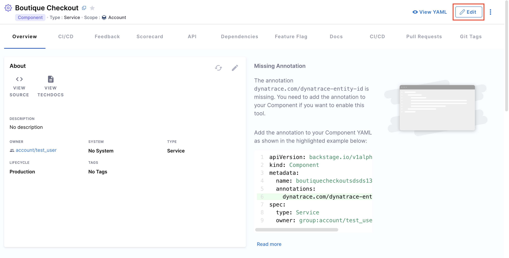

import Tabs from '@theme/Tabs';
import TabItem from '@theme/TabItem';

This guide walks you through **managing your Catalog Entity UI**.  
Whenever you register an entity in your software catalog, you can view all its details from the Catalog Entity page in your Harness IDP UI. Every section on the entity page is uniquely designed to present the most relevant information for the specific type of entity you're viewing.

Here’s how to access the catalog entity details page:
1. In your Harness IDP, navigate to **Catalog**.
2. Select the entity you want to view. You’ll be redirected to the entity details page.


Let’s dive deeper into managing and creating the Catalog Entity UI.

## Understanding Catalog Entity UI

The Catalog Entity Details Page is divided into multiple **tabs**, each showing different **components**, **cards**, and **views** relevant to that entity.

- Each **tab** represents a specific section.
- You can **customize and edit** tabs by modifying the entity layout.
- All views inside a tab are powered by **out-of-the-box components** like the "About Card," "Scorecard Card," and the Plugins configured for your instance.


When you enable a plugin (or create a custom one), you can choose where the plugin’s components appear by modifying the Layout YAML of the catalog entity. 
- When a plugin is enabled, the default layouts are auto-updated.
- You can always make changes manually by checking the exported UI components from that plugin (documented under each plugin's section).

## Managing Catalog Entity UI

You can manage and edit Catalog Entity UI layouts directly using the **Layout Editor**.

- Each Catalog Layout is uniquely designed for a specific ``Kind`` and ``Type`` of application.
- Learn more about `Kinds` in the Catalog YAML documentation and understand the **System Model** for different use-cases.


For example:
- A typical microservice will have ``kind: Component`` and ``spec.type: service``.

> Note: Entity kinds (such as Component, API, Resource) are fixed. However, you can create any arbitrary **types** under them (e.g., `spec.type: micro-frontend`).


###  Using the Layout Editor

#### Accessing the Layout Editor
<Tabs>
<TabItem value="Interactive guide">
<DocVideo src="https://app.tango.us/app/embed/f0f1e522-bc37-430c-b5f5-ab82d8afb649" title="Accessing the Layout Editor" />
</TabItem>
<TabItem value="Step-by-step">
1. In Harness IDP, go to **Configure > Layout**.
2. Select **Catalog Entities**.
3. Choose the **Entity Kind** you want to modify.
4. Layouts are organized by:
   - `Kind` (e.g., Component)
   - `Type` (e.g., service, website)
   - A **default layout** acts as a fallback if a specific type layout isn’t defined.
</TabItem>
</Tabs>

#### Creating a New Layout

<Tabs>
<TabItem value="Interactive guide">
<DocVideo src="https://app.tango.us/app/embed/d3d0ca5a-85eb-4b78-87fd-00bee8f57688" title="Accessing the Layout Editor" />
</TabItem>
<TabItem value="Step-by-step">
1. Duplicate an existing layout or click **New Catalog Layout**.
2. Select the **Entity Kind** and **Entity Type** this layout will apply to.
3. Click **Continue** to create the new layout.
4. Start editing the Layout YAML to configure it.
</TabItem>
</Tabs>

#### Editing an Existing Layout

1. In the Layout Editor, select the relevant **Entity Kind** and **Entity Type**.
2. Click **Edit Layout** and modify the YAML.


:::info
**View Applied Entities:**  
You can see which entities a specific layout applies to by clicking **View Applied Entities**.
:::

---

### Understanding Layout YAML

Entity Page Layouts are defined in a hierarchical structure, starting with the ``page`` key, which represents the entity page. Each ``page`` consists of ``tabs``, an array that controls the rendered tabs for the entity page.

| Key | Description |
|----|-------------|
| `page` | Represents the entity page configuration. |
| `tabs` | Defines the tabs shown on the entity page. |
| `contents` | Specifies components rendered inside each tab. |
| `component` | Defines an individual component. |
| `specs` | Contains additional configurations for the component. |
| `props` | Properties for the component. |
| `gridProps` | Grid settings for arranging components. |
| `cases` | (Specific to `EntitySwitch`) Conditional rendering based on logic. |

---

### Example: Entity Layout YAML

```yaml
page:
  name: EntityLayout
  tabs:
    - name: Overview
      path: /
      title: Overview
      contents:
        - component: EntityOrphanWarning
        - component: EntityRelationWarning
        - component: EntityProcessingErrorsPanel
        - component: EntityAboutCard
          specs:
            props:
              variant: gridItem
            gridProps:
              md: 6
        ...
    - name: ci-cd
      path: /ci-cd
      title: CI/CD
      contents:
        ...
    - name: Deps
      path: /dependencies
      title: Dependencies
      contents:
        ...
    - name: TechDocs
      path: /docs
      title: Docs
      contents:
        ...
```

---

## Advanced Use Cases

### Adding Links

You can also add a list of **external hyperlinks** related to the entity on the catalog entity's UI page. **Links** can provide additional contextual information that may exist outside of Harness itself, such as an admin dashboard or an external CMS page.

Here’s how **"Links"** show up in your Catalog entity details page. The **Links Card** serves as a navigational tool, and these links can point to anything. Here are some examples:
- User and Group Management
- Infrastructure and Cloud
- Operational Dashboards
- Support and Help
- General Web and Information
- Notifications and Alerts and more, serving as quick bookmarks for developers corresponding to the entity.


You can add links for an entity by using the ``metadata.links`` field in your Catalog YAML. Here is the list of fields required:

| Field | Type | Description |
|------|------|-------------|
| `url` | String | Destination URL. |
| `title` | String | Display name for the link. |
| `icon` | String (Optional) | Icon name from [SimpleIcons](https://simpleicons.org/). |

Here’s how you can add links in your catalog entity page:
1. Go to your **Catalog**, and select the entity you want to add links for.
2. Click on the **Edit** button and switch to the **YAML view** to edit the YAML.

3. Add a ``links`` reference in your entity YAML under the ``metadata`` field. You can refer to the Example YAML for the ``links`` reference. 

#### Example YAML: 

```yaml
metadata:
  name: artist-lookup
  links:
    - url: https://example.com/user
      title: Example User
      icon: user
    - title: Prometheus
      url: https://example.com/prometheus
      icon: prometheus
    ...
```

### Adding an Additional Info Card

You can add an **Additional Info Card** to display additional details about the catalog entity on the **"Overview"** page. You can populate this card using the catalog entity's YAML metadata for fields like apiVersion, kind, metadata, and spec, including additional values ingested. 


#### Additional info in ``metadata``
To add custom information beyond the default root fields, use the ``additionalInfo`` key under ``metadata``. This supports adding key-value pairs, with the value sourced dynamically.

**Example:**
```yaml
metadata:
  name: demo-catalog-datasource
  additionalInfo:
    onShoreTeamLead: Jane Doe
    offShoreTeamLead: Dan John
```

#### Using this card in Layout Editor
You can refer to the detailed demo linked here.

Here are the steps to add the Additional Info Card:
1. Go to the **Layout Editor** and choose the entity kind where you want to add the additional info card.
2. Add the ``EntityAdditionalInfoCard`` component as shown below:

```yaml
- component: EntityAdditionalInfoCard
  specs:
    props:
      title: Additional Info Card
      headerItems:
        - icon: SaveRounded
          label: Save Details
          url: https://artifactregistry.com
      items:
        - label: On-Shore Team Lead
          value: <+metadata.additionalInfo.onShoreTeamLead>
          type: string
          style:
            bold: true
        - label: Off-Shore Team Lead
          value: <+metadata.additionalInfo.offShoreTeamLead>
          type: string
          style:
            bold: true
    gridProps:
      md: 6
```

All the fields mentioned here support sourcing data from the `catalog-info.yaml` file as strings.

#### items:
Contains information sourced from `catalog-info.yaml`:
- `label:` A `string` providing information about the value being displayed.
- `value:` The value to display against the added label, typically sourced from `catalog-info.yaml`.
- `type:` Defaults to `string`, but also supports `link` type.
- `style:` Used for text styling, as demonstrated in the example above.

#### headerItems (Optional):
Contains information to be displayed in the header section of the card:
- `icon:` Supports any Material icon.
- `url:` Adds a `link` to the Material icon.
- `label:` A `string` providing information about the icon.


