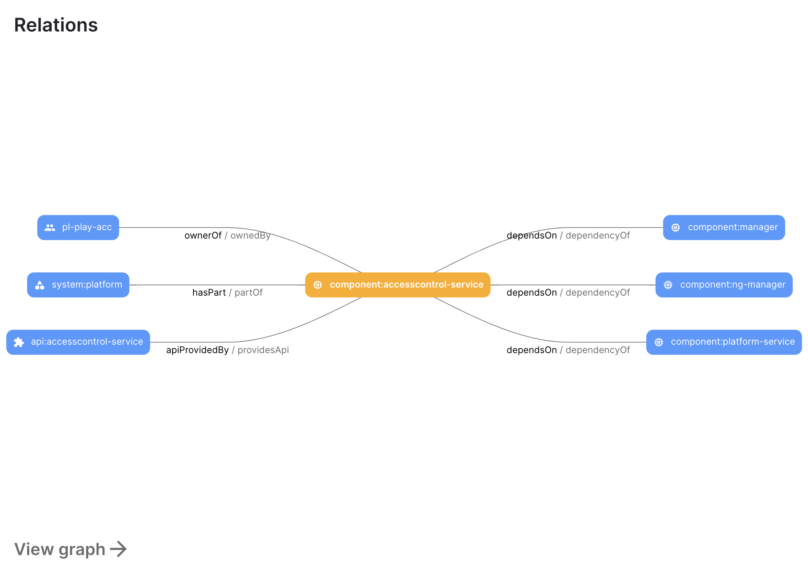
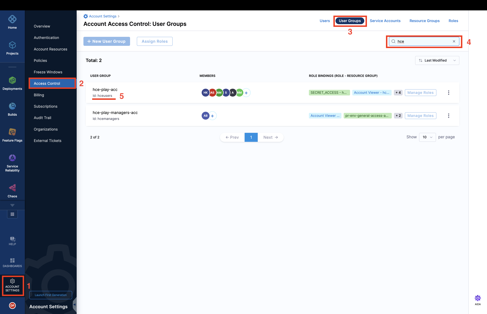

import Tabs from '@theme/Tabs';
import TabItem from '@theme/TabItem';

<Tabs queryString="version">
<TabItem value="IDP 2.0 (New)" label="IDP 2.0 (New)">

:::tip For IDP 2.0 Customers
If you're using Harness IDP 2.0, please ensure you have reviewed the [IDP 2.0 Overview guide](/docs/internal-developer-portal/idp-2o-overview/2-0-overview-and-upgrade-path.md) and are familiar with the key steps for [upgrading to IDP 2.0](/docs/internal-developer-portal/idp-2o-overview/migrating-idp-2o.md). To enable IDP 2.0, you must raise a support ticket to activate the `IDP_2_0` feature flag for your account.
:::

Harness IDP 2.0 marks a significant evolution of the Internal Developer Portal, introducing a Harness-native data model tailored for enterprise-scale environments and strong access control. As we transition to this new model, **legacy Backstage YAML** will no longer be supported. Going forward, only the **Harness-native data model** schema will be used and referenced. This guide walks you through the new **Harness-native YAML schema** and outlines the key changes from the previous schema.

:::info
Please ensure that **no entity YAML files** are stored in **Git in IDP 2.0** until the [Git Experience](/docs/internal-developer-portal/idp-2o-overview/2-0-overview-and-upgrade-path.md#native-harness-git-experience) feature is released. You can track its release and other updates in the **[IDP 2.0 Features Status](/docs/internal-developer-portal/idp-2o-overview/2-0-overview-and-upgrade-path.md)** table
:::

## What's new in IDP 2.0?
IDP 2.0 implements a **Harness-native entity schema** featuring targeted adjustments to previous Backstage-style YAML configurations. These changes primarily introduce scope concepts (project, organization, or account) while enhancing readability based on user feedback.

JSON Schemas for all Catalog entities are available through our API.

#### ⨁ New fields

- `orgIdentifier` (optional)
- `projectIdentifier` (optional)

These fields define the entity's scope. For project-scoped entities, both fields will be present. For organization-scoped entities, only `orgIdentifier` will appear. Account-level entities will have the scope automatically assigned to the account.

#### ♻️ Updated fields

- `metadata.name` becomes `identifier`
  - This aligns with Harness Entity YAML definitions and enhances UX consistency. Moved to root level due to its importance to entity definition.
- `metadata.title` becomes `name`
  - Aligned with Harness Entity YAML definitions and moved to root level to reflect its critical importance.
- `spec.type` becomes `type`
  - Relocated to root level as it is fundamental to entity definition. The `kind` and `type` fields define entity behavior and should appear together.
- `spec.owner` becomes `owner`
  - Moved to root level to emphasize its significance. IDP Catalog addresses ownership challenges, warranting prominent placement of this field.

#### ⊖ Removed fields

- `metadata.namespace`
  - Previously used in Backstage for scoping (typically set as default). With the introduction of Harness Platform Hierarchy, `namespace` becomes redundant. Scope is now determined using `projectIdentifier` and `orgIdentifier`.
- `spec.system` and `spec.domain`
  - These fields previously helped organize components within systems. Since entities will now exist within Harness projects and organizations, these structures will replace System and Domain functionality.

#### Unchanged fields

- `metadata` continues to be flexible. You can define your own properties within metadata.
- `annotations`, `description`, `tags`, `links`, `labels` etc. continue to be part of metadata.

## Converting Existing Entity YAMLs [IDP 2.0]

If you have entities defined using legacy Backstage YAML (from IDP 1.0), you can easily convert them to the new Harness-native data model schema. There are two ways to perform this conversion:

1. **Using the Harness IDP UI:**
   Navigate to the **[Harness IDP UI](/docs/internal-developer-portal/catalog/manage-catalog.md#harness-idp-ui)** and open the **YAML view** while creating an entity. Paste your legacy Backstage Catalog YAML, and the system will automatically generate the corresponding Harness-native Catalog YAML.
   Learn more in the **[Catalog YAML View documentation](/docs/internal-developer-portal/catalog/manage-catalog.md#catalog-yaml)**.

2. **Using the YAML Conversion API:**
   To streamline migration, we've also introduced an API that converts Backstage Catalog YAML to the Harness-native format. [Read more in the IDP 2.0 migration guide.](/docs/internal-developer-portal/idp-2o-overview/migrating-idp-2o.md)

All existing Catalog entities will be **automatically migrated** to IDP 2.0, and their associated YAML files will be deprecated. Additionally, a new Git Experience tool will soon be available, allowing you to **commit the converted definitions directly to YAML files in your Git repository**.


## Common to All Kinds: The Envelope [IDP 2.0]

The root object of your **Catalog YAML** file follows a standard structure. Below are the core properties that can be included in your Catalog YAML, as defined in **IDP 2.0**:

### `apiVersion`

The `apiVersion` field specifies the **version of the specification format** that the entity conforms to. It plays a critical role in ensuring compatibility and evolution of the entity schema over time. This field is **mandatory** for every entity definition, as it allows the parser to correctly interpret the structure and content of the entity.

With IDP 2.0, we've introduced a Harness-native entity schema. As part of this change, all entities now use an `apiVersion` prefixed with `harness.io/`.

Use the following **default value** for your catalog entities:

```yaml
apiVersion: harness.io/v1
```

---

### `kind`

The `kind` field defines the **high-level** type of entity being described in the YAML file. When combined with `apiVersion`, it helps the parser understand how to interpret the rest of the entity’s structure and behavior. This field is also **mandatory** for every entity definition.

With **IDP 2.0**, you can define the following `kind` types in your Catalog YAML:

* `kind: Component`
* `kind: API`
* `kind: Resource`
* `kind: Workflow`
* `kind: System`

Each kind represents a different type of entity within the Harness-native data model.
[Read more about the different entity kinds here.](/docs/internal-developer-portal/catalog/catalog-yaml.md#entity-kinds)

---

### `identifier`

The `identifier` field is a **unique, machine-readable** reference for the entity. It serves as the primary key for identifying and interacting with the entity. Ensure your `identifier` follows [naming rules](https://developer.harness.io/docs/platform/references/entity-identifier-reference/#identifier-naming-rules). Invalid identifiers may lead to entity registration errors.

| **Property**            | **Description**                                                                                       |
|------------------------|-------------------------------------------------------------------------------------------------------|
| **Uniqueness**         | Must be **unique** per `kind` (case-sensitive).                                                      |
| **Required**           | ✅ Yes, this field is **mandatory** for all entities.                                                 |

This field can be reused after an entity is deleted. It must adhere to the format defined [here](https://developer.harness.io/docs/platform/references/entity-identifier-reference/#identifier-naming-rules).

All entity references across the platform use the `identifier`.

**Example usage:**

```yaml
identifier: artist
```

---

### `name`

The `name` field represents the **display name of the entity** shown in the UI.

| **Property**            | **Description**                                                                                   |
|------------------------|---------------------------------------------------------------------------------------------------|
| **Uniqueness**         | Not required to be unique.                                                                        |
| **Required**           | ❌ No, this field is **optional**.                                                                |

This field supports explanatory or user-friendly strings and may contain special characters.

**Example usage:**

```yaml
name: Artist Service
```

---

### `type`

The `type` field represents the type of entity (e.g., website, service, library, API, etc). The `kind` and `type` fields together define entity behavior and should always appear together.

While the catalog accepts any string value here, organizations should maintain a consistent taxonomy. Common examples include:

1. `service` - a backend API service  
2. `website` - a frontend web application  
3. `library` - a reusable software component (e.g., npm module, Java library)

**Example usage:**

```yaml
type: service
```

---

### `projectIdentifier`

In IDP 2.0, legacy **System** entities are now mapped to Harness Projects. Thus the `projectIdentifier` field indicates which **project the entity belongs to**. It is **optional** for Org or Account-scope entities, but **required** for those created at the Project scope.

**Example usage:**

```yaml
projectIdentifier: public-websites
```

---

### `orgIdentifier`

In IDP 2.0, legacy **Domain** entities are now mapped to Harness Orgs. Thus the field `orgIdentifier` indicates which **Org the entity belongs to**.

**Example usage:**

```yaml
orgIdentifier: default
```

---

### `owner`

The `owner` field indicates the owner of that entity and maps to Harness Users or User Groups depending on the scope.

While `owner` is not mandatory, it is **strongly recommended** to associate entities with logical owning teams.

- At **Project scope**: any User/User Group from Project, Org, or Account can be assigned.  
- At **Org scope**: assign Users/User Groups from Org or Account.  
- At **Account scope**: assign from Account-level only.

The `spec.owner` field supports multiple formats for defining ownership:

* You can use a plain value like `backend-team`. This is treated as a group by default. If no matching group is found, it is still accepted and displayed as an arbitrary string without validation.

* For explicit user or group references, use one of the following formats:

  * `user:<scope>/<email-or-username>`
  * `group:<scope>/<group-name>`

  Supported scope formats:

  * `account`
  * `account.<orgIdentifier>`
  * `account.<orgIdentifier>.<projectIdentifier>`

* Owner resolution is **case-sensitive**. Make sure the casing in your reference exactly matches the group names as defined in your account.

> In cases where reliable resolution is critical, consider using the **user group ID** instead of just the name to avoid ambiguity.

---

### `metadata`

A container for auxiliary data that is not part of the entity’s specification. Additional metadata helps enhance platform-level processing or categorization. See individual entity kind sections for specific structure guidelines. 

Please refer to this guide to learn more about [``metadata``](https://backstage.io/docs/features/software-catalog/descriptor-format#common-to-all-kinds-the-metadata). 

---

### `spec`

Defines the actual specification data that describes the entity. This is the core configuration and varies depending on the `kind`. See individual entity kind sections for specific structure guidelines.

## Entity Kinds [IDP 2.0]

### Kind: Component  
A **Component** describes a software component. It is typically closely tied to the source code that constitutes the component and is what a developer would typically consider a “unit of software,” usually with a distinct deployable or linkable artifact.

#### Entity Structure  
All the fields mentioned below are the mandatory parameters required to define a Component:

| **Field** | **Value** |
| --------- | --------- |
| `apiVersion` | **harness.io/v1** |
| `kind` | **Component** |
| `type` | You can find out more about the `type` key here. |
| `spec.lifecycle` | You can find out more about the `lifecycle` key here. |
| `spec.system` | Optional. Reference to System entities this Component belongs to. |

#### Example YAML
```yaml
apiVersion: harness.io/v1
kind: Component
type: website
identifier: artistweb
name: artistweb
owner: artist-relations-team
spec:
  lifecycle: production
  system:
    - system:account/marketing_systems
    - system:account/web_platform
  partOf:
    - system:account/customer_experience
metadata:
  description: The place to be, for great artists
  annotations:
    example.com/service-discovery: artistweb
  links:
    - url: https://admin.example-org.com
      title: Admin Dashboard
      icon: dashboard
      type: admin-dashboard
  labels:
    example.com/custom: custom_label_value
  tags:
    - java
```

---

### Kind: System
A **System** is a high-level catalog entity used to logically group related software components, APIs, and infrastructure resources. It represents a functional or domain-specific boundary such as a module, platform area, or business unit—enabling teams to organize and manage complex software ecosystems more effectively.

#### Entity Structure  
All the fields mentioned below are the mandatory parameters required to define a System:

| **Field** | **Value** |
| --------- | --------- |
| `apiVersion` | **harness.io/v1** |
| `kind` | **System** |
| `type` | Common values include `domain`, `module`, or `platform` |
| `owner` | The team or group responsible for the System |

#### Example YAML
```yaml
apiVersion: harness.io/v1
kind: System
type: domain
identifier: paymentsystem
name: Payment System
owner: team-payment
spec:
  lifecycle: ""
metadata:
  description: This system groups services and libraries related to payment processing.
  tags:
    - payments
    - financial
```

---

### Kind: API  
An **API** describes an interface that can be exposed by a component. APIs can be defined using formats such as OpenAPI, AsyncAPI, GraphQL, gRPC, or others.

#### Entity Structure  
All the fields mentioned below are the mandatory parameters required to define an API:

| **Field** | **Value** |
| --------- | --------- |
| `apiVersion` | **harness.io/v1** |
| `kind` | **API** |
| `type` | You can find out more about the `type` key here. |
| `spec.lifecycle` | You can find out more about the `lifecycle` key here. |
| `spec.definition` | You can find out more about the `definition` key here. |

#### `type` Definition  
The type of the `API` definition as a string (e.g., `openapi`):

1. `openapi` – A definition in YAML or JSON based on OpenAPI v2 or v3.
2. `asyncapi` – A definition based on the AsyncAPI specification.
3. `graphql` – A definition using GraphQL schemas.
4. `grpc` – A definition based on Protocol Buffers for use with gRPC.

#### Example YAML
```yaml
apiVersion: harness.io/v1
kind: API
type: openapi
identifier: petstore
name: petstore
owner: Harness_Partners
spec:
  lifecycle: dev
  definition:
    $text: https://github.com/swagger-api/swagger-petstore/blob/master/src/main/resources/openapi.yaml
metadata:
  description: The petstore API
  links:
    - url: https://github.com/swagger-api/swagger-petstore
      title: GitHub Repo
      icon: github
    - url: https://github.com/swagger-api/swagger-petstore/blob/master/src/main/resources/openapi.yaml
      title: API Spec
      icon: code
  tags:
    - store
    - rest
```

---

### Kind: Resource  
A **Resource** describes infrastructure components that a system needs to operate—like BigTable databases, Pub/Sub topics, S3 buckets, or CDNs. Modeling them alongside components and systems helps visualize infrastructure footprint and enables tooling around them.

#### Entity Structure  
All the fields mentioned below are the mandatory parameters required to define a Resource:

| **Field** | **Value** |
| --------- | --------- |
| `apiVersion` | **harness.io/v1** |
| `kind` | **Resource** |
| `type` | You can find out more about the `type` key here. |

#### `type` Definition  
The type of the `Resource` as a string (e.g., `database`). This field is required. There is no enforced list of values; each organization can define names that suit their tech stack.

Common examples include:
- `database`
- `s3-bucket`
- `kubernetes-cluster`

#### Example YAML
```yaml
apiVersion: harness.io/v1
kind: Resource
type: database
identifier: artistsdb
name: artistsdb
owner: artist-relations-team
spec: {}
metadata:
  description: Stores artist details
```

---

### Kind: Workflow  
**Workflows** enable developer self-service by automating manual tasks and processes. Platform engineering teams can use workflows to:
- Automate new service onboarding
- Simplify Day 2 operations
- Provide developers with **golden paths** to production, including best practices and guardrails

Workflows are stored in the catalog using `kind: Workflow`.

#### Entity Structure  
All the fields mentioned below are the mandatory parameters required to define a Workflow:

| **Field** | **Value** |
| --------- | --------- |
| `apiVersion` | **harness.io/v1** |
| `kind` | **Workflow** |
| `type` | You can find out more about the `type` key here. |
| `spec.parameters` | You can find out more about the `parameters` key here. |
| `spec.steps` | You can find out more about the `steps` key here. |

#### Example YAML
```yaml
apiVersion: harness.io/v1
kind: Workflow
type: service
identifier: reactapp
name: Create a new service
owner: d.p@harness.io
spec:
  output:
    links:
      - title: Pipeline Details
        url: ${{ steps.trigger.output.PipelineUrl }}
  parameters:
    - title: Service Details
      required:
        - project_name
        - template_type
        - public_template_url
        - repository_type
        - repository_description
        - repository_default_branch
        - direct_push_branch
        - slack_id
      properties:
        token:
          title: Harness Token
          type: string
          ui:widget: password
          ui:field: HarnessAuthToken
        projectId:
          title: Project Identifier
          description: Harness Project Identifier
          type: string
          ui:field: HarnessProjectPicker
        template_type:
          title: Type of the Template
          type: string
          description: Type of the template
        public_template_url:
          title: Public Template URL
          type: string
          description: URL of the public Cookiecutter template
        repository_type:
          type: string
          title: Repository Type
          enum:
            - public
            - private
          default: Public
        repository_description:
          type: string
          title: Repository Description
          description: Auto-generated using the self-service flow of Harness IDP
        owner:
          title: Service Owner
          type: string
          ui:field: OwnerPicker
          ui:options:
            allowedKinds:
              - Group
  steps:
    - id: trigger
      name: Creating your React app
      action: trigger:harness-custom-pipeline
      input:
        url: https://app.harness.io/ng/account/account_id/module/idp/orgs/org_id/projects/project_id/pipelines/pipeline_id/pipeline-studio/?storeType=INLINE
        inputset:
          project_name: ${{ parameters.project_name }}
          template_type: ${{ parameters.template_type }}
          public_template_url: ${{ parameters.public_template_url }}
        apikey: ${{ parameters.token }}
metadata:
  description: A workflow to create a new service
  tags:
    - nextjs
    - react
    - javascript
```

---

### [Deprecated] Kind: Location  
The **Location** entity served as a reference to a YAML path that produced other entities.  
However, with Harness IDP 2.0 managing all entities internally, this entity type is no longer required and has been **deprecated**.

</TabItem>
<TabItem value="IDP 1.0" label="IDP 1.0">

In this documentation we describe the YAML format and semantics of catalog entities. Although it's possible to name catalog entity descriptor files however you wish, we recommend that you name them `catalog-info.yaml`. More detailed instructions regarding this can be found in the [Descriptor Format of Catalog Entities](https://backstage.io/docs/features/software-catalog/descriptor-format)

## Support for Harness Account Variables [IDP 1.0]

In the context of Harness IDP you can use all the **[custom account variables](https://developer.harness.io/docs/platform/variables-and-expressions/add-a-variable#define-variables)** and **[account scoped built-in variables](https://developer.harness.io/docs/platform/variables-and-expressions/harness-expressions-reference)** in IDP YAML.

```YAML
...
annotations:
    harness.io/pipelines: |
        Build: https://app.harness.io/ng/account/<+account.identifier>/home/orgs/<+variable.account.orgIdentifier>/projects/<+variable.account.projectIdentifier>/pipelines/Build_IDP_UI_App
...
...
spec:
  type: <+account.identifier>
  lifecycle: <+variable.account.orgIdentifier> <+variable.account.projectIdentifier>
```
## Entity Kinds [IDP 1.0]
### Kind: Component

The template given below is an example used for self-service onboarding using the [Harness Custom Field extensions](https://developer.harness.io/docs/internal-developer-portal/flows/custom-actions#harness-specific-custom-actions)


```YAML
apiVersion: backstage.io/v1alpha1
kind: Component
metadata:
  name: artist-web
  description: The place to be, for great artists
  labels:
    example.com/custom: custom_label_value
  annotations:
    example.com/service-discovery: artistweb
  tags:
    - java
  links:
    - url: https://admin.example-org.com
      title: Admin Dashboard
      icon: dashboard
      type: admin-dashboard
spec:
  type: website
  lifecycle: production
  owner: artist-relations-team
  system: public-websites
```

### Kind: Template

```YAML
apiVersion: scaffolder.backstage.io/v1beta3
kind: Template
metadata:
  name: Example Template
  title: Create a new service
  description: A template to create a new service
  tags:
    - nextjs
    - react
    - javascript
spec:
  owner: user:default/username
  type: service
  parameters:
    - title: Service Details
      required:
        - project_name
        - template_type
        - public_template_url
        - repository_type
        - repositoty_description
        - repository_default_branch
        - direct_push_branch
        - slack_id
      properties:
        project_name:
          title: Project Name
          type: string
          description: Mention the project name
        token:
          title: Harness Token
          type: string
          ui:widget: password
          ui:field: HarnessAuthToken
        projectId:
            title: Project Identifier
            description: Harness Project Identifier
            type: string
            ui:field: HarnessProjectPicker
            ui:autofocus: true
        orgId:
            title: Org Identifier
            description: Harness org Identifier
            type: string
            ui:field: HarnessAutoOrgPicker
            ui:autofocus: true
        template_type:
          title: Type of the Template
          type: string
          description: Type of the Template
        public_template_url:
          title: Give a Public template URL
          type: string
          description: Give a Public Cookiecutter Template  
        repository_type:
          type: string
          title: Repository Type
          enum:
            - public
            - private
          default: Public
        repositoty_description:
          type: string
          title: Add a description to your repo
          description: Auto-generated using Self-Service-Flow of Harness-IDP 
        repository_default_branch:
          title: Name of your Default Branch
          type: string
          description: name your branch 
        direct_push_branch:
          title: Name of your develop branch
          type: string
          description: Name the Branch to which changes will be updated
        slack_id:
          title: Name of your slack ID
          type: string
          description: Give the slack ID to which notifications would be sent      
        owner:
          title: Choose an Owner for the Service
          type: string
          ui:field: OwnerPicker
          ui:options:
            allowedKinds:
              - Group
  steps:
    - id: trigger
      name: Creating your react app
      action: trigger:harness-custom-pipeline
      input:
        url: "Harness Pipeline URL"
        inputset:
          project_name: ${{ parameters.project_name }}
          template_type: ${{ parameters.template_type }}
          public_template_url: ${{ parameters.public_template_url }}
          repository_type: ${{ parameters.repository_type }}
          repositoty_description: ${{ parameters.repository_description }}
          repository_default_branch: ${{ parameters.repository_default_branch }}
          direct_push_branch: ${{ parameters.direct_push_branch }}
          slack_id: ${{ parameters.slack_id }}
        apikey: ${{ parameters.token }}
    # The final step is to register our new component in the catalog.


  output:
    links:
      - title: Pipeline Details
        url: ${{ steps.trigger.output.PipelineUrl }}

```

### Kind: API

We have detailed descriptions here on the [how to add API docs](https://developer.harness.io/docs/internal-developer-portal/get-started/add-api-docs#example-for-different-use-cases).

### Kind: Group

A group describes an organizational entity, such as for example a team, a business unit, or a loose collection of people in an interest group. Members of these groups are modeled in the catalog as kind `User`. In Harness IDP, this entity could also be referenced as **[Harness User Groups](https://developer.harness.io/docs/platform/role-based-access-control/add-user-groups/)**

Descriptor files for this kind may look as follows.

```YAML
apiVersion: backstage.io/v1alpha1
kind: Group
metadata:
  name: infrastructure
  description: The infra business unit
spec:
  type: business-unit
  profile:
    displayName: Infrastructure
    email: infrastructure@example.com
    picture: https://example.com/groups/bu-infrastructure.jpeg
  parent: ops
  children: [backstage, other]
  members: [jdoe]
  ```

### Kind: User

A user describes a person, such as an employee, a contractor, or similar. Users belong to User Group entities in the catalog or the [Harness User Groups](https://developer.harness.io/docs/platform/role-based-access-control/add-user-groups/).

```YAML
apiVersion: backstage.io/v1alpha1
kind: User
metadata:
  name: jdoe
spec:
  profile:
    displayName: Jenny Doe
    email: jenny-doe@example.com
    picture: https://example.com/staff/jenny-with-party-hat.jpeg
  memberOf: [team-b, employees]
```

### Kind: Resource

A resource describes the infrastructure a system needs to operate, like BigTable databases, Pub/Sub topics, S3 buckets or CDNs. Modelling them together with components and systems allows visualizing resource footprint, and create tooling around them.

Descriptor files for this kind may look as follows.

```YAML
apiVersion: backstage.io/v1alpha1
kind: Resource
metadata:
  name: artists-db
  description: Stores artist details
spec:
  type: database
  owner: artist-relations-team
  system: artist-engagement-portal
```

### Kind: System


A system is a collection of resources and components. The system may expose or consume one or several APIs. It is viewed as abstraction level that provides potential consumers insights into exposed features without needing a too detailed view into the details of all components. This also gives the owning team the possibility to decide about published artifacts and APIs.

Descriptor files for this kind may look as follows.

```YAML
apiVersion: backstage.io/v1alpha1
kind: System
metadata:
  name: artist-engagement-portal
  description: Handy tools to keep artists in the loop
spec:
  owner: artist-relations-team
  domain: artists
```

### Kind: Domain

A Domain groups a collection of systems that share terminology, domain models, business purpose, or documentation, i.e. form a bounded context.

Descriptor files for this kind may look as follows.

```YAML
apiVersion: backstage.io/v1alpha1
kind: Domain
metadata:
  name: artists
  description: Everything about artists
spec:
  owner: artist-relations-team
```

### Kind: Location

A location is a marker that references other places to look for catalog data.

Descriptor files for this kind may look as follows.

```YAML
apiVersion: backstage.io/v1alpha1
kind: Location
metadata:
  name: org-data
spec:
  type: url
  targets:
    - http://github.com/myorg/myproject/org-data-dump/catalog-info-staff.yaml
    - http://github.com/myorg/myproject/org-data-dump/catalog-info-consultants.yaml
```

## Create an IDP YAML or `catalog-info.yaml` [IDP 1.0]

The **IDP YAML or catalog-info.yaml** is a crucial descriptor file that provides metadata about the software components you register within our IDP. It serves as a blueprint, detailing essential information about each component, such as its name, description, owner, and other related metadata. This file ensures that our portal accurately represents and organizes the software components, making it easier for teams to discover and understand the tools and services available.

Although it's possible to name catalog entity descriptor files however you wish, we recommend that you name them `idp.yaml`.

:::info

`idp.yaml` follows the same [Descriptor Format of Catalog Entities](https://backstage.io/docs/features/software-catalog/descriptor-format#substitutions-in-the-descriptor-format) as Backstage.io.

:::

### Start with basic entity information

Begin your YAML file with the basic entity information, this contains the `kind` which could be any of the following:

1. [Component](https://backstage.io/docs/features/software-catalog/descriptor-format/#kind-component)
2. [Template](https://backstage.io/docs/features/software-catalog/descriptor-format/#kind-template)
3. [API](https://backstage.io/docs/features/software-catalog/descriptor-format/#kind-api)
4. [Resource](https://backstage.io/docs/features/software-catalog/descriptor-format/#kind-resource)
5. [Location](https://backstage.io/docs/features/software-catalog/descriptor-format/#kind-location)

and few others.

Out of this `Component` is quite widely used for service, website, library, etc. which needs to be specified as `spec.type` as discussed below.

```yaml
apiVersion: backstage.io/v1alpha1
kind: Component
```

### Provide metadata

Under the metadata section, provide essential details about your component:

```yaml
metadata:
  name: artist-service
  description: The place to be, for great artists
```

### Add labels (Optional)

You can add key/value pairs as labels to classify the component:

```yaml
labels:
  example.com/custom: custom_label_value
```

### Add annotations (Optional)

Annotations are used to reference external systems or provide additional non-identifying metadata:

```yaml
annotations:
  harness.io/project-url: "https://app.harness.io/ng/account/accountid/cd/orgs/orgid/projects/projectid"
  github.com/project-slug: github/example-org/artist-website
```

### Include tags (Optional)

Tags are single-valued strings used to classify entities:

```yaml
tags:
  - java
```

### Add Relations

For the relationship graph to get populated, you need to add the dependencies in the `catalog-info.yaml`



The field `spec.owner` is a reference. In this case, the string `group:pet-managers` was given by the user. That means that the kind is `Group`, the namespace is left out, and the name is pet-managers.

The entries in `providesApis` are references. In this case, none of them needs to specify a kind since we know from the context that that's the only kind that's supported here. The second entry specifies a namespace, but the other ones don't, and in this context, the default is to refer to the same namespace as the originating entity (external-systems here). So the three references essentially expand to `api:external-systems/petstore`, `api:internal/streetlights`, and `api:external-systems/hello-world`. We expect there to exist three API kind entities in the catalog matching those references.

[Read More about relations](https://developer.harness.io/docs/internal-developer-portal/catalog/system-model#relations), in the system model docs. Also reference once mentioned for a single component `catalog-info.yaml` doesn't need to be included in the dependent components catalog-info.yaml to show up in the relationship graph of both the entities. 


```YAML
# Example catalog-info.yaml
...
spec:
  type: service
  lifecycle: experimental
  owner: group:pet-managers
  dependsOn:
    - Component:manager
    - Component:ng-manager
    - Component:platform-service
  providesApis:
    - accesscontrol-service
    - petstore
    - internal/streetlights
    - hello-world
...
```

### Provide external links (Optional)

External hyperlinks related to the entity can be added for contextual information:

:::warning Allow External URLs

If you're referencing external URLs in your `IDP.yaml` file, such as Swagger documentation links, please ensure that these URLs are allowed within the Harness Internal Developer Portal. This is a crucial step to ensure that the portal can access and display content from these external sources.

To allow external URLs:

- Navigate to **Admin** in the Harness Internal Developer Portal.
- Go to **URL Allow List**.
- Click on **+Add Host**.
- In the provided field, enter the URL pattern you wish to allow. For example, to allow all URLs from Swagger, you'd enter `*.swagger.com`.
- Confirm and save your changes.

By following the above steps, you ensure that the portal can safely and correctly access the external content referenced in your IDP.yaml file.

:::

```yaml
links:
  - url: https://admin.example-org.com
    title: Admin Dashboard
    type: admin-dashboard
```

### Support for Harness Account Variables

You can as well use all the **[custom account variables](https://developer.harness.io/docs/platform/variables-and-expressions/add-a-variable#define-variables)** and **[account scoped built-in variables](https://developer.harness.io/docs/platform/variables-and-expressions/harness-expressions-reference)** in IDP YAML.

```YAML
...
annotations:
    harness.io/pipelines: |
        Build: https://app.harness.io/ng/account/<+account.identifier>/home/orgs/<+variable.account.orgIdentifier>/projects/<+variable.account.projectIdentifier>/pipelines/Build_IDP_UI_App
...
...
spec:
  type: <+account.identifier>
  lifecycle: <+variable.account.orgIdentifier> <+variable.account.projectIdentifier>
```

### Specify component details

Under the `spec` section, provide specific details about the component:

#### Spec type

The current set of well-known and common values for this field is:

1. `service` - a backend service, typically exposing an API
2. `website` - a website
3. `library` - a software library, such as a npm module or a Java library

#### Spec owner

In the Harness Internal Developer Portal, the owner of a component is identified by the [Harness User Group ID](https://developer.harness.io/docs/platform/role-based-access-control/add-user-groups). This User Group ID represents the collective entity that holds ultimate responsibility for the component and possesses the authority and capability to develop and maintain it. Should any issues arise or if there are requests for features, this User Group will serve as the primary point of contact. The primary purpose of this field in the Harness IDP is for display, ensuring that individuals accessing catalog items can easily identify the responsible User Group for a given component.

<details>
<summary>How to get the Harness User Group ID</summary>

- Navigate to the **bottom left** of the Harness dashboard and select **Account settings**.
- From the Account settings menu, select **Access Control**.
- Once in the Access Control section, look to the **top right** of the page and click on **User Groups**.
- You'll see a **search bar** at the top. Use this to search for the specific user group you're interested in.
- Once you've located the desired user group, you'll find the **User Group ID** listed. Simply **copy** this ID for your reference.



</details>

#### Spec system

A system is a collection of resources and components. The system may expose or consume one or several APIs. It is viewed as abstraction level that provides potential consumers insights into exposed features without needing a too detailed view into the details of all components. This also gives the owning team the possibility to decide about published artifacts and APIs.

Descriptor files for this kind may look as follows.

```yaml
apiVersion: backstage.io/v1alpha1
kind: System
metadata:
  name: Custom Dashboards
  description: Handles creation of Custom Dashboard across different Harness Modules
spec:
  owner: platformengineeringteam
```

#### Spec lifecycle

The lifecycle state of the component, e.g. `production`. This field is required.

The software catalog accepts any lifecycle value, but an organization should take great care to establish a proper taxonomy for these.

The current set of well-known and common values for this field is:

1. `production` - an established, owned, maintained component
2. `deprecated` - a component that is at the end of its lifecycle, and may disappear at a later point in time

Example YAML with all the Spec

```yaml
spec:
  type: service
  owner: platformengineeringteam
  system: developer-experience
  lifecycle: production
```

### Substitutions in the descriptor format:

The descriptor format supports substitutions using `$text`, `$json`, and `$yaml`. Placeholders like `$json: https://example.com/entity.json` are substituted by the content of the referenced file. You can reference relative files like `./referenced.yaml` from the same location. For example:

```yaml
spec:
  type: service
  owner: platformengineeringteam
  system: developer-experience
  lifecycle: production
  definition: $text://developer.harness.io/docs/enhancing-developer-experience
```

### Save the file:

Save the file with the recommended name `idp.yaml or catalog-info.yaml` and upload it on your file in your Git repository. If it is a mono-repo, navigate to its directory and create a `idp.yaml` at the root of the directory. The file can technically live anywhere (for example, `.harness/idp.yaml`).

Following is an example of the same.

```yaml
apiVersion: backstage.io/v1alpha1
kind: Component
metadata:
  name: my-new-service
  description: Description of my new service
  annotations:
    pagerduty.com/integration-key: <sample-service-integration-key>
  tags:
    - java
  links:
    - url: https://admin.example-org.com
      title: Admin Dashboard
      type: admin-dashboard
spec:
  type: service
  lifecycle: production
  owner: team-a
  system: project-x
```

</TabItem>
</Tabs>

