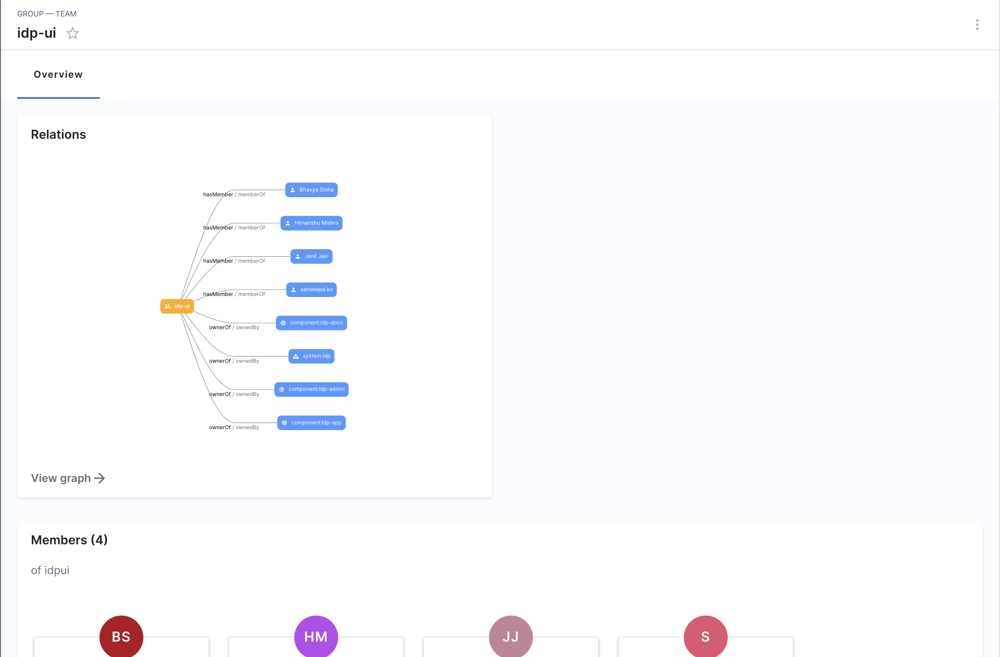

## Add User Groups Directly in the Catalog

The Catalog in Harness IDP also supports addition of [organizational entities](https://backstage.io/docs/features/software-catalog/system-model#organizational-entities) like **user groups** directly, independent of their presence on the Harness Platform. These entities can be registered as `kind: Group` in the catalog as an YAML. Note that our recommendation is to use the [Harness Platform Access Control](https://developer.harness.io/docs/platform/role-based-access-control/add-user-groups/) for ingesting Users and User Groups into Harness IDP.

:::info
The User Groups registered as entities in Catalog directly are not synced back with Harness Platform. The User Groups you add in IDP won't be available as a [Harness Platform User Group](https://developer.harness.io/docs/platform/role-based-access-control/add-user-groups). However, the opposite is true - any user group created in the Harness Platform at the Account level scope will be available in the IDP Catalog as well.
:::

## Kind: Group

A group describes an organizational entity, such as a team, a business unit, or a loose collection of people in an interest group. Members of these groups are modeled in the catalog as User. 

:::info
You can not add Users directly into the catalog as Users are linked with authentication. You can [add users](https://developer.harness.io/docs/platform/role-based-access-control/add-users/#add-users-manually) on the Harness platform at the Account level.
:::

Descriptor files for this kind may look as follows, where `apiVersion`, `kind`, `spec.type` and `spec.children` are **required** fields. 

```YAML
apiVersion: backstage.io/v1alpha1
kind: Group
metadata:
  name: infrastructure
  description: The infra business unit
spec:
  type: business-unit
  profile:
    displayName: Infrastructure
    email: infrastructure@example.com
    picture: https://example.com/groups/bu-infrastructure.jpeg
  parent: ops
  children: [infra-devops, infra-devsecops]
  members: [mira.rosen, lee.coleman]
```
In the above example, `children` represent other user-groups and `members` represent the users under this user group. 

At present we sync all your [user-groups](https://developer.harness.io/docs/platform/role-based-access-control/add-user-groups/) added in Harness Platform to IDP and you could find them under catalog page. 


Here's and example of how a group is displayed as a Team page in IDP. 

:::info

In case there's a user-group already present with the same `metadata.name` while you're registering through your catalog or adding it to the platform, there would be no overwrite of the user-group if it's already present. 

:::



#### When to ingest groups directly into the Catalog rather than creating a Harness Platform User Group at the account level?

- If you need to represent a Group of Groups kind of hierarchy e.g. Org -> Department -> Team
- If you would like the Groups definition to support annotations and tags to be consumed by plugins on the Groups page in Catalog.
- If you already have a YAML representation of Groups and maintain it in a repository today somewhere.