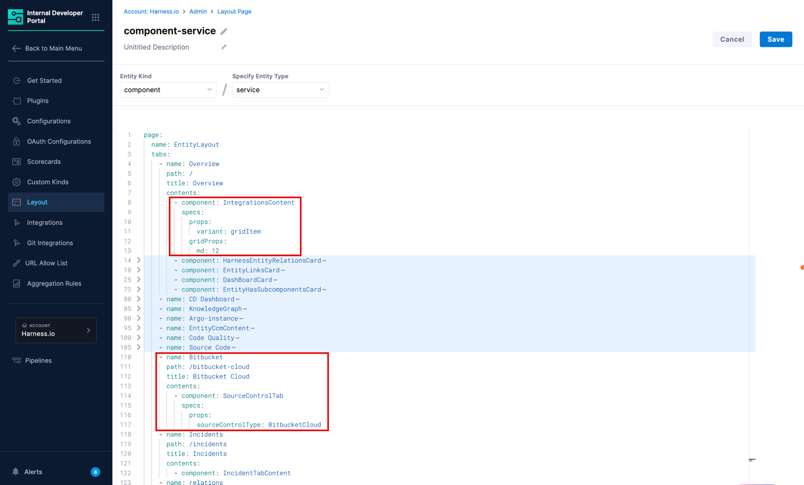
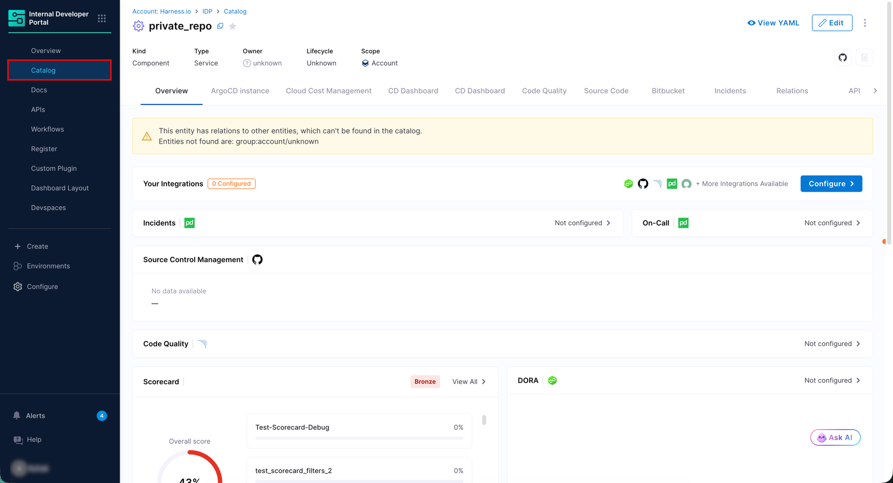
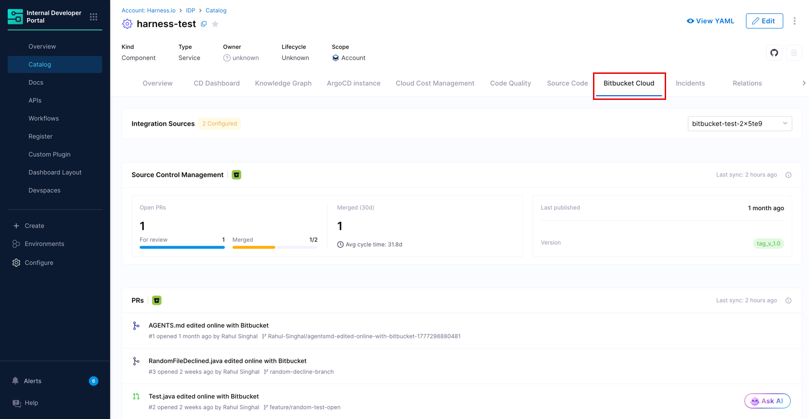

import DocImage from '@site/src/components/DocImage';
import DocVideo from '@site/src/components/DocVideo';

The Bitbucket Cloud integration automatically discovers repositories from your Bitbucket workspace and brings them into the IDP Catalog. Once discovered, entities can be registered as new catalog entries or merged into existing ones, enriching them with Bitbucket-sourced metadata for service discovery and dependency mapping.

For each repository, the integration collects the following:

| Resource | What it provides |
|---|---|
| **Repository** | Repository name, default branch, description, visibility, project details, tags, and repository URL. |

---

## Before you begin

The following are needed to get the integration running:

* Ensure the feature flag `IDP_INTEGRATIONS` is enabled. Contact [Harness Support](mailto:support@harness.io) to enable them.
* You have the required RBAC permissions to manage integrations. All integration operations require the `IDP_INTEGRATION_EDIT` permission on the `IDP_INTEGRATION` resource type.
* A [Bitbucket Cloud connector](https://www.youtube.com/watch?v=PTfoe7siyGs) is configured in Harness with the credentials needed to access your Bitbucket workspace. Ensure that the connector has the [necessary permissions on your Bitbucket Cloud](#bitbucket-permissions). Go to [Set up a Bitbucket Cloud Connector](/docs/platform/connectors/code-repositories/ref-source-repo-provider/bitbucket-connector-settings-reference/) to review the required settings and scopes. You can create a new connector directly during the integration setup.
* While setting up the Bitbucket Cloud connector, make sure to select HTTP (not SSH) and authenticate using an access token. Use `x-token-auth` as the username. If you have an API token or App Password, generate a workspace access token instead.
* For each Bitbucket workspace, maintain one integration.

:::info Proxy Configuration
If your environment blocks outbound third-party traffic and routes it through a proxy, configure proxy settings on your Harness Delegate. Once configured there, the proxy settings are automatically picked up by IDP integrations. No additional setup is needed on the integration side.

Go to [Configure delegate proxy settings](/docs/platform/delegates/manage-delegates/configure-delegate-proxy-settings) to set up proxy settings on your delegate.
:::

---

## Enable the Bitbucket Cloud integration

### 1. Navigate to the integrations page

1. In Harness, open the **Internal Developer Portal**.

2. From the left sidebar, click **Configure**.

3. In the left navigation menu, click **Integrations**.

   <DocImage path={require('./static/bb-integration-nav.png')} />

4. On the Integrations page, click **+ New Integration** at the top.

5. Select **Bitbucket Cloud** from the integration type picker. You will be taken to the **Auto Discover Bitbucket Cloud Integration** page.

### 2. Configure setup & connectivity

This section connects Harness IDP to your Bitbucket workspace.

<DocImage path={require('./static/bb-setup-connectivity.png')} />

1. Enter a name in the **Integration Name** field. This name appears on the integration card on the **Integrations** page (for example, `Bitbucket PreQA Workspace`).

2. Click the **Choose Bitbucket Cloud connector** dropdown and select the connector you created above.

   :::info Do not have a Bitbucket connector yet?
   If no connectors appear in the dropdown, click **+ New Connector** inside the picker modal to create one inline. Go to [Set up a Bitbucket Cloud Connector](/docs/platform/connectors/code-repositories/ref-source-repo-provider/bitbucket-connector-settings-reference/) to review the required settings and scopes. Remember to choose **HTTP** as the connection type while setting up the connector.

   <DocVideo src="https://www.youtube.com/embed/PTfoe7siyGs" />
   :::

### 3. Configure mapping & correlation

This section defines how Bitbucket entities map to IDP catalog entities and how they correlate with existing records.

The Bitbucket Cloud integration supports one entity type: **Repository Entity**.

<DocImage path={require('./static/bb-repository-entity.png')} />

#### Repository entity

The Repository Entity mapping imports Bitbucket repositories as catalog entities, with configurable `Kind` and `Type`.

1. Under **Entity Registration Behavior**, choose how repositories are brought into the catalog:
   * **Register & Merge** *(Default)* - Registers new entities and updates existing ones when a match is found. This is the recommended option for most setups.
   * **Register** - Creates new catalog entities from Bitbucket Cloud. Does not merge with existing entities.
   * **Merge** - Links discovered repositories to existing catalog entities. Matching entities are recommended automatically, but you can choose a different one.

2. Choose the **Kind** and **Type** from the dropdown. By default, these are `Component` and `service` respectively. Configurability varies by registration behavior:

   | Registration Behavior | Kind | Type |
   |---|---|---|
   | `Register & Merge` | Configurable | Configurable |
   | `Register` | Configurable | Configurable |
   | `Merge` | Configurable | Not configurable |

3. Under **Correlation Mapping**, set the **Ingested Data Path** (from Bitbucket) and the corresponding **Catalog YAML Path** (from your IDP entity) to define how records are matched. The operator supports `Equals` and `Contains`. By default, `name` is mapped to `name`.

4. Optionally, click **Configure** next to **Configure fields (optional)** to customize which Bitbucket fields are synced to the catalog. Default mappings are preconfigured.

5. Optionally, click **Configure** next to **Configure Secondary Kinds (optional)** to control which additional data streams are synced for each repository. By default, all secondary kinds are selected.

   Secondary kinds enrich each repository entity with development activity data, giving teams a view of how actively an entity is being developed without leaving the platform.

   <DocImage path={require('./static/bb-secondary-kinds.gif')} />

   The following secondary kinds are available:

   | Secondary Kind | Description | First sync (per repository) | Limit across all repositories (per sync) |
   |---|---|---|---|
   | **Pull Requests** | Pull request details, covering open, merged, and declined PRs. | 50 most recently updated PRs | 5,000 PRs |
   | **Commits** | Commit history on the default branch. | 50 most recent commits | 5,000 commits |

   On the first sync, IDP fetches a limited snapshot per repository. If the total PRs or commits across all repositories exceed their respective per-sync limits (i.e. 5000), the excess is not dropped. Subsequent syncs backfill the remaining PRs and commits and pick up any new ones.

   :::caution Secondary kinds cannot be modified after setup
   These selections are locked once the integration is created and cannot be modified later. Choose carefully before confirming.
   :::

   <!-- :::info Where does this data appear?
   Secondary kinds data is displayed on the [Entity Details](/docs/internal-developer-portal/catalog/create-entity/entity-details) page for each repository under the **Bitbucket** tab. It does not appear in the **Ingested Properties** YAML in the Entity Inspector.
   ::: -->

### 4. Configure advanced settings

The **Advanced Settings** section controls how frequently IDP syncs with Bitbucket Cloud.

<DocImage path={require('./static/bb-advanced-settings.png')} />

1. Select an **Update Frequency** from the dropdown to control how often IDP polls Bitbucket for new data.

   Available options: `30 min`, `1 hour`, `3 hours`, `6 hours`, `12 hours`, `1 day`.

2. Optionally, set a **Select start date** to define the earliest date from which IDP will pull Bitbucket data.

3. Once all sections are configured, click **Confirm & Enable**. A confirmation dialog will appear before changes are applied.

The integration is now enabled and IDP begins syncing data from Bitbucket Cloud. Discovered repositories appear in the [**Discovered** tab](#discovered-tab).

---

## Discover and import Bitbucket entities

This section covers how to view the Bitbucket entities discovered by the integration and import them into your IDP Catalog.

### Discovered tab

After the integration runs, all Bitbucket repositories detected appear in the **Discovered** tab. If entities do not appear, use the **Sync** button at the top right to manually refresh.

<DocImage path={require('./static/bb-discovered-tab.png')} />

For each discovered entity, you can see its name, the recommended catalog action, kind, type, and the date it was detected. You can choose how to bring entities into the catalog using one of the following actions:

* **Register** *(typically used when no matching catalog entity exists)* - Creates a new catalog entity populated with the Bitbucket metadata. `Type` is editable by the user.
* **Merge** *(shown as Recommended when a matching catalog entity is found)* - Links the discovered entity to an existing catalog entity, enriching it with Bitbucket data. The suggested matching entity is shown automatically and can be changed.

:::tip Bulk Import and Auto Import options
* **Bulk Import** - Select services individually using the checkboxes, or use the snackbar at the bottom of the page to bulk-select by action type. Open the dropdown to choose **All services**, **Register**, or **Merge (Recommended)**, then click **Import selected services**.
* **Auto Import** - Toggle **Auto-import future discovered entities** in the top right of the Discovered tab to automatically import all future entities without manual review. You can change this preference at any time.
:::

### Imported tab

The **Imported** tab displays all Bitbucket entities that have been brought into the catalog.

<DocImage path={require('./static/bb-imported-tab.png')} />

It displays the following data:

| Column | Description |
|---|---|
| **Bitbucket Cloud Entity** | The name of the entity from Bitbucket, along with its import status (for example, **Merged** or **Registered**). |
| **Entity** | The linked IDP catalog entity and its ID. |
| **Kind** | The catalog entity kind (for example, `component` for repositories). |
| **Type** | The catalog entity type (for example, `service` for repositories). |
| **Scope** | The Harness account scope the entity belongs to. |
| **Imported At** | The timestamp when the entity was imported. |

:::caution Unlink an Imported Entity
To stop syncing a specific entity without deleting the catalog entity, use the three-dot menu on any row and select **Unlink**. This stops sync updates while keeping the IDP entity and its existing data intact.
:::

### Events tab

The **Events** tab logs all sync and lifecycle activity for this integration. Use it to verify that syncs are running, confirm that imports completed successfully, and investigate any failures.

<DocImage path={require('./static/bb-events.png')} />

For the full event type reference and detail panel fields, go to [Integration Events](/docs/internal-developer-portal/catalog/create-entity/catalog-discovery/integration-events).

---

## View Bitbucket entities in the catalog

Once imported, Bitbucket entities are available in the **Catalog** section of IDP as standard catalog entities.

Each imported Bitbucket repository is registered with:

* **Kind:** `Component`
* **Type:** `service`
* **Scope:** The Harness account the integration belongs to

Open any entity to view Bitbucket-sourced data directly on the entity details page. This data is displayed through two dedicated UI components: one on the **Overview** tab and a **Bitbucket Cloud** tab. Both require a one-time layout configuration, described in the [next section](#layout-for-bitbucket-cloud-components).

<DocImage path={require('./static/bb-catalog-entity.gif')} />

### Layout for Bitbucket Cloud components

To display Bitbucket Cloud data on the [entity details](/docs/internal-developer-portal/catalog/create-entity/entity-details) page, you need to add the two Bitbucket Cloud components to the relevant entity layout. This is a one-time configuration per entity kind and type.

1. From the left sidebar of IDP, go to **Configure** → **Layout** → **Catalog Entities**.
2. Edit the existing layout for your entity or create a new one.
3. Select the **Entity Kind** (e.g., `component`) and the **Entity Type** (e.g., `service`) that matches your imported Bitbucket Cloud entities.
4. In the YAML editor, add the `IntegrationsContent` component inside the **Overview** tab's `contents` block, and add a new **Bitbucket Cloud** tab using the `SourceControlTab` component.

   
   <center>Figure 8: Layout configuration for Bitbucket Cloud cards in Overview tab and Bitbucket Cloud tab</center>

   The relevant YAML additions are:

   ```yaml title="Inside the Overview tab's contents block"
           - component: IntegrationsContent
             specs:
               props:
                 variant: gridItem
               gridProps:
                 md: 12
   ```
   ```yaml title="A new top-level tab entry"
       - name: Bitbucket
         path: /bitbucket-cloud
         title: Bitbucket Cloud
         contents:
           - component: SourceControlTab
             specs:
               props:
                 sourceControlType: BitbucketCloud
   ```

5. Click **Save** to apply the layout changes. The Bitbucket Cloud components will now appear on all entity detail pages of the selected kind and type that have Bitbucket Cloud data.


### Cards in overview tab

After the layout is configured, a `Source Control Management` card appears in the **Overview** tab of any entity that has Bitbucket Cloud data linked to it. The card displays the key Bitbucket Cloud metadata ingested for that entity, sourced from the entity's [ingested properties](#ingested-properties).


<center>Figure 9: IDP Catalog Entity Page for a Bitbucket Cloud service</center>

If the Bitbucket Cloud integration has not been configured for the entity, the card shows a **Not configured** state with a link to the Integrations page.

### Bitbucket Cloud tab

The **Bitbucket Cloud** tab provides a more complete view of the Bitbucket Cloud data for the entity. This tab fetches latest possible data using the integration ID and entity UUID.


<center>Figure 10: Tab showing full Bitbucket Cloud resource details</center>

:::tip Feature Highlights
* The tab shows all available fields for the resource type, including fields not present in the **Overview**.
* All the fields are dynamic.
* The Open and Merged PR metrics and the Pull Requests table shows PRs updated since 30 days before integration setup, limited to the 1000 most recently updated PRs. In the first sync, only the latest 50 pull requests are imported initially.
:::

### Ingested properties

To inspect the raw data ingested from Bitbucket Cloud, open the entity and click **View YAML**, then select **Ingested Properties** in the Entity Inspector.

<DocImage path={require('./static/bb-ingested-properties.gif')} />

Ingested properties are stored in two sections of the entity YAML:

* **`metadata.integration`** - Tracks which integrations are linked to this entity, including the entity action (for example, `REGISTER` or `MERGE`) and the linked entity UUID for each integration instance.
* **`integration_properties.BitbucketCloud`** - Contains the Bitbucket-specific data for the entity, including repository metadata such as name, URL, project key, default branch, tags, and visibility.

---

## Manage the Bitbucket Cloud integration

### Edit the integration

To update the integration name, switch the Bitbucket connector, or change the mapping and correlation settings, navigate to the **Integrations** page, find your Bitbucket integration card, and click **View**. From there, click **Configuration** to open the edit screen.

### Suspend auto-discovery

If auto-discovery is suspended, new entities will not appear in the **Discovered** tab. Existing imported entities remain unchanged in the catalog and sync between Bitbucket and their corresponding IDP entities will stop.

To suspend auto-discovery:

1. Go to **Integrations** and open your Bitbucket integration using the **View** button.
2. Click **Configuration** at the top.
3. In the **Danger Zone** section, click **Suspend**.
4. Confirm the action.

You may re-enable it at any time by following the same steps.

---

## Bitbucket permissions

The Bitbucket Cloud integration requires a workspace access token with the following minimum scopes. Go to the [Bitbucket connector settings reference](/docs/platform/connectors/code-repositories/ref-source-repo-provider/bitbucket-connector-settings-reference/) to review the full connector settings.

* **Projects:** Read
* **Repositories:** Read
* **Pull requests:** Read

<DocImage path={require('./static/minimum-perm.png')} />

These scopes allow IDP to discover all repositories in the workspace, read repository metadata, and ingest pull request data as a secondary kind.
