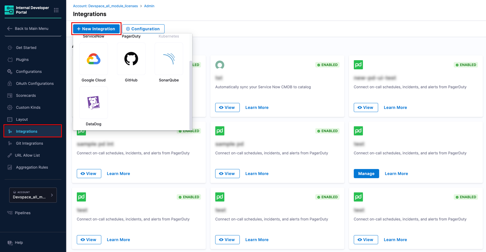
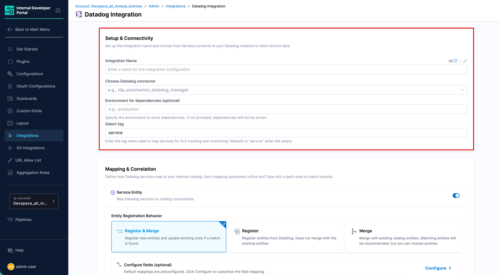
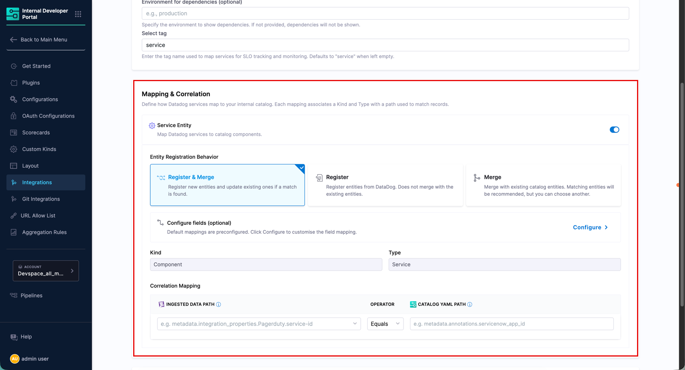
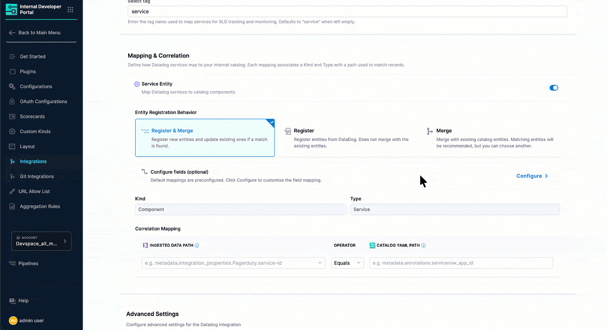
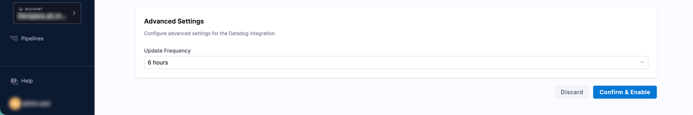
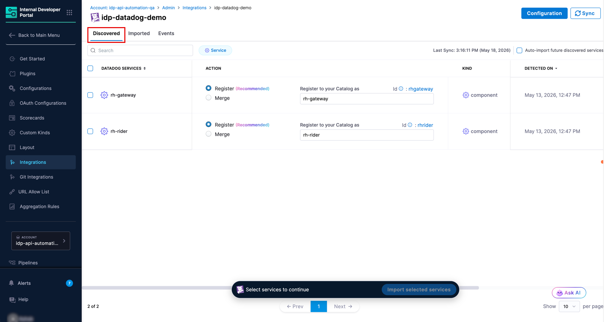
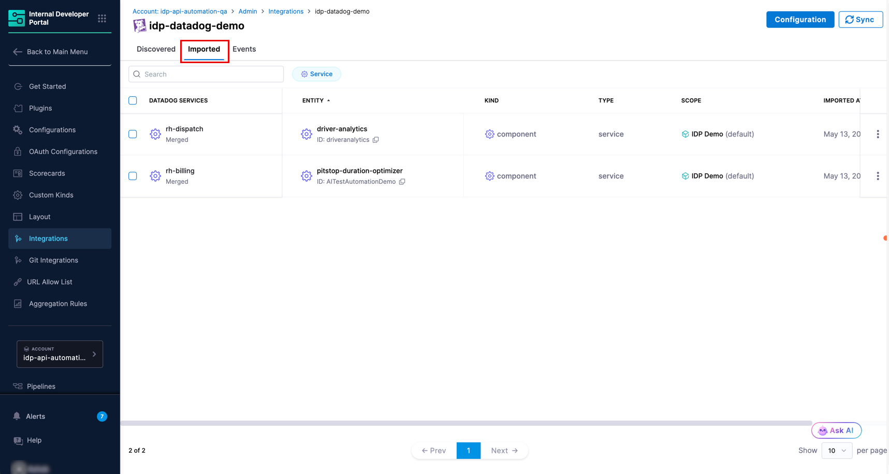
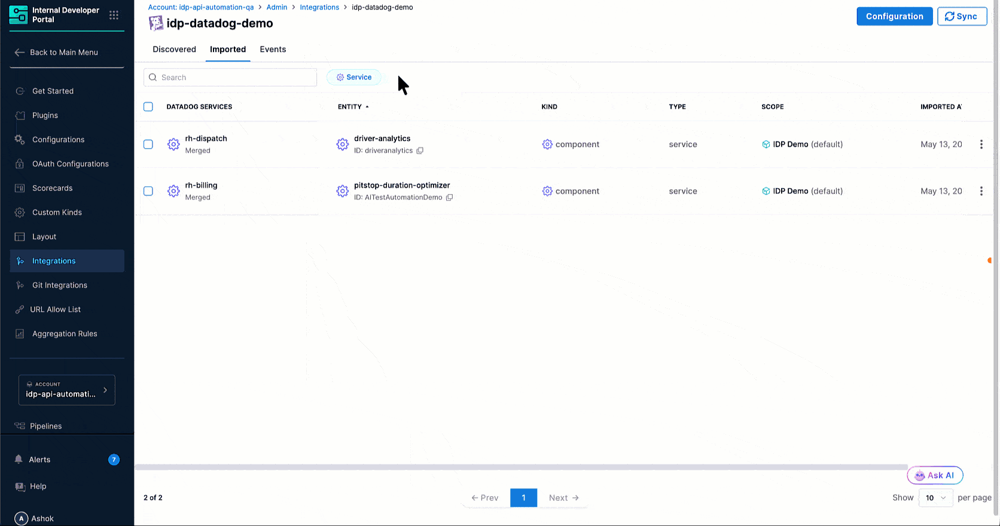
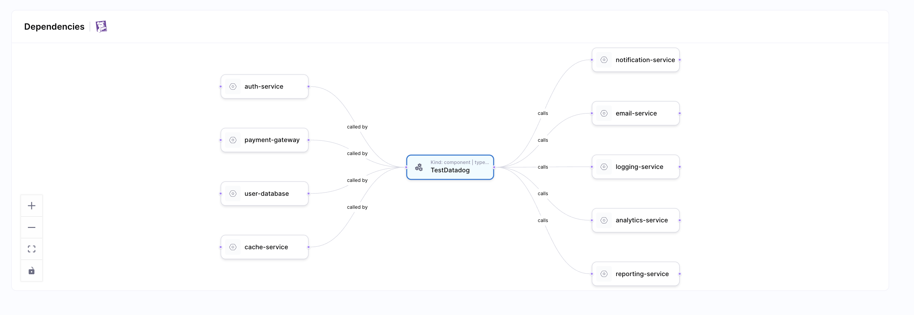
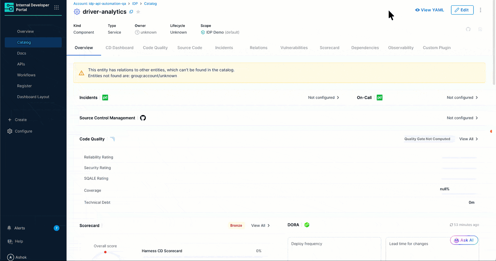

The Datadog integration automatically discovers services from your [Datadog](https://www.datadoghq.com/) account and brings them into the [IDP Catalog](/docs/internal-developer-portal/catalog/overview). Once discovered, entities can be registered as new catalog entries or merged into existing ones. 

For each service, the integration collects the following resources from Datadog:

| Resource | What it provides |
|---|---|
| **Service** | Core metadata from the Datadog Service Catalog such as description, contacts, resources, and repository information. |
| **Monitor** | Monitor metrics and health summary using queries. |
| **SLO** | Service Level Objective data associated with the service. |
| **Service Dependency** | Upstream and downstream service relationships, scoped to an environment you configure. |

---

## Before you begin

The following are needed to get the integration running:

* Ensure the feature flag `IDP_CATALOG_CD_AUTO_DISCOVERY` is enabled. Contact [Harness Support](mailto:support@harness.io) to enable it.
* You have the required RBAC permissions to manage integrations. All integration operations require the `IDP_INTEGRATION_EDIT` permission on the `IDP_INTEGRATION` resource type.
* A Datadog connector is configured in Harness with a valid Datadog URL, Application Key, and API Key. You can also create the connector during the integration setup.

:::info Proxy Configuration
If your environment blocks outbound third-party traffic and routes it through a proxy, you will need to configure proxy settings on your Harness Delegate. Once configured there, the proxy settings are automatically picked up by IDP integrations. No additional setup is needed on the integration side. 

Go to [Configure delegate proxy settings](/docs/platform/delegates/manage-delegates/configure-delegate-proxy-settings) to configure proxy settings on your Harness Delegate.
:::

---

## Enable the Datadog Integration

### 1. Navigate to the Integrations Page

1. In Harness, open the **Internal Developer Portal**.

2. From the left sidebar, click **Configure**.

3. In the left navigation menu, click **Integrations**.

   
   
Figure 1: Navigation Path of Datadog Integration

4. On the Integrations page, click **+ New Integration** at the top.

5. Select **DataDog** from the integration type picker. You will be taken to the **Datadog Integration** configuration page.

### 2. Configure Setup & Connectivity

This section connects Harness IDP to your Datadog account.

Figure 2: Setup & Connectivity

1. Enter a name in the **Integration Name** field. This name appears on the integration card on the **Integrations** page (e.g., `Datadog Prod Observability`).

2. Click the **Choose Datadog connector** dropdown and select the Datadog connector you want to use to pull data into the IDP.

   :::info Don't have a Datadog connector yet?
   If no connectors appear in the dropdown, you need to first [create a Datadog connector](#create-a-datadog-connector) in Harness.
   :::

3. (Optional) In the Environment for dependencies field, enter the environment name whose service dependencies you want to see on entity pages (e.g., production). Leave it empty if you do not need dependency information. 

   :::note
   Service dependencies are tracked by Datadog based on recent APM traces. If a service is down and not generating traces, it will not appear in the dependency view.
   :::

4. The **Select tag** field defaults to `service`. This is a reserved Datadog tag used to map services for SLO tracking and monitoring. Only change this value if you have a specific reason to use a different tag, as modifying it may affect how services are identified and matched.

#### Create a Datadog Connector

If you do not have an existing Datadog connector, you can create one directly from the integration setup flow. The below video tutorial covers all the steps in depth.

<DocVideo src="https://www.youtube.com/embed/sPSO-kKRgmE" />

1. Click the **Choose Datadog connector** dropdown, then click **+ New Connector**.

2. **Overview**: Give a name to your Datadog connector. Optionally add a description and tags, then click **Continue**.

3. **Credentials**: Provide the following and then click **Next**:

   | Field | Description |
   |---|---|
   | **URL** | The base URL of your Datadog instance (e.g., `https://api.datadoghq.com`) followed by `/api/`. Exclude versions if any (e.g., `v1`)|
   | **Encrypted Application Key** | The Datadog Application Key. Click **Create or Select a Secret** to store it securely. The following scopes are required: <ul><li>`apm_service_catalog_read`</li><li>`apm_read`</li><li>`monitors_read`</li><li>`slos_read`</li><li>`metrics_read`</li></ul> |
   | **Encrypted API Key** | The Datadog API Key. Click **Create or Select a Secret** to store it securely. |

4. **Delegates Setup**: Select the delegate(s) this connector will use to communicate with Datadog.

   - Choose **Use any available Delegate** to let Harness automatically select an available delegate.
   - Choose **Only use Delegates with all of the following tags** to pin the connector to specific delegates by tag.

   Click **Save and Continue**.

5. **Verify Connection**: Harness tests the connection using the provided credentials and delegate. Once verified, click **Finish** to save the connector.

### 3. Configure Mapping & Correlation

This section defines how Datadog services are mapped to IDP catalog entities and how they are correlated with existing records.

Figure 3: Mapping & Correlation

#### Service Entity

The Service Entity mapping imports Datadog services as catalog components.

1. Ensure the **Service Entity** toggle is turned on.

2. Under **Entity Registration Behavior**, choose how services are brought into the catalog:
   - **Register & Merge** *(Default)* - Registers new entities and updates existing ones when a match is found. This is the recommended option for most setups.
   - **Register** - Creates new catalog entities from Datadog. Does not merge with existing entities.
   - **Merge** - Links discovered services to existing catalog entities. Matching entities are recommended automatically, but you can choose a different one.

3. The default **Kind** is `Component` and **Type** is `Service`. These are pre-configured and apply to all Datadog service imports.

4. Under **Correlation Mapping**, set the **Ingested Data Path** (from Datadog) and the corresponding **Catalog YAML Path** (from your IDP entity) to define how records are matched. The operator defaults to `Equals`.

5. Optionally, click **Configure** next to **Configure fields** to customize which Datadog fields are synced to the catalog. By default, all available fields are selected.

   
   
Figure 4: Configure Datadog Service Fields

### 4. Configure Advanced Settings

The **Advanced Settings** section controls how frequently IDP syncs with Datadog.

Figure 5: Advanced Settings

1. Select an **Update Frequency** from the dropdown to control how often IDP polls Datadog for new data.

2. Once all sections are configured, click **Confirm & Enable**. 

The integration is now enabled and IDP begins syncing data from Datadog. Discovered services appear in the [**Discovered** tab](#discovered-tab).

---

## Discover and Import Datadog Entities

This section covers how to view the Datadog services discovered by the integration and import them into your IDP Catalog.

### Discovered Tab

After the integration runs, all Datadog services detected appear in the **Discovered** tab. If no entities appear yet, the tab shows a **Discovering Services** state, indicating the sync is still in progress.

Figure 6: Discovered tab in progress

Use the **Sync** button at the top right to manually trigger a refresh if needed.

Once discovery completes, each discovered service appears with its name, recommended catalog action, kind, type, and detection date. You can bring entities into the catalog using one of the following actions:

- **Register** *(shown as Recommended when no matching catalog entity exists)* - Creates a new catalog entity populated with Datadog metadata.
- **Merge** - Links the discovered entity to an existing catalog entity, enriching it with Datadog data. If IDP finds a catalog entity with a matching name, **Merge** is pre-selected and the suggested entity is shown automatically.

:::tip Bulk Import
Select multiple entities using the checkboxes and click **Import selected entities** at the bottom of the page to import them all at once.
:::

### Imported Tab

The **Imported** tab displays all Datadog services that have been brought into the catalog.

Figure 7: Imported tab

It displays the following data:

| Column | Description |
|---|---|
| **Datadog Services** | The name of the service from Datadog, along with its import status (e.g., **Merged**). |
| **Entity** | The linked IDP catalog entity and its ID. |
| **Kind** | The catalog entity kind (e.g., `component`). |
| **Type** | The catalog entity type (e.g., `service`). |
| **Scope** | The Harness account scope the entity belongs to. |
| **Imported** | The timestamp when the entity was imported. |

:::caution Unlink an Imported Entity
To stop syncing a specific entity without deleting the catalog entity, use the three-dot menu on any row and select **Unlink**. This stops sync updates while keeping the IDP entity and its existing data intact.
:::

---

## View Datadog Entities in the Catalog

Once imported, Datadog entities are available in the **Catalog** section of IDP as standard catalog entities.

Each imported Datadog service is registered with:

- **Kind:** `Component`
- **Type:** `Service`
- **Scope:** The Harness account the integration belongs to

Figure 8: IDP Catalog Entity Page for a Datadog service

Open any entity to view its Overview, Scorecards, and other configured tabs. The **Integrations** section on the Overview tab reflects the Datadog connection status for the entity.

Figure 9: IDP Catalog Entity Page for a Datadog service

### Ingested Properties

To inspect the raw data ingested from Datadog, open the entity and click **View YAML**, then select **Ingested Properties** in the Entity Inspector.

Figure 10: Entity Inspector showing Datadog Ingested Properties

Ingested properties are stored in two sections of the entity YAML:

- **`metadata.integration`** - Tracks which Datadog integration instances are linked to this entity, including the entity action (e.g., `MERGE`) and the linked entity UUID.
- **`integration_properties.Datadog`** - Contains the Datadog-specific data for the entity, including fields like `description`, `monitorCount`, `monitors_summary`, `monitors_summary_count`, `links`, `contacts`, `docs`, `downstreamServiceNames`, `githubHtmlUrl`, `languages`, and more.

---

## Manage the Datadog Integration

### Edit the Integration

To update the integration name, switch the Datadog connector, or change the mapping and correlation settings, navigate to the **Integrations** page, find your Datadog integration card, and click **View**. From there, click **Configuration** to open the edit screen.

### Suspend Auto-Discovery

If auto-discovery is suspended, new entities will not appear in the **Discovered** tab. Existing imported entities remain unchanged in the catalog and the sync between Datadog and their corresponding IDP entities will stop.

To suspend auto-discovery:

1. Go to **Integrations** and open your Datadog integration using the **View** button.
2. Click **Configuration** at the top.
3. In the **Danger Zone** section, click **Suspend**.
4. Confirm the action.

You may re-enable it at any time by following the same steps.
