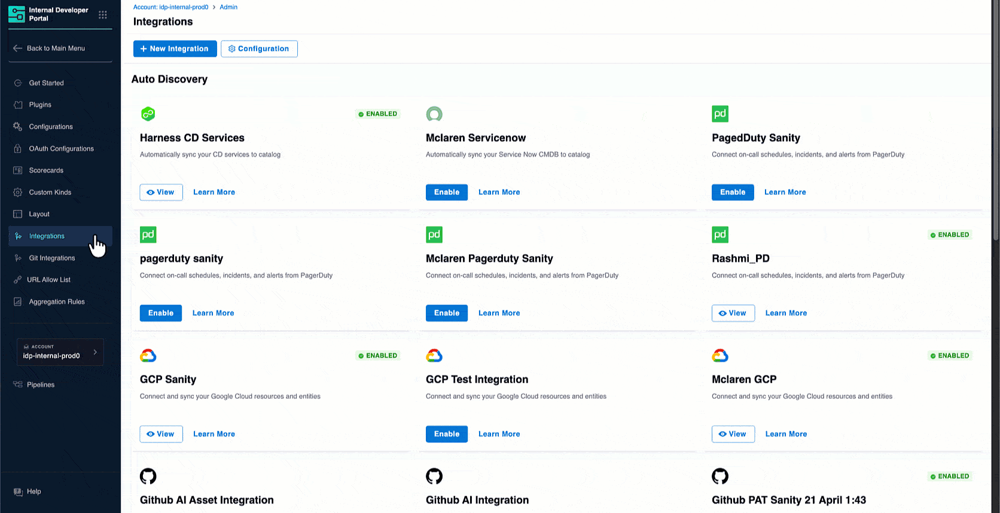
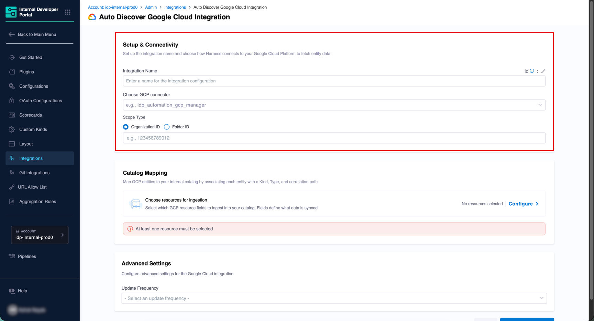
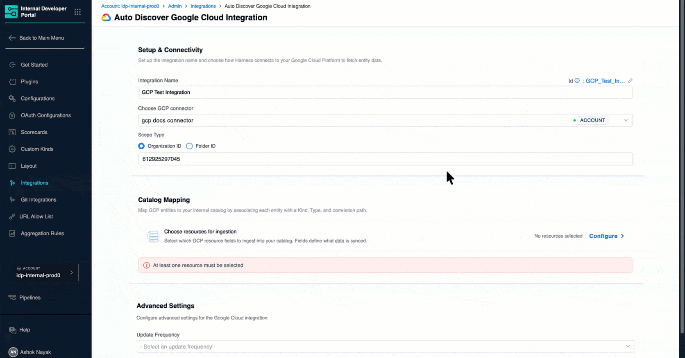
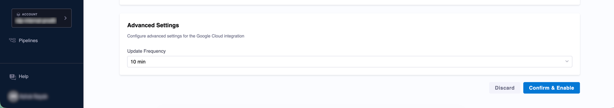
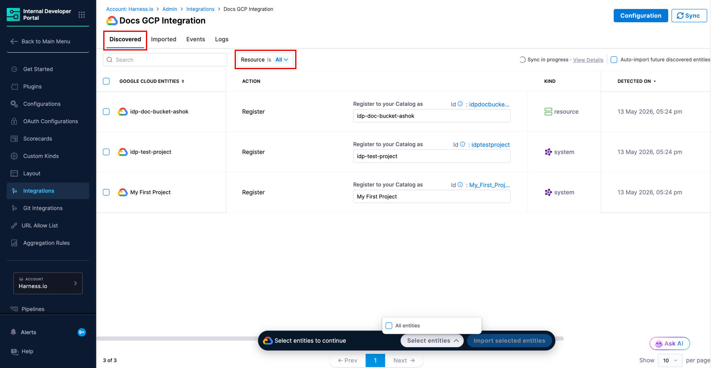
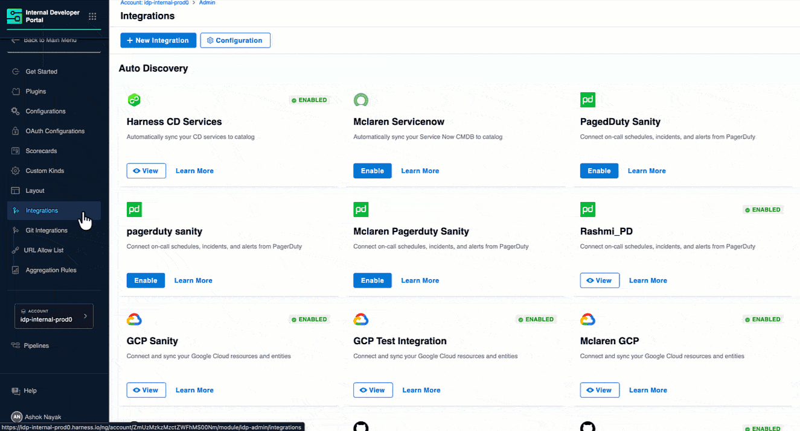
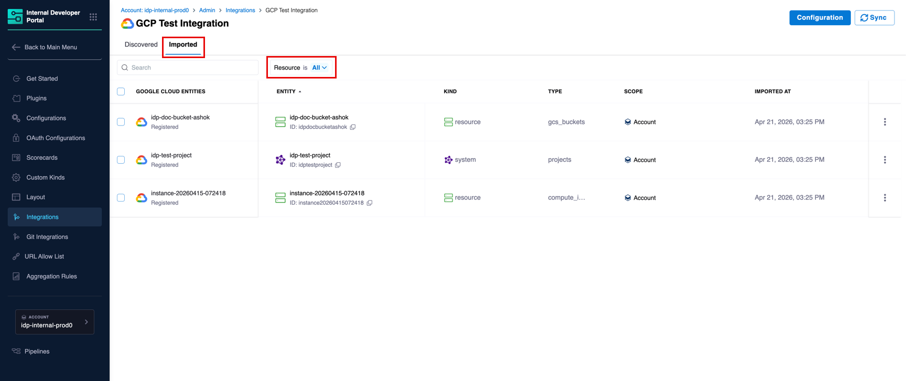
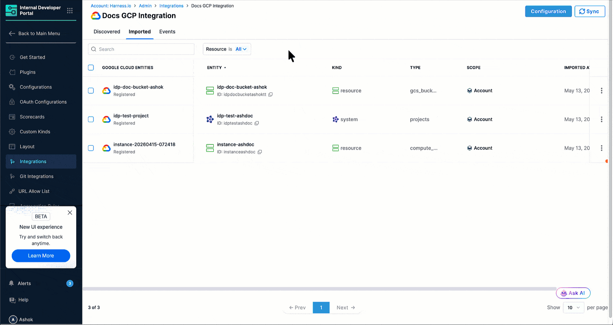

import DocVideo from '@site/src/components/DocVideo';

The Google Cloud integration connects to your GCP organization or folder and brings resources into the IDP Catalog, such as Compute Instances, GCS Buckets, Cloud Run services, BigQuery datasets, GKE clusters, and more. Once discovered, entities can be registered as new catalog entries, enriching them with GCP-sourced metadata such as asset type, location, state, and resource identifiers.

---

## Before you begin

The following configurations are needed in Harness and GCP to get the integration running.

### Relevant Harness Configurations
 
* The feature flag `IDP_CATALOG_CD_AUTO_DISCOVERY` is enabled. Contact [Harness Support](mailto:support@harness.io) to enable it.
* You have the required RBAC permissions to manage integrations. All integration operations require the `IDP_INTEGRATION_EDIT` permission on the `IDP_INTEGRATION` resource type.
* A [GCP connector](https://www.youtube.com/watch?v=frNDU4Iv7zM) is configured in Harness using a service account JSON key. See [GCP configurations](#relevant-gcp-configurations) below for how to obtain the key.

### Relevant GCP Configurations
 
* **IAM role**: Grant `roles/cloudasset.viewer` to your service account at the **organization or folder level** (not project level) via [IAM & Admin](https://console.cloud.google.com/iam-admin/iam). For resource-specific access (e.g., Compute, BigQuery), also grant the relevant viewer roles such as `roles/compute.viewer` or `roles/bigquery.metadataViewer` at the same scope.
* **Service account key**: [Generate a JSON key](https://cloud.google.com/iam/docs/keys-create-delete) for your service account (**Keys** tab → **Add key → Create new key → JSON**) and upload it when creating the GCP connector in Harness.
* **Cloud Asset API**: [Enable `cloudasset.googleapis.com`](https://console.cloud.google.com/apis/library/cloudasset.googleapis.com) on the GCP project associated with the service account.

:::info Proxy Configuration
If your environment blocks outbound third-party traffic and routes it through a proxy, you'll need to configure proxy settings on your Harness Delegate. Once configured there, the proxy settings are automatically picked up by IDP integrations. No additional setup is needed on the integration side. 

Here's how to set it up: [Configure delegate proxy settings](/docs/platform/delegates/manage-delegates/configure-delegate-proxy-settings)
:::

---

## Enable the Google Cloud Integration

:::info
The Google Cloud integration is available at the **Account**, **Organization**, and **Project** levels. Navigate to the appropriate scope of the Internal Developer Portal to add or manage Google Cloud integrations.
:::

### 1. Navigate to the Integrations Page

1. In Harness, open the **Internal Developer Portal**.

2. From the left sidebar, click **Configure**.

3. In the left navigation menu, click **Integrations**.

   
   
Figure 1: Navigation Path of GCP Integration

4. On the Integrations page, click **+ New Integration** at the top.

5. Select **Google Cloud** from the integration type picker. You will be taken to the **Auto Discover Google Cloud Integration** page.

### 2. Configure Setup & Connectivity

This section connects Harness IDP to your Google Cloud Platform.

Figure 2: Setup & Connectivity

1. Enter a name in the **Integration Name** field. This name appears on the integration card on the **Integrations** page (e.g., `GCP QA Data Integration`).

2. Click the **Choose GCP connector** dropdown and select the GCP connector you want to use to pull data into the IDP (e.g., `idp_automation_gcp_manager`).

   :::info Don't have a GCP connector yet?
   If no connectors appear in the dropdown, you need to first create a GCP connector in Harness. Once saved, it will appear in the dropdown here.

   <DocVideo src="https://www.youtube.com/embed/frNDU4Iv7zM" />
   :::

3. Under **Scope Type**, select how IDP should scope the resource discovery:
   * **Organization ID** *(Default)*: Discovers resources across your entire GCP organization. Enter your numeric GCP Organization ID (e.g., `123456789012`).
   * **Folder ID**: Limits discovery to a specific GCP folder. Enter the numeric Folder ID.

### 3. Configure Catalog Mapping

This section defines which GCP resources are ingested and how they map to IDP catalog entities.

Click **Configure** next to **Choose resources for ingestion** to open the **Resource selection** panel.

Resources are organized into several categories: Monitoring, Databases, API Gateway, Serverless, CI/CD & Data, Compute Engine, Networking, IAM & Security, Kubernetes, Storage, Resource Manager, Caching, Messaging, and Vertex AI. Use the **Choose Resource** dropdown at the top of the panel to filter by category.

Figure 3: GCP Resource Selection

For each resource you select, three fields are configurable:

* **Sync Mode**: `Full Refresh` re-syncs the entire resource list on every update cycle. `Incremental` syncs only resources that have changed since the last update.
* **Kind**: Select the IDP catalog entity kind that best represents this resource in your catalog.
* **Type**: The catalog entity type label (e.g., `compute_instances`, `gcs_buckets`). Pre-filled based on the resource and can be customized.

Once you have made your selections, click **Continue** to return to the main configuration page.

### 4. Configure Advanced Settings

The **Advanced Settings** section controls how frequently IDP syncs with GCP.

Figure 4: Advanced Settings

1. Select an **Update Frequency** from the dropdown to control how often IDP polls GCP for new data.

   Available options: `10 min`, `30 min`, `1 hour`, `1 day`.

2. Once all sections are configured, click **Confirm & Enable**. A confirmation dialog will appear before the changes are applied.

The integration is now enabled and IDP begins syncing data from GCP. Discovered resources appear in the [**Discovered** tab](#discovered-tab).

---

## Discover and Import GCP Entities

### Discovered tab

After the integration runs, all GCP resources detected appear in the **Discovered** tab. Use the **Resource** dropdown filter to narrow the list by resource type. If entities do not appear, use the **Sync** button at the top right to manually refresh.

Figure 5: 'Discovered' tab showing GCP Resources

For each discovered entity, you can see its name, the recommended catalog action, kind, type, and the date it was detected. All discovered GCP resources default to the **Register** action, which creates a new catalog entity populated with the GCP metadata.

:::tip Bulk Import and Auto Import Options
* **Bulk Import**: Select multiple entities using the checkboxes and click **Import selected entities** at the bottom of the page to import them all at once.
* **Auto Import**: Toggle **Auto-import future discovered entities** in the top right of the Discovered tab to automatically import all future entities without manual review.
:::

Figure 6: Import Discovered GCP Resources to IDP Catalog

### Imported tab

The **Imported** tab displays all GCP entities that have been brought into the catalog. Use the **Resource** dropdown filter to narrow by resource type.

Figure 7: 'Imported' tab showing GCP entities linked to catalog entities

| Column | Description |
|---|---|
| **Google Cloud Entities** | The name of the resource from GCP, along with its import status (e.g., **Registered**). |
| **Entity** | The linked IDP catalog entity and its ID. |
| **Kind** | The catalog entity kind (e.g., `resource`, `system`). |
| **Type** | The catalog entity type (e.g., `compute_disks`). |
| **Scope** | The Harness account scope the entity belongs to. |
| **Imported At** | The timestamp when the entity was imported. |

:::caution Unlink an Imported Entity
To stop syncing a specific entity without deleting the catalog entity, use the three-dot menu on any row and select **Unlink**. This stops sync updates while keeping the IDP entity and its existing data intact.
:::

---

## View GCP Entities in the Catalog

Once imported, GCP entities are available in the **Catalog** section of IDP as standard catalog entities. Each entity's kind and type reflect the selections made during resource configuration.

Figure 8: Entity Inspector Page showing Ingested Properties

Open any entity to view its Overview, Relations, and other tabs configured for your entity layout. The entity status (e.g., `READY`) is sourced directly from GCP.

### Ingested Properties

To inspect the raw data ingested from GCP, open the entity and click **View YAML** → **Ingested Properties** in the Entity Inspector.

Ingested properties are stored in two sections of the entity YAML:

* **`metadata.integration`**: Tracks which integrations are linked to this entity, including the entity action (e.g., `REGISTER`) and the linked entity UUID.
* **`integration_properties.GCP`**: Contains the GCP-specific data for the entity, including fields such as `assetType`, `createTime`, `displayName`, `identifier`, `location`, `organization`, `projects`, `resourceName`, `state`, and others depending on the resource type.

---

## Manage the Google Cloud Integration

### Edit the integration

To update the integration name, switch the GCP connector, change the scope, or modify resource selections, navigate to the **Integrations** page, find your GCP integration card, and click **View**. From there, click **Configuration** to open the edit screen.

### Suspend Auto-Discovery

If auto-discovery is suspended, new entities will not appear in the **Discovered** tab. Existing imported entities remain unchanged in the catalog, and the sync between GCP and their corresponding IDP entities will stop.

To suspend auto-discovery:

1. Go to **Integrations** and open your GCP integration using the **View** button.
2. Click **Configuration** at the top.
3. In the **Danger Zone** section, click **Suspend**.
4. Confirm the action.

You may re-enable it at any time by following the same steps.
