The GitHub integration automatically discovers repositories, teams, and AI assets from your GitHub organization and brings them into the IDP Catalog. Once discovered, entities can be registered as new catalog entries or merged into existing ones, enriching them with GitHub-sourced metadata for service discovery, team ownership, and dependency mapping.

---

## Before you begin

The following are needed to get the integration running:

* The feature flag `IDP_CATALOG_CD_AUTO_DISCOVERY` is enabled. Contact [Harness Support](mailto:support@harness.io) to enable it.
* You have the required RBAC permissions to manage integrations. All integration operations require the `IDP_INTEGRATION_EDIT` permission on the `IDP_INTEGRATION` resource type.
* A [GitHub PAT Connector](https://www.youtube.com/watch?v=67r7gXk-UcU) or [GitHub App Connector](/docs/platform/connectors/code-repositories/git-hub-app-support) is configured in Harness with the credentials needed to access your GitHub organization. Ensure that the connector has the [necessary permissions on your GitHub](#github-permissions). You can create a new connector directly during the integration setup. 
* For each GitHub org, user has to maintain one integration.

:::info Proxy Configuration
If your environment blocks outbound third-party traffic and routes it through a proxy, you'll need to configure proxy settings on your Harness Delegate. Once configured there, the proxy settings are automatically picked up by IDP integrations. No additional setup is needed on the integration side. 

Here's how to set it up: [Configure delegate proxy settings](/docs/platform/delegates/manage-delegates/configure-delegate-proxy-settings)
:::

---

## Enable the GitHub Integration

### 1. Navigate to the Integrations Page

1. In Harness, open the **Internal Developer Portal**.

2. From the left sidebar, click **Configure**.

3. In the left navigation menu, click **Integrations**.

   
   
Figure 1: Navigation Path of GitHub Integration

4. On the Integrations page, click **+ New Integration** at the top.

5. Select **GitHub** from the integration type picker. You will be taken to the **Auto Discover GitHub Integration** page.

### 2. Configure Setup & Connectivity

This section connects Harness IDP to your GitHub organization.

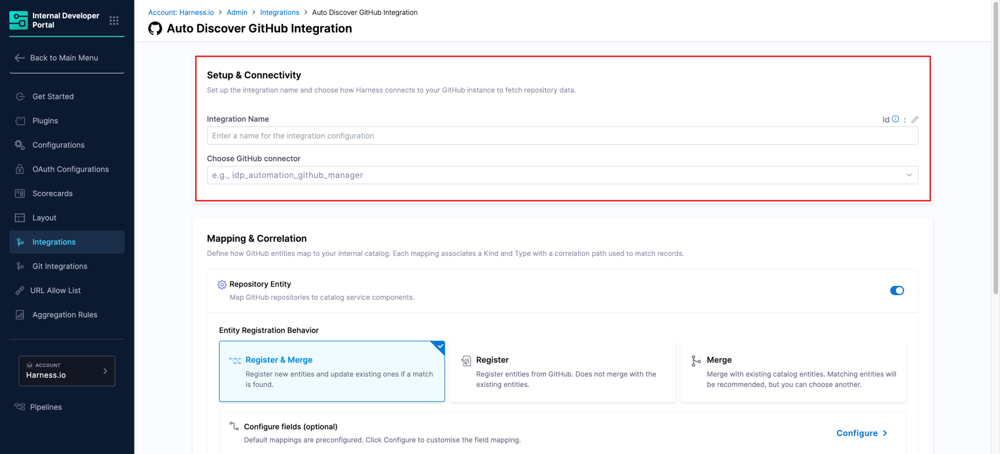

Figure 2: Setup & Connectivity

1. Enter a name in the **Integration Name** field. This name appears on the integration card on the **Integrations** page (e.g., `GitHub Production`).

2. Click the **Choose GitHub connector** dropdown and select the GitHub connector you want to use to pull data into the IDP.

   :::caution Connector requires org-level permissions
   The GitHub integration performs org-level queries to discover repositories and teams across your organization. Ensure the GitHub connector you select has org-level permissions on your GitHub.
   :::

   :::info Don't have a GitHub connector yet?
   If no connectors appear in the dropdown, you need to first create a GitHub connector in Harness. Once saved, it will appear in the dropdown here.

   <DocVideo src="https://www.youtube.com/embed/67r7gXk-UcU" />
   :::

### 3. Configure Mapping & Correlation

This section defines how GitHub entities are mapped to IDP catalog entities and how they are correlated with existing records.

The integration supports three entity types: **Repository Entity**, **Team Entity**, and **AI Assets Entity**, each with its own toggle, registration behavior, and field configuration.

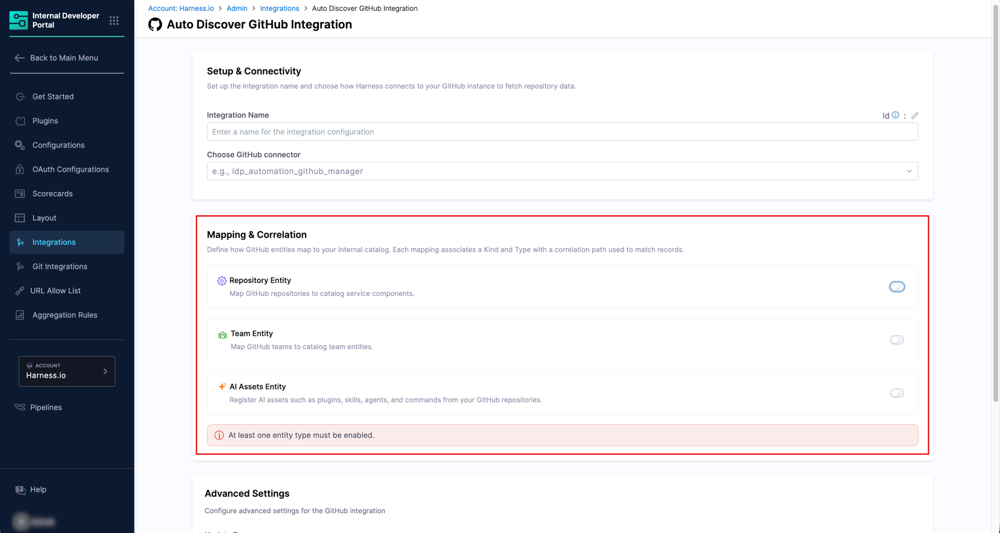

Figure 3: Available Entities - Repository, Team, and AI Assets

#### Repository Entity

The Repository Entity mapping imports GitHub repositories as catalog entities, with configurable `Kind` or `Type`.

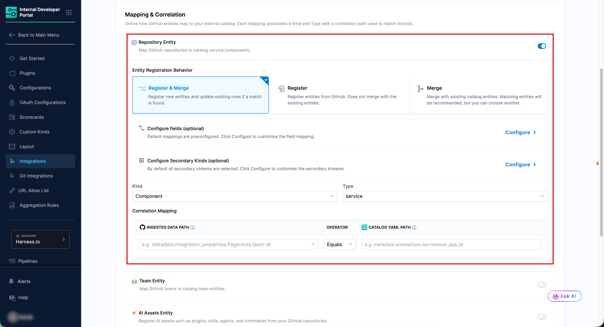

Figure 4: Enable Repository Entity

1. Ensure the **Repository Entity** toggle is turned on.

2. Under **Entity Registration Behavior**, choose how repositories are brought into the catalog:
   * **Register & Merge** *(Default)* - Registers new entities and updates existing ones when a match is found. This is the recommended option for most setups.
   * **Register** - Creates new catalog entities from GitHub. Does not merge with existing entities.
   * **Merge** - Links discovered repositories to existing catalog entities. Matching entities are recommended automatically, but you can choose a different one.

3. Choose the **Kind** and **Type** from the dropdown. By default, it is `Component` and `service` respectively. Configurability varies by registration behavior:

   | Registration Behavior | Kind | Type |
   |---|---|---|
   | `Register & Merge` | Configurable | Configurable |
   | `Register` | Configurable | Configurable |
   | `Merge` | Configurable | Not configurable |

4. Under **Correlation Mapping**, set the **Ingested Data Path** (from GitHub) and the corresponding **Catalog YAML Path** (from your IDP entity) to define how records are matched. The operator supports `Equals` and `Contains`.

5. Optionally, click **Configure** next to **Configure fields (optional)** to customize which GitHub fields are synced to the catalog. By default, all available fields are selected.

:::info Release Data Limit
GitHub repository entities include release metadata for the latest 10 releases only (if they exist). Older releases are not ingested into the catalog.
:::

#### Team Entity

The Team Entity mapping imports GitHub teams as catalog entities, with configurable `Kind` or `Type`.

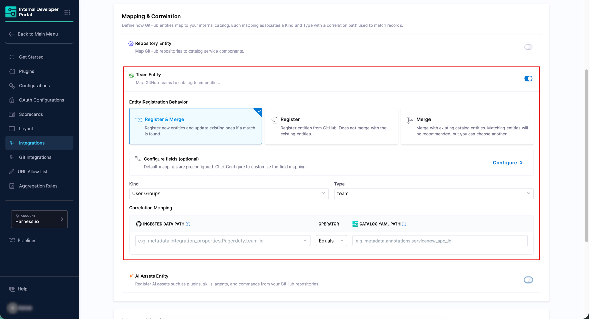

Figure 5: Enable Team Entity

1. Ensure the **Team Entity** toggle is turned on.

2. Under **Entity Registration Behavior**, choose the registration behavior as described above for [Repository Entity](#repository-entity).

3. Choose the **Kind** and **Type** from the dropdown. By default, it is `User Groups` and `Team` respectively. Configurability varies by registration behavior:

   | Registration Behavior | Kind | Type |
   |---|---|---|
   | `Register & Merge` | Configurable | Configurable |
   | `Register` | Configurable | Configurable |
   | `Merge` | Configurable | Not configurable |

4. Configure the **Correlation Mapping** fields as needed.

5. Optionally, click **Configure** next to **Configure fields (optional)** to customize the field mapping.

:::info Repository Visibility for Teams
The catalog only surfaces repositories for which the GitHub team has Admin permission. Repositories with lower-level access will not show up in the [Ingested Properties](#ingested-properties).
:::

#### AI Assets Entity

The AI Assets Entity mapping discovers and imports AI/ML assets found in your GitHub repositories through manifest-level, API-based scanning. No repository cloning is required. 

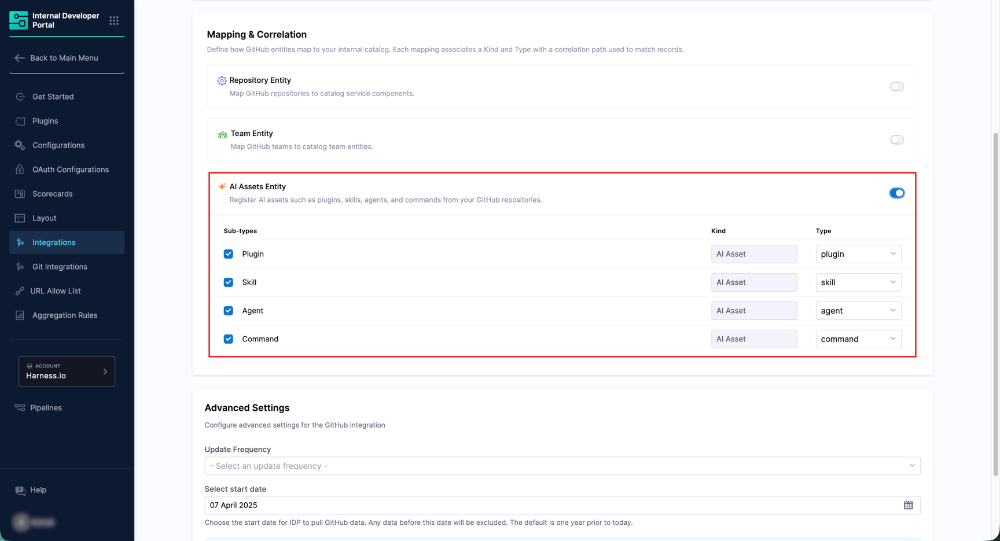

Figure 6: Enable AI Assets Entity

You can discover two classes of assets:

* **`ai_asset`** - Claude Code ecosystem components defined in `.claude-plugin/` manifests or standalone `.claude/` directories. Includes the following types:

   | Type | Description | Example |
   |---|---|---|
   | `plugin` | A Claude Code plugin bundle | `make-agent-friendly`, `harness-hql` |
   | `skill` | A user-invocable task definition | `python-conventions`, `hql`, `dbops` |
   | `agent` | An autonomous agent definition | `python-explorer`, `doc-generator` |
   | `command` | A CLI-style command | `run`, `suggest-workflows`, `add-fme-step` |

* **`dependency`** - AI/ML tooling and infrastructure detected in package files, config files, and infrastructure manifests. Includes the following types:

   | Type | Description | Example |
   |---|---|---|
   | `library` | Package manager dependency | `openai`, `langchain`, `anthropic` |
   | `model` | LLM/ML model reference | `gpt-4o`, `claude-3.5-sonnet` |
   | `endpoint` | API endpoint or key reference | `OPENAI_API_KEY`, `ANTHROPIC_API_KEY` |
   | `mcp_server` | MCP server configuration | Declared in `.mcp.json` or `claude_desktop_config.json` |

:::info Monorepo Support
The current implementation scans for plugin manifests and `.claude/` directories at the repository root only. Subdirectory scanning of AI assets in a monorepo might be planned in a future release.
:::

:::tip Find your imported entities in the Catalog
Both asset classes are registered in the IDP Catalog under `AIAsset` kind with their respective types, and are browsable under the **AI Assets** and **AI Dependencies** tabs in the [Catalog](../../../catalog/overview)
:::

### 4. Configure Advanced Settings

The **Advanced Settings** section controls how frequently IDP syncs with GitHub and how far back historical data is pulled.

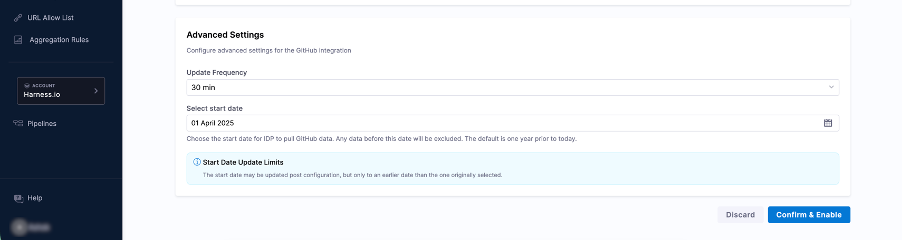

Figure 7: Advanced Settings

1. Select an **Update Frequency** from the dropdown to control how often IDP polls GitHub for new data.

2. Set the **Select start date** to define the earliest date from which IDP will pull GitHub data. Any data before this date will be excluded. By default, this is set to one year prior to today.

   :::info Start Date Update Limits
   The start date may be updated after the integration is configured, but only to an earlier date (up to 1 year old) than the one originally selected. It cannot be moved forward.
   :::

3. Once all sections are configured, click **Confirm & Enable**. A confirmation dialog will appear before the changes are applied.

The integration is now enabled and IDP begins syncing data from GitHub. Discovered repositories, teams, and AI assets appear in the [**Discovered** tab](#discovered-tab).

---

## Discover and Import GitHub Entities

This section covers how to view the GitHub entities discovered by the integration and import them into your IDP Catalog.

### Discovered tab

After the integration runs, all GitHub entities detected appear in the **Discovered** tab. Use the **Repository**, **Team**, and **AI Assets** sub-tabs to switch between entity types. If entities do not appear, use the **Sync** button at the top right to manually refresh.

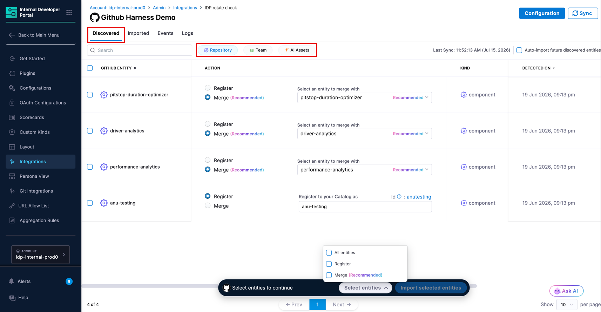

Figure 8: 'Discovered' tab showing GitHub Repositories, Teams, and AI Assets

For each discovered entity, you can see its name, the recommended catalog action, kind, and the date it was detected. You can choose how to bring entities into the catalog using one of the following actions:

* **Register** *(shown as Recommended when no matching catalog entity exists)* - Creates a new catalog entity populated with the GitHub metadata. `Type` is editable by the user.
* **Merge** *(shown as Recommended when a matching catalog entity is found)* - Links the discovered entity to an existing catalog entity, enriching it with GitHub data. The suggested matching entity is shown automatically and can be changed.

:::tip Bulk Import and Auto Import Options
* **Bulk Import** - Select multiple entities using the checkboxes and click **Import selected entities** at the bottom of the page to import them all at once. The selection widget shows a count of selected entities.
* **Auto Import** - Toggle **Auto-import future discovered entities** in the top right of the Discovered tab to automatically import all future entities without manual review. You can change this preference at any time.
:::

### Imported tab

The **Imported** tab displays all GitHub entities that have been brought into the catalog. Use the **Repository**, **Team**, and **AI Assets** sub-tabs to view each entity type separately.

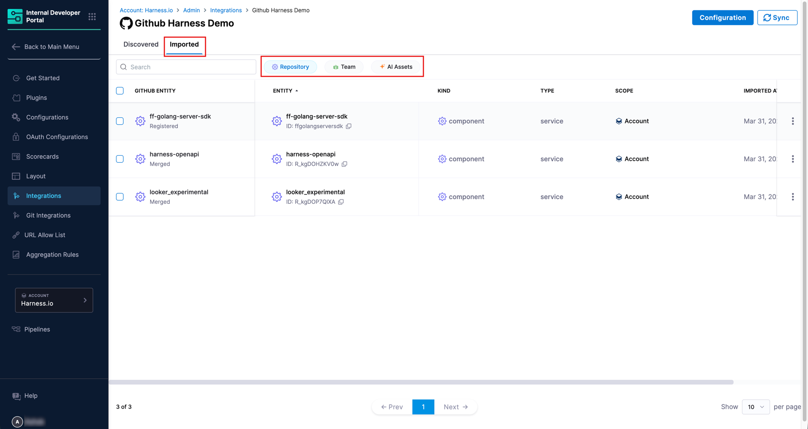

Figure 9: 'Imported' tab showing GitHub entities linked to catalog entities

It displays the following data:

| Column | Description |
|---|---|
| **GitHub Entity** | The name of the entity from GitHub, along with its import status (for example, **Merged** or **Registered**). |
| **Entity** | The linked IDP catalog entity and its ID. |
| **Kind** | The catalog entity kind (e.g., `component` for repositories, `group` for teams, `aiasset` for AI assets). |
| **Type** | The catalog entity type (e.g., `service` for repositories, `team` for teams). |
| **Scope** | The Harness account scope the entity belongs to. |
| **Imported At** | The timestamp when the entity was imported. |

:::caution Unlink an Imported Entity
To stop syncing a specific entity without deleting the catalog entity, use the three-dot menu on any row and select **Unlink**. This stops sync updates while keeping the IDP entity and its existing data intact.
:::

---

## View GitHub Entities in the Catalog

Once imported, GitHub entities are available in the **Catalog** section of IDP as standard catalog entities.

Each imported GitHub repository is registered with:

* **Kind:** `Component`
* **Type:** `service`
* **Scope:** The Harness account the integration belongs to

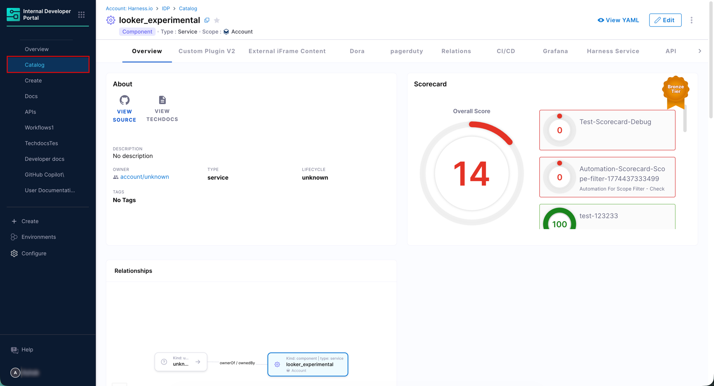

Figure 10: IDP Catalog Entity Page showing Service/Team/AI-Asset Relationship

Each imported GitHub team is registered with:

* **Kind:** `Group`
* **Type:** `Team`
* **Scope:** The Harness account the integration belongs to

Each imported AI asset is registered with:

* **Kind:** `aiasset`
* **Scope:** The Harness account the integration belongs to

Open any entity to view its Overview, Relationships, Scorecards, and any other tabs configured for your entity layout. The **Relationships** section reflects ownership links between AI assets, teams, and repositories as discovered from GitHub.

### Ingested Properties

To inspect the raw data ingested from GitHub, open the entity and click **View YAML** → **Ingested Properties** in the Entity Inspector.

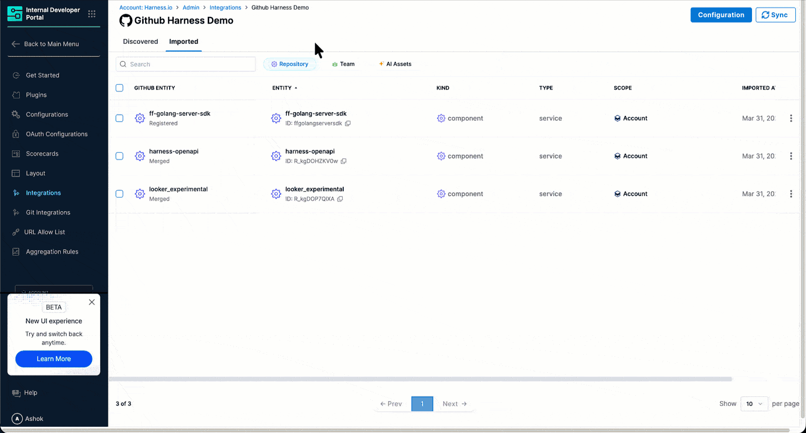

Figure 11: Entity Inspector Page showing Ingested Properties

Ingested properties are stored in two sections of the entity YAML:

* **`metadata.integration`** - Tracks which integrations are linked to this entity, including the entity action (e.g., `REGISTER` or `MERGE`) and the linked entity UUID for each integration instance.
* **`integration_properties.GitHub`** - Contains the GitHub-specific data for the entity, organized by entity type. For repository entities, this includes repository metadata such as name, URL, and associated teams. For team entities, this includes team membership and hierarchy data.

---

## Manage the GitHub Integration

### Edit the Integration

To update the integration name, switch the GitHub connector, or change the mapping and correlation settings, navigate to the **Integrations** page, find your GitHub integration card, and click **View**. From there, click **Configuration** to open the edit screen.

### Suspend Auto-Discovery

If auto-discovery is suspended, new entities will not appear in the **Discovered** tab. Existing imported entities remain unchanged in the catalog and the sync between GitHub and their corresponding IDP entities will stop.

To suspend auto-discovery:

1. Go to **Integrations** and open your GitHub integration using the **View** button.
2. Click **Configuration** at the top.
3. In the **Danger Zone** section, click **Suspend**.
4. Confirm the action.

You may re-enable it at any time by following the same steps.

---

## GitHub Permissions

The GitHub Integration connector supports three credential types. The table below summarizes the minimum permissions required for each. Detailed breakdowns follow.

| Credential Type | Minimum Permission |
|---|---|
| Classic Personal Access Token | `read:org` scope + SSO authorization (if applicable) |
| Fine-Grained Personal Access Token | Repository: Metadata (Read-only), Organization: Members (Read-only) |
| GitHub App | Repository: Metadata (Read-only), Organization: Members (Read-only) |

### Classic Personal Access Token

`read:org` (under `admin:org`) grants read access to organization and team membership, and org projects. This is the minimum scope needed for IDP to perform org-level discovery of repositories and teams.

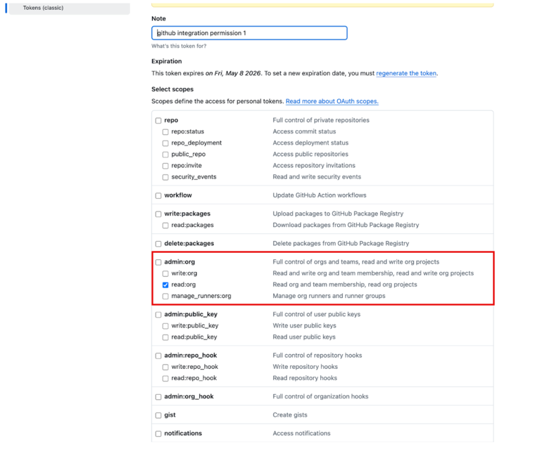

If your GitHub organization enforces SAML SSO, the token must also be explicitly authorized for that organization after it is generated. Without SSO authorization, org-level queries will fail even if `read:org` is selected.

To authorize: navigate to your token on the GitHub tokens page, click **Configure SSO**, and authorize the token for the relevant organization.

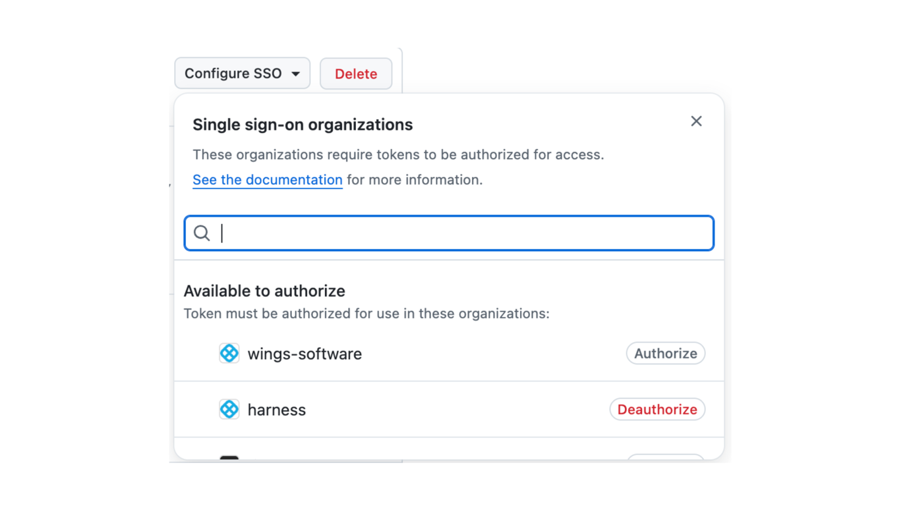

### Fine-Grained Personal Access Token

* **Repository access** must be set to **All repositories** so that IDP can discover all repositories in the organization. 

   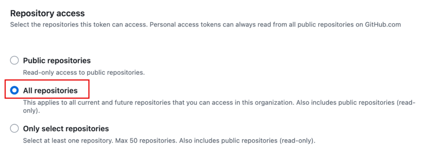

* Under the **Repositories** permission tab, set **Metadata** to `Read-only`.

   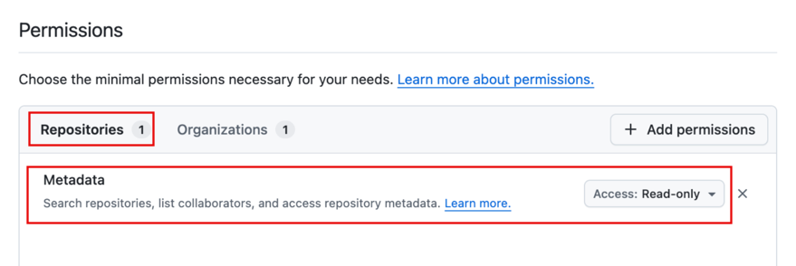

* Under the **Organizations** permission tab, set **Members** to `Read-only`.

   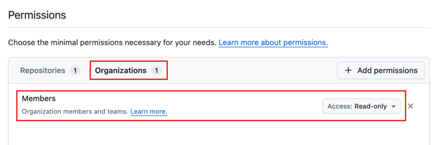

The **Resource owner** must be set to the **organization**, not a personal account. Fine-grained tokens are scoped to a single resource owner, so one token covers one organization. If you need to connect multiple GitHub organizations, create a separate token and a separate Harness connector for each.

### GitHub App

* When configuring the app, the **Permissions** section should show exactly 1 selected permission under both **Repository permissions** and **Organization permissions**.

   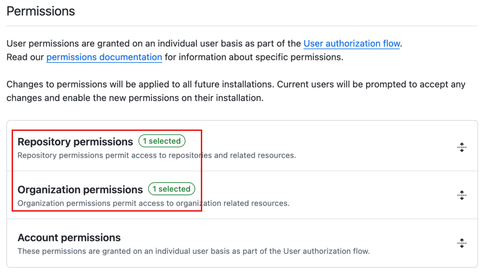

* Expanding each section, confirm that **Metadata** is set to `Read-only` under Repository permissions, and **Members** is set to `Read-only` under Organization permissions.

   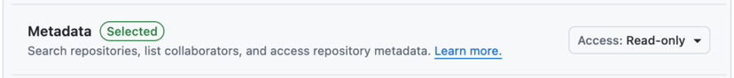

   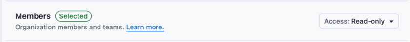

* The app must be installed on the organization for the permissions to take effect. Once installed, the app's permission summary on the org's installed apps page will confirm: `Read access to members and metadata`

   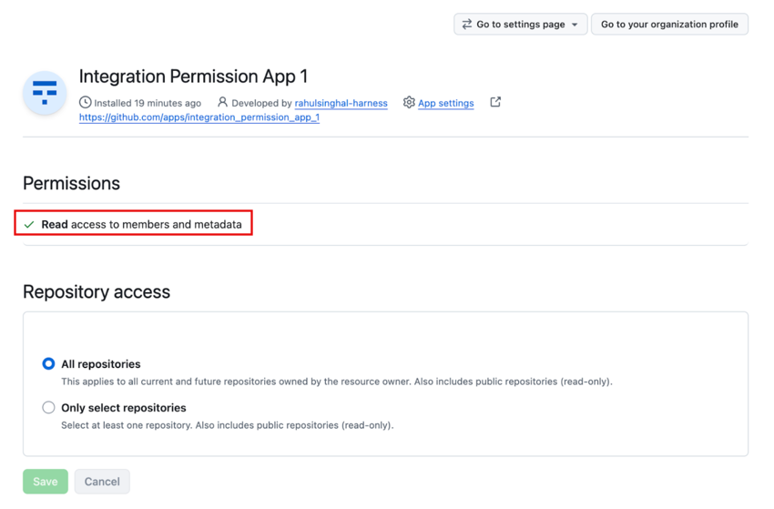
