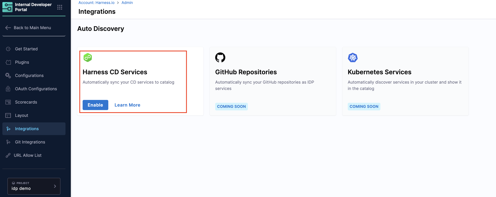
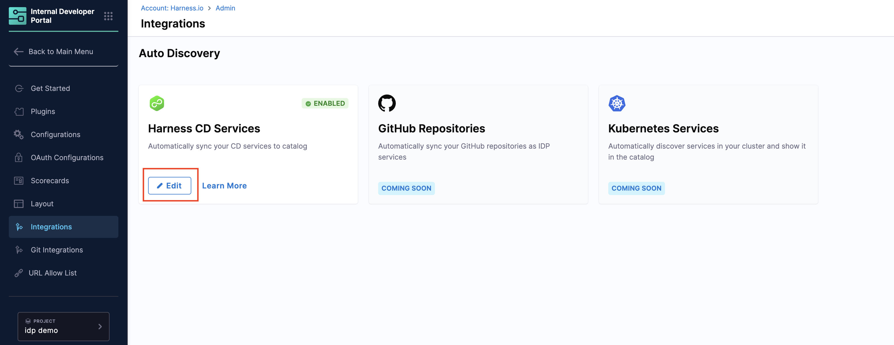
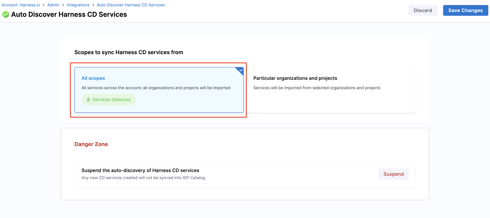
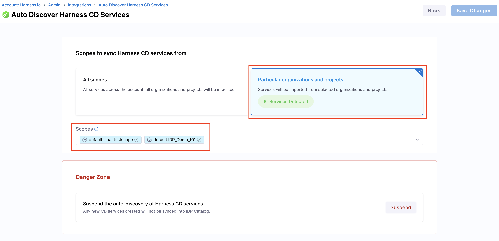
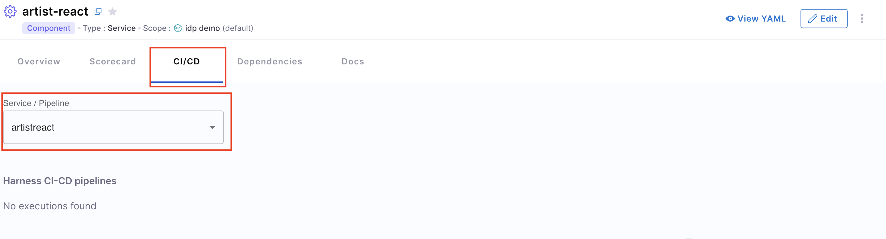
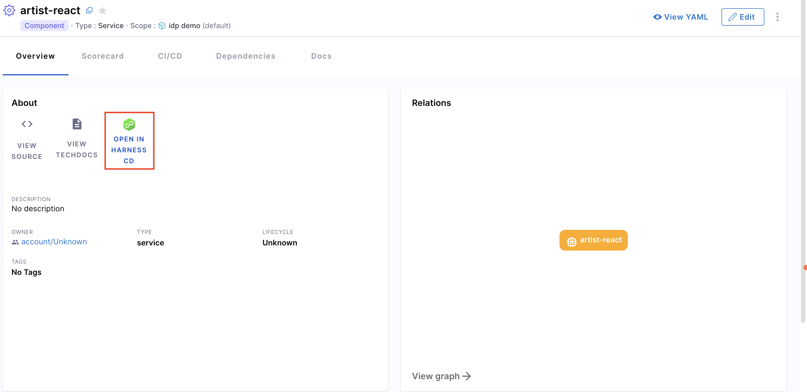
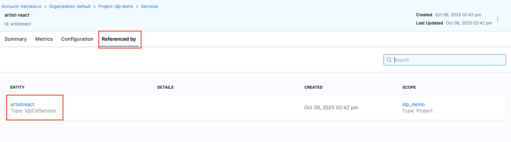
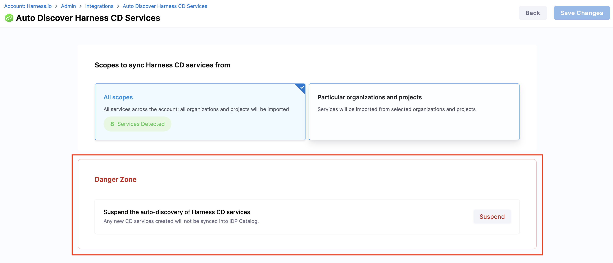

This document is a detailed guide on how to use the **Harness IDP Catalog Auto-Discovery** integration to sync **Harness CD** services into the **IDP Catalog**. This integration populates your Catalog with CD services so you can sync, view, and manage them directly in Catalog. Services are created as **IDP service entities** and kept in **real-time, uni-directional sync** with their corresponding CD services.

---

## Before you begin
Make sure the following prerequisites are met:

1. The feature flag **`IDP_CATALOG_CD_AUTO_DISCOVERY`** is enabled. Contact [Harness Support](mailto:support@harness.io) to enable it.
2. **Harness CD** is enabled for your account. This must be the **same account** you use for Harness IDP.
3. You have the required **RBAC permissions** to manage integrations. All operations for CD and Platform integrations require the **IDP Integration Edit** permission (`IDP_INTEGRATION_EDIT`) on the **IDP Integration** resource type (`IDP_INTEGRATION`).

---

## Catalog Auto-Discovery with Harness CD

### 1. Enable the Harness CD Auto-Discovery integration

1. In Harness IDP, go to **Configure** → **Integrations**.
2. On the **Harness CD services** integration card, select **Enable**.


### 2. Sync Harness CD services to the IDP Catalog

After enabling the integration, configure what to sync:

* **IDP entities created:**
  Each CD service appears in Catalog as an IDP entity with:

  * `kind: Component`
  * `type: Service`

* **Entity ID mapping:**
  - The IDP entity is created with the **same entity ID** as the CD service ID. 
  - **Scope restrictions apply**: The CD service and IDP entity must be in the same scope (account, organization, or project). 
  - If an IDP entity with the same CD service ID already exists (created manually), the system performs a **merge operation**:
    - The CD service gets linked to the existing IDP entity
    - Ingested metadata from the CD service is added
    - Other existing details in the IDP entity remain unchanged

* **Entity fields populated (read-only in IDP):**
  The following fields are fetched from the CD service and remain synced:

| **Harness CD Field** | **IDP Entity Field** | **Editable in IDP** |
|---------------------|---------------------|---------------------|
| Service Name | `metadata.name` | ❌ No (synced from CD) |
| Service Identifier | `metadata.identifier` | ❌ No (synced from CD) |
| Service Description | `metadata.description` | ❌ No (synced from CD) |
| Service Tags | `metadata.tags` | ❌ No (synced from CD) |
| Additional Metadata | Custom fields | ✅ Yes (IDP-specific) |

  **Important notes:**
  - **Description and Tags** from the CD service are synced to the IDP entity and cannot be edited in IDP. 
  - Once the link is established, the IDP entity will reflect the CD service's **name**, **description**, and **tags**. 
  - If an IDP entity already has description or tags before linking, the **CD service values take precedence** and overwrite them. 
  - To update these fields, make changes in Harness CD; they will automatically sync to IDP. 
  - **IDP-CD Service Sync:** Sync is **uni-directional** from **CD service → IDP entity**. Changes made to the IDP entity are **not** propagated back to the CD service.
  - **RBAC:** You can view and sync services from the same projects and organizations you have access to in Harness CD.


#### Configure the sync scope

1. On the same integration card, select **Edit**.

2. Choose a scope:

   * **All Scopes** — Sync services across the entire account (all organizations and projects).
   
   * **Particular Organizations & Projects** — Sync from selected organizations and/or projects using the dropdown.
   
3. Select **Save Changes** to begin syncing.

:::info Changing Scope Filters
If you remove a project or organization from the sync scope:
- **Existing linked entities** from that project/org will remain in the IDP Catalog unchanged. 
- These entities will **stop receiving updates** from their corresponding CD services. 
- The link between the CD service and IDP entity remains, but sync is paused. 
- To resume sync, add the project/org back to the scope filter.
:::

That’s it; your CD services will appear in the IDP Catalog.

For suspending auto-discovery, see [Suspend Auto-Discovery](/docs/internal-developer-portal/catalog/create-entity/catalog-discovery/harness-cd.md#4-suspend-auto-discovery).

### 3. View & manage CD services in the IDP Catalog

Once synced, search for any CD service in **IDP Catalog**:

* Open the entity to view all data synced from the CD service.
* The **CI/CD** plugin is automatically configured for the entity.

* Use **Open in Harness CD** on the entity overview to navigate to the service in CD.


#### Check the IDP entity reference in Harness CD

* In **Harness CD**, open the relevant CD service.
* Go to the **Referenced by** section.
* From there, open the corresponding IDP entity.


### 4. Suspend Auto-Discovery
**What happens when auto-discovery is suspended:**
- **New CD services** will not be automatically created as IDP entities. 
- **Existing IDP entities** that were created through auto-discovery will remain unchanged. 
- The sync between existing CD services and their corresponding IDP entities will stop. 

To stop auto-discovery:

1. Go to **Configure** → **Integrations** → **Harness CD**, then select **Edit**.
2. Enable **Suspend Auto-discovery** and select **Save Changes**.


Auto-discovery is now suspended.

---

## CD Auto-Discovery with IDP_INTEGRATIONS Feature Flag

:::info
This enhanced CD Auto-Discovery experience requires the **`IDP_INTEGRATIONS`** feature flag to be enabled. Contact [Harness Support](mailto:support@harness.io) to enable it.
:::

When the `IDP_INTEGRATIONS` feature flag is enabled, the CD Auto-Discovery integration transforms into a more powerful workflow with enhanced discovery and management capabilities for CD services.

### What changes with the IDP_INTEGRATIONS feature flag?

The CD Auto-Discovery workflow becomes more comprehensive with new capabilities:

**Enhanced discovery and management:** Instead of services being automatically imported, you now have a **Discovered** tab where all CD services appear first. Use the **Sync Services** button to manually refresh and fetch the latest services within your configured scope. From here, you can review each service (seeing its name, kind, type, scope, and available actions) and decide whether to **register it as a new entity** or **merge it with an existing catalog entity**. This gives you complete control over how services are brought into your catalog. Once you import services (individually or in bulk), they move to the **Imported** tab for easy management.

<DocImage path={require('./static/sync.png')} alt="Sync Services" title="Click to view full size image" />

**Entity sync behavior:** CD services sync the same fields as before (name, identifier, description, tags), but with the enhanced workflow you get more visibility into the sync process. If an entity with the same CD service ID already exists, the system performs a merge operation automatically. You can view which entities are linked to which CD services in the Imported tab.

**Flexible import options:** You can import services one at a time or select multiple services for bulk import. There's also an **Auto-import toggle** that automatically imports all future discovered services, giving you the choice between manual curation and automatic syncing.

<DocImage path={require('./static/import-toggle.png')} alt="Import Toggle" title="Click to view full size image" />

**Register vs Merge:** For each discovered service, choose how to bring it into your catalog. **Register** creates a fresh catalog entry, while **Merge** links the CD service to an existing entity, combining information from both sources. This is particularly useful when you already have catalog entities defined and want to enrich them with CD service data.

**Imported services management:** The **Imported** tab shows all services that have been brought into your catalog, displaying the relationship between CD services and IDP entities. You can unlink services at any time using the three-dot menu, which stops sync updates while keeping the IDP entity intact.

<DocImage path={require('./static/imported.png')} alt="Imported Services" title="Click to view full size image" />

**Configuration changes:** When configuring the sync scope, you'll use the **Configuration** button instead of **Edit**, and confirm changes with **Confirm** instead of **Save Changes**. The scope selection options remain the same (All Scopes or specific organizations/projects), but you can now also select specific account-level entities.

In addition to scope selection, you can now configure **DORA metrics settings**:
- Set the **deployment cycle period** (in days) to define the time window for calculating DORA metrics
- Once configured, DORA metrics from CD (deployment frequency, lead time, change failure rate, and mean time to recovery) will be automatically sent to the catalog entity

<DocImage path={require('./static/config.png')} alt="Configuration" title="Click to view full size image" />

### Ingested Properties

To inspect the raw data ingested from Harness CD, open the entity and click **View YAML** → **Ingested Properties** in the Entity Inspector.

<DocImage path={require('./static/harnesscd-ingested-properties.gif')} alt="Ingested Properties of HarnessCD" title="Click to view full size image" />

Ingested properties are stored in two sections of the entity YAML:

* **`metadata.integration`** - Tracks which integrations are linked to this entity, including the entity action (e.g., `MERGE`) and the linked entity UUID for each integration instance.
* **`integration_properties.HarnessCD`** - Contains the DORA metrics synced from the CD service. Fields include `changeFailureRatePercent`, `deploymentFrequencyPerSprint`, etc.

:::info Field Path Update for Old Users
Prior to this change, these fields were available directly under `metadata` (e.g., `metadata.deploymentFrequencyPerSprint`). They have been moved to `metadata.integration_properties.HarnessCD`. Update any existing layout YAML to use the new paths.
:::

#### Surfacing DORA metrics (synced from a CD integration)

To display DORA metrics on the catalog entity page, add a `StatsCardGroup` component to your [catalog layout](/docs/internal-developer-portal/layout-and-appearance/catalog) using the `metadata.integration_properties.HarnessCD` field paths:

```yaml
- component: StatsCardGroup
  specs:
    props:
      title: CD Dora Metrics
      cards:
        - title: Deployment Frequency
          value: <+metadata.integration_properties.HarnessCD.deploymentFrequencyPerSprint>
        - title: Change Failure Rate
          value: <+metadata.integration_properties.HarnessCD.changeFailureRatePercent>
```

---

:::info Scope Filter Changes
If you remove a project or organization from the sync scope, existing linked entities from that scope remain in your catalog unchanged but stop receiving updates. The link between the CD service and IDP entity remains active but sync is paused. To resume sync, add the scope back to the filter.
:::

**Suspend behavior:** When you suspend auto-discovery with the `IDP_INTEGRATIONS` feature flag enabled, new CD services won't appear in the Discovered tab, and the Discovered tab won't refresh automatically. Existing entities remain unchanged, and you can re-enable auto-discovery at any time.

**Additional RBAC requirement:** All operations for CD Auto-Discovery with the `IDP_INTEGRATIONS` feature flag require the **IDP Integration Edit** permission (`IDP_INTEGRATION_EDIT`) on the **IDP Integration** resource type.

---


