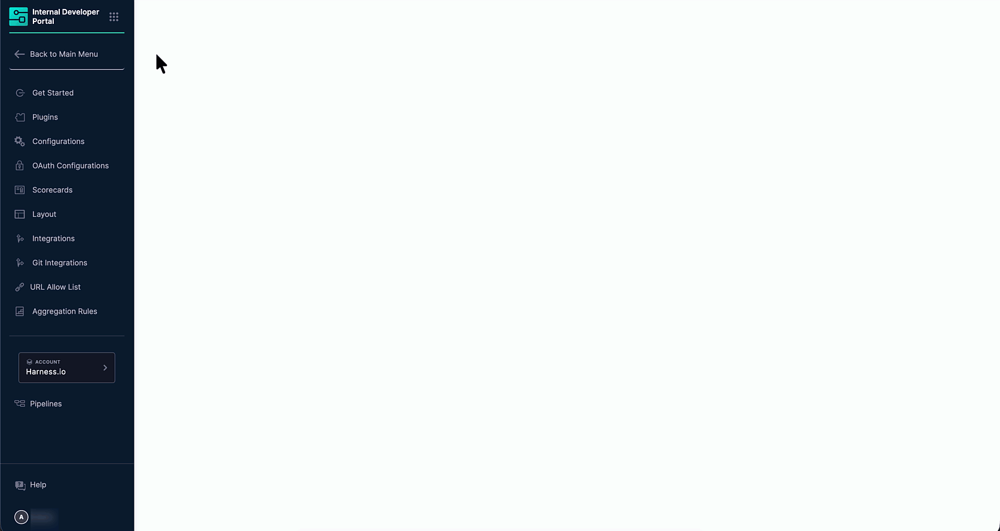
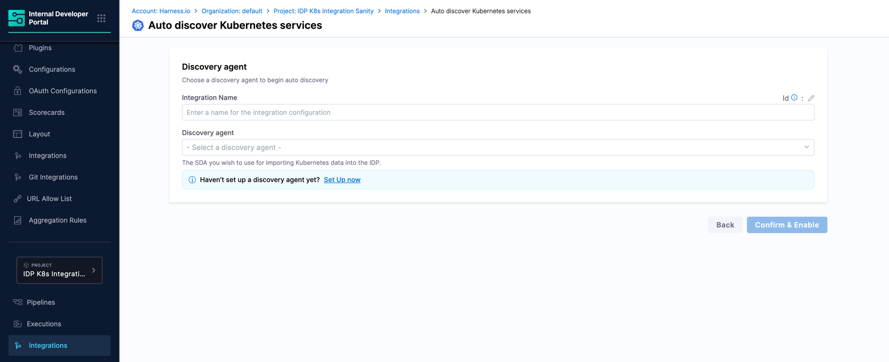
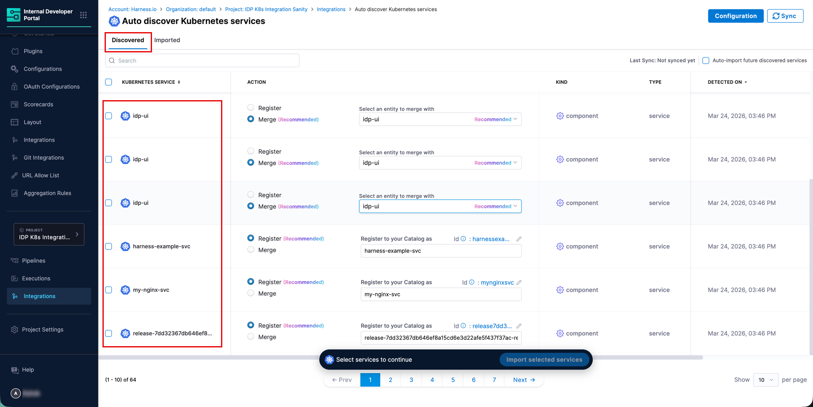
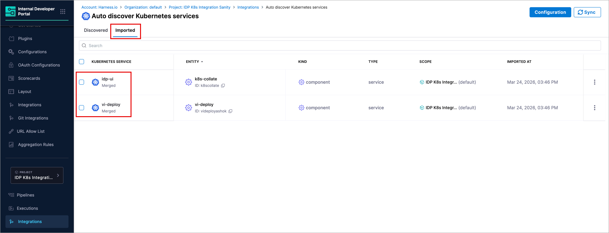
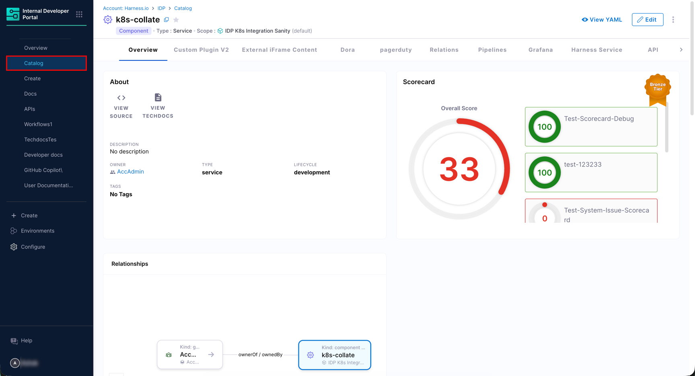
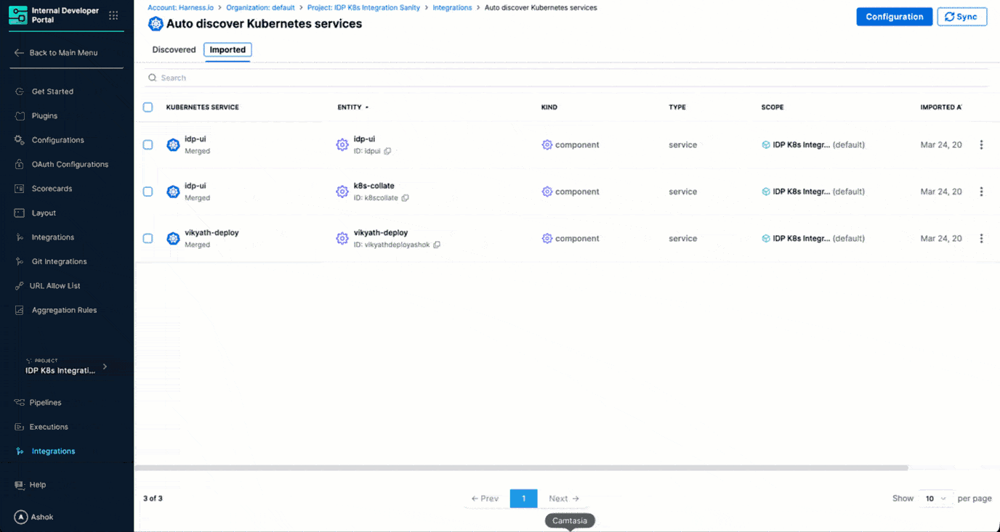

The Kubernetes integration automatically discovers services running in your Kubernetes cluster and brings them into the IDP Catalog. Once discovered, services can be registered as new catalog entities or merged into existing ones, enriching them with Kubernetes-sourced metadata for service discovery and dependency mapping.

---

## Before you begin

The following are needed to get the integration running:

* The feature flag `IDP_CATALOG_CD_AUTO_DISCOVERY` is enabled. Contact [Harness Support](mailto:support@harness.io) to enable it.
* You have the required RBAC permissions to manage integrations. All integration operations require the `IDP_INTEGRATION_EDIT` permission on the `IDP_INTEGRATION` resource type.
* A [Self-hosted Discovery Agent (SDA)](/docs/platform/service-discovery/customize-agent/) is installed and running in your Kubernetes cluster with permissions to list and watch services and deployments in the target namespaces.

---

## Enable the Kubernetes Integration

:::info
The Kubernetes integration is currently available at the **Project** level only. Navigate to a specific project to add or manage Kubernetes integrations.
:::

### 1. Navigate to the Integrations Page

This section is intended to take you to the Kubernetes integration at the project level.

1. In Harness, open the **Internal Developer Portal**.

2. From the left sidebar, click **Configure**.

3. In the left sidebar, switch the scope to your target project.

   
   
Figure 1: Navigation Path of Kubernetes Integration

4. In the left navigation menu under the project section, click **Integrations**.

5. On the Integrations page, click **+ New Integration** at the top.

6. Select **Kubernetes**. You will be taken to the **Auto discover Kubernetes services** page to [choose a discovery agent](#2-choose-a-discovery-agent).

### 2. Choose a Discovery Agent

This section is intended to help you attach a discovery agent required to pull information about your Kubernetes services into the IDP.

Figure 2: Select a Service Discovery Agent

1. Enter a name in the **Integration Name** field. This name appears on the integration card on the **Integrations** page (e.g., `PreQA GCP K8s Integration`).

2. Click the **Discovery agent** dropdown and select the Service Discovery Agent (SDA) you want to use to import Kubernetes data into the IDP (for example, `DA-Infra1`).

:::tip Need help with setting up a Discovery Agent?
If no discovery agents appear in the dropdown, you haven't set up a Service Discovery Agent (SDA) yet. Click the **Set Up now** link on the configuration screen to register a new agent. You will be prompted to provide an agent name, select or create a Kubernetes connector pointing to your cluster, and specify the namespace where the agent will run. A Kubernetes manifest file is generated for you to install the agent in your environment. Click [Customize Discovery Agent](/docs/platform/service-discovery/customize-agent/) to know more.
:::

3. Once both fields are filled, click **Confirm & Enable** and a dialog box will appear to confirm before applying the changes.

The integration is now enabled. The SDA begins scanning the connected Kubernetes cluster, and discovered services appear in the [**Discovered** tab](#discovered-tab).

---

## Discover and Import Kubernetes Services

This section covers how you can view the Kubernetes services found by the discovery agent and display them in your IDP catalog.

### Discovered tab

After the integration runs, all services detected by the SDA appear in the **Discovered** tab. If the services do not update, use the **Sync** button at the top right to manually refresh and fetch the latest services from the cluster.

   
   
Figure 3: 'Discovered' tab showing the K8s services

For each discovered service, you can see its name, kind, and the date it was detected. You can choose how to bring the services into the IDP Catalog using one of the following methods:

* **Register** - Creates a new catalog entity populated with the Kubernetes service metadata. Use this for services that do not yet exist in the catalog.
* **Merge** *(Recommended)* - Links the discovered service to an existing catalog entity, enriching it with Kubernetes metadata. If IDP already has an entity with a matching name, the **Merge** option is pre-selected and the matching entity is suggested automatically. Existing entity data is preserved and the Kubernetes data is layered on top.

:::tip Bulk Import and Auto Import Options
* **Bulk Import** - You can import services one at a time or select multiple services for bulk import using the checkboxes. A selection widget at the bottom shows the count of selected services and an **Import selected services** button.

* **Auto Import** - When you click **Import selected services**, you will be prompted to enable **Auto-import future discovered services**. Turn this on to automatically import all future services without manual review. You can change this preference at any time.
:::

### Imported tab

The **Imported** tab displays all the services you have brought into the catalog.

   
   
Figure 4: 'Imported' tab showing the K8s services linked to the catalog entities

It displays the following data:

| Column | Description |
|---|---|
| **Kubernetes Service** | The name of the service from the cluster, along with its import status (for example, **Merged**). |
| **Entity** | The linked IDP catalog entity and its ID. |
| **Kind** | The catalog entity kind (e.g., `component`). |
| **Type** | The catalog entity type (e.g., `service`). |
| **Scope** | The Harness project scope the entity belongs to. |
| **Imported At** | The timestamp when the service was imported. |

:::tip Unlink an Imported Service
To stop syncing a specific service without deleting the catalog entity, use the three-dot menu on any row and select **Unlink**. This stops sync updates while keeping the IDP entity and its existing data intact.
:::

---

## View Kubernetes Services in the Catalog

Once imported, services are available in the **Catalog** section of IDP as standard catalog entities.

   
   
Figure 5: IDP Catalog Entity Page showing Service Relationship

Each imported Kubernetes service is registered with:

* **Kind:** `Component`
* **Type:** `Service`
* **Scope:** The Harness project the integration belongs to

Open any entity to view its Overview, Relationships, Scorecards, and any other tabs configured for the entity layout. The **Relationships** section reflects service dependencies discovered from the cluster.

### Ingested Properties

To inspect the raw data ingested from Kubernetes, open the entity and click **View YAML** → **Ingested Properties** in the Entity Inspector.

   
   
Figure 6: Entity Inspector Page showing Ingested Properties

Ingested properties are stored in two sections of the entity YAML:

* **`metadata.integration`** - Tracks which integrations are linked to this entity, including the entity action (`MERGE`) and the linked entity UUID for each integration instance.
* **`integration_properties.HarnessK8s`** - Contains the Kubernetes-specific data, organized by environment. For each environment, it lists the services you [imported](#imported-tab) to the catalog, including details like `kind`, `replicas`, `namespace`, and `name`.

---

## Manage the Kubernetes Integration

### Edit the integration

To update the integration name or switch to a different discovery agent, navigate to **Integrations** in your project, find the Kubernetes integration card, and click **View**. From there, click **Configuration** to open the edit screen.

### Suspend Auto-Discovery

If auto-discovery is suspended, new services will not be surfaced in the **Discovered** tab. Existing imported entities remain unchanged in the catalog. In other words, the sync between the Kubernetes services and their corresponding IDP entities will stop.

To suspend auto-discovery:

1. In your project, go to **Integrations** and open your Kubernetes integration using the **View** button.
2. Click **Configuration** at the top.
3. In the **Danger Zone** section, click **Suspend**.
4. Confirm the action.

You may re-enable it at any time by following the same steps.
