The PagerDuty integration automatically discovers services and teams from your PagerDuty account and brings them into the IDP Catalog. Once discovered, entities can be registered as new catalog entries or merged into existing ones, enriching them with PagerDuty-sourced metadata such as on-call schedules, incident analytics, and team ownership.

For each entity type, the integration collects the following:

| Entity | What it provides |
|---|---|
| **Service** | Total incidents, mean time to first acknowledgment, mean time to resolve, on-call responders, and linked PagerDuty teams. |
| **Team** | Team-level incident analytics and team identifiers. |

---

## Before you begin

The following are needed to get the integration running:

* Ensure the feature flags `IDP_CATALOG_CD_AUTO_DISCOVERY` and `IDP_INTEGRATIONS` are enabled. Contact [Harness Support](mailto:support@harness.io) to enable them.
* You have the required RBAC permissions to manage integrations. All integration operations require the `IDP_INTEGRATION_EDIT` permission on the `IDP_INTEGRATION` resource type.
* A [PagerDuty connector](https://youtu.be/QE8dFDeK8Vs) is configured in Harness with the credentials needed to access your PagerDuty account. You can also add the connector during the setup of PagerDuty Integration.

:::info Proxy Configuration
If your environment blocks outbound third-party traffic and routes it through a proxy, you will need to configure proxy settings on your Harness Delegate. Once configured there, the proxy settings are automatically picked up by IDP integrations. No additional setup is needed on the integration side. 

Here is how to set it up: [Configure delegate proxy settings](/docs/platform/delegates/manage-delegates/configure-delegate-proxy-settings)
:::

---

## Enable the PagerDuty integration

:::info
The PagerDuty integration is currently available at the **Account** level only. Navigate to the Account scope of the Internal Developer Portal to add or manage PagerDuty integrations.
:::

### 1. Navigate to the integrations page

1. In Harness, open the **Internal Developer Portal**.

2. From the left sidebar, click **Configure**.

3. In the left navigation menu, click **Integrations**.

   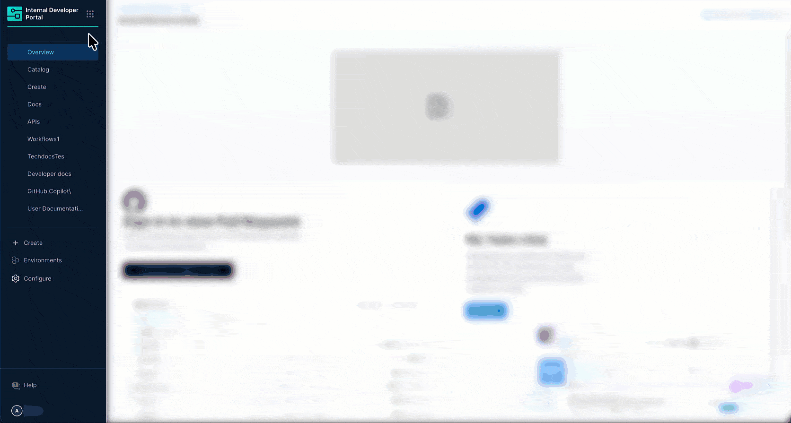
   <center>Figure 1: Navigation Path of PagerDuty Integration</center>

4. On the Integrations page, click **+ New Integration** at the top.

5. Select **PagerDuty** from the integration type picker. You will be taken to the **Auto Discover PagerDuty Integration** page.

### 2. Configure setup & connectivity

This section connects Harness IDP to your PagerDuty account.

1. Enter a name in the **Integration Name** field. This name appears on the integration card on the **Integrations** page (e.g., `PagerDuty Production`).

2. Click the **Choose PagerDuty connector** dropdown and select the PagerDuty connector you want to use to pull data into the IDP.

   :::info Do not have a PagerDuty connector yet?
   If no connectors appear in the dropdown, you need to first create a PagerDuty connector in Harness. Navigate to **Account Settings** → **Connectors** and create a new PagerDuty connector by providing your PagerDuty API key. Once saved, it will appear in the dropdown here.

   <DocVideo src="https://www.youtube.com/embed/QE8dFDeK8Vs" />
   :::

### 3. Configure mapping & correlation

This section defines how PagerDuty entities are mapped to IDP catalog entities and how they are correlated with existing records.

The integration supports two entity types: **Service Entity** and **Team Entity**, each with its own toggle, registration behavior, and field configuration.

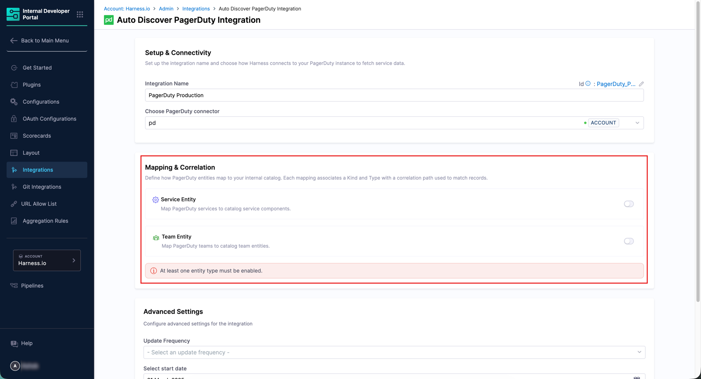
<center>Figure 2: Available Entities - Service and Team</center>

#### Service entity

The Service Entity mapping imports PagerDuty services as catalog components.

1. Ensure the **Service Entity** toggle is turned on.

2. Under **Entity Registration Behavior**, choose how services are brought into the catalog:
   * **Register & Merge** *(Default)* - Registers new entities and updates existing ones when a match is found. This is the recommended option for most setups.
   * **Register** - Creates new catalog entities from PagerDuty. Does not merge with existing entities.
   * **Merge** - Links discovered services to existing catalog entities. Matching entities are recommended automatically, but you can choose a different one.

      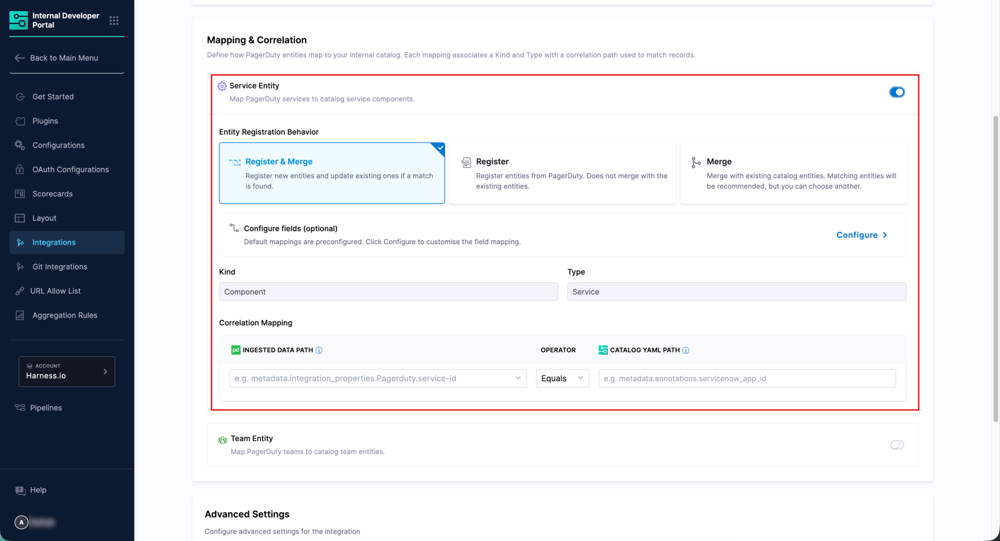
      <center>Figure 3: Enable Service Entity</center>

3. The default **Kind** is `Component` and **Type** is `Service`. These are pre-configured and apply to all PagerDuty service imports.

4. Under **Correlation Mapping**, set the **Ingested Data Path** (from PagerDuty) and the corresponding **Catalog YAML Path** (from your IDP entity) to define how records are matched. The operator defaults to `Equals`. Check the example shown below:

   | Ingested Data Path | Operator | Catalog YAML Path |
   |---|---|---|
   | `metadata.integration_properties.PagerDuty.identifier` | Equals | `metadata.annotations.pagerduty_service_id` |


5. Optionally, click **Configure** next to **Configure fields** to customize which PagerDuty fields are synced to the catalog. By default, all available fields are selected. 

   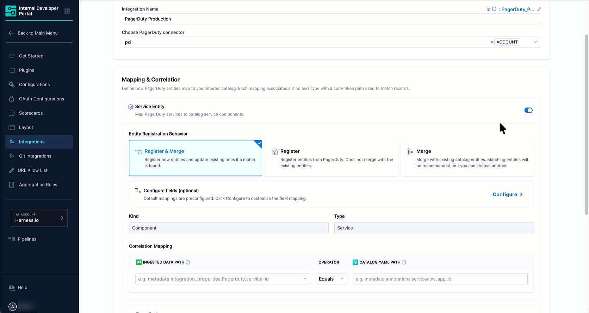
   <center>Figure 4: Service Entity Configuration</center>

   The available PagerDuty service fields include:
 
   | PagerDuty Field | Description |
   |---|---|
   | `analyticsMeanSecondsToFirstAck` | Mean time to first acknowledgment (in seconds). |
   | `analyticsMeanSecondsToResolve` | Mean time to resolve an incident (in seconds). |
   | `analyticsTotalIncidents` | Total number of incidents for the service. |
   | `onCallName` | The name of the on-call responder currently assigned to the service. |
   | `pagerdutyStatus` | The current status of the PagerDuty service. |
   | `teams` | The PagerDuty teams associated with the service, including team URLs and metadata. |
   | `ownedBy` | Maps to the catalog `ownedBy` field, linking the service to its owning team entity. |

#### Team entity

The Team Entity mapping imports PagerDuty teams as catalog group entities.

1. Ensure the **Team Entity** toggle is turned on.

2. Under **Entity Registration Behavior**, choose the registration behavior as described above for [Service Entity](#service-entity).

   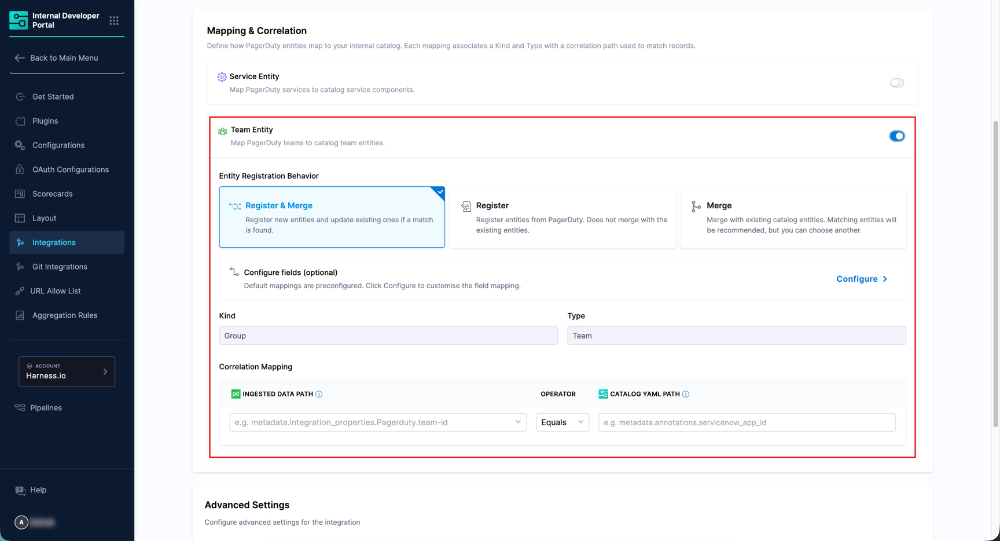
   <center>Figure 5: Enable Team Entity</center>

3. The default **Kind** is `Group` and **Type** is `Team`.

4. Configure the **Correlation Mapping** fields as needed.

5. Optionally, click **Configure** next to **Configure fields (optional)** to customize the field mapping. 

   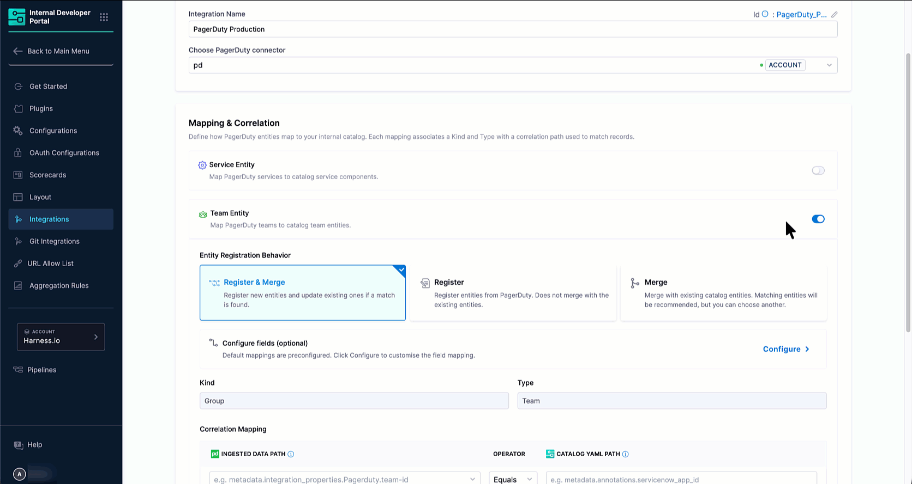
   <center>Figure 6: Team Entity Configuration</center>

   The available PagerDuty fields include:
 
   | PagerDuty Field | Description |
   |---|---|
   | `analyticsMeanSecondsToFirstAck` | Mean time to first acknowledgment (in seconds). |
   | `analyticsMeanSecondsToResolve` | Mean time to resolve an incident (in seconds). |
   | `analyticsTotalIncidents` | Total number of incidents for the team. |
   | `defaultRole` | The default role assigned to team members. |
   | `name` | Maps to the catalog `name` field, setting the team entity's display name. |

### 4. Configure advanced settings

The **Advanced Settings** section controls how frequently IDP syncs with PagerDuty and how far back historical data is pulled.

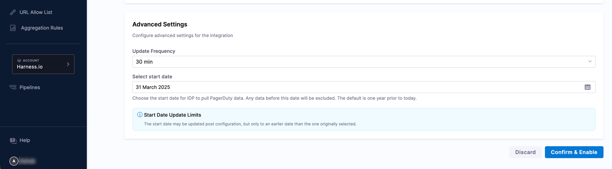
<center>Figure 7: Advanced Settings</center>

1. Select an **Update Frequency** from the dropdown to control how often IDP polls PagerDuty for new data. 

   Available options: `10 min`, `30 min`, `1 hour`, `3 hours`, `6 hours`, `12 hours`, `1 day`, `2 days`, `7 days`.

2. Set the **Select Duration** to define how far back IDP pulls service and team analytics data from PagerDuty. Available options: `1 month`, `2 months`, `3 months`, `4 months`, `5 months`, `6 months`. Note that for incidents, the duration is always 1 month regardless of this setting.

3. Once all sections are configured, click **Confirm & Enable**. A confirmation dialog will appear before the changes are applied.

The integration is now enabled and IDP begins syncing data from PagerDuty. Discovered services and teams appear in the [**Discovered** tab](#discovered-tab).

---

## Discover and import PagerDuty entities

This section covers how to view the PagerDuty entities discovered by the integration and import them into your IDP Catalog.

### Discovered tab

After the integration runs, all PagerDuty services and teams detected appear in the **Discovered** tab. Use the **Service** and **Team** sub-tabs to switch between entity types. If entities do not appear, use the **Sync** button at the top right to manually refresh.

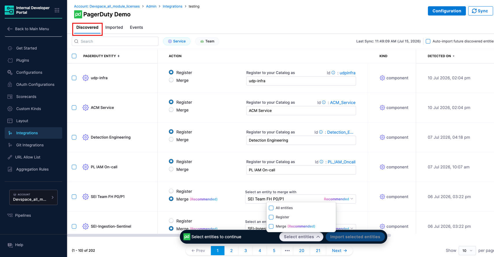
<center>Figure 8: 'Discovered' tab showing the PagerDuty Services and Teams</center>

For each discovered entity, you can see its name, the recommended catalog action, kind, type, and the date it was detected. You can choose how to bring entities into the catalog using one of the following actions:

* **Register** *(shown as Recommended when no matching catalog entity exists)* - Creates a new catalog entity populated with the PagerDuty metadata.
* **Merge** - Links the discovered entity to an existing catalog entity, enriching it with PagerDuty data. If IDP finds a catalog entity with a matching name, the **Merge** option is pre-selected and the suggested entity is shown automatically.

:::tip Bulk Import and Auto Import Options
* **Bulk Import** - Select multiple entities using the checkboxes and click **Import selected entities** at the bottom of the page to import them all at once. The selection widget shows a count of selected entities.
* **Auto Import** - Toggle **Auto-import future discovered services** in the top right of the Discovered tab to automatically import all future entities without manual review. You can change this preference at any time.
:::

### Imported tab

The **Imported** tab displays all PagerDuty entities that have been brought into the catalog. Use the **Service** and **Team** sub-tabs to view each entity type separately.

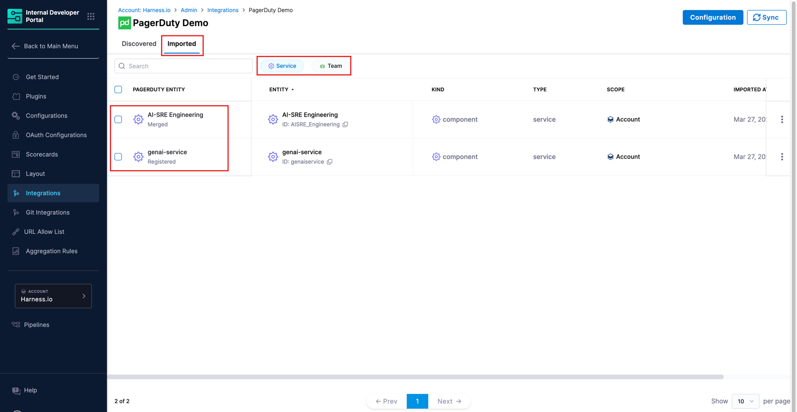
<center>Figure 9: 'Imported' tab showing the PagerDuty Services and Teams linked to the catalog entities</center>

It displays the following data:

| Column | Description |
|---|---|
| **PagerDuty Entity** | The name of the entity from PagerDuty, along with its import status (for example, **Registered**). |
| **Entity** | The linked IDP catalog entity and its ID. |
| **Kind** | The catalog entity kind (e.g., `component` for services, `group` for teams). |
| **Type** | The catalog entity type (e.g., `service` for services, `team` for teams). |
| **Scope** | The Harness account scope the entity belongs to. |
| **Imported At** | The timestamp when the entity was imported. |

:::caution Unlink an Imported Entity
To stop syncing a specific entity without deleting the catalog entity, use the three-dot menu on any row and select **Unlink**. This stops sync updates while keeping the IDP entity and its existing data intact.
:::

---

## View PagerDuty entities in the catalog

Once imported, PagerDuty entities are available in the **Catalog** section of IDP as standard catalog entities.

Each imported PagerDuty service is registered with:

* **Kind:** `Component`
* **Type:** `Service`
* **Scope:** The Harness account the integration belongs to

Similarly, each imported PagerDuty team is registered with:

* **Kind:** `Group`
* **Type:** `Team`
* **Scope:** The Harness account the integration belongs to

Open any entity to view PagerDuty-sourced data directly on the entity details page. This data is displayed through two dedicated UI components: a card on the **Overview** tab and an **Incidents** tab. Both require a one-time layout configuration, described in the [next section](#layout-for-pagerduty-components).

### Layout for PagerDuty components

To display PagerDuty data on the [entity details](/docs/internal-developer-portal/catalog/create-entity/entity-details) page, you need to add the two PagerDuty components to the relevant entity layout. This is a one-time configuration per entity kind and type.

1. From the left sidebar of IDP, go to **Configure** → **Layout** → **Catalog Entities**.
2. Edit the existing layout for your entity or create a new one.
3. Select the **Entity Kind** (e.g., `component`) and the **Entity Type** (e.g., `service`) that matches your imported PagerDuty entities.
4. In the YAML editor, add the `IntegrationsContent` component inside the **Overview** tab's `contents` block, and add a new **Incidents** tab using the `IncidentTabContent` component.

   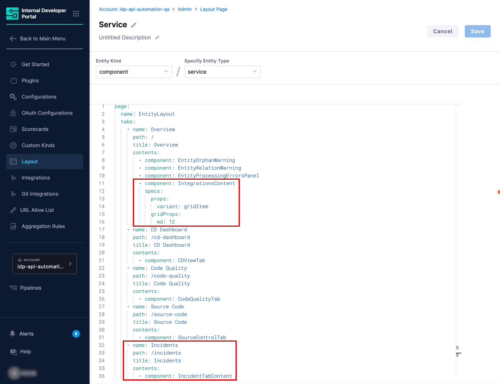
   <center>Figure 10: Layout configuration for PagerDuty cards in Overview tab and Incidents tab</center>

   The relevant YAML additions are:

   ```yaml title="Inside the Overview tab's contents block"
           - component: IntegrationsContent
             specs:
               props:
                 variant: gridItem
               gridProps:
                 md: 12
   ```
   ```yaml title="A new top-level tab entry"
       - name: Incidents
         path: /incidents
         title: Incidents
         contents:
           - component: IncidentTabContent
   ```

5. Click **Save** to apply the layout changes. The PagerDuty components will now appear on all entity detail pages of the selected kind and type that have PagerDuty data.


### Cards in overview tab

After the layout is configured, two cards `Incidents` and `On-Call` appear in the **Overview** tab of any entity that has PagerDuty data linked to it. The card displays the key PagerDuty metadata ingested for that entity, sourced from the entity's [ingested properties](#ingested-properties).

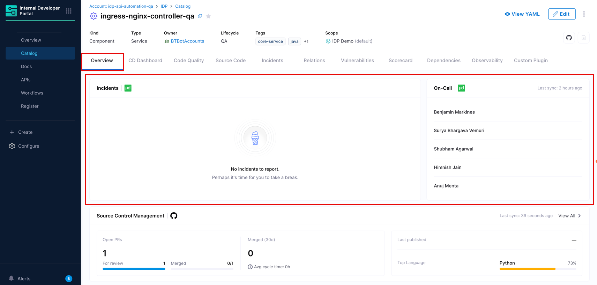
<center>Figure 11: PagerDuty Cards on the Overview tab</center>

If the PagerDuty integration has not been configured for the entity, the card shows a **Not configured** state with a link to the Integrations page. 

### Incidents tab

The **Incidents** tab provides a more complete view of the PagerDuty data for the entity. This tab fetches latest possible data using the integration ID and entity UUID.

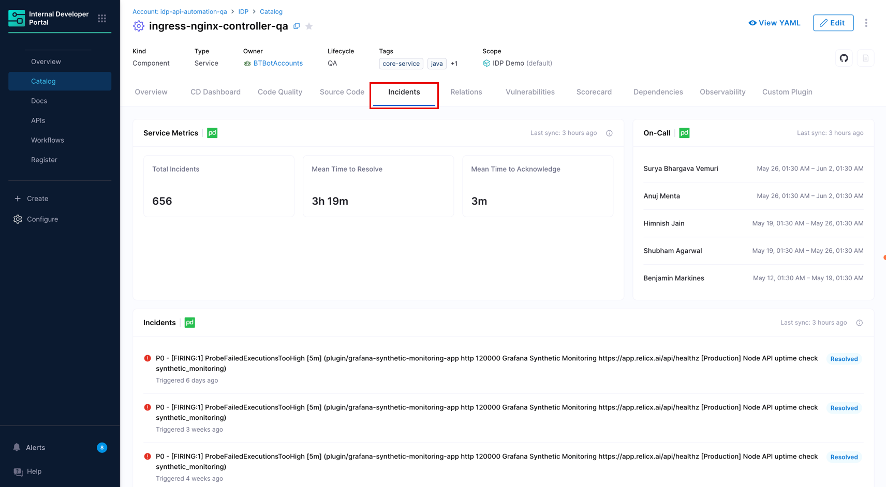
<center>Figure 12: Incidents tab showing full PagerDuty resource details</center>

:::tip Feature Highlights
* The tab shows all available fields for the resource type, including fields not present in the **Overview**.
* All the fields are dynamic.
* 'Service Metrics' card displays data from the date you configured the integration.
* 'On-Call' card displays data last synced from PagerDuty, based on your configured [update frequency](#4-configure-advanced-settings).
* 'Incidents' card lists all incidents (resolved, triggered, acknowledged) from 30 days before the integration was created. Incidents are retained for 6 months from their last update.
:::

### Ingested properties

To inspect the raw data ingested from PagerDuty, open the entity and click **View YAML** → **Ingested Properties** in the Entity Inspector.

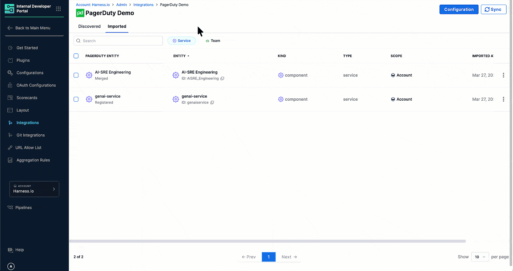
<center>Figure 13a: Entity Inspector Page showing ingested properties of Service Data</center>

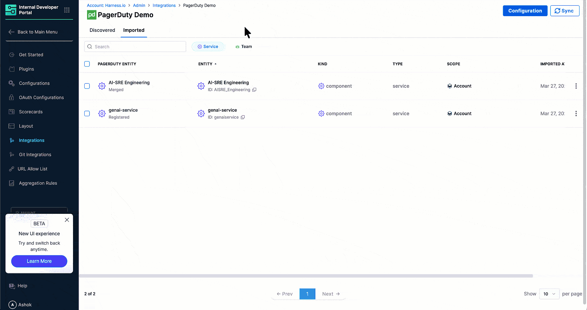
<center>Figure 13b: Entity Inspector Page showing ingested properties of Team Data</center>

Ingested properties are stored in two sections of the entity YAML:

* **`metadata.integration`** - Tracks which integrations are linked to this entity, including the entity action (e.g., `REGISTER`) and the linked entity UUID for each integration instance.
* **`integration_properties.PagerDuty`** - Contains the PagerDuty-specific data for the entity. For service entities, this includes fields like `analyticsMeanSecondsToFirstAck`, `analyticsMeanSecondsToResolve`, `analyticsTotalIncidents`, `identifier`, `name`, `onCallName`, and `teams` (with PagerDuty team URLs and metadata). For team entities, this includes analytics fields and the team identifier.

---

## Manage the PagerDuty integration

### Edit the integration

To update the integration name, switch the PagerDuty connector, or change the mapping and correlation settings, navigate to **Integrations** page, find your PagerDuty integration card, and click **View**. From there, click **Configuration** to open the edit screen.

### Suspend auto-discovery

If auto-discovery is suspended, new entities will not appear in the **Discovered** tab. Existing imported entities remain unchanged in the catalog and the sync between PagerDuty and their corresponding IDP entities will stop.

To suspend auto-discovery:

1. Go to **Integrations** and open your PagerDuty integration using the **View** button.
2. Click **Configuration** at the top.
3. In the **Danger Zone** section, click **Suspend**.
4. Confirm the action.

You may re-enable it at any time by following the same steps.
