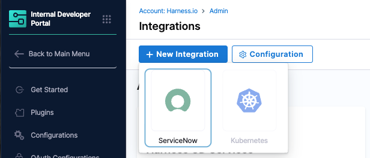
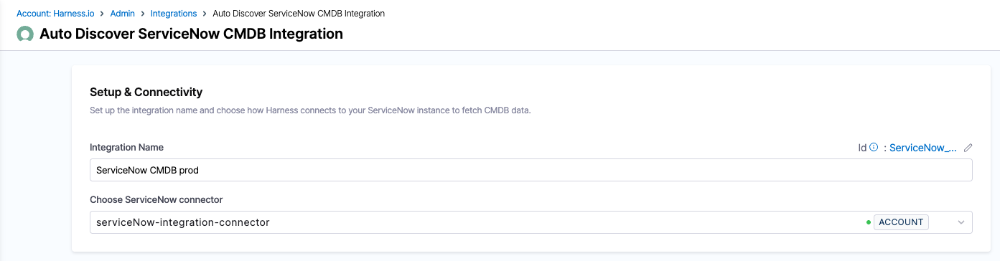
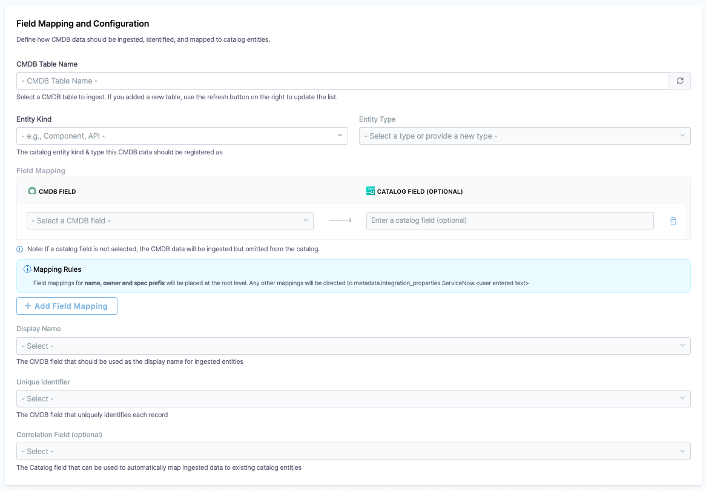
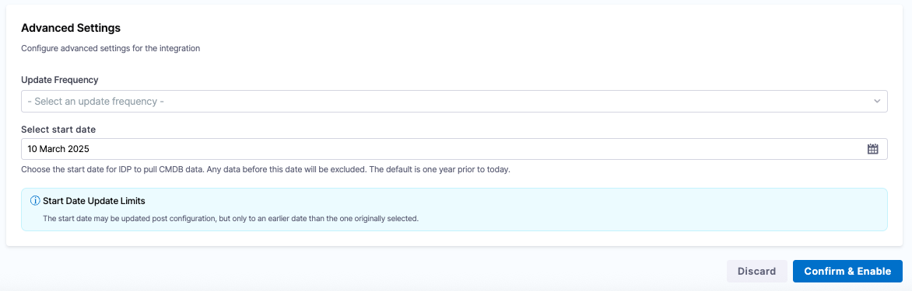

The ServiceNow CMDB integration syncs records from a ServiceNow CMDB table into the IDP Catalog. It uses configurable field mappings to control which CMDB columns are ingested and where they appear in the catalog entity YAML.

The integration syncs records from a configured CMDB table. The fields collected depend on your field mapping configuration. For example:

| Resource | What it provides |
|---|---|
| **CMDB Record** | Any mapped CMDB columns, such as lifecycle, MTTR, and service name, stored as catalog entity fields or custom properties under `spec.properties`. |

---

## Before you begin

The following are needed to get the integration running:

1. **Harness CD** is enabled for your account. This must be the **same account** you use for Harness IDP.
2. You have the required **RBAC permissions** to manage integrations. All operations for CD and Platform integrations require the **IDP Integration Edit** permission (`IDP_INTEGRATION_EDIT`) on the **IDP Integration** resource type (`IDP_INTEGRATION`).

:::info Proxy Configuration
If your environment blocks outbound third-party traffic and routes it through a proxy, you will need to configure proxy settings on your Harness Delegate. Once configured there, the proxy settings are automatically picked up by IDP integrations. No additional setup is needed on the integration side. 

Here is how to set it up: [Configure delegate proxy settings](/docs/platform/delegates/manage-delegates/configure-delegate-proxy-settings)
:::

---

## Enable and configure the ServiceNow CMDB integration

1. In Harness IDP, go to **Configure** → **Integrations**.
2. Click on **+New integration** and choose **ServiceNow**. This will take you to the **Configuration** page.

   

### Setup and connectivity

   

1. Enter a friendly name for the integration. This will be shown in the **Integrations** list card.
2. Select the Harness [ServiceNow connector](/docs/platform/connectors/ticketing-systems/connect-to-service-now) that is configured to access your ServiceNow instance. This connector is used to fetch table data from the CMDB. Note that we support username/password and OAuth authentication for this connector.

### Field mapping

   

1. **CMDB Table Name** -    Specify the name of the ServiceNow CMDB table from which records should be imported (for example, `cmdb_ci_service`).
2. **Entity Kind and Type** - Define the catalog entity `kind` (for example, `Component`) and `type` (for example, `Service`) that will be assigned to entities created or enriched from this integration.
3. **Field Mapping** - Field mapping defines how CMDB columns translate to catalog entity YAML fields. Each mapping entry consists of:

| Setting | Description |
|---------|-------------|
| **CMDB Column Name** | The column name in the ServiceNow CMDB table. |
| **Catalog YAML Field** | [optional] The target path in the catalog entity YAML (for example, `spec.lifecycle`, `spec.owner`, `metadata.name`). If not specified, the field will not be stored in the catalog but will be queryable through the API (coming soon). |

For example, you might configure:

| CMDB Column | Catalog YAML Field |
|-------------|-------------------|
| `life_cycle` | `spec.lifecycle` |
| `owner` | `spec.owner` |
| `service_name` | `metadata.name` |
| `mttr` | `spec.properties.mttr` |

Any CMDB field can be mapped to a standard catalog field or to a custom property under `spec.properties`.

4. **Display Name and Unique Identifier** - Configure which CMDB columns serve as the **display name** and **unique identifier** for discovered entities. These determine how entities are labeled and deduplicated in the Discovered tab.

5. **Correlation Field** - Set a **correlation field**, the catalog field used to automatically map discovered CMDB records to existing catalog entities. For example, setting the correlation field to `name` means the integration will look for existing catalog entities with a matching name and pre-select the **Merge** option for those matches.

#### Advanced settings
   

6. **Sync Schedule** - Configure when and how often the integration runs to fetch updated data from ServiceNow.

---

## Discover and import CMDB records

After the integration runs, discovered CMDB records appear in the **Discovered** tab.

If a correlation field is configured, matching catalog entities are automatically suggested as merge targets. For example, if your catalog already contains an entity named "IDP Service" (created via the Harness CD integration) and the ServiceNow CMDB also has a record named "IDP Service," the integration will automatically suggest merging the CMDB data into the existing entity.

For each discovered record:

- **Register**: Creates a new catalog entity populated with the mapped CMDB fields.
- **Merge**: Enriches an existing catalog entity with the mapped CMDB fields (for example, adding `lifecycle`, `owner`, and custom properties like `mttr`).

You have the option of turning on **Auto-import** for integrations. This will automatically import all discovered entities without needing the manual effort of reviewing discovered entities.

### Events tab

The **Events** tab logs all sync and lifecycle activity for this integration. Use it to verify that syncs are running, confirm that imports completed successfully, and investigate any failures.

For the full event type reference and detail panel fields, go to [Integration Events](/docs/internal-developer-portal/catalog/create-entity/catalog-discovery/integration-events).

---

## View ServiceNow data on a catalog entity

After merging, the catalog entity's Overview page displays:

- A **ServiceNow** integration card showing the CMDB-specific properties (for example, MTTR, CMDB table name). You might need to configure the layout to see this card. 
- Updated fields populated from the CMDB field mappings.
- The **Integrations** status card showing **ServiceNow: Connected**.
