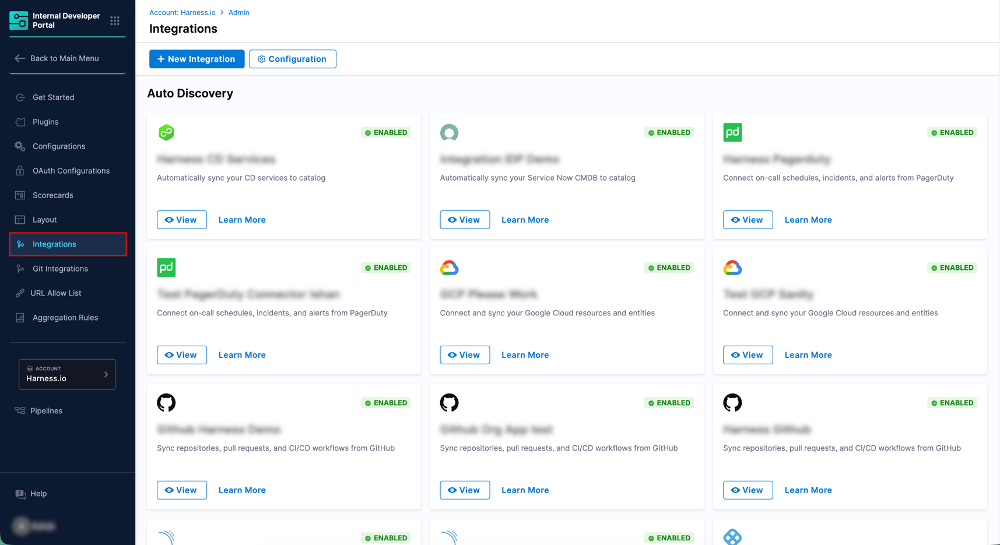
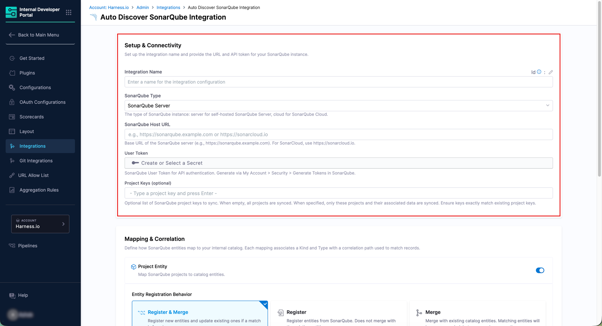
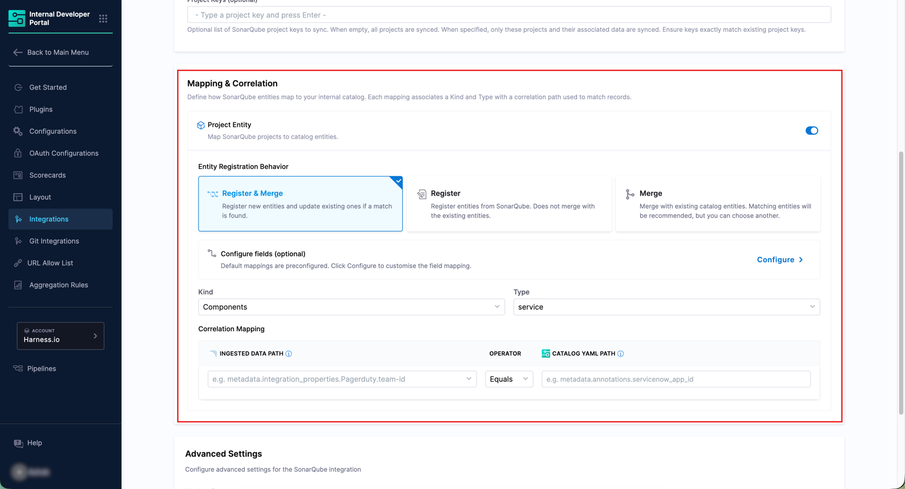
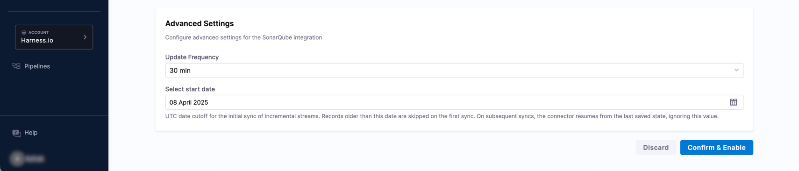
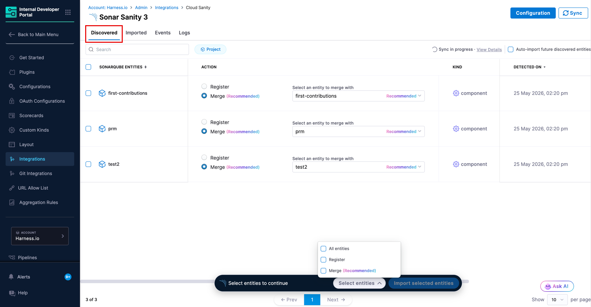
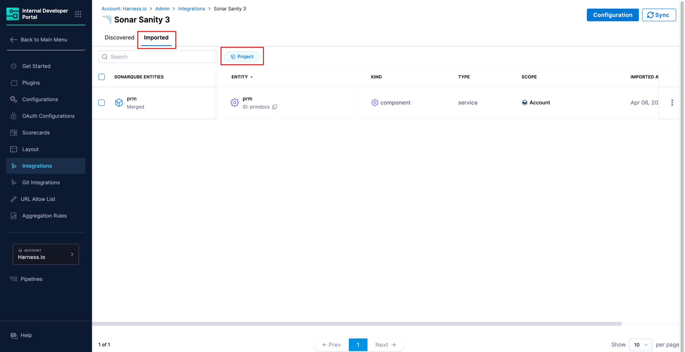
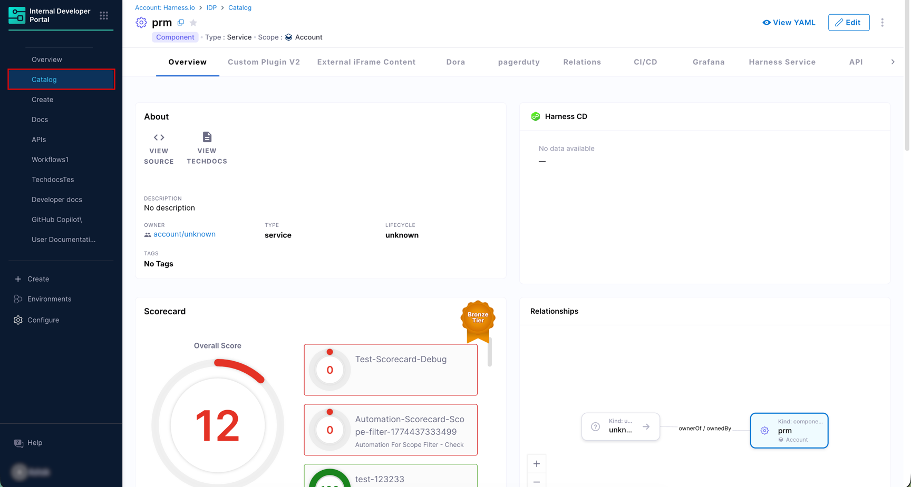
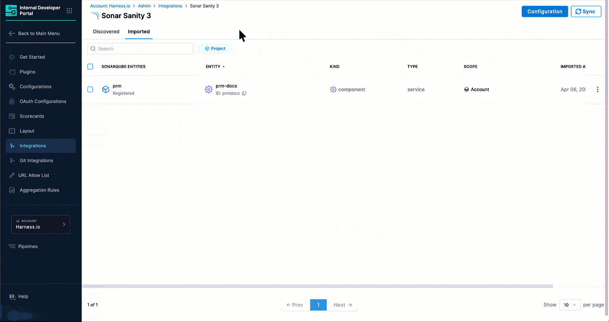

The SonarQube integration connects to your SonarQube Server (self-hosted) or SonarQube Cloud instance and brings projects into the IDP Catalog. Once ingested, entities can be registered as new catalog entries or merged into existing ones, enriching them with SonarQube-sourced metadata such as:

* Code quality measures
* Security hotspots
* Quality gate status
* Issue analytics

---

:::caution Prerequisites
* The feature flag `IDP_CATALOG_CD_AUTO_DISCOVERY` is enabled. Contact [Harness Support](mailto:support@harness.io) to enable it.
* You have the required RBAC permissions to manage integrations. All integration operations require the `IDP_INTEGRATION_EDIT` permission on the `IDP_INTEGRATION` resource type.
* A SonarQube user token with global-level `Browse` privileges is available. Generate it via **My Account** → **Security** → **Generate Tokens** in SonarQube.
:::

---

## Enable the SonarQube Integration

:::info
The SonarQube integration is available at the **Account**, **Organization**, and **Project** levels of Harness. Navigate to the appropriate scope of the Internal Developer Portal to add or manage SonarQube integrations.
:::

### 1. Navigate to the Integrations Page

1. In Harness, open the **Internal Developer Portal**.

2. From the left sidebar, click **Configure**.

3. In the left navigation menu, click **Integrations**.

   
   
Figure 1: Navigation Path of SonarQube Integration

4. On the Integrations page, click **+ New Integration** at the top.

5. Select **SonarQube** from the integration type picker. You will be taken to the **Auto Discover SonarQube Integration** page.

### 2. Configure Setup & Connectivity

This section connects Harness IDP to your SonarQube instance.

Figure 2: Setup & Connectivity

1. Enter a name in the **Integration Name** field. This name appears on the integration card on the **Integrations** page (e.g., `SonarQube Production`).

2. Select the **SonarQube Type** from the dropdown:
   * **SonarQube Cloud** - for cloud-hosted SonarQube (sonarcloud.io).
   * **SonarQube Server** - for self-hosted, on-premises SonarQube.

3. Enter the **SonarQube Host URL**:
   * For SonarQube Server, this is the base URL of your instance (e.g., `https://sonarqube.example.com`).
   * For SonarQube Cloud, use the regional endpoint for your organization:
     * Global: `https://sonarcloud.io`
     * US region: `https://sonarqube.us`

4. *(SonarQube Cloud only)* Enter the **Organization Key**. This is your SonarQube Cloud organization key (e.g., `my-org`).

5. Under **User Token**, click **Create or Select a Secret** and provide your SonarQube User Token. This token must have global-level `Browse` privileges.

   :::info Recommended Secrets Manager
   For SonarQube Integration, we recommend you use the **Harness Built-in Secret Manager** for storing the SonarQube user token.
   :::

6. *(Optional)* Enter one or more **Project Keys** to limit the sync scope. Type a project key and press **Enter** to add it. When left empty, all projects in your SonarQube instance or organization are synced.

   :::tip Scoping Your Integration
   Every project in SonarQube has a unique project key. Use these to scope each integration appropriately. We recommend creating one integration per project or small group of projects rather than a single integration covering all projects. This makes it easier to manage sync frequency, troubleshoot issues, and control catalog growth. 
   :::

   :::caution Check Network Reachability
   For SonarQube Server (self-hosted) instances, ensure that your SonarQube instance is reachable from within the environment where your Harness Delegate is running. The delegate must have network access to the SonarQube Host URL you configure.
   :::

### 3. Configure Mapping & Correlation

This section defines how SonarQube projects are mapped to IDP catalog entities and how they are correlated with existing catalog records.

The integration supports the **Project Entity** type, which imports SonarQube projects as catalog components.

Figure 3: Available Entities - Projects

#### Project Entity

1. Ensure the **Project Entity** toggle is turned on.

2. Under **Entity Registration Behavior**, choose how projects are brought into the catalog:
   * **Register & Merge** *(Default)* - Registers new entities and updates existing ones when a match is found. This is the recommended option for most setups.
   * **Register** - Creates new catalog entities from SonarQube projects. Does not merge with existing entities.
   * **Merge** - Links discovered projects to existing catalog entities. Matching entities are recommended automatically, but you can choose a different one.

3. The default **Kind** is `Component` and **Type** is `Service`. These are pre-configured and apply to all SonarQube project imports.

4. Under **Correlation Mapping**, set the **Ingested Data Path** (from SonarQube) and the corresponding **Catalog YAML Path** (from your IDP entity) to define how records are matched. The operator defaults to `Equals`. Example:

   | Ingested Data Path | Operator | Catalog YAML Path |
   |---|---|---|
   | `name` | Equals | `name` |

5. Optionally, click **Configure** next to **Configure fields (optional)** to customize which SonarQube fields are synced to the catalog. By default, all available fields are selected.

### 4. Configure Advanced Settings

The **Advanced Settings** section controls how frequently IDP syncs with SonarQube and, for SonarQube Cloud, how far back historical data is pulled.

Figure 4: Advanced Settings

1. Select an **Update Frequency** from the dropdown to control how often IDP polls SonarQube for new data.

   Available options: `10 min`, `30 min`, `1 hour`, `1 day`.

2. Set the **Select start date** to define the earliest date from which IDP will pull SonarQube data. Note that setting this date too far in the past might increase the volume of data pulled on the initial sync and slow it down.

3. Once all sections are configured, click **Confirm & Enable**. A confirmation dialog will appear before the changes are applied.

The integration is now enabled and IDP begins syncing data from SonarQube. Discovered projects appear in the [**Discovered** tab](#discovered-tab).

---

## Discover and Import SonarQube Entities

This section covers how to view the SonarQube entities discovered by the integration and import them into your IDP Catalog.

### Discovered tab

After the integration runs, all SonarQube projects detected appear in the **Discovered** tab under the **Project** sub-tab. If entities do not appear, use the **Sync** button at the top right to manually refresh.

Figure 5: 'Discovered' tab showing SonarQube projects

For each discovered entity, you can see its name, the recommended catalog action, kind, type, and the date it was detected. You can choose how to bring entities into the catalog using one of the following actions:

* **Register** *(shown as Recommended when no matching catalog entity exists)* - Creates a new catalog entity populated with the SonarQube metadata.
* **Merge** - Links the discovered entity to an existing catalog entity, enriching it with SonarQube data. If IDP finds a catalog entity with a matching name or correlation key, the **Merge** option is pre-selected and the suggested entity is shown automatically.

:::tip Bulk Import and Auto Import Options
* **Bulk Import** - Select multiple entities using the checkboxes and click **Import selected entities** at the bottom of the page to import them all at once. The selection widget shows a count of selected entities.
* **Auto Import** - Toggle **Auto-import future discovered services** in the top right of the Discovered tab to automatically import all future entities without manual review. You can change this preference at any time.
:::

### Imported tab

The **Imported** tab displays all SonarQube entities that have been brought into the catalog under the **Project** sub-tab.

Figure 6: 'Imported' tab showing SonarQube entities linked to catalog entities

It displays the following data:

| Column | Description |
|---|---|
| **SonarQube Entity** | The name of the project from SonarQube, along with its import status (for example, **Merged** or **Registered**). |
| **Entity** | The linked IDP catalog entity and its ID. |
| **Kind** | The catalog entity kind (e.g., `component`). |
| **Type** | The catalog entity type (e.g., `service`). |
| **Scope** | The Harness scope the entity belongs to (e.g., Account). |
| **Imported At** | The timestamp when the entity was imported. |

:::caution Unlink an Imported Entity
To stop syncing a specific entity without deleting the catalog entity, use the three-dot menu on any row and select **Unlink**. This stops sync updates while keeping the IDP entity and its existing data intact.
:::

---

## View SonarQube Entities in the Catalog

Once imported, SonarQube entities are available in the **Catalog** section of IDP as standard catalog entities.

Each imported SonarQube project is registered with:

* **Kind:** `Component`
* **Type:** `Service`
* **Scope:** The Harness scope the integration belongs to

Figure 7: IDP Catalog Entity Page showing Entity Relationship

Open any entity to view its Overview, Scorecards, CI/CD, and other tabs configured for your entity layout.

### Ingested Properties

To inspect the raw data ingested from SonarQube, open the entity and click **View YAML** → **Ingested Properties** in the Entity Inspector.

Figure 8: Entity Inspector Page showing Ingested Properties

Ingested properties are stored in two sections of the entity YAML:

* **`metadata.integration`** - Tracks which integrations are linked to this entity, including the entity action (e.g., `MERGE`) and the linked entity UUID for each integration instance.
* **`integration_properties.SonarQube`** - Contains the SonarQube-specific data for the project entity, including top-level metadata fields and quality measures nested under the `measures` key.

---

## Manage the SonarQube Integration

### Edit the Integration

To update the integration name, change the host URL, token, or mapping and correlation settings, navigate to the **Integrations** page, find your SonarQube integration card, and click **View**. From there, click **Configuration** to open the edit screen.

### Suspend Auto-Discovery

If auto-discovery is suspended, new entities will not appear in the **Discovered** tab. Existing imported entities remain unchanged in the catalog, and the sync between SonarQube and their corresponding IDP entities will stop.

To suspend auto-discovery:

1. Go to **Integrations** and open your SonarQube integration using the **View** button.
2. Click **Configuration** at the top.
3. In the **Danger Zone** section, click **Suspend**.
4. Confirm the action.

You may re-enable it at any time by following the same steps.
