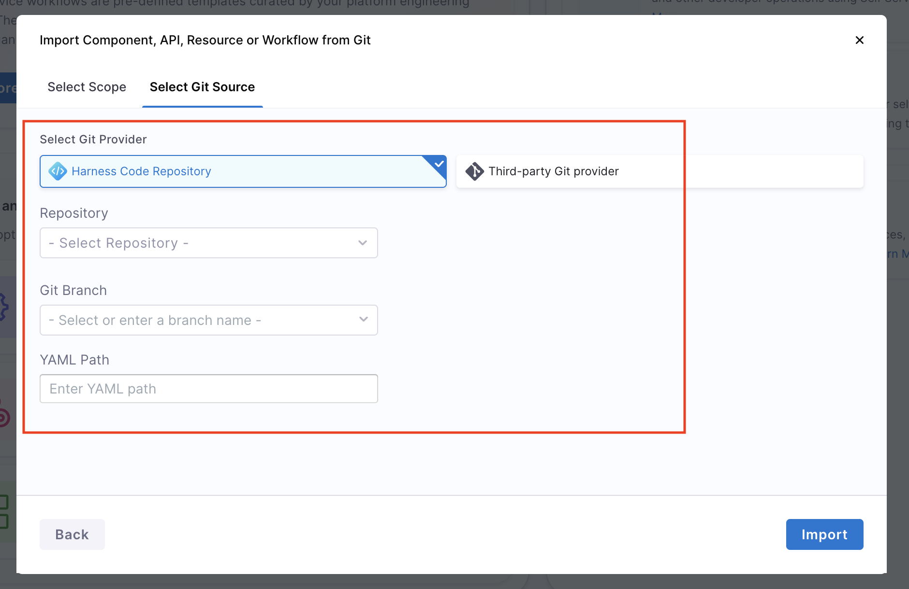

import DocImage from '@site/src/components/DocImage';
import DocVideo from '@site/src/components/DocVideo';
import Tabs from '@theme/Tabs';
import TabItem from '@theme/TabItem';

:::info IDP 2.0 Only
This documentation is only relevant to **IDP 2.0**. This will not be valid for **IDP 1.0** since the experience there is different.
:::

In Harness IDP, users can also create new entities and Workflows by importing their YAML definitions stored in Git repositories directly into Harness IDP.
This feature allows teams to reuse pre-defined configurations, onboard services faster, and migrate from automation workflows or existing repositories.

---

## Pre-requisites

- **Enable API Access**: For connection types and authentication methods where API access is not already enabled by default, you'll have to enable it from the Git connector settings. API Access is required for using Harness Git Experience. Refer to these docs to [enable API access](https://developer.harness.io/docs/platform/connectors/code-repositories/ref-source-repo-provider/git-hub-connector-settings-reference#enable-api-access).
  

---

## Import an Entity YAML

:::note Convert Existing YAMLs
If you have existing entities defined using legacy Backstage YAML (from IDP 1.0), you can convert them to the new Harness-native data model schema. For detailed instructions on converting your existing entity YAMLs, refer to [Convert Existing Entity YAMLs](/docs/internal-developer-portal/catalog/catalog-yaml#convert-existing-entity-yamls).
:::

You can create a new entity or workflow in Harness IDP directly from your Git YAML by using this **Import** flow. Please refer to the following steps to import any entity from Git.
<Tabs>
<TabItem value="Interactive Guide">
<DocVideo src="https://app.tango.us/app/embed/e6bb7067-f9f0-4280-ab71-9571d476936b" title="Import a Workflow from Git using a YAML" />
</TabItem>
<TabItem value="Step-by-Step">

1. Go to Harness IDP -> Create. In the bottom, you'll find an option to create a new entity by importing YAML from Git. Click on **Import from Git**.
2. Select the **Entity Scope** (scope at which you want your entity to be created). The scope (Account, Org, or Project) of the entity is determined by the scope you select here. Make sure your imported YAML includes the appropriate scope identifiers i.e. `projectIdentifier` and `orgIdentifier` – otherwise, it will result in an error.
3. Select the **Git Provider**. You can either choose **Harness Code Repository** or **Third-Party Provider**. For your selected option, enter the required details.
4. In case of **Harness Code Repository**, you'll have to provide the following details:
   - **Repository**: Git Repository where your Entity YAML is stored.
   - **Git Branch**: Branch of your Repository where your Entity YAML is stored.
   - **YAML Path**: Path of your YAML File.
     
5. In case of **Third-Party Provider**, you'll have to provide the following details:
   - **Git Connector**: Git Connector added in your Harness IDP
   - **Repository**: Git Repository where your Entity YAML is stored.
   - **Git Branch**: Branch of your Repository where your Entity YAML is stored.
   - **YAML Path**: Path of your YAML File.
     
6. Click on **Import**. This will create an entity in your IDP directly from the YAML file stored in Git.

</TabItem>
</Tabs>

#### Harness native YAML vs Backstage YAML

To use this feature, Backstage YAML is not supported directly. Since IDP 2.0 uses a new data model, existing YAMLs from IDP 1.0 (Backstage-native) must be converted using Harness CLI, UI editors, or migration scripts. To understand more about converting IDP 1.0 YAMLs to IDP 2.0 YAMLs, please refer to [Converting IDP 1.0 YAMLs](/docs/internal-developer-portal/catalog/catalog-yaml.md#converting-existing-entity-yamls-idp-20)

---

## Entity Scope and Connector Rules

Some important constraints exist during the import process:

- **Entity Scope is Fixed**:
  The scope (Account, Org, or Project) of the entity is determined by the scope you select initially. Make sure your imported YAML includes the appropriate scope identifiers i.e. `projectIdentifier` and `orgIdentifier`; otherwise, it will result in an error.
- **Harness Code & Other Git Providers**:
  - **Harness Code Repository**: When importing via **Harness Code**, YAMLs can be sourced from any repository that the user has access to. The repo’s scope does not affect the entity scope. The following details are required in importing an entity from Git using Harness Code Repository:
    - **Repository**: Git Repository where your Entity YAML is stored.
    - **Git Branch**: Branch of your Repository where your Entity YAML is stored.
    - **YAML Path**: Path of your YAML File.
      
  - **Third-Party Git Providers**: When using other **Git providers** (GitHub, GitLab, Bitbucket, Azure Repos), the same rules apply — the scope selection and YAML determines the entity's scope. The following details are required in importing an entity from Git using Third-party Git Providers:
    - **Git Connector**: Git Connector added in your Harness IDP
    - **Repository**: Git Repository where your Entity YAML is stored.
    - **Git Branch**: Branch of your Repository where your Entity YAML is stored.
    - **YAML Path**: Path of your YAML File.
      

---

## Next Steps

For more advanced Git Experience features and workflows, refer to:
- [Git Experience Journey](/docs/internal-developer-portal/git-experience/gitx-journey)
- [Manage Catalog](/docs/internal-developer-portal/catalog/manage-catalog)
- [Catalog YAML Reference](/docs/internal-developer-portal/catalog/catalog-yaml)
