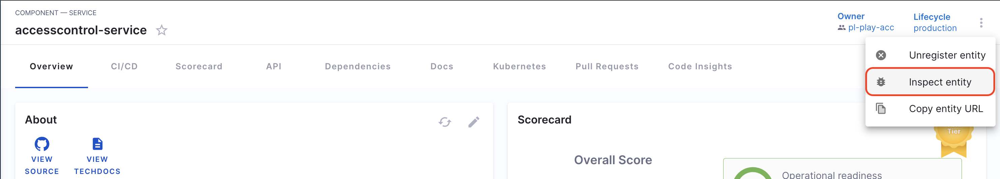
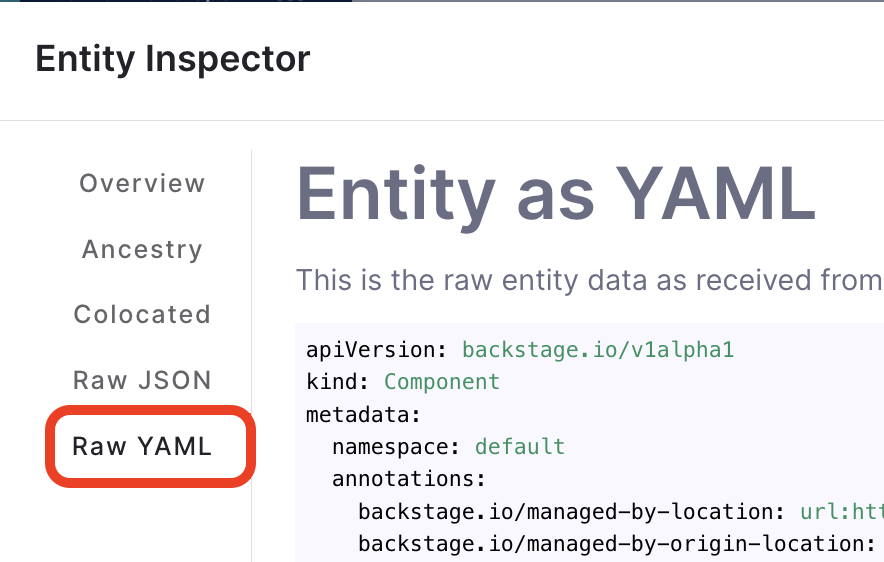

<DocVideo src="https://www.youtube.com/embed/mI_KIuMpnBM?si=2SfPcO-JpFvAMJrT" />

## Introduction

With the introduction of Catalog Metadata Ingestion APIs, users now have the capability to append or update arbitrary metadata associated with catalog entities such as services, libraries, websites, etc without manually adding it to the `catalog-info.yaml`. This feature facilitates the integration of metadata sourced from internal systems such as cost trackers, service health checkers, security scans, or even from simple spreadsheets tracking personnel details.

Also see - [Scorecards using Custom Data Sources](../scorecards/custom-data-source.md)

## Key Features

- **Custom Property Support**: The metadata field in the catalog supports custom properties, enabling users to add tailored metadata to catalog entities.

- **Scalability**: Using the APIs, users can now automate the process for adding custom properties at scale, streamlining the customization of catalog entities.

- **Enhanced Personalization**: Users can now personalize their catalog experience to a greater extent, unlocking faster onboarding of entities and facilitating the creation of more personalized scorecards and plugins.

<DocImage path={require('./static/catalog-custom-property.png')} />

## API Examples and Usage

## Catalog Metadata Ingestion API

### Endpoint

Adds a metadata in the already existing software component on IDP Catalog.

### HTTP Method

`POST`

### URL

```bash
https://app.harness.io/gateway/v1/catalog/custom-properties
```

### Headers

- `x-api-key`: Your Harness API token.
- `Harness-Account`: Your Harness account ID.

You can find your account ID in any Harness URL, for example:

```bash
https://app.harness.io/ng/account/ACCOUNT_ID/idp/overview
```

- `'Content-Type: application/json'`

### Request Body

```json
{
  "properties": [
    {
      "field": "metadata.teamLead",
      "filter": {
        "kind": "Component",
        "type": "service",
        "owners": ["Product_Engineering"]
      },
      "value": "Jane Doe"
    }
  ]
}
```

- **field:** It contains the information on the metadata name to be added, here in the above example it would ingest the `teamLead` under metadata. **This won't append your catalog-info.yaml stored in your git**, rather you could view the changes on IDP.

:::info

We need to add escape character for any field has an additional `DOT` in the path like `metadata.annotation.harness.io/idp-test` , that part needs to be escaped with `\"` like this `metadata.annotations.\"harness.io/idp-test\"`

:::

- **filter:** This is used to identify the software components where you want to ingest the new entity, you can filter through `kind`, `type`, `owners`, `lifecycle` and `tags`. **Where `kind`, `type` and `owners` are mandatory fields.**

:::info

**Error Handling**: We validate the body of the API and certain fields like `kind`, `metadata`, `metadata.name`, `metadata.namespace`, are uneditable and if you try to change these, the endpoint returns an Error Code 400. Also make sure your metadata updates adhere to the [backstage schema](https://github.com/backstage/backstage/tree/master/packages/catalog-model/src/schema)

:::

- **value:** This field contains the value of the entity added under `field`.





```YAML
###Example Processed Entitiy YAML as displayed in IDP

apiVersion: backstage.io/v1alpha1
kind: Component
metadata:
  name: my-new-service
  description: Description of my new service
  annotations:
       harness.io/project-url: https://app.harness.io/ng/#/account/vpCkHKsDSxK9_KYfjCTMKA/cd/orgs/default/projects/PREQA_NG_Pipelines
  teamLead: Jane Doe
...
```

### How to assign metadata value for an individual software component?

- value_overrides: This field is used when you want to assign multiple values against a single metadata for different `filter.type` or `filter.kind`. Here's an Example of the Request Body with `value_overrides`:

```JSON
{
    "properties": [
        {
            "field": "metadata.teamLead",
            "filter": {
                "kind": "Component",
                "type": "service",
                "owners": [
                    "Product_Engineering"
                ]
            },
            "value_overrides": [
                {
                    "entity_ref": "component:default/location-service",
                    "override_value": "Dan John"
                }
            ],
            "value": "Jane Doe"
        }
    ]
}
```

In the above example, we assign the team lead for `location_service` of type `service` as `Jane Harris` instead of `Jane Doe`. So `value_overrides` helps you to assign metadata values to individual software components.

### How to check for which metadata and entities are affected?

Using **dry_run** users can check for all the metadata and components getting affected by the **Catalog Metadata Ingestion API**, dry_run won't apply any change rather will provide a preview of all the changes as shown in the example below.

```json
[
  {
    "field": "metadata.offShoreTeamLead",
    "entities_with_additions": {
      "count": 0,
      "entity_refs": []
    },
    "entities_with_updates": {
      "count": 2,
      "entity_refs": [
        "component:default/order-service",
        "component:default/foodservice"
      ]
    }
  }
]
```

As you could see in the example above we display the affected software components under `entity_refs`.

To use **dry_run** you need to add `?dry_run=true` in the URL

```bash
https://app.harness.io/gateway/v1/catalog/custom-properties?dry_run=true
```

### cURL Example

The endpoint could also be used to **replace** value for an already existing metadata.

```cURL
curl --location 'https://app.harness.io/gateway/v1/catalog/custom-properties' \
--header 'Harness-Account: px7xd_BFRCi-pfABYXVjvw' \
--header 'Content-Type: application/json' \
--header 'x-api-key: <Add your key>' \
--data '{
    "properties": [
        {
            "field": "metadata.releaseVersion",
            "filter": {
                "kind": "Component",
                "type": "service",
                "owners": [
                    "harness_account_all_users"
                ],
                "lifecycle": [
                    "experimental",
                    "production"
                ],
                "tags": [
                    "food-ordering",
                    "java",
                    "tag1"
                ]
            },
            "value": "abcd"
        }
    ]
}'
```

You can **append** an `array` data type using this API as shown in the example below by using `mode: append`

```cURL
curl --location 'https://app.harness.io/gateway/v1/catalog/custom-properties' \
--header 'Harness-Account: px7xd_BFRCi-pfABYXVjvw' \
--header 'Content-Type: application/json' \
--header 'x-api-key: <Add your key>' \
--data '{
    "properties": [
        {
            // "field": "metadata.tags",
            "field": "metadata.releaseVersions",
            "filter": {
                "kind": "Component",
                "type": "service",
                "owners": [
                    "harness_account_all_users"
                ],
                "lifecycle": [
                    "experimental",
                    "production"
                ],
                "tags": [
                    "food-ordering",
                    "java",
                    "tag1"
                ]
            },
            "value": [                  #array of objects
                {"prod1": "1.5.6"},
                {"prod2": "1.5.6"},
                {"prod3": "1.5.6"},
            ],
            // "value": ["tag2", "tag3"], #array
            "mode": "append"
        }
    ]
}'

```

### Response:

The response will update/append a metadata in the desired software component in your IDP catalog.

## Catalog Metadata Deletion API

### Endpoint

Delete a metadata in the already existing software component on IDP Catalog.

### HTTP Method

`DELETE`

### URL

```bash
https://app.harness.io/v1/catalog/custom-properties
```

### Headers

- `x-api-key`: Your Harness API token.
- `Harness-Account`: Your Harness account ID.

You can find your account ID in any Harness URL, for example:

```bash
https://app.harness.io/ng/account/ACCOUNT_ID/idp/overview
```

- `'Content-Type: application/json'`

### Request Body

```json
{
  "properties": [
    {
      "field": "metadata.teamLead",
      "filter": {
        "kind": "Component",
        "type": "service",
        "owners": ["Product_Engineering"]
      }
    }
  ]
}
```

- **field:** It contains the information on the metadata name to be deleted, here in the above example it would delete the `teamLead` under metadata. **This won't append your catalog-info.yaml stored in your git**, rather you could view the changes on IDP.


:::info

We need to add escape character for any field has an additional `DOT` in the path like `metadata.annotation.harness.io/idp-test` , that part needs to be escaped with `\"` like this `metadata.annotations.\"harness.io/idp-test\"`

:::

- **filter:** This is used to identify the software components from where you want to delete the metadata information, you can filter through `kind`, `type`, `owners`, `lifecycle` and `tags`. **Where `kind`, `type` and `owners` are mandatory fields.**

### cURL Example

```cURL
curl --location --request DELETE 'https://app.harness.io/gateway/v1/catalog/custom-properties' \
--header 'Harness-Account: px7xd_BFRCi-pABCYXVjvw' \
--header 'Content-Type: application/json' \
--header 'x-api-key: {{apiKey}}' \
--data '{
    "properties": [
        {
            "field": "metadata.releaseVersion",
            "filter": {
                "kind": "Component",
                "type": "service",
                "owners": [
                    "harness_account_all_users"
                ],
                "lifecycle": [
                    "experimental",
                    "production"
                ],
                "tags": [
                    "food-ordering",
                    "java",
                    "tag1"
                ]
            }
        }
    ]
}'
```

### Response:

The response will delete a metadata in the desired software component in your IDP catalog.
