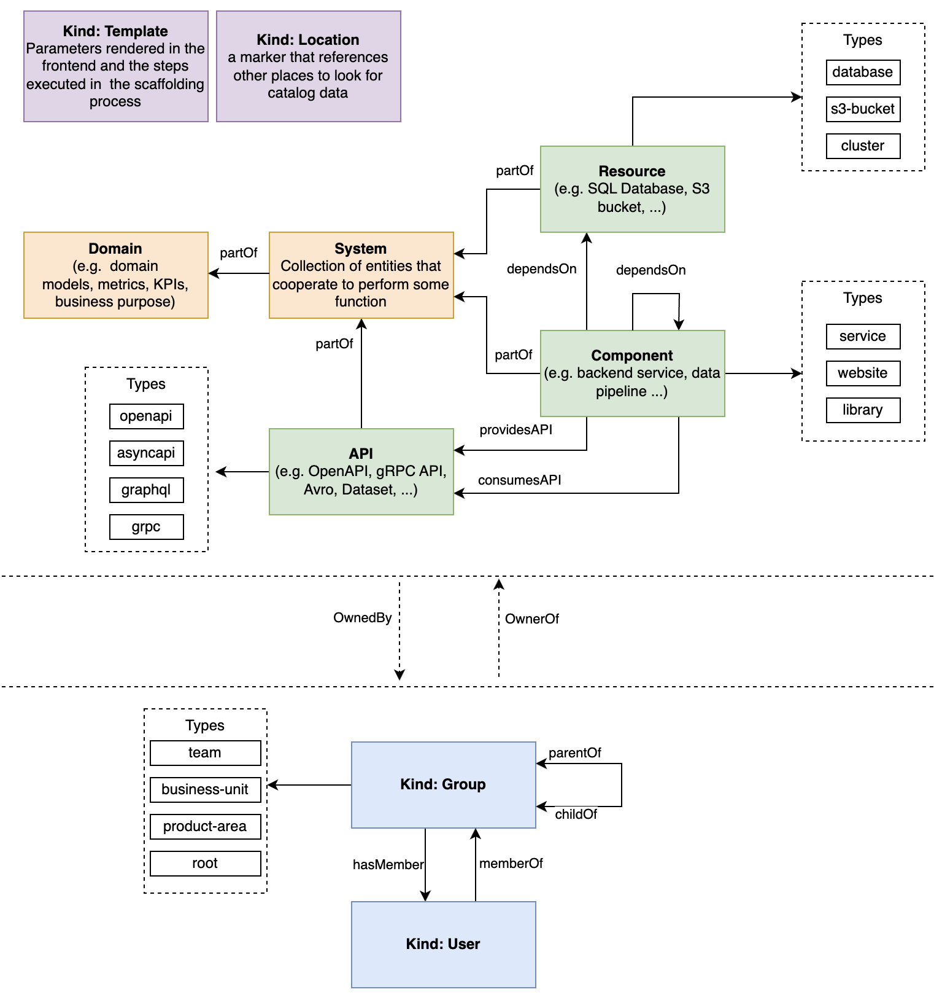

import Tabs from '@theme/Tabs';
import TabItem from '@theme/TabItem';

<Tabs queryString="version">
<TabItem value="IDP 2.0 (New)" label="IDP 2.0 (New)">

With IDP 2.0, we are moving towards a **Harness-native Data Model** designed for enterprise scale and access control. This data model in Harness IDP helps us manage dependencies by organizing different entities such as software components, services, and tools within our technical landscape. It illustrates how everything connects and functions together within the system.

This data model focuses on the key aspects in the following manner:

* **Scopes**: Explains the scopes available in the new data model and how entities are mapped to them.
* **Entities**: Describes the types of entities that can exist in the Harness-native Data Model.


Let's dive deeper into how entities and scopes come together in the Harness-native data model.

## Harness IDP Entities

There are different entities within our Harness IDP data model. However, software is modeled in the Harness IDP Catalog using three core entities:

* **Components**: Individual pieces of software.
* **APIs**: Boundaries between different components.
* **Resources**: Physical or virtual infrastructure needed to operate a component.


Let's explore these core entities and their usage in detail!

### Component

A **Component** is a piece of software, such as a mobile feature, website, backend service, or data pipeline (list not exhaustive). A component can be tracked in source control or use existing open-source or commercial software. It can implement APIs for other components to consume. In turn, it might consume APIs implemented by other components or directly depend on components or resources attached to it at runtime.

For more details on how to use this entity, please refer to the [detailed docs](/docs/internal-developer-portal/catalog/catalog-yaml.md#kind-component) here.

### API

An **API** describes an interface that can be exposed by a component. APIs can be defined using formats such as OpenAPI, AsyncAPI, GraphQL, gRPC, or others. They are implemented by components and form boundaries between them. APIs might be defined using an RPC IDL (e.g., Protobuf, GraphQL), a data schema (e.g., Avro, TFRecord), or as code interfaces. In all cases, APIs exposed by components need to be in a known machine-readable format to enable tooling and analysis.

For more details on how to use this entity, please refer to the [detailed docs](/docs/internal-developer-portal/catalog/catalog-yaml.md#kind-api) here.

### Resource

A **Resource** describes infrastructure components required for a system to operate—such as BigTable databases, Pub/Sub topics, S3 buckets, or CDNs. Modeling them alongside components and systems helps visualize infrastructure footprint and enables tooling around them.

For more details on how to use this entity, please refer to the [detailed docs](/docs/internal-developer-portal/catalog/catalog-yaml.md#kind-resource) here.

### Workflow

Workflows enable developer self-service by automating manual tasks and processes. Using workflows, platform engineering teams can automate new service onboarding, simplify Day 2 operations, and provide developers with golden paths to production that include guardrails and best practices.

A Workflow is divided into three key components: Frontend, Backend, and Outputs. **Frontend** defines the input fields required for the workflow. **Backend** configures the actions to be triggered and the orchestration pipelines to be executed. **Outputs** specify the output variables to be shown to developers after execution. You can configure your workflow's frontend and backend by defining specific inputs, actions, and orchestration pipelines.

For more details on how to use this entity, please refer to the [detailed docs](/docs/internal-developer-portal/flows/overview.md) here.

## Harness Platform Entities

We also support Harness Platform Entities - Users and User Groups.

### Users

A **User** refers to a person who has been onboarded or has access to any part of Harness IDP. Across Harness, a user is any individual registered with a unique email address. Users can be associated with multiple Harness accounts and can belong to multiple user groups. Roles and resource groups can be assigned directly to users or inherited from user groups. Here's how you can [add users](https://developer.harness.io/docs/platform/role-based-access-control/add-users/) in Harness IDP.

You can [add users manually](https://developer.harness.io/docs/platform/role-based-access-control/add-users/#add-users-manually) or through [automated provisioning](https://developer.harness.io/docs/platform/role-based-access-control/add-users/#use-automated-provisioning). User groups can be created at all scopes.

### User Groups

**User Groups** contain multiple users. Roles and resource groups can be assigned to user groups. The permissions and access granted by the assigned roles and resource groups are applied to all group members. User groups help keep your RBAC organized and simplify permission management. Instead of modifying each user individually, you can update permissions and access for the entire group at once.

Harness includes some [built-in user groups](https://developer.harness.io/docs/platform/role-based-access-control/add-user-groups/#built-in-user-groups), and you can [create user groups manually](https://developer.harness.io/docs/platform/role-based-access-control/add-user-groups/#create-user-groups-manually), through [inheritance](https://developer.harness.io/docs/platform/role-based-access-control/add-user-groups/#create-groups-by-inheritance), or via [automated provisioning](https://developer.harness.io/docs/platform/role-based-access-control/add-user-groups/#use-automated-provisioning). You can create user groups at all scopes.

## Scopes & Hierarchy

IDP 2.0 follows a three-level hierarchical structure. The three levels, or scopes, are **Account**, **Organization**, and **Project**. Entities can be explicitly created at any scope.

You can configure permissions for each scope. This helps delegate responsibilities to different teams and allows efficient organization and management of resources by providing granular access control that is flexible, scalable, and easy to manage.

Learn more about the [Harness platform hierarchy](https://developer.harness.io/docs/platform/get-started/key-concepts/#account).

### Account Scope

The **Account Scope** is the highest level. It is your Harness account and encompasses all resources within your subscription. Entities created at the account scope are accessible platform-wide. Permissions for entities or resources created at this level can be modified using granular RBAC and shared across user groups.


### Organization Scope

The **Organization Scope** contains related projects, resources, and users within a specific domain or business unit. It provides a way to create and manage entities specific to a particular organization, separate from other areas of the account. Entities created at the organization scope are scoped to the orgs that own them but can also be shared using granular RBAC.


### Project Scope

The **Project Scope** includes resources for a specific team or project. It enables the creation and management of entities specific to a particular project, separate from the larger organization and account. Entities created at this scope are only available within that project and scoped to the teams that own them.


## Resources & Scopes

All core entities can exist at different scopes, but their permissions and access levels depend on the RBAC settings you apply. With granular RBAC, you can define custom roles with specific permissions for Catalog and Workflows (Create, Edit, Read, Delete, Execute), and organize them into reusable resource groups. These permissions are fully aligned with the existing Harness RBAC framework.

With IDP 2.0, you can create resources at any scope: **Account**, **Org**, or **Project**. Here's how resources and scopes link together in IDP 2.0:

| **Resource**   | **Account scope** | **Org scope** | **Project scope** | **Notes**                                                                                                  |
| -------------- | ----------------- | ------------- | ----------------- | ---------------------------------------------------------------------------------------------------------- |
| **Catalog**    | ✅                 | ✅             | ✅                 | Core catalog entities **(Component, API, Resource)** can be created and managed across all scopes.         |
| **Workflows**  | ✅                 | ✅             | ✅                 | Workflows can be created, managed, and executed across all scopes.                                         |
| **Scorecards** | ✅                 | ❌             | ❌                 | Only supported at the Account scope currently. Org/Project scope support is planned in the future roadmap. |
| **Layouts**    | ✅                 | ❌             | ❌                 | Supported only at the Account scope currently. Org/Project scope support is planned.                       |
| **Plugins**    | ✅                 | ❌             | ❌                 | Plugins can be created and configured only at the Account scope.                                           |


## Relations

The following is a non-exhaustive list of actively used relations.

Each relation has a *source* (implicitly, the entity that holds the relation), a *target* (the entity it relates to), and a *type* that defines the nature of the relationship. Relations are directional. Typically, you'll find relation pairs where the reverse relation exists for the other entity (e.g., when querying A, you see `A.ownedBy.B`; when querying B, you see `B.ownerOf.A`).

### 1. `ownedBy` and `ownerOf`

An ownership relation where the owner is typically a [User Group](https://developer.harness.io/docs/platform/role-based-access-control/add-user-groups/).

In IDP, the owner is the single entity (usually a User Group in Harness) responsible for the entity, with the authority and capability to maintain it. They act as the point of contact for issues or feature requests. This relation primarily serves display purposes in IDP, allowing users to understand ownership. It should not be used by automated systems for runtime authorization. While others may contribute to the entity, there is always one designated owner.

This relation is typically generated based on the `spec.owner` field of the owned entity.

### 2. `providesApi` and `apiProvidedBy`

A relation involving an [API](https://developer.harness.io/docs/internal-developer-portal/catalog/system-model#3-api) entity, usually linked to a [Component](https://developer.harness.io/docs/internal-developer-portal/catalog/system-model#4-component).

This relation indicates that a component exposes an API, i.e., it hosts endpoints from which the API can be consumed.

Typically generated from the `spec.providesApis` field.

### 3. `consumesApi` and `apiConsumedBy`

A relation involving an [API](https://developer.harness.io/docs/internal-developer-portal/catalog/system-model#3-api) entity, usually from a [Component](https://developer.harness.io/docs/internal-developer-portal/catalog/system-model#4-component).

This expresses that a component depends on endpoints of the API.

Typically generated from the `spec.consumesApis` field.

### 4. `dependsOn` and `dependencyOf`

A relation that expresses a general dependency on another entity.

This can indicate that, for example, a website component needs a library during its build process, or that a service uses a persistent storage resource.

Typically generated from the `spec.dependsOn` field.

### 5. `parentOf` and `childOf`

A parent-child relation used to construct trees, commonly for organizational structures among [User Groups](https://developer.harness.io/docs/platform/role-based-access-control/add-user-groups/).

Typically based on the `spec.parent` and/or `spec.children` fields.

### 6. `memberOf` and `hasMember`

A membership relation, usually for users in [User Groups](https://developer.harness.io/docs/platform/role-based-access-control/add-user-groups/).

Typically based on the `spec.memberOf` field.

### Example YAML

```yaml
spec:
  type: service
  lifecycle: experimental
  owner: group:pet-managers
  dependsOn:
    - Component:manager
    - Component:ng-manager
    - Resource:sample-s3-bucket
  providesApis:
    - accesscontrol-service
    - petstore
    - internal/streetlights
    - hello-world
  subcomponentOf: sample-service
```

</TabItem>
<TabItem value="IDP 1.0" label="IDP 1.0">
## Introduction

The Harness Internal Developer Portal's systems model is based on the [Backstage System Model](https://backstage.io/docs/features/software-catalog/system-model). It helps to manage and understand complex software ecosystems. This model is important for DevOps and microservices, where many connected parts can be hard to manage.

The System Model in Harness IDP helps us manage dependencies by organizing software components, services, and tools in our technical landscape. This model shows how everything connects and works together within the system. It provides a clear structure for understanding and navigating the different parts of the system.


## Example Architecture

Let's create a map of a city-like software ecosystem. The IDP's service catalog is like a central hub, organizing and sharing important information about the software assets. This ecosystem, with its interconnected neighborhoods (Domains), buildings (Systems), services (APIs), establishments (Components), and utilities (Resources), mirrors the complex yet structured world of software development and operations. 

By using the Harness IDP System Model, we can effectively manage and maintain the dependencies within Harness IDP Catalog. It structures around five key concepts: Domains, Systems, APIs, Components, and Resources.


## Harness IDP System Model

### Components and Dependencies

#### Core Backend: 

Let's start with a core backend service, like a central office in a building, providing specific functionalities.

```YAML
kind: Component
type: service
name: core-backend
```

#### Core Queuing Library: 

Now let's start adding a library component, akin to a specialized tool used within the office.

```YAML
kind: Component
type: library
name: core-queueing-library
```

### Dependency Representation: 

Showing how the Core Backend depends on the Core Queuing Library.

```YAML
providesApi:
  - core-api
```

### APIs and Their Consumption

Core API: Represented as a service provided by the Core Backend.

```YAML
kind: API
type: openapi
name: core-api
```

#### API Provision: Indicating that the Core Backend exposes the Core API.

```YAML
providesApi:
  - core-api
```

### Systems and Their Components

#### Core System: 
A system that includes the Core Backend and Core API.

```YAML
kind: System
name: core
```

#### System Association: 

Linking the Core Backend and API to the Core System.

```YAML
system: core
```

### City Domains and Expansion

**The city is expanding and creating a new Domain AI as a new part of the city.**

```YAML
kind: Domain
name: ai
```




To set up the backend service in the software catalog, we create an IDP YAML file. This file includes concepts such as dependencies and ownership.

### Neighborhoods: Domains

1. **Function:** Domains are like neighborhoods, each with its unique character, housing systems that share common goals or technical requirements.

2. **Example:** The "Data Analytics District" could be a Domain, grouping systems related to data processing and analysis.

```YAML
kind: Domain
name: data-analytics-district
```

### Buildings: Systems
1. **Structure:** Systems are akin to buildings, each encapsulating a set of functionalities provided by various components.

2. **Example:** The "Customer Insights Tower" in the Data Analytics District represents a System comprising data processing services, analytics tools, and customer feedback components.

```YAML
kind: System
name: customer-insights-tower
```

### Services: APIs
1. **Interactions:** APIs are the services that allow different systems and components to communicate, much like the utilities in a city.

2. **Example:** The Customer Insights Tower might offer a RESTful API for querying processed customer data.

```YAML
kind: API
type: openapi
name: customer-query-api
```

### Establishments: Components
1. **Specific Functions:** Components are like the different offices or shops in a building, each serving a specific function.

2. **Example:** Within the Customer Insights Tower, there's a "Feedback Analysis Suite," a component dedicated to analyzing customer feedback.

```YAML
kind: Component
type: service
name: feedback-analysis-suite
```

### Utilities: Resources
1. **Support Infrastructure:** Resources are the essential infrastructure elements that support the systems, similar to a city's utilities.

2. **Example:** The Customer Insights Tower relies on cloud storage and computing resources to handle large datasets.

```YAML
kind: Resource
type: cloud-service
name: cloud-storage
```

## Relations

This is a (non-exhaustive) list of relations that are known to be in active use.

Each relation has a _source_ (implicitly: the entity that holds the relation), a _target_ (the entity to which the source has a relation), and a _type_ that tells what relation the source has with the target. The relation is directional; there are commonly pairs of relation types and the entity at the other end will have the opposite relation in the opposite direction (e.g. when querying for `A`, you will see `A.ownedBy.B`, and when querying `B`, you will see `B.ownerOf.A`).

### `ownedBy` and `ownerOf`

An ownership relation where the owner is usually an organizational entity [User Group](https://developer.harness.io/docs/platform/role-based-access-control/add-user-groups/). 

In IDP, the owner of an entity is the singular entity (commonly a User Group in Harness) that bears ultimate responsibility for the entity, and has the authority and capability to develop and maintain it. They will be the point of contact if something goes wrong, or if features are to be requested. The main purpose of this relation is for display purposes in IDP, so that people looking at catalog entities can get an understanding of to whom this entity belongs. It is not to be used by automated processes to for example assign authorization in runtime systems. There may be others that also develop or otherwise touch the entity, but there will always be one ultimate owner.

This relation is commonly generated based on `spec.owner` of the owned entity, where present.

### `providesApi` and `apiProvidedBy`

A relation with an [API](https://developer.harness.io/docs/internal-developer-portal/catalog/system-model#3-api) entity, typically from a
[Component](https://developer.harness.io/docs/internal-developer-portal/catalog/system-model#4-component).

These relations express that a component exposes an API - meaning that it hosts callable endpoints from which you can consume that API.

This relation is commonly generated based on `spec.providesApis` of the component or system in question.

### `consumesApi` and `apiConsumedBy`

A relation with an [API](https://developer.harness.io/docs/internal-developer-portal/catalog/system-model#3-api) entity, typically from a
[Component](https://developer.harness.io/docs/internal-developer-portal/catalog/system-model#4-component).

These relations express that a component consumes an API - meaning that it depends on endpoints of the API.

This relation is commonly generated based on `spec.consumesApis` of the component or system in question.

### `dependsOn` and `dependencyOf`

A relation denoting a dependency on another entity.

This relation is a general expression of being in need of that other entity for an entity to function. It can for example be used to express that a website
component needs a library component as part of its build, or that a service component uses a persistent storage resource.

This relation is commonly generated based on `spec.dependsOn` of the component or resource in question.

### `parentOf` and `childOf`

A parent/child relation to build up a tree, used for example to describe the organizational structure between [ User Groups](https://developer.harness.io/docs/platform/role-based-access-control/add-user-groups/).

This relation is commonly based on `spec.parent` and/or `spec.children`.

### `memberOf` and `hasMember`

A membership relation, typically for Users in [Groups](https://developer.harness.io/docs/platform/role-based-access-control/add-user-groups/).

This relation is commonly based on `spec.memberOf`.

### `partOf` and `hasPart`

A relation with a [Domain](https://developer.harness.io/docs/internal-developer-portal/catalog/system-model#1-domain), [System](https://developer.harness.io/docs/internal-developer-portal/catalog/system-model#2-system) or [Component](https://developer.harness.io/docs/internal-developer-portal/catalog/system-model#4-component) entity, typically from a
[Component](https://developer.harness.io/docs/internal-developer-portal/catalog/system-model#4-component),
[API](https://developer.harness.io/docs/internal-developer-portal/catalog/system-model#3-api), or
[System](https://developer.harness.io/docs/internal-developer-portal/catalog/system-model#2-system).

These relations express that a component belongs to a larger component; a component, API or resource belongs to a system; or that a system is grouped
under a domain.

This relation is commonly based on `spec.system` or `spec.domain`.

```YAML
# Example catalog-info.yaml
...
spec:
  type: service
  lifecycle: experimental
  owner: group:pet-managers
  dependsOn:
    - Component:manager
    - Component:ng-manager
    - Resource:sample-s3-bucket
  providesApis:
    - accesscontrol-service
    - petstore
    - internal/streetlights
    - hello-world
  subcomponentOf: sample-service  
...
```

## Definitions and Reference

### 1. Domain
#### Definition: 
A Domain is a high-level organizational unit in the Backstage model, grouping together systems that share common characteristics such as business goals, domain models, terminology, or documentation.
#### Purpose: 
To create a bounded context for easier management and understanding of related systems.
#### Example: 
The "Payments" Domain includes systems related to payment processing, sharing common documentation, API entity types, and integration standards.

### 2. System
#### Definition: 
A System is an abstraction layer encapsulating the implementation details of specific functionalities. It consists of a collection of resources and components and exposes one or several APIs.
#### Purpose: 
To reduce complexity by allowing consumers to interact with functionalities without needing to understand the underlying implementation details.
#### Example: 
A playlist management system includes backend services for playlist management and a database, exposing functionalities through various APIs like RPC, datasets, and event streams.

### 3. API
#### Definition: 
APIs are the primary means of interaction within the software ecosystem. They are implemented by components and define the boundaries between different components and systems.
#### Purpose: 
To facilitate interaction and discovery within the software ecosystem, ensuring scalability and manageability.
#### Example: 
A public API exposed by a system for other Spotify components, documented and discoverable in Backstage.

### 4. Component
#### Definition: 
A Component is a discrete unit of software, such as a mobile feature, website, backend service, or data pipeline.
#### Purpose: 
To implement specific functionalities and APIs, encapsulating code dependencies and interacting with system resources.
#### Example: 
A backend service for user data processing, implementing specific APIs and relying on system resources like databases.

### 5. Resource
#### Definition: 
Resources are the infrastructure elements required for a system's operation, including databases, cloud storage, CDN services, etc.
#### Purpose: 
To support the operational needs of systems, allowing for a clear visualization of resource usage and facilitating targeted tooling development.
#### Example: 
Cloud storage buckets and CDN services used by a video streaming system.

## Conclusion 

In everyday situations, utilizing a systems model such as Backstage's involves creating a central catalog or storage location. This catalog contains all information regarding systems, parts, and their connections. This dependency management in IDP Catalog System Model, enables developers to have service onboarding using seamless integrations.

</TabItem>
</Tabs>