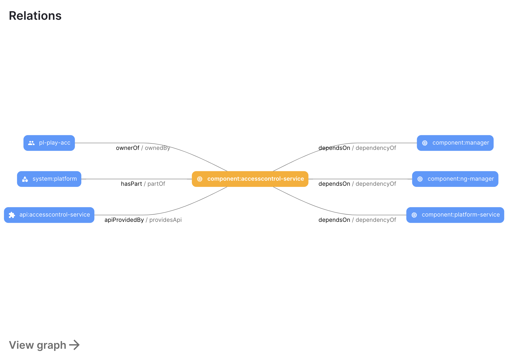

## Create an IDP YAML or `catalog-info.yaml`

The **IDP YAML or catalog-info.yaml** is a crucial descriptor file that provides metadata about the software components you register within our IDP. It serves as a blueprint, detailing essential information about each component, such as its name, description, owner, and other related metadata. This file ensures that our portal accurately represents and organizes the software components, making it easier for teams to discover and understand the tools and services available.

Although it's possible to name catalog entity descriptor files however you wish, we recommend that you name them `idp.yaml`.

:::info

`idp.yaml` follows the same [Descriptor Format of Catalog Entities](https://backstage.io/docs/features/software-catalog/descriptor-format#substitutions-in-the-descriptor-format) as Backstage.io.

:::

### Start with basic entity information

Begin your YAML file with the basic entity information, this contains the `kind` which could be any of the following:

1. [Component](https://backstage.io/docs/features/software-catalog/descriptor-format/#kind-component)
2. [Template](https://backstage.io/docs/features/software-catalog/descriptor-format/#kind-template)
3. [API](https://backstage.io/docs/features/software-catalog/descriptor-format/#kind-api)
4. [Resource](https://backstage.io/docs/features/software-catalog/descriptor-format/#kind-resource)
5. [Location](https://backstage.io/docs/features/software-catalog/descriptor-format/#kind-location)

and few others.

Out of this `Component` is quite widely used for service, website, library, etc. which needs to be specified as `spec.type` as discussed below.

```yaml
apiVersion: backstage.io/v1alpha1
kind: Component
```

### Provide metadata

Under the metadata section, provide essential details about your component:

```yaml
metadata:
  name: artist-service
  description: The place to be, for great artists
```

### Add labels (Optional)

You can add key/value pairs as labels to classify the component:

```yaml
labels:
  example.com/custom: custom_label_value
```

### Add annotations (Optional)

Annotations are used to reference external systems or provide additional non-identifying metadata:

```yaml
annotations:
  harness.io/project-url: "https://app.harness.io/ng/account/accountid/cd/orgs/orgid/projects/projectid"
  github.com/project-slug: github/example-org/artist-website
```

### Include tags (Optional)

Tags are single-valued strings used to classify entities:

```yaml
tags:
  - java
```

### Add Relations

For the relationship graph to get populated, you need to add the dependencies in the `catalog-info.yaml`



The field `spec.owner` is a reference. In this case, the string `group:pet-managers` was given by the user. That means that the kind is `Group`, the namespace is left out, and the name is pet-managers.

The entries in `providesApis` are references. In this case, none of them needs to specify a kind since we know from the context that that's the only kind that's supported here. The second entry specifies a namespace, but the other ones don't, and in this context, the default is to refer to the same namespace as the originating entity (external-systems here). So the three references essentially expand to `api:external-systems/petstore`, `api:internal/streetlights`, and `api:external-systems/hello-world`. We expect there to exist three API kind entities in the catalog matching those references.

[Read More about relations](https://developer.harness.io/docs/internal-developer-portal/catalog/system-model#relations), in the system model docs. Also reference once mentioned for a single component `catalog-info.yaml` doesn't need to be included in the dependent components catalog-info.yaml to show up in the relationship graph of both the entities. 


```YAML
# Example catalog-info.yaml
...
spec:
  type: service
  lifecycle: experimental
  owner: group:pet-managers
  dependsOn:
    - Component:manager
    - Component:ng-manager
    - Component:platform-service
  providesApis:
    - accesscontrol-service
    - petstore
    - internal/streetlights
    - hello-world
...
```

### Provide external links (Optional)

External hyperlinks related to the entity can be added for contextual information:

:::warning Allow External URLs

If you're referencing external URLs in your `IDP.yaml` file, such as Swagger documentation links, please ensure that these URLs are allowed within the Harness Internal Developer Portal. This is a crucial step to ensure that the portal can access and display content from these external sources.

To allow external URLs:

- Navigate to **Admin** in the Harness Internal Developer Portal.
- Go to **URL Allow List**.
- Click on **+Add Host**.
- In the provided field, enter the URL pattern you wish to allow. For example, to allow all URLs from Swagger, you'd enter `*.swagger.com`.
- Confirm and save your changes.

By following the above steps, you ensure that the portal can safely and correctly access the external content referenced in your IDP.yaml file.

:::

```yaml
links:
  - url: https://admin.example-org.com
    title: Admin Dashboard
    type: admin-dashboard
```

### Support for Harness Account Variables

You can as well use all the **[custom account variables](https://developer.harness.io/docs/platform/variables-and-expressions/add-a-variable#define-variables)** and **[account scoped built-in variables](https://developer.harness.io/docs/platform/variables-and-expressions/harness-expressions-reference)** in IDP YAML.

```YAML
...
annotations:
    harness.io/pipelines: |
        Build: https://app.harness.io/ng/account/<+account.identifier>/home/orgs/<+variable.account.orgIdentifier>/projects/<+variable.account.projectIdentifier>/pipelines/Build_IDP_UI_App
...
...
spec:
  type: <+account.identifier>
  lifecycle: <+variable.account.orgIdentifier> <+variable.account.projectIdentifier>
```

### Specify component details

Under the `spec` section, provide specific details about the component:

#### Spec type

The current set of well-known and common values for this field is:

1. `service` - a backend service, typically exposing an API
2. `website` - a website
3. `library` - a software library, such as a npm module or a Java library

#### Spec owner

In the Harness Internal Developer Portal, the owner of a component is identified by the [Harness User Group ID](https://developer.harness.io/docs/platform/role-based-access-control/add-user-groups). This User Group ID represents the collective entity that holds ultimate responsibility for the component and possesses the authority and capability to develop and maintain it. Should any issues arise or if there are requests for features, this User Group will serve as the primary point of contact. The primary purpose of this field in the Harness IDP is for display, ensuring that individuals accessing catalog items can easily identify the responsible User Group for a given component.

<details>
<summary>How to get the Harness User Group ID</summary>

- Navigate to the **bottom left** of the Harness dashboard and select **Account settings**.
- From the Account settings menu, select **Access Control**.
- Once in the Access Control section, look to the **top right** of the page and click on **User Groups**.
- You'll see a **search bar** at the top. Use this to search for the specific user group you're interested in.
- Once you've located the desired user group, you'll find the **User Group ID** listed. Simply **copy** this ID for your reference.


</details>

#### Spec system

A system is a collection of resources and components. The system may expose or consume one or several APIs. It is viewed as abstraction level that provides potential consumers insights into exposed features without needing a too detailed view into the details of all components. This also gives the owning team the possibility to decide about published artifacts and APIs.

Descriptor files for this kind may look as follows.

```yaml
apiVersion: backstage.io/v1alpha1
kind: System
metadata:
  name: Custom Dashboards
  description: Handles creation of Custom Dashboard across different Harness Modules
spec:
  owner: platformengineeringteam
```

#### Spec lifecycle

The lifecycle state of the component, e.g. `production`. This field is required.

The software catalog accepts any lifecycle value, but an organization should take great care to establish a proper taxonomy for these.

The current set of well-known and common values for this field is:

1. `production` - an established, owned, maintained component
2. `deprecated` - a component that is at the end of its lifecycle, and may disappear at a later point in time

Example YAML with all the Spec

```yaml
spec:
  type: service
  owner: platformengineeringteam
  system: developer-experience
  lifecycle: production
```

### Substitutions in the descriptor format:

The descriptor format supports substitutions using `$text`, `$json`, and `$yaml`. Placeholders like `$json: https://example.com/entity.json` are substituted by the content of the referenced file. You can reference relative files like `./referenced.yaml` from the same location. For example:

```yaml
spec:
  type: service
  owner: platformengineeringteam
  system: developer-experience
  lifecycle: production
  definition: $text://developer.harness.io/docs/enhancing-developer-experience
```

### Save the file:

Save the file with the recommended name `idp.yaml or catalog-info.yaml` and upload it on your file in your Git repository. If it is a mono-repo, navigate to its directory and create a `idp.yaml` at the root of the directory. The file can technically live anywhere (for example, `.harness/idp.yaml`).

Following is an example of the same.

```yaml
apiVersion: backstage.io/v1alpha1
kind: Component
metadata:
  name: my-new-service
  description: Description of my new service
  annotations:
    pagerduty.com/integration-key: <sample-service-integration-key>
  tags:
    - java
  links:
    - url: https://admin.example-org.com
      title: Admin Dashboard
      type: admin-dashboard
spec:
  type: service
  lifecycle: production
  owner: team-a
  system: project-x
```