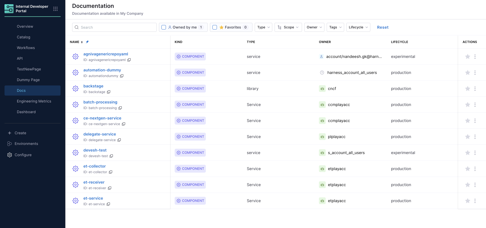

import Tabs from '@theme/Tabs';
import TabItem from '@theme/TabItem';

This document will take you through detailed steps to enable and publish Markdown documentation for your Software Catalog using **TechDocs**. 

---

## What is TechDocs?

**TechDocs** enables a docs-as-code approach where documentation lives alongside your source code in Git. Write docs in **Markdown**, commit them alongside your source code, and publish automatically. Your team can discover and access documentation instantly through the **Docs tab** in the Catalog; no more outdated wikis or scattered knowledge.

TechDocs is powered by the [TechDocs Backstage Plugin](https://backstage.io/docs/features/techdocs/) and uses **MkDocs** as the static site generator to transform your Markdown files into beautiful, searchable documentation.

### Key Benefits

- **Docs-as-code**: Version control your documentation alongside source code
- **Automatic publishing**: Documentation updates automatically when you commit changes
- **Centralized discovery**: All docs accessible through the Software Catalog
- **Markdown-based**: Simple, developer-friendly format
- **Always up-to-date**: Documentation evolves with your codebase

---

## Setup TechDocs for Catalog
To enable TechDocs for your component, you'll need to:

1. **Enable the TechDocs plugin** for your entity in your catalog entity's YAML file
2. **Create documentation** in Markdown format with an `mkdocs.yml` file
3. **Add the TechDocs annotation** to specify where your documentation is located



:::info Requirements
Your documentation files must be in **Markdown format** with an `mkdocs.yml` file present in the specified path.
:::

---

## Documentation Location Options

You can add documentation for your component in two ways:

1. **Co-located with source code**: Documentation lives in the same repository as your component's source code
2. **Separate location**: Documentation is stored in a different repository or directory

<Tabs queryString="enable-docs-location">
<TabItem value="docs-available-in-root" label="Co-located with Source Code">

## Option 1: Co-located with Source Code

When your documentation lives in the same repository as your component's source code:

### Step 1: Create Documentation Structure

Create a `docs` directory next to your `catalog-info.yaml` file:

```sh
├── catalog-info.yaml
└── docs
    └── index.md
```

### Step 2: Create Documentation Content

Inside the `docs` directory, create an `index.md` file with your documentation content. Here's a basic example:
```
# Welcome!

This is a basic example of documentation. It is intended to showcase some of the
features that TechDocs provides out of the box.

## Basic Markdown

Headings:

# h1

## h2

### h3

#### h4

##### h5

###### h6

Here is a bulleted list:

- Item one
- Item two
- Item Three

Check out the [Markdown Guide](https://www.markdownguide.org/) to learn more about how to
simply create documentation.

You can also learn more about how to configure and set up this documentation in Backstage,
[read the TechDocs Overview](https://backstage.io/docs/features/techdocs/).

## Table example

While this documentation isn't comprehensive, in the future it should cover the following
topics outlined in this example table:

| Topic   | Description                                                  |
| ------- | ------------------------------------------------------------ |
| Topic 1 | An introductory topic to help you learn about the component. |
| Topic 2 | A more detailed topic that explains more information.        |
| Topic 3 | A final topic that provides conclusions and lessons learned. |

## Learn more about MkDocs

TechDocs uses MkDocs as the static site generator. Visit https://www.mkdocs.org for more information about MkDocs.
```

### Step 3: Add TechDocs Annotation

Edit your `catalog-info.yaml` and add the TechDocs annotation in the `metadata.annotations` field:

```yaml
metadata:
  annotations:
    backstage.io/techdocs-ref: dir:.
```


The `dir:.` annotation indicates that:
- Documentation source code lives in the same location as the `catalog-info.yaml` file
- The `docs` folder is a sibling of `catalog-info.yaml` (in the same directory)

</TabItem>
<TabItem value="docs-not-in-root" label="Separate Location">

## Option 2: Separate Location

When your TechDocs source content is managed in a location separate from your `catalog-info.yaml`, specify a URL location reference using the `url:` prefix instead of `dir:`. Ensure the specified path contains the `mkdocs.yml` file.

### Supported Git Providers

**Harness Code Repository:**
- Account scope: `url:https://app.harness.io/ng/account/account_id/module/code/repos/repo_name`
- Organization scope: `url:https://app.harness.io/ng/account/account_id/module/code/orgs/org_id/repos/repo_name` 
- Project scope: `url:https://app.harness.io/ng/account/account_id/module/code/orgs/org_id/projects/project_id/repos/repo_name`

**Third-Party Git Providers:**
- **GitHub**: `url:https://githubhost.com/org/repo/tree/<branch_name>`
- **GitLab**: `url:https://gitlabhost.com/org/repo/tree/<branch_name>`
- **Bitbucket**: `url:https://bitbuckethost.com/project/repo/src/<branch_name>`
- **Azure**: `url:https://azurehost.com/organization/project/_git/repository`

:::tip Subdirectory Support
You can provide a path to a non-root directory inside the repository that contains the `mkdocs.yml` file and `docs/` directory.

Example: `url:https://github.com/backstage/backstage/tree/master/plugins/techdocs-backend/examples/documented-component`
:::

### Add TechDocs Annotation

Edit your `catalog-info.yaml` and add the TechDocs annotation with the URL reference:

```yaml
metadata:
  annotations:
    backstage.io/techdocs-ref: url:https://github.com/backstage/backstage/tree/master/plugins/techdocs-backend/examples/documented-component
```

</TabItem>
</Tabs>

---

