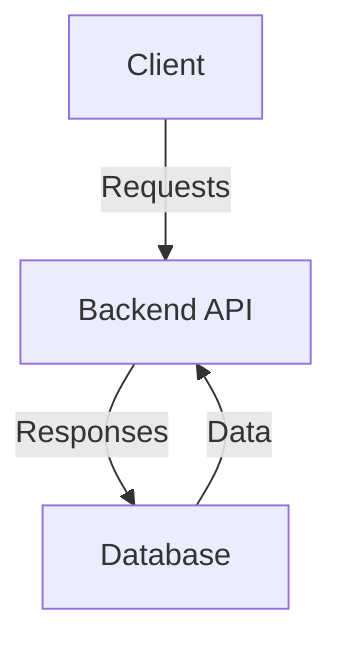
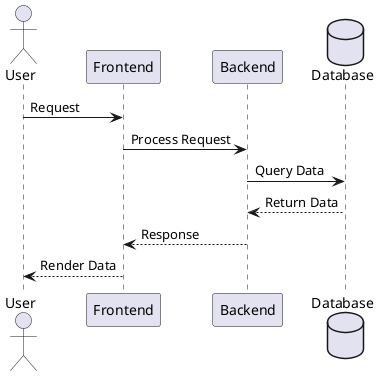
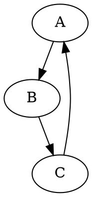

import DocVideo from '@site/src/components/DocVideo';

TechDocs leverages **MkDocs** to convert Markdown files into static documentation sites, following the [docs-like-code](https://www.docslikecode.com/) philosophy. This guide covers best practices for creating effective documentation, including site structure, diagrams, videos, and advanced features.

---

## Documentation Site Structure

### Single-Page Documentation

Single-page documentation is ideal for quick-start guides, FAQs, or standalone documentation that doesn't require complex navigation.

**When to use:**
- Simple project documentation
- Quick reference guides
- FAQ pages
- Getting started tutorials

**Setup:**

1. Create a `docs` folder in your repository
2. Add a single `README.md` or `index.md` file with your content
3. Register the repository in your `catalog-info.yaml` with the TechDocs annotation

TechDocs will automatically render the content without additional configuration.

---

### Multi-Page Documentation

For comprehensive documentation requiring hierarchical navigation and better content organization, use multi-page sites.

#### Option 1: Auto-Generated Navigation

MkDocs automatically generates navigation based on your folder and file structure—no configuration required.

**Example directory structure:**

```sh
/docs
  |-- index.md
  |-- guide/
       |-- getting-started.md
       |-- troubleshooting.md
  |-- reference/
       |-- api.md
```

**Resulting navigation:**
- Home
- Guide
  - Getting Started
  - Troubleshooting
- Reference
  - API

**Optional `mkdocs.yml` configuration:**

```yaml
site_name: Project Documentation
plugins:
  - techdocs-core
```

:::info
With auto-generated navigation, you can include an `mkdocs.yml` file for site configuration (like `site_name` and `plugins`), but you **cannot** define a custom `nav` section. If no `mkdocs.yml` is present, TechDocs creates a basic configuration automatically.
:::

---

#### Option 2: Custom Navigation

For precise control over navigation structure and ordering, define a `nav` section in your `mkdocs.yml` file.

**Example `mkdocs.yml` with custom navigation:**

```yaml
site_name: Project Documentation
plugins:
  - techdocs-core
nav:
  - Home: index.md
  - Guide:
      - Getting Started: guide/getting-started.md
      - Troubleshooting: guide/troubleshooting.md
  - Reference:
      - API: reference/api.md
```

:::tip
Always include the `techdocs-core` plugin for compatibility with TechDocs. See this [example mkdocs.yml](https://github.com/backstage/backstage/blob/master/mkdocs.yml) for reference.
:::

**Video tutorial:**

<DocVideo src="https://www.youtube.com/embed/S8kjTy5GBuQ?si=yAaIWdrzEkSSIVB_&amp;start=88" />

---

## Add Diagrams and Images

Visual elements like diagrams and images enhance documentation clarity and understanding.

### Static Images (PNG, JPG, SVG)

**Directory structure:**

Store images in the `docs` folder or a subdirectory (commonly `docs/static`):

```sh
/docs
  |-- index.md
  |-- static/
       |-- architecture-diagram.png
```

**Reference in Markdown:**

```markdown

```

**Path guidelines:**
- If image is at `/docs/static/architecture-diagram.png`, use: `static/architecture-diagram.png`
- If image is at `/docs/architecture-diagram.png`, use: `architecture-diagram.png`
- Always use relative paths from the Markdown file's location

---

### Diagrams as Code

Create diagrams directly in Markdown using diagram-as-code tools. TechDocs supports multiple diagram formats through the `techdocs-core` plugin.

#### Mermaid Diagrams

Mermaid is supported out of the box and ideal for flowcharts, sequence diagrams, Gantt charts, and more.

```sh
### System Architecture Diagram




#### Supported Diagram Types:
- Flowcharts
- Sequence Diagrams
- Gantt Charts
- Pie Charts

For more syntax options, refer to the [Mermaid documentation](https://mermaid-js.github.io/mermaid/).

#### Instructions to use in local environment:

- Ensure the `mkdocs-mermaid2-plugin` is installed and configured in your `mkdocs.yml`.   

```YAML
plugins:
    - mermaid2
```

For more information refer [here](/docs/internal-developer-portal/catalog/integrate-tools/techdocs/working-with-techdocs-locally)

---

### PlantUML for Advanced Diagrams

PlantUML is ideal for more detailed and customizable diagrams, such as class diagrams, activity diagrams, and deployment diagrams.

#### Example Usage:
- In your Markdown file:

```sh
### Deployment Diagram



#### Instructions to use in local environment:
- PlantUML is available as part of the `techdocs-core` plugin.  

```YAML
plugins:
    - techdocs-core
```
For more information refer [here](/docs/internal-developer-portal/catalog/integrate-tools/techdocs/working-with-techdocs-locally)

---

### Graphviz diagrams

Allows inline rendering of Graphviz diagrams (DOT language) directly in Markdown files.

Example Usage

```markdown
# Inline Graphviz Diagram



#### Instructions to use in local environment:
- Graphviz is available as part of the `techdocs-core` plugin.  

```YAML
plugins:
    - techdocs-core
```
For more information refer [here](/docs/internal-developer-portal/catalog/integrate-tools/techdocs/working-with-techdocs-locally)

---

## Embed Videos in TechDocs

Embedding videos enriches documentation, especially for tutorials or product demonstrations.

### Embed Videos Using iframe

To embed videos hosted on platforms like YouTube or Vimeo, use the following syntax:

```markdown
<iframe 
  width="560" 
  height="315" 
  src="https://www.youtube.com/embed/VIDEO_ID" 
  title="Video title" 
  frameborder="0" 
  allow="accelerometer; autoplay; clipboard-write; encrypted-media; gyroscope; picture-in-picture" 
  allowfullscreen>
</iframe>
```
- Replace `VIDEO_ID` with the unique ID of the video from the platform (e.g., dQw4w9WgXcQ for YouTube).
- Adjust width and height for desired sizing.

#### Allowed Domains:
To maintain security and compatibility, only embed videos from the following domains are allowed:

- youtube.com
- www.youtube.com
- youtu.be
- www.youtu.be
- drive.google.com
- zoom.us
- loom.com
- sharepoint.com
- dropbox.com
- docs.google.com

**Note:**
> Iframe-based videos cannot be rendered locally when using tools like techdocs-cli to preview documentation. They will render correctly only when the TechDocs site is hosted and accessed through the Internal Developer Portal (IDP).

### Embed Self-Hosted Videos
For videos hosted in your repository or accessible via a direct URL, use the Markdown `<video>` tag:

```markdown
<video controls>
  <source src="https://www.example.com/path-to-video.mp4" type="video/mp4">
</video>
```
- Use this method for `.mp4` or other self-hosted video formats stored in the repository. 


---

## Create download links for static assets

You may want to make files available for download by your users such as PDF documents, images, or code templates. Download links for files included in your docs directory can be made by adding `{: download }` after a Markdown link.

```sh
[Link text](https://example.com/foo.jpg){: download }
```
The user's browser will download the file as `download.jpg` when the link is clicked.

Specify a file name to control the name the file will be given when it is downloaded:

```sh
[Link text](https://example.com/foo.jpg){: download="foo.jpg" }
```

---

