import Tabs from '@theme/Tabs';
import TabItem from '@theme/TabItem';

<Tabs queryString="version">
<TabItem value="IDP 2.0 (New)" label="IDP 2.0 (New)">

:::tip For IDP 2.0 Customers
If you're using Harness IDP 2.0, please ensure you have reviewed the [IDP 2.0 Overview guide](/docs/internal-developer-portal/idp-2o-overview/2-0-overview-and-upgrade-path.md) and are familiar with the key steps for [upgrading to IDP 2.0](/docs/internal-developer-portal/idp-2o-overview/migrating-idp-2o.md). To enable IDP 2.0, you must raise a support ticket to activate the `IDP_2_0` feature flag for your account.
:::

The **Software Catalog** is a centralized registry for all your software assets — including components, services, websites, libraries, data pipelines, and more.
Think of it as a curated directory of all your **entities**, helping you efficiently track ownership, metadata, and dependencies across your entire software ecosystem.

## What’s new for Catalog in IDP 2.0?
Harness IDP 2.0 represents a major evolution of the Internal Developer Portal, built on a Harness-native data model designed for enterprise-scale environments and robust access control. Here's what’s changing in IDP 2.0 for the Software Catalog:

- **Harness-native Platform Hierarchy:** Catalog entities and workflows now support Account, Org, and Project scopes, with built-in, fine-grained RBAC.

- **No YAML Required:** Create and modify entities directly within the UI—no need to manage YAML files or deal with Git operations.

- **Revamped Catalog UI:** A fresh user experience featuring an updated Catalog table with filters, enhanced navigation, and a built-in entity creation interface.

## Creating Entities [IDP 2.0]
With IDP 2.0, we are moving towards a Harness-native Data Model designed for enterprise scale and access control. There are different entities within the Harness-native Data Model. To learn more about the Harness IDP entities, go to [Data Model](/docs/internal-developer-portal/catalog/data-model.md#harness-idp-entities)

There are two ways to add and create a new entity in your catalog:
- **Create an entity via the Harness IDP UI**:
Use the **Harness UI** to create entities directly—no YAML required. This method offers a streamlined, code-free experience for adding entities.
- **Create an entity using your catalog YAML**:
You can still create entities using your **existing catalog YAML** files. Harness will automatically convert **legacy Backstage YAML** into the new Harness Catalog Entity Model and register the corresponding entity.


### Harness IDP UI
In **IDP 2.0**, you can now create new entities directly from the **Harness IDP UI** —eliminating the need to manually manage YAML files. With this release, **"inline entities"** are fully supported, allowing you to manage the entire entity lifecycle through the UI or APIs—no Git operations required. This makes it easier for any developer to onboard into the portal without learning Backstage-specific YAML conventions.

To create a new entity, navigate to the Harness IDP portal and click on **“Create”** from the side-bar menu. Choose the desired entity type, and follow these steps:
  1. You’ll be redirected to the **"Visual View"**, where you can input entity details and begin the creation process.
  2. Enter the required entity information. The **Visual view** is synced in real-time with the **YAML view** for full transparency.
  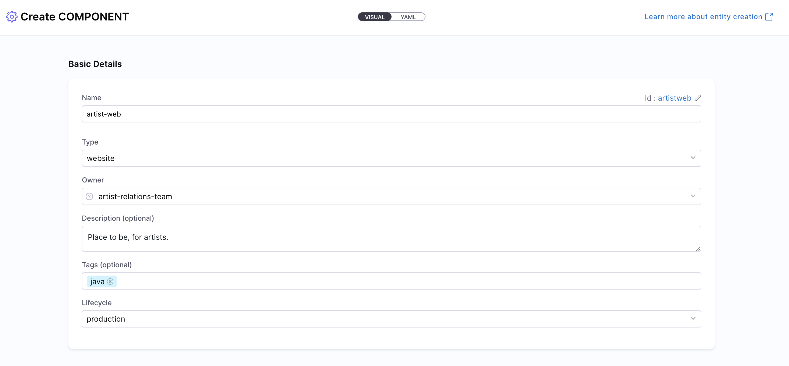
  3. Define the **entity scope** — choose whether the entity should reside at the Account, Project, or Organization level. Read more about Catalog RBAC.
  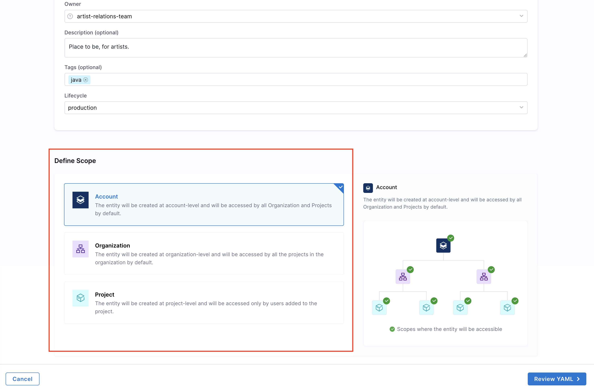
  
  4. **Associate with System Entities**
     Systems in Harness IDP are high-level catalog entities used to logically group related components, APIs, and resources. Associating your component with one or more Systems helps organize the catalog and improves visibility.

     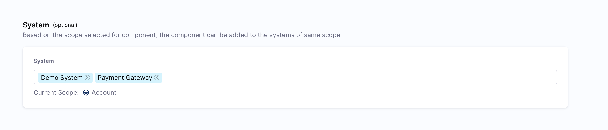

     You can select one or more Systems from the dropdown. This creates a relationship between your component and the selected Systems, making it easier to discover related entities and understand your software ecosystem.

     > If you don't see the System you need, you can [create a new System entity](/docs/internal-developer-portal/catalog/system-entity.md) first.
  
  5. **Link to Source Code Repository**
     Configure the source code repository associated with this component. This link enables several key capabilities, such as:
     
     * Automatically configuring plugins like **Scorecards**, **TechDocs**, and **STO**
     * Displaying the **View Source** option in the UI

     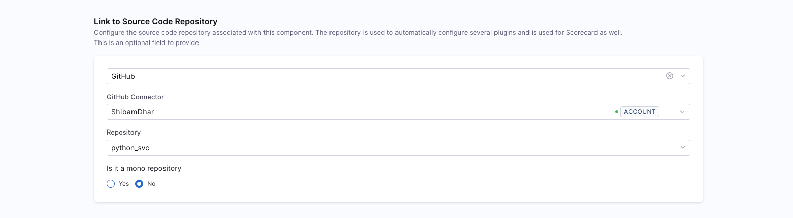

     This field is **optional**, but strongly recommended if your component is tied to a Git-based workflow or needs source-aware plugins. Note that the source code repository link is scoped to the same level as the entity itself (Account, Organization, or Project).
     > Harness IDP also auto-generates the legacy `backstage.io/source-location` annotation for backwards compatibility.
  
  6. Choose how you want to manage the entity:
    * **Inline (default):** Manage the entity YAML directly within Harness.
    * **Remote:** Choose to store your entity YAML in a Git repository for version control, collaboration, and change tracking.
    You can either use a **Harness Code Repository** or connect to a **Third-party Git provider** like GitHub or GitLab by selecting a Git connector, repository, branch, and YAML path.
      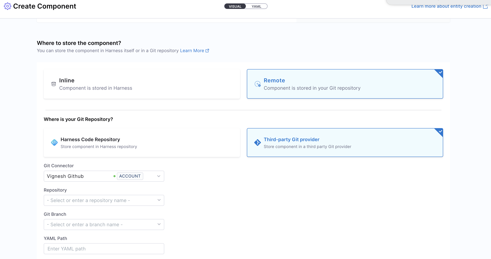
      > The Git Experience is ideal for teams who prefer to manage entities as code. Learn more in the [Git Experience Journey](/docs/internal-developer-portal/git-experience/gitx-journey.md).
  7. Click on **“Review YAML”** to view the auto-generated YAML. Since there's a live sync between the Visual and YAML views, changes in one will reflect in the other.

    :::info
     **YAML validation** is performed to ensure compatibility with the **Harness-native Catalog YAML** model. Any errors will be shown in the Validation logs.
    Ensure your `identifier` follows [naming rules](https://developer.harness.io/docs/platform/references/entity-identifier-reference/#identifier-naming-rules). Invalid identifiers may lead to entity registration errors.
    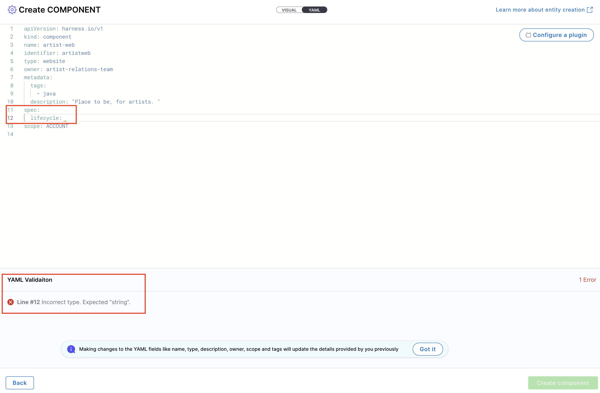
    :::

  8. If needed, **configure a plugin** by referring to its documentation and adding the required annotations in the Catalog YAML.
  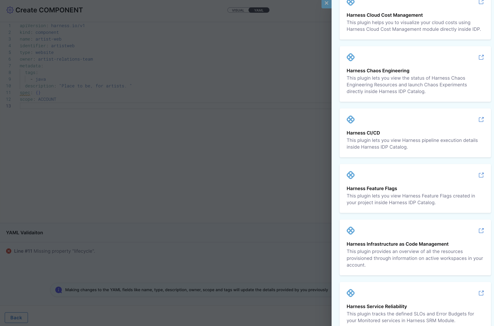
  9. Once everything is set, click **“Create Component”** to finalize and create the entity.
  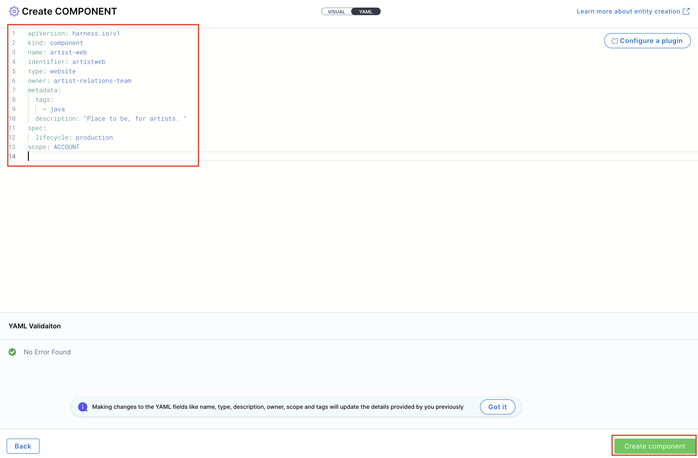

### Catalog with Git Experience (GitX)

When you choose to manage your entity YAML via a Git repository (Remote mode), Harness IDP enables full Git integration through GitX.

This adds advanced capabilities to your catalog experience, including:

- **Branch selection**: Choose from any available Git branches (e.g., `main`, `dev`, or feature branches) from a dropdown in the Catalog view.
- **File path visibility**: Easily identify which YAML file and location are powering your entity.
- **Real-time sync**: Changes made to the YAML file in Git (e.g., via PR or commit) are reflected in the IDP UI, and updates made via the UI are pushed to the Git repo.
- **Pull request collaboration**: Git-backed entities enable auditability and team collaboration using version control workflows.

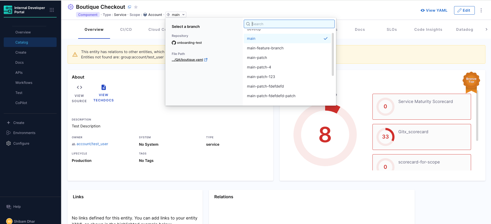

This makes it easy to track, version, and collaborate on entity definitions as code, while still leveraging the UI for updates and metadata insights.

> This Git-backed entity mode requires a Git connector and a repository path configuration during entity creation.
:::note
While you can view and edit entity YAML across multiple Git branches, the entity registered in the Software Catalog will always reflect the YAML from the repository’s **default branch** (e.g., `main`). Ensure that any final changes are merged to the default branch to be considered active in IDP.
:::
### Catalog YAML
You can also use the [Catalog YAML](/docs/internal-developer-portal/catalog/catalog-yaml.md) to create entities in Harness IDP. With IDP 2.0, you are required to follow the new Harness-native Data Model and structure when defining entities in Catalog YAML. If you have existing entities defined using **legacy Backstage YAML**, you can still use them—Harness will automatically convert them into the Harness-native Data Model format. Learn more about the new data model here. To create a new entity, navigate to the Harness IDP portal and click **“Create”** from the side-bar menu.

  :::info
  If you have a **legacy Backstage YAML**, you can still use it to create an entity. Harness will automatically convert it into the native **Catalog Entity Model** format.
  :::

1. You’ll be redirected to the **Visual View**. You can switch to the **YAML View** using the toggle at the top of the screen. This allows you to directly edit the entity's YAML definition.
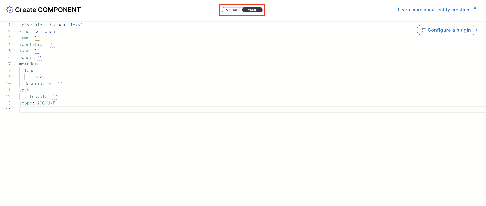
2. If you’re using a **legacy Backstage YAML**, paste it into the YAML view. Harness will convert it into the **Harness-native format** automatically. You can then proceed to finalize and create the entity. Since the Visual and YAML views are **live-synced**, changes made in one view will reflect in the other.
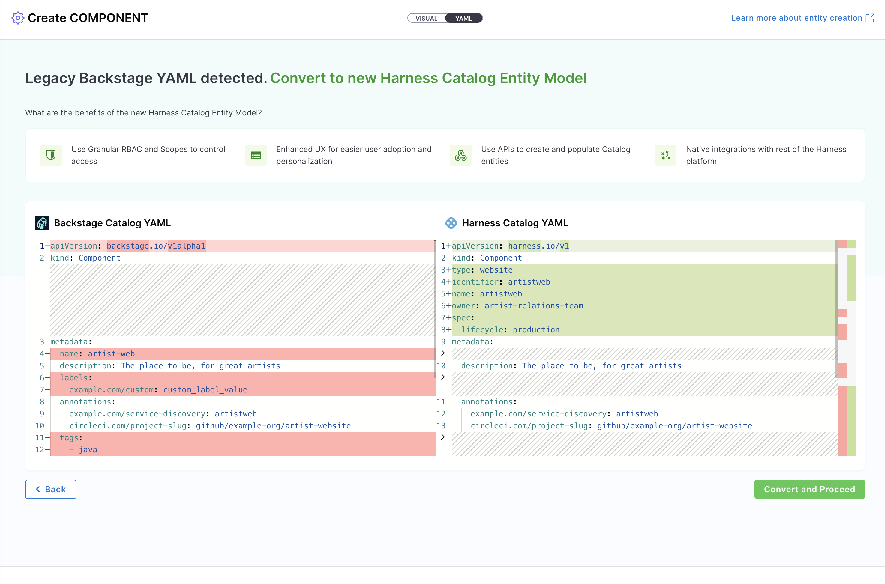

:::info
Note: **YAML validation** is automatically performed to ensure compatibility with the **Harness-native Catalog YAML model**. Any validation errors will be displayed in the Validation Logs. Ensure your `identifier` follows [naming rules](https://developer.harness.io/docs/platform/references/entity-identifier-reference/#identifier-naming-rules). Invalid identifiers may lead to entity registration errors.

:::

3. You can define the **scope** of the entity in two ways: either switch to the Visual View and select the desired scope, or specify the **[projectIdentifier](/docs/internal-developer-portal/catalog/catalog-yaml.md#projectidentifier)** or **[orgIdentifier](/docs/internal-developer-portal/catalog/catalog-yaml.md#orgidentifier)** directly in the YAML to set the project or organization scope.


4. To **associate your entity with System Entities** in YAML, add the `system` field to the `spec` section. You can specify multiple Systems by providing an array of System entity references:

```yaml
apiVersion: harness.io/v1
kind: Component
name: MyServiceComponent
identifier: my-service-component
type: service
owner: team-backend
projectIdentifier: myproject  # Set scope level as needed
spec:
  system:
    - system:account/payment-system
    - system:account/api-gateway-system
  # Other spec fields...
```

This creates a relationship between your component and the specified Systems, making it easier to discover related entities and understand your software ecosystem. Each System reference follows the format `system:[scope]/[identifier]`.

5. Define **Link to Source Code Repository** to configure the source code repository associated with this component. This link enables several key capabilities, such as, Automatically configuring plugins and Displaying the **View Source** option in the UI
This field is **optional**, but strongly recommended if your component is tied to a Git-based workflow or needs source-aware plugins.

```yaml
   spec:
       sourceCode:
        branch: main
        monoRepo: true
        isHarnessCodeRepo: false
        provider: Github
        repoName: idp-template
        connectorRef: account.ShibamDhar
        monoReposubDirectoryPath: /harness
```

   > Harness IDP also auto-generates the legacy `backstage.io/source-location` annotation for backwards compatibility.

6. Choose how you want to manage the entity:
    * **Inline (default):** Manage the entity YAML directly within Harness.
    * **Remote:** Choose to store your entity YAML in a Git repository for version control, collaboration, and change tracking.
    You can either use a **Harness Code Repository** or connect to a **Third-party Git provider** like GitHub or GitLab by selecting a Git connector, repository, branch, and YAML path.
      
      > The Git Experience is ideal for teams who prefer to manage entities as code. Learn more in the [Git Experience Journey](/docs/internal-developer-portal/git-experience/gitx-journey.md).

5. If needed, **configure a plugin** by referring to the plugin’s documentation and adding the appropriate **annotations** in the Catalog YAML.
6. Once all details are complete, click **“Create Component”** to finalize and register your entity in the catalog.

## Editing Entities [IDP 2.0]
You can now modify your entities directly from the **Harness IDP UI**, removing the dependency on manually editing the Catalog YAML file in your Git repository. This streamlines the update process and makes entity management much easier.

To edit an entity:
1. Navigate to the **Catalog** and select the entity you want to modify.
2. In the entity details view, click on **Edit** in the top-right corner.
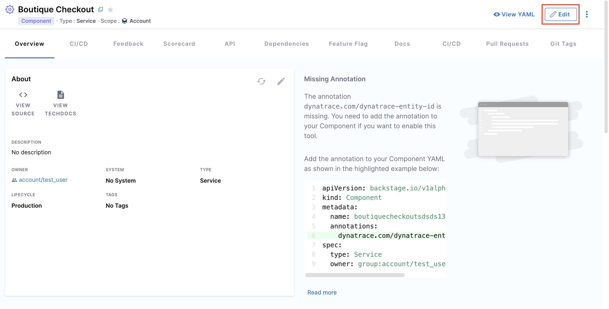
3. You can update the entity using either the **Visual View** or the **YAML View**. Both views are live-synced—changes made in one will instantly reflect in the other.
4. Click **Save Changes** to apply and save your updates.

### Entity Inspector
You can also view the **entity’s YAML** by clicking **“View YAML”** from the entity details screen.
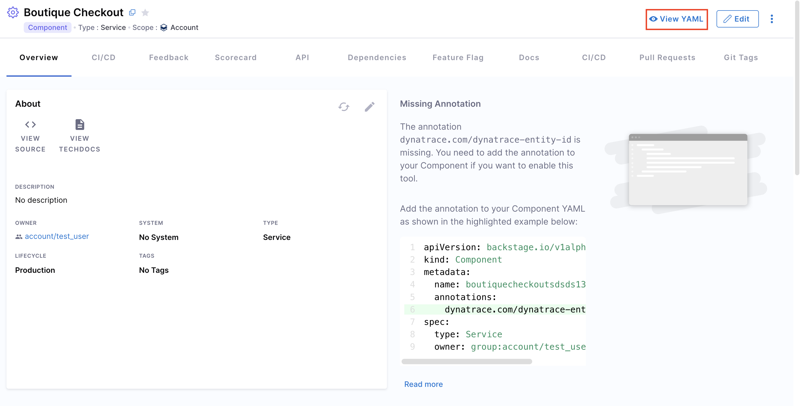

This opens the **Entity Inspector**, where you can review both the Raw YAML and Raw JSON representations.
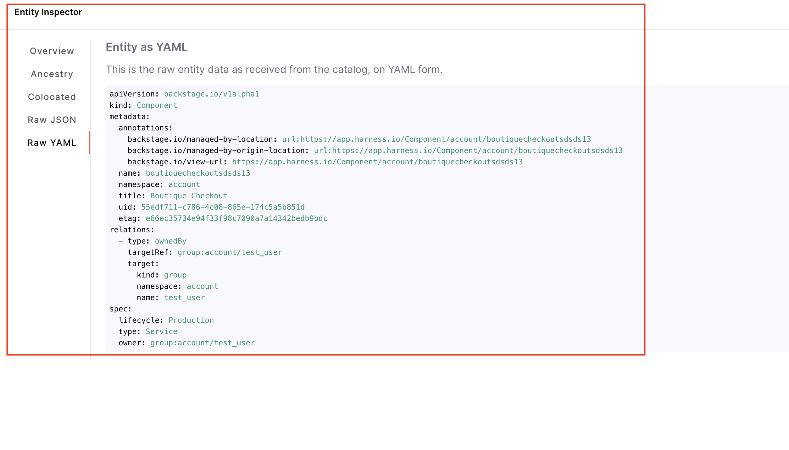


## Deleting Entities [IDP 2.0]
You can also **delete** any existing entity from the Software Catalog.

Here’s how to do it:
1. Navigate to your **Catalog** and select the entity you want to delete.
2. In the entity details view, click the **three-dot menu** in the top-right corner.
3. From the dropdown, select **Delete**. The entity will be removed from the catalog.

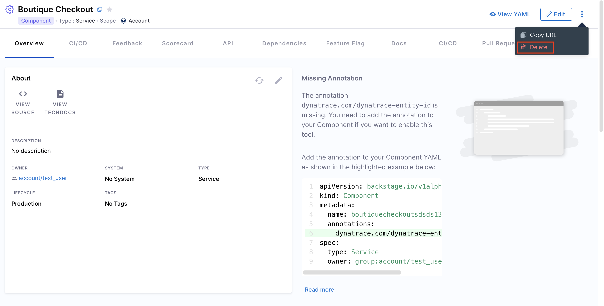

## Sharing Entities [IDP 2.0]
You can also copy the **entity URL** from the same dropdown menu and share it with others—provided they have the necessary access permissions.

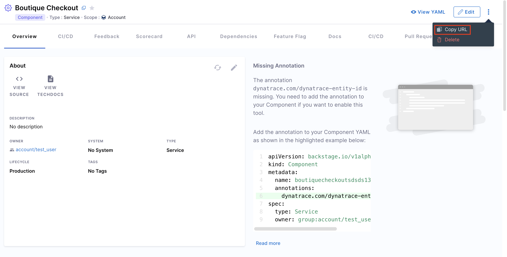

## Using Scopes & Filters [IDP 2.0]
With the revamped **Catalog UI**, you can now use various scopes and filters to efficiently track all your applications, services, and other entities. It offers intuitive filtering and a streamlined way to access and manage everything within your Catalog. This update also introduces visibility into scorecard data and scope-level details—right within the Catalog—so you get deeper insights without navigating away.

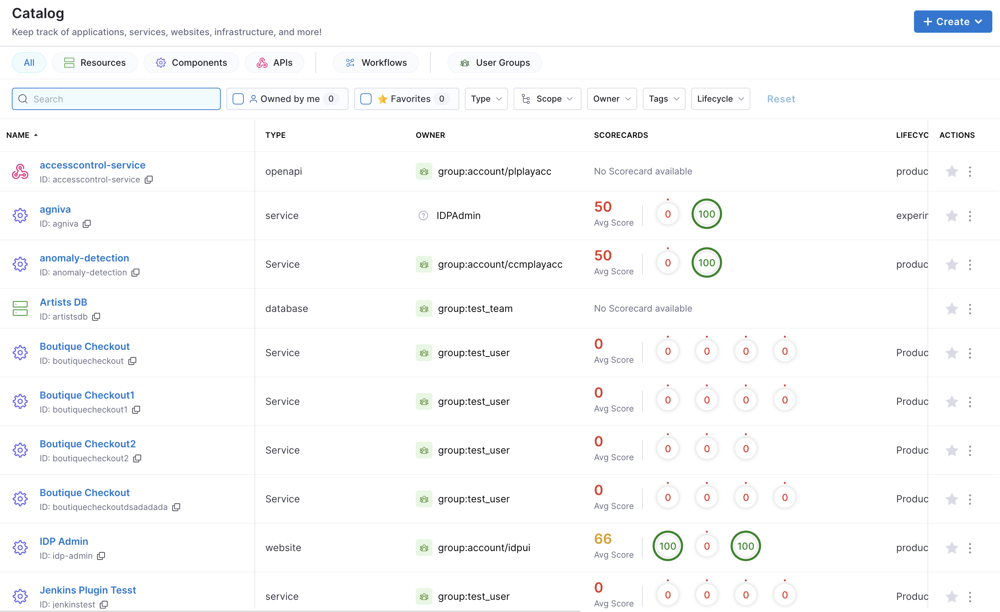

</TabItem>
<TabItem value="IDP 1.0" label="IDP 1.0">
<DocsTag  backgroundColor= "#cbe2f9" text="Tutorial"  textColor="#0b5cad"  />

<DocVideo src="https://www.youtube.com/embed/YgtIMDGMzJE?si=AYnisVn-lHX-4STw" />

## Create an IDP YAML [IDP 1.0]

The **IDP YAML** is a crucial descriptor file that provides metadata about the software components you register within our IDP. It serves as a blueprint, detailing essential information about each component, such as its name, description, owner, and other related metadata. This file ensures that our portal accurately represents and organizes the software components, making it easier for teams to discover and understand the tools and services available.

Although it's possible to name catalog entity descriptor files however you wish, we recommend that you name them `idp.yaml`.

:::info

`idp.yaml` follows the same [Descriptor Format of Catalog Entities](https://backstage.io/docs/features/software-catalog/descriptor-format#substitutions-in-the-descriptor-format) as Backstage.io.

:::

Follow the instructions [here](/docs/internal-developer-portal/catalog/catalog-yaml.md) to understand more on how to write a `catalog-info.yaml`

### Save the File

Save the file with the recommended name `idp.yaml or catalog-info.yaml` and upload it on your file in your Git repository. If it is a mono-repo, navigate to its directory and create a `idp.yaml` at the root of the directory. The file can technically live anywhere (for example, `.harness/idp.yaml`).

Following is an example of the same.

```yaml
apiVersion: backstage.io/v1alpha1
kind: Component
metadata:
  name: my-new-service
  description: Description of my new service
  annotations:
    pagerduty.com/integration-key: <sample-service-integration-key>
  tags:
    - java
  links:
    - url: https://admin.example-org.com
      title: Admin Dashboard
      type: admin-dashboard
spec:
  type: service
  lifecycle: production
  owner: team-a
  system: project-x
```

## Register with Harness IDP [IDP 1.0]

To register this component with Harness IDP, you'll need to submit this YAML file to the appropriate **API** endpoint or Register the existing component using **UI**.

<Tabs>
<TabItem value="Harness Platform">

Follow the steps below to register components in the Harness Platform UI:

1. Once the file is created in your git repo, copy the full URL to the file. For example, `https://github.com/harness-community/idp-samples/blob/main/catalog-info.yaml`.


2. In the left navigation, select **Create**, and then select **Register Software Component**.


3. Enter the URL to your new `idp.yaml`.


4. Click **Import**.


</TabItem>
<TabItem value="API">

Follow these steps to register components using the Harness Catalog API endpoint:

- Generate a Harness API Key as described in [Manage API keys](https://developer.harness.io/docs/platform/automation/api/add-and-manage-api-keys)
- Follow the following cURL command with the request body to register your component. The body takes two input at present `type` and `target`.

```cURL
curl --location 'https://idp.harness.io/<ACCOUNT_ID>/idp/api/catalog/locations' \
--header 'x-api-key: <HARNESS_TOKEN>' \
 --data-raw '{"type":"url","target":"https://github.com/harness-community/idp-samples/blob/main/catalog-info.yaml"}'
```

</TabItem>
</Tabs>

The new component is available in your catalog.


## Further Reading [IDP 1.0]

For those looking to expand their knowledge and explore more advanced methods of registering software components on Harness IDP, consider the following:

### GitHub Auto-Discovery Plugin

If you're aiming to register multiple components in the software catalog concurrently, the [GitHub auto-discovery plugin](https://developer.harness.io/docs/internal-developer-portal/plugins/available-plugins/github-catalog-discovery/) is a valuable tool. This plugin automates the discovery and registration of components, with all the IDP YAML located in single repo.

### Using the Catalog API

Another effective approach is leveraging the catalog API. By running a custom script as shown in the example below, you can automate the registration of components, providing a more programmatic method for bulk registrations.

```shell
#!/bin/bash

set -e

function usage {
    echo "usage: $0 [-a accountIdentifier] [-x xApiKey] [-u bearerAuthorization] [-l catalogLocations]"
    echo "  -a      Harness Account Identifier"
    echo "  -x      Harness X-API-KEY for the given account"
    echo "  -u      Harness Bearer Authorization from the logged in session"
    echo "  -l      Catalog locations to be registered in Harness IDP. Comma separated list of locations"
    exit 1
}

while getopts a:x:u:l:h flag
do
    case "${flag}" in
        a) ACCOUNT_ID=${OPTARG};;
        x) X_API_KEY=${OPTARG};;
        u) BEARER_AUTHORIZATION=${OPTARG};;
        l) CATALOG_LOCATIONS=${OPTARG};;
        h | ?) usage
    esac
done

echo -e "\nStarting catalog location registration for given location in Harness IDP...";

CATALOG_LOCATION_REGISTER_DATA='{"type":"url","target":"CATALOG_LOCATION_TARGET"}'

for LOCATION in ${CATALOG_LOCATIONS//,/ }
do
    echo -e "\n--------"
    echo "Registering $LOCATION catalog location in Harness IDP account $ACCOUNT_ID"

    POST_DATA=${CATALOG_LOCATION_REGISTER_DATA/CATALOG_LOCATION_TARGET/$LOCATION}

    RESULT_HTTP_CODE=$(curl --write-out %{http_code} -s --output /dev/null -H "Content-Type: application/json" -H "Harness-Account: $<ACCOUNT_ID>" -H "x-api-key: ${X_API_KEY}" -H "Authorization: Bearer ${BEARER_AUTHORIZATION}" -X POST --data "${POST_DATA}" "https://idp.harness.io/$<ACCOUNT_ID>/idp/api/catalog/locations")

    if [[ "$RESULT_HTTP_CODE" -ne 201 ]] ; then
        echo "Failed registering $LOCATION catalog location in Harness IDP account $ACCOUNT_ID"
    else
        echo "Successfully registered $LOCATION catalog location in Harness IDP account $ACCOUNT_ID"
    fi

    echo "--------"
done

echo -e "\nCompleted catalog location registration for given location in Harness IDP...";
```

</TabItem>
</Tabs>
