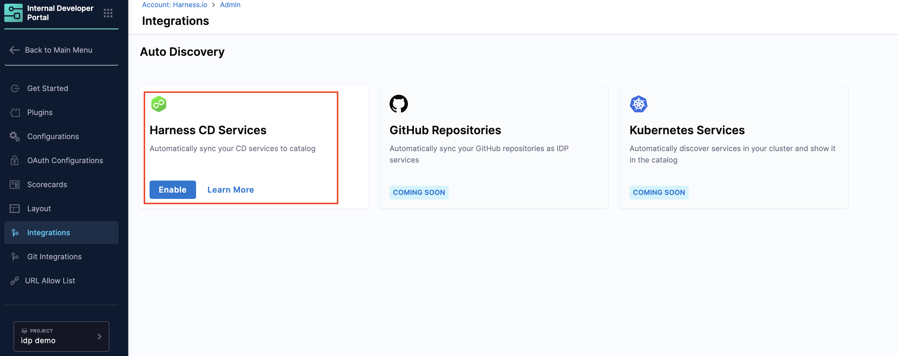
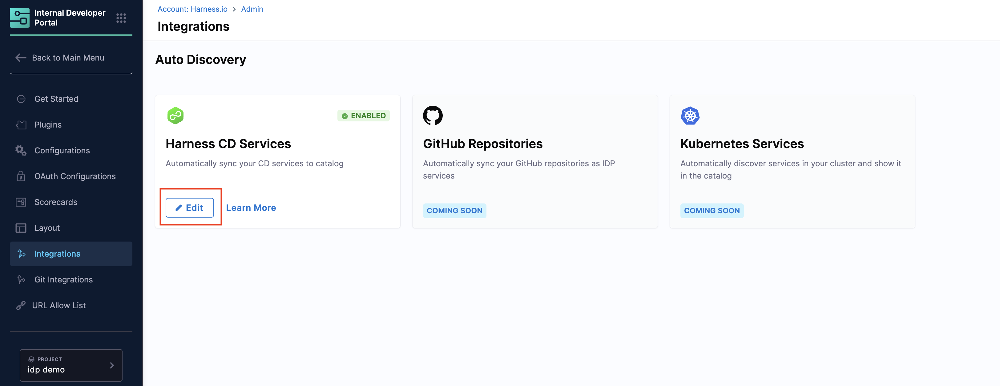
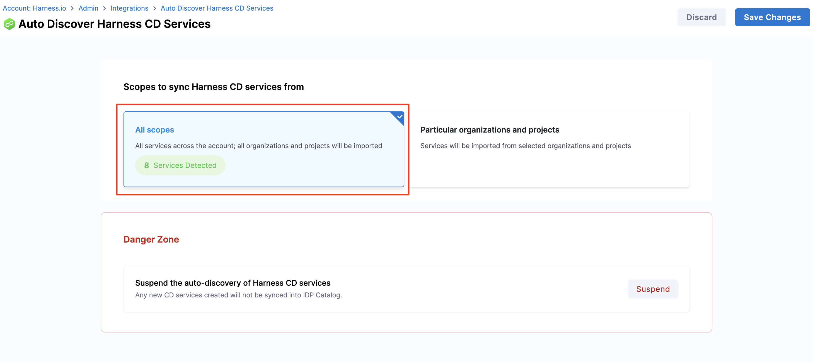
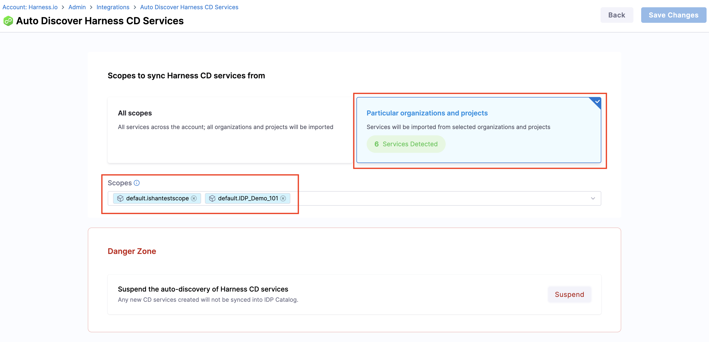
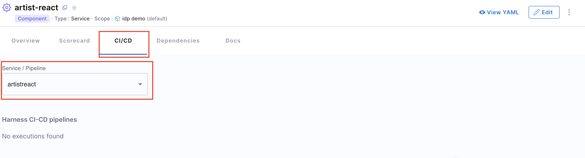
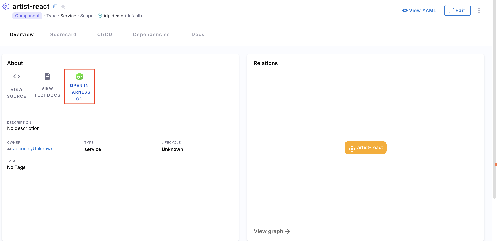
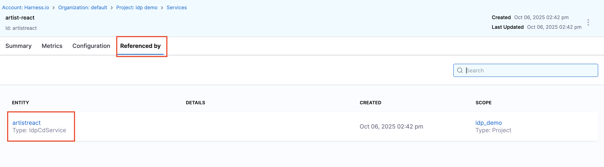
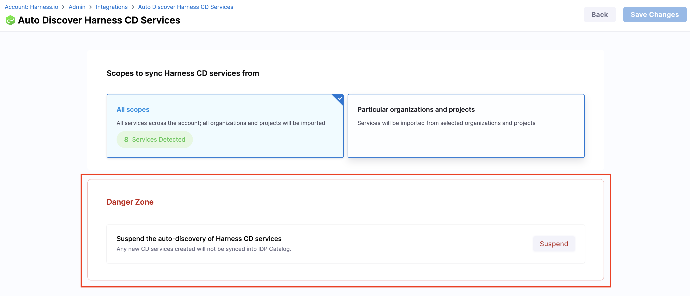

## Overview
This document is a detailed guide on how to use the **Harness IDP Catalog Auto-Discovery** integration to sync **Harness CD** services into the **IDP Catalog**. This integration populates your Catalog with CD services so you can sync, view, and manage them directly in Catalog. Services are created as **IDP service entities** and kept in **real-time, uni-directional sync** with their corresponding CD services.

---

## Before you begin
Make sure the following prerequisites are met:

1. The feature flag **`IDP_CATALOG_CD_AUTO_DISCOVERY`** is enabled. Contact [Harness Support](mailto:support@harness.io) to enable it.
2. **Harness CD** is enabled for your account. This must be the **same account** you use for Harness IDP.

---

## Catalog Auto-Discovery with Harness CD

### 1. Enable the Harness CD Auto-Discovery integration

1. In Harness IDP, go to **Configure** → **Integrations**.
2. On the **Harness CD services** integration card, select **Enable**.

### 2. Sync Harness CD services to the IDP Catalog

After enabling the integration, configure what to sync:

* **IDP entities created:**
  Each CD service appears in Catalog as an IDP entity with:

  * `kind: Component`
  * `type: Service`

* **Entity fields populated (read-only in IDP):**
  The following fields are fetched from the CD service and remain synced:

  * `name`
  * `identifier`
  * `description`
  * `tags`

  These fields **cannot be edited in IDP**. Update them in Harness CD.

* **IDP-CD Service Sync:**
  Sync is **uni-directional** from **CD service → IDP entity**. Changes made to the IDP entity are **not** propagated back to the CD service.

* **RBAC:**
  You can view and sync services from the same projects and organizations you have access to in Harness CD.

  ---

#### Configure the sync scope

1. On the same integration card, select **Edit**.

2. Choose a scope:

   * **All Scopes** — Sync services across the entire account (all organizations and projects).
   
   * **Particular Organizations & Projects** — Sync from selected organizations and/or projects using the dropdown.
   
3. Select **Save Changes** to begin syncing.

That’s it; your CD services will appear in the IDP Catalog.

For suspending auto-discovery, see [Suspend Auto-Discovery](/docs/internal-developer-portal/catalog/manage-catalog/catalog-discovery/harness-cd.md#4-suspend-auto-discovery).

### 3. View & manage CD services in the IDP Catalog

Once synced, search for any CD service in **IDP Catalog**:

* Open the entity to view all data synced from the CD service.
* The **CI/CD** plugin is automatically configured for the entity.

* Use **Open in Harness CD** on the entity overview to navigate to the service in CD.

#### Check the IDP entity reference in Harness CD

* In **Harness CD**, open the relevant CD service.
* Go to the **Referenced by** section.
* From there, open the corresponding IDP entity.

### 4. Suspend Auto-Discovery

To stop auto-discovery:

1. Go to **Configure** → **Integrations** → **Harness CD**, then select **Edit**.
2. Enable **Suspend Auto-discovery** and select **Save Changes**.

Auto-discovery is now suspended.

---

