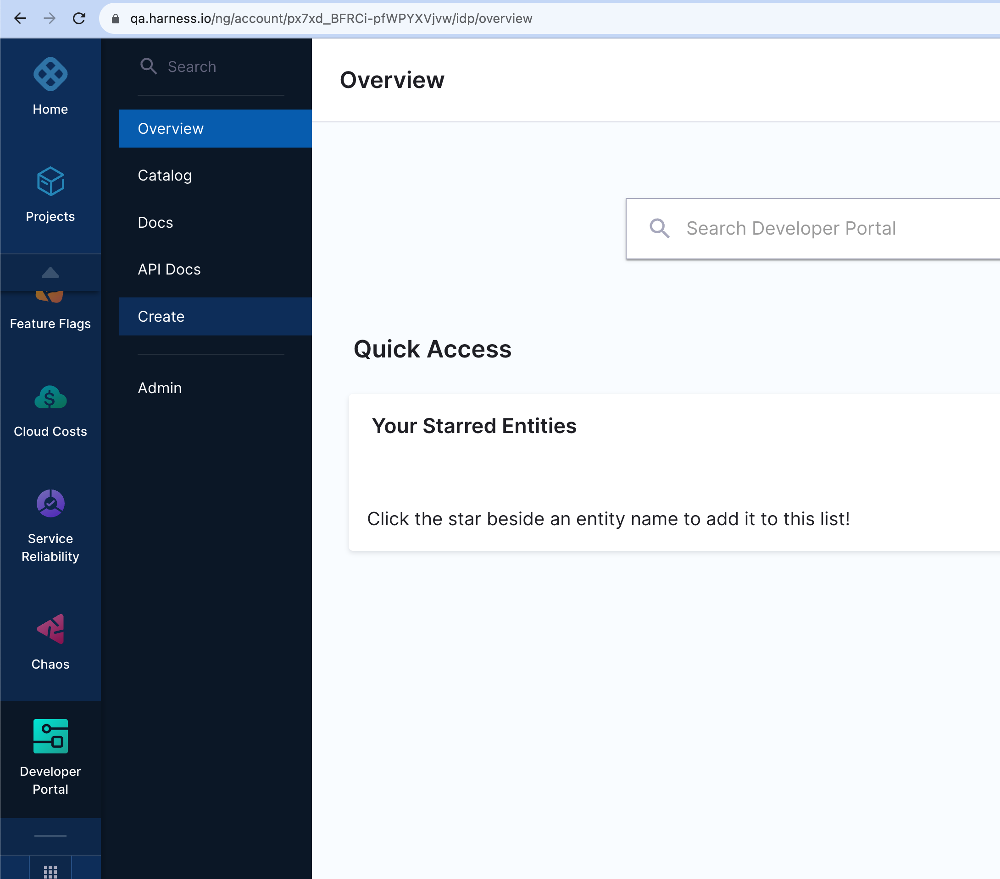
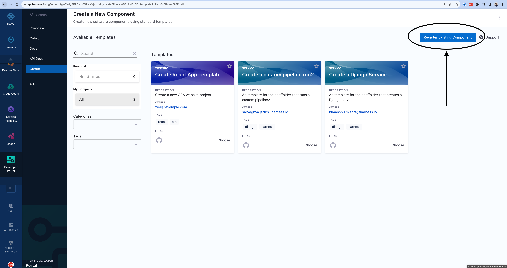

<DocsTag  backgroundColor= "#cbe2f9" text="Tutorial"  textColor="#0b5cad"  />

<DocVideo src="https://www.youtube.com/embed/YgtIMDGMzJE?si=AYnisVn-lHX-4STw" />

## Create an IDP YAML

The **IDP YAML** is a crucial descriptor file that provides metadata about the software components you register within our IDP. It serves as a blueprint, detailing essential information about each component, such as its name, description, owner, and other related metadata. This file ensures that our portal accurately represents and organizes the software components, making it easier for teams to discover and understand the tools and services available.

Although it's possible to name catalog entity descriptor files however you wish, we recommend that you name them `idp.yaml`.

:::info

`idp.yaml` follows the same [Descriptor Format of Catalog Entities](https://backstage.io/docs/features/software-catalog/descriptor-format#substitutions-in-the-descriptor-format) as Backstage.io.

:::

Follow the instructions [here](/docs/internal-developer-portal/catalog/how-to-create-idp-yaml) to understand more on how to write a `catalog-info.yaml`

### Save the file:

Save the file with the recommended name `idp.yaml or catalog-info.yaml` and upload it on your file in your Git repository. If it is a mono-repo, navigate to its directory and create a `idp.yaml` at the root of the directory. The file can technically live anywhere (for example, `.harness/idp.yaml`).

Following is an example of the same.

```yaml
apiVersion: backstage.io/v1alpha1
kind: Component
metadata:
  name: my-new-service
  description: Description of my new service
  annotations:
    pagerduty.com/integration-key: <sample-service-integration-key>
  tags:
    - java
  links:
    - url: https://admin.example-org.com
      title: Admin Dashboard
      type: admin-dashboard
spec:
  type: service
  lifecycle: production
  owner: team-a
  system: project-x
```

## Register with Harness IDP:

To register this component with Harness IDP, you'll need to submit this YAML file to the appropriate **API** endpoint or Register the existing component using **UI**.

import Tabs from '@theme/Tabs';
import TabItem from '@theme/TabItem';

<Tabs>
<TabItem value="Harness Platform">

Follow the steps below to register components in the Harness Platform UI:

1. Once the file is created in your git repo, copy the full URL to the file. For example, `https://github.com/harness-community/idp-samples/blob/main/catalog-info.yaml`.



2. In the left navigation, select **Create**, and then select **Register Software Component**.



3. Enter the URL to your new `idp.yaml`.


4. Click **Import**.


</TabItem>
<TabItem value="API">

Follow these steps to register components using the Harness Catalog API endpoint:

- Generate a Harness API Key as described in [Manage API keys](https://developer.harness.io/docs/platform/automation/api/add-and-manage-api-keys)
- Follow the following cURL command with the request body to register your component. The body takes two input at present `type` and `target`.

```cURL
curl --location 'https://idp.harness.io/{ACCOUNT_IDENTIFIER}/idp/api/catalog/locations' \
--header 'x-api-key: {X_API_KEY}' \
--header 'Harness-Account: {ACCOUNT_IDENTIFIER}'
 --data-raw '{"type":"url","target":"https://github.com/harness-community/idp-samples/blob/main/catalog-info.yaml"}'
```

</TabItem>
</Tabs>

The new component is available in your catalog.


## Further Reading

For those looking to expand their knowledge and explore more advanced methods of registering software components on Harness IDP, consider the following:

### GitHub Auto-Discovery Plugin

If you're aiming to register multiple components in the software catalog concurrently, the [GitHub auto-discovery plugin](https://developer.harness.io/docs/internal-developer-portal/plugins/available-plugins/github-catalog-discovery/) is a valuable tool. This plugin automates the discovery and registration of components, with all the idp yamls located in single repo.

### Using the Catalog API

Another effective approach is leveraging the catalog API. By running a custom script as shown in the example below, you can automate the registration of components, providing a more programmatic method for bulk registrations.

```shell
#!/bin/bash

set -e

function usage {
    echo "usage: $0 [-a accountIdentifier] [-x xApiKey] [-u bearerAuthorization] [-l catalogLocations]"
    echo "  -a      Harness Account Identifier"
    echo "  -x      Harness X-API-KEY for the given account"
    echo "  -u      Harness Bearer Authorization from the logged in session"
    echo "  -l      Catalog locations to be registered in Harness IDP. Comma seperated list of locations"
    exit 1
}

while getopts a:x:u:l:h flag
do
    case "${flag}" in
        a) ACCOUNT_IDENTIFIER=${OPTARG};;
        x) X_API_KEY=${OPTARG};;
        u) BEARER_AUTHORIZATION=${OPTARG};;
        l) CATALOG_LOCATIONS=${OPTARG};;
        h | ?) usage
    esac
done

echo -e "\nStarting catalog location registration for given location in Harness IDP...";

CATALOG_LOCATION_REGISTER_DATA='{"type":"url","target":"CATALOG_LOCATION_TARGET"}'

for LOCATION in ${CATALOG_LOCATIONS//,/ }
do
    echo -e "\n--------"
    echo "Registering $LOCATION catalog location in Harness IDP account $ACCOUNT_IDENTIFIER"

    POST_DATA=${CATALOG_LOCATION_REGISTER_DATA/CATALOG_LOCATION_TARGET/$LOCATION}

    RESULT_HTTP_CODE=$(curl --write-out %{http_code} -s --output /dev/null -H "Content-Type: application/json" -H "Harness-Account: ${ACCOUNT_IDENTIFIER}" -H "x-api-key: ${X_API_KEY}" -H "Authorization: Bearer ${BEARER_AUTHORIZATION}" -X POST --data "${POST_DATA}" "https://idp.harness.io/${ACCOUNT_IDENTIFIER}/idp/api/catalog/locations")

    if [[ "$RESULT_HTTP_CODE" -ne 201 ]] ; then
        echo "Failed registering $LOCATION catalog location in Harness IDP account $ACCOUNT_IDENTIFIER"
    else
        echo "Successfully registerd $LOCATION catalog location in Harness IDP account $ACCOUNT_IDENTIFIER"
    fi

    echo "--------"
done

echo -e "\nCompleted catalog location registration for given location in Harness IDP...";
```
