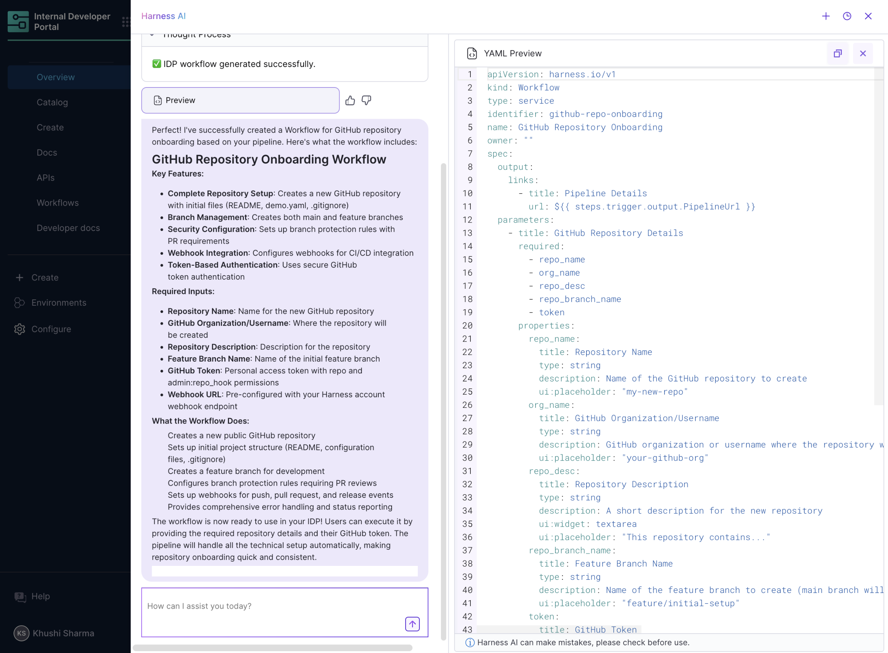

Harness IDP leverages AI to enhance discoverability and developer productivity across multiple layers of IDP. The following features outline the AI-driven capabilities currently implemented, focusing on semantic understanding, cross-module reasoning, and self-service orchestration.

---

## AI-Powered Search in IDP

### Overview
The AI Search feature in Harness IDP enables users to query and interact with existing IDP data such as Catalog entities, Scorecards, and Self-Service Workflows using natural language. This capability integrates with various Harness modules (CI, CD, STO, etc.) to deliver correlated insights from across the developer ecosystem.

### Key Features
1. **Entity-Aware Querying**:

Users can ask direct questions about any service or entity registered in the IDP Catalog:
- Ownership and responsible teams
- Repository and deployment locations
- Associated Kubernetes clusters

2. **Intelligent Scorecard Queries**: 

Developers can request detailed insights about Scorecards:
- View compliance status, failed/passed checks, and recommendations
- Ask how to improve a specific Scorecard score

3. **Self-Service Workflow Discovery and Execution**: 

Users can ask and query data around Self service Workflows: 
- Suggest existing Self-Service Workflows relevant to a user’s task. *Example: “How can I create a new deployment environment?”*
- Execute eligible workflows directly from chat
- Suggest parameters and inputs required for specific workflow execution

Users can also create Self-Service Workflows through this AI integration. They simply need to describe the intended use case, and the system will automatically generate the required Workflow YAML with all the detailed steps.

4. **Contextual Product Queries**

Harness IDP integrates AI documentation search, enabling queries such as:
- “How do I create a workflow that accepts inputs A, B, and C?”
- “What is the difference between pipeline templates and workflows?”

The feature leverages the existing IDP documentation corpus for accurate responses.

---

## AI Semantic Search in TechDocs

### Overview
Harness IDP extends its search capability with semantic understanding across all documentation sources integrated through TechDocs. This feature enables natural language querying of technical documents related to any entity in the Catalog, powered by embedding-based semantic retrieval.

### Core Functionality
Users can ask high-level or contextual questions such as:
- “How do I configure OAuth in Service X? Help me understand this using TechDocs”
- “What are the best practices for writing a Scorecard check? Help me understand this using TechDocs”
- “Where can I find onboarding documentation for API Gateway? Help me understand this using TechDocs”

The search uses **vector embeddings** to retrieve conceptually similar information, even if exact keywords are absent from entity’s techdocs. 

---

## Example Queries & Use Scenarios

| Use Case | Example Query | Response Type |
|----------|---------------|---------------|
| Catalog Entity Query | "What are the different scorecards configured for Auth Service?" | Owner metadata + Slack link + scorecard summary |
| Workflow Creation | "Generate a simple IDP Workflow using this service onboarding pipeline \<url\> which takes Z inputs. Use user token authentication." | Workflow YAML + all required steps and details to create a Workflow |
| Workflow Help | "I want to create a new Harness repo. Is there any IDP workflow for that?" | Workflow suggestion + approval workflow trigger |
| Documentation Search | "Steps to configure OAuth for service Y using TechDocs" | TechDocs pages |
| Scorecard Debug | "Why is my DORA check in Service quality scorecard for service X failing?" | Breakdown of failed checks + improvement suggestions |

----

## Implementation

### Prerequisites
The TechDocs semantic search feature is gated behind a feature flag (FF). Ensure the FF (`IDP_TECH_DOCS_SEMANTIC_SEARCH`) is enabled on your account. If it’s not, please contact Harness Support to enable it.

### Steps
1. A **Harness AI** chat icon appears at the bottom-right of the IDP interface.
2. **Open the chat**: Click the icon to launch Harness AI.
3. **Start a new conversation**: Enter your query and provide as much context as possible for higher-quality results (e.g., entity name, environment, goal).
4. **Manage conversations**: You can create multiple chats and review chat history from the **Harness AI** top navbar.

<DocVideo src="https://app.tango.us/app/embed/7ed4839b-f4cd-4aaa-9fe3-3ffbc4a2ec5a?skipCover=true&defaultListView=false&skipBranding=false&makeViewOnly=true&hideAuthorAndDetails=true" title="Harness IDP AI Use-cases" />

