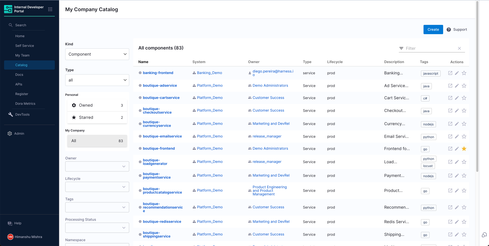

The software catalog is a centralized registry for all your software (services, websites, libraries, data pipelines, and so on), and it helps you track their ownership, metadata, and dependencies. The catalog is built from metadata YAML files, each of which is stored with its code and owned by a team. It is powered by the [Backstage Software Catalog](https://backstage.io/docs/features/software-catalog/).

## Component definition YAML

The definition for any component in the software catalog is stored in a YAML file (usually `catalog-info.yaml`) in your git repository. Usually the YAML files resides in the same repository as the software code. Following is a typical definition file:

```yaml
# file: catalog-info.yaml
apiVersion: backstage.io/v1alpha1
kind: Component
metadata:
  name: my-new-service
  description: Description of my new service
  annotations:
    pagerduty.com/integration-key: <sample-service-integration-key>
  tags:
    - java
  links:
    - url: https://admin.example-org.com
      title: Admin Dashboard
      icon: dashboard
      type: admin-dashboard
spec:
  type: service
  lifecycle: production
  owner: team-a
  system: project-x
```

For information about how to register a software component, go to [register a new software component](/docs/internal-developer-portal/get-started/register-a-new-software-component.md). For YAML reference documentation, go to [backstage.io](https://backstage.io/docs/features/software-catalog/descriptor-format).

## Software ecosystem modelling

The catalog is home to several types of software components such as services, websites, libraries, APIs, and even resources such as databases. Every component is owned by a team and is part of a system. When configured properly, the catalog is a graph of your entire software ecosystem. For information about how to model your software ecosystem, go to [backstage.io](https://backstage.io/docs/features/software-catalog/system-model).

## API access

You can access catalog APIs to retrieve software components from the catalog, register new components, or build your automation on top of it.

Start by generating a Harness API Key as described in [Manage API keys](/docs/platform/automation/api/add-and-manage-api-keys). Then, by using your Harness account ID and the API Key, you can make requests to the IDP catalog APIs as follows:

```
curl --location 'https://idp.harness.io/{ACCOUNT_IDENTIFIER}/idp/api/catalog/locations' \
--header 'x-api-key: {X_API_KEY}' \
--header 'Harness-Account: {ACCOUNT_IDENTIFIER}'
```

To learn more about the available catalog APIs supported by Backstage, go to [API](https://backstage.io/docs/features/software-catalog/software-catalog-api/).

## FAQs

### How can I update the definition of a software component?

Anyone can update the definition of a software component by updating the component's `catalog-info.yaml` file. You can also use the edit button on the catalog page to go to the component's source location.


Committed changes reflect on the catalog in 30 minutes. You can also press the refresh button on the catalog page to instantly sync the system with Git.

### How does the catalog read files from my Git repository?

IDP uses the Git connector you selected during the module onboarding process. To view or update the configured connector, go to **Internal Developer Portal** > **Admin** > **Connectors**.

### How do I add links to software components?

You can add links associated with the Software Components, which could be dashboards, support pages, runbooks, email groups, Slack channels, etc. Each link is an arbitrary name and URL pair, which can be accompanied by an icon for visual representation.

Once you register a Software Component in the Catalog, links can be shown on the catalog Overview, based on your IDP YAML.


Links appear in the **Links Card**. These links can be anything, such as:

- User and Group Management
- Infrastructure and Cloud
- Operational Dashboards
- Support and Help
- General Web and Information
- Notifications and Alerts
- And more

Links are quick bookmarks for the developers corresponding to the software component.

To add links to your software components in the catalog:

1. Select the edit icon on the overview page, which will redirect you to the IDP YAML.

   

2. Add `links` to the IDP YAML, as shown in the example below.

   Links have three attributes:

   - `url`: This is the actual web address or URL that the link points to. It's the destination users will be directed to when they click on the link.
   - `title`: This serves as the display name or label for the link. It gives users a brief idea of what to expect when they click on the link or where it might lead them.
   - `icon`: An optional attribute, you can select from a category of supported icon that provides a visual representation or hint about the nature or category of the link.

   The link attributes provide essential information and enhance the user experience by making navigation more intuitive and visually appealing. By categorizing and visually representing links, users can quickly find and access the resources they're interested in.

<details>
<summary>IDP YAML with links</summary>

```yaml
apiVersion: backstage.io/v1alpha1
kind: Component
metadata:
  name: artist-lookup
  description: Artist Lookup
  tags:
    - java
    - data
  links:
    - url: https://example.com/user
      title: Examples Users
      icon: user
    - url: https://example.com/group
      title: Example Group
      icon: group
    - url: https://example.com/cloud
      title: Link with Cloud Icon
      icon: cloud
    - url: https://example.com/dashboard
      title: Dashboard
      icon: dashboard
    - url: https://example.com/help
      title: Support
      icon: help
    - url: https://example.com/web
      title: Website
      icon: web
    - url: https://example.com/alert
      title: Alerts
      icon: alert
  annotations:
    backstage.io/linguist: 'https://github.com/backstage/backstage/tree/master/plugins/playlist'
spec:
  type: service
  lifecycle: experimental
  owner: team-a
  system: artist-engagement-portal
  dependsOn: ['resource:artists-db']
  apiConsumedBy: ['component:www-artist']
```

</details>
