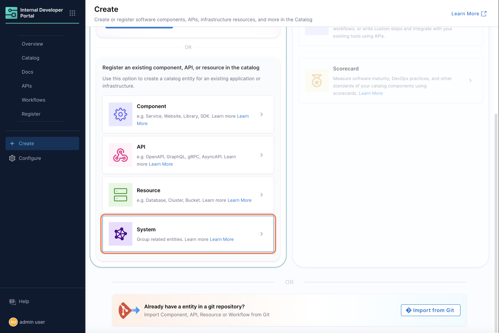
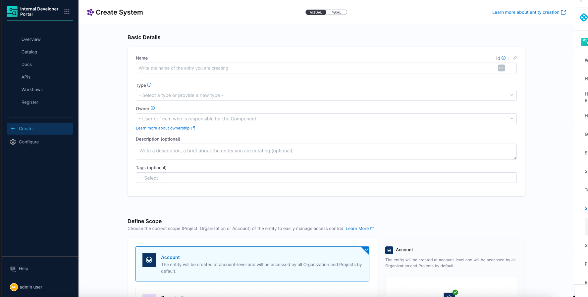
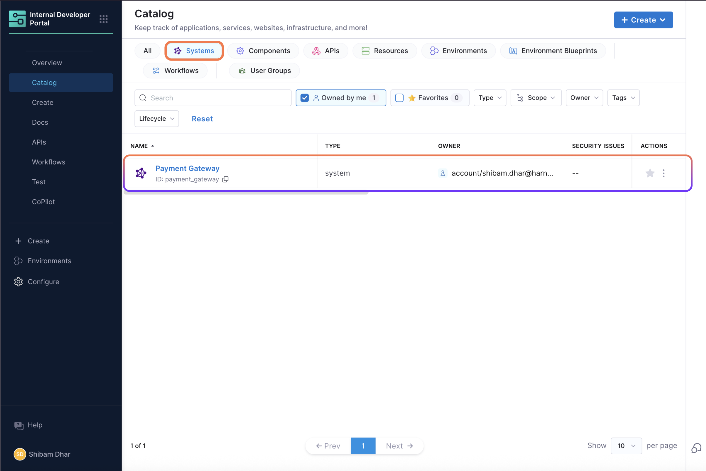
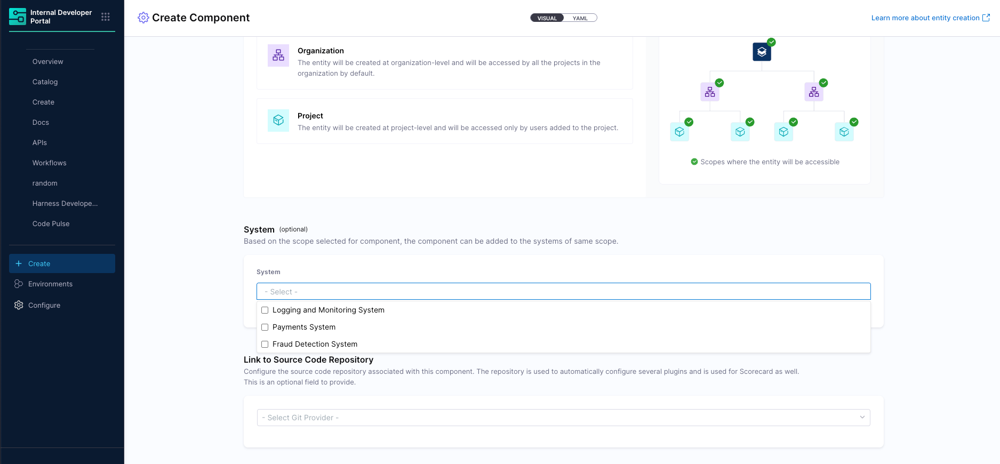

# System Entity

A **System** in Harness Internal Developer Portal (IDP) is a high-level catalog entity used to logically group related software components, APIs, and infrastructure resources. It represents a functional or domain-specific boundary such as a module, platform area, or business unit—and enables teams to organize and manage complex software ecosystems more effectively.

While Projects and Organizations help separate teams structurally, they often fall short in large environments where multiple teams share the same project. Systems provide an additional layer of organization by allowing you to group related entities based on ownership or functionality. You can define a System at the Project, Organization, or Account level, and assign catalog entities to one or more Systems for better clarity and governance.

You can also use Systems to power views in the Catalog, run scorecards at a system level, and improve how teams discover and manage services. Whether your teams are structured around modules or shared platforms, Systems help bring clarity to how services are grouped and owned.



Use Systems to:
- Group services owned by the same team or module
- Provide a top-down view of related entities
- Assign team ownership and operational responsibility
- Enable scorecard and plugin targeting at a System level

## Creating a System Entity

In Harness IDP, a **System** represents a logical grouping of related services, APIs, and resources. Systems help improve catalog visibility, support governance across scopes, and make it easier for teams to discover and manage what they own.

Systems can be created through:
- The **Harness UI/YAML** view
- The **Create Entity API** by mentioning the `kind: System`

They can exist at **Project**, **Organization**, or **Account** scope, based on how broadly you want to apply grouping logic.

#### Creating via the IDP UI

To create a System from the IDP UI:

1. In the **Internal Developer Portal → Software Catalog**, click **Create**.
2. Select **System** as the entity kind

3. Provide:

   * Name
   * Identifier
   * Owner
   * Optional: tags and description
4. Save the entity

The System will appear in the Catalog and can be used to group other entities either visually or programmatically.



#### Example: System Entity YAML

```yaml
apiVersion: harness.io/v1
kind: System
name: Payment System
identifier: paymentsystem
type: domain
owner: team-payment
spec:
  ownedBy:
    - group:account/_account_all_users
  hasPart:
    - component:account/acclevel123
    - api:account/agnivaaapi
metadata:
  description: This system groups services and libraries related to payment processing.
  tags:
    - rest
    - java
```

Systems in Harness IDP are standalone entities visible in the Software Catalog, similar to services or APIs. Unlike traditional scopes that are tightly bound to Projects or Organizations, Systems can be defined at any level — Account, Org, or Project — giving teams flexibility based on how they work.

## Associating Entities with a System

In Harness IDP, once a System is defined, you can associate services, APIs, and other catalog entities with that System by updating their YAML definitions. This helps structure the catalog meaningfully and improves visibility, especially in large organizations with many components.



Systems support **many-to-many relationships**:

* A single service can be part of multiple Systems
* A System can include multiple Components, APIs, or Resources

To associate an entity with a System:

* Use the `system` field in the entity's YAML
* Optionally use the `partOf` field if you want to express semantic relationships across systems or domains

#### Example: Component associated with multiple Systems

```yaml
apiVersion: harness.io/v1
kind: Component
name: testnew system component
identifier: testnew_system_component
type: component
owner: group:account/_account_all_users
spec:
  lifecycle: experimental
  partOf:
    - system:account/system_101dev
    - system:account/system_101
    - system:account/paymentgatewaysystem101
    - system:account/testsystem
    - system:account/paymentgatewaysystem
  system:
    - system:account/testsystem
    - system:account/paymentgatewaysystem
    - system:account/paymentgatewaysystem101
    - system:account/system_101
    - system:account/system_101dev
  ownedBy:
    - group:account/_account_all_users
metadata:
  tags:
    - app
    - java
    - rest
```

To establish relationships between catalog entities and Systems in Harness IDP, core entities such as Components, APIs, or Resources can include the `spec.system` field in their YAML definitions. This allows a single entity to be associated with one or more Systems.

These associations form declarative relationships:

* **Component → partOf → System**
* **System → hasPart → Component**

Once a System is defined, you do not need to modify the System's YAML to reflect every associated Component. When a Component's YAML includes the `spec.system` field, the Harness IDP Catalog automatically updates the System's `relations` metadata to reflect this link. This keeps System definitions clean while ensuring accurate relationship visibility within the Catalog.

:::info 
Only the systems created at the scope of the entity can be chosen.
:::

## Auto-Conversion of Existing 1.0 System Entities

To ensure a seamless transition, Harness IDP automatically converts System entities created in version 1.0 to the new System format introduced in version 2.0. This allows users to retain their existing logical groupings without needing to re-create them.

System entities from IDP 1.0 are migrated into 2.0 at the **Account scope** by default, making them immediately usable in the new Catalog experience.

#### Behavior

* System entities from IDP 1.0 are auto-converted into valid 2.0 System entities.
* These are created at the account level to ensure broad visibility and continuity across teams.
* No user action is required for the System definitions themselves to appear in the new Catalog.

#### Notes on Associations

While System entities themselves are migrated automatically, associations between Systems and Components are **not included** in the conversion. To re-establish those relationships:

* Add the relevant `system` or `partOf` references manually in the YAML of each Component or API entity.

This ensures that the Catalog relationships reflect your current architecture and ownership model under the new entity framework.
