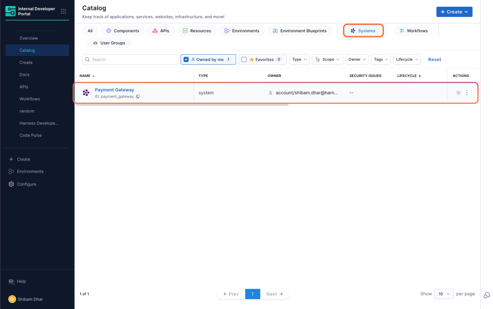
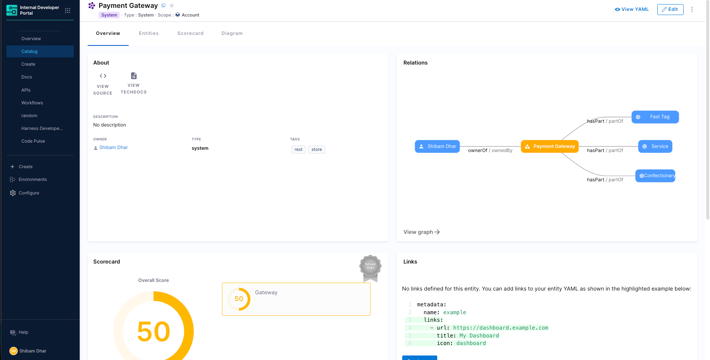

# System Entity

A **System** in Harness Internal Developer Portal (IDP) is a high-level catalog entity used to logically group related software components, APIs, and infrastructure resources. It represents a functional or domain-specific boundary such as a module, platform area, or business unit—and enables teams to organize and manage complex software ecosystems more effectively.

While Projects and Organizations help separate teams structurally, they often fall short in large environments where multiple teams share the same project. Systems provide an additional layer of organization by allowing you to group related entities based on ownership or functionality. You can define a System at the Project, Organization, or Account level, and assign catalog entities to one or more Systems for better clarity and governance.

You can also use Systems to power views in the Catalog, run scorecards at a system level, and improve how teams discover and manage services. Whether your teams are structured around modules or shared platforms, Systems help bring clarity to how services are grouped and owned.


Use Systems to:
- Group services owned by the same team or module
- Provide a top-down view of related entities
- Assign team ownership and operational responsibility
- Enable scorecard and plugin targeting at a System level

## Creating a System Entity

In Harness IDP, a **System** represents a logical grouping of related services, APIs, and resources. Systems help improve catalog visibility, support governance across scopes, and make it easier for teams to discover and manage what they own.

Systems can be created through:
- The **[Harness UI](/docs/internal-developer-portal/catalog/manage-catalog#harness-idp-ui)** or **[YAML](/docs/internal-developer-portal/catalog/manage-catalog#catalog-yaml)** view
- The **[Create Entity API](https://apidocs.harness.io/tag/Entities#operation/create-entity)** by mentioning the `kind: System`

They can exist at **Project**, **Organization**, or **Account** scope, based on how broadly you want to apply grouping logic.

#### Creating via the IDP UI

To create a System from the IDP UI:

1. In the **Internal Developer Portal → Software Catalog**, click **Create**.
2. Select **System** as the entity kind

3. Provide:

   * Name
   * Identifier
   * Owner
   * Optional: tags and description
4. Save the entity

The System will appear in the Catalog and can be used to group other entities either visually or programmatically.



#### Example: System Entity YAML

```yaml
apiVersion: harness.io/v1
kind: System
name: Payment System
identifier: paymentsystem
type: system
owner: team-payment
spec:
  lifecycle: ""
metadata:
  description: This system groups services and libraries related to payment processing.
  tags:
    - rest
    - java
```

Systems in Harness IDP are standalone entities visible in the Software Catalog, similar to services or APIs. Unlike traditional scopes that are tightly bound to Projects or Organizations, Systems can be defined at any level — Account, Org, or Project — giving teams flexibility based on how they work.


### Configuring the System Layout in Catalog Entities

After defining a **System Entity** in Harness IDP, you can configure how its details appear in the Software Catalog.




For newly created accounts, the **default System layout** is automatically applied. This layout includes tabs such as **Overview**, **Entities**, **Scorecard**, and **Diagram**, along with a structured arrangement of key catalog components.


We can edit the **System Layout** under `Admin → Layout → Catalog Entities → System`. The layout determines the tabs, cards, and views shown when viewing a System in the UI.


#### The configuration is defined in YAML, for example:

```yaml
page:
  name: EntityLayout
  tabs:
    - name: Overview
      path: /
      title: Overview
      contents:
        - component: EntityOrphanWarning
        - component: EntityProcessingErrorsPanel
        - component: EntityAboutCard
          specs:
            props:
              variant: gridItem
            gridProps:
              md: 6
              // highlight-start
        - component: EntityCatalogGraphCard
          specs:
            props:
              variant: gridItem
              height: 400
            gridProps:
              md: 6
              xs: 12
        // highlight-end
        - component: EntityScoreCard
          specs:
            gridProps:
              md: 6
        - component: EntityLinksCard
          specs:
            props:
              variant: gridItem
              item: 400
            gridProps:
              md: 6
              xs: 12
        - component: CatalogTable
          specs:
            props:
              variant: gridItem
              height: 600
            gridProps:
              md: 12
              xs: 12
    // highlight-start
    - name: Entities
      path: /entities
      title: Entities
      contents:
        - component: CatalogTable
        // highlight-end
    - name: Scorecard
      path: /scorecard
      title: Scorecard
      contents:
        - component: EntityScorecardContent
    - name: Diagram
      path: /diagram
      title: Diagram
      contents:
        - component: EntityCatalogGraphCard
          specs:
            props:
              variant: gridItem
              title: System Diagram
              height: 700
              unidirectional: false
              relations:
                - partOf
                - hasPart
                - apiConsumedBy
                - apiProvidedBy
                - consumesApi
                - providesApi
                - dependencyOf
                - dependsOn
```


> Existing customers can update their System layout by applying the above YAML in the **System** section under **Catalog Entities - Layout**. This ensures the same structured layout and features available to new accounts.

#### Understanding the Entities Tab in System Layout

The **Entities** tab provides a comprehensive view of all components, APIs, resources, and other entities that belong to a System. This tab is configured in the layout as follows:

```yaml
- name: Entities
  path: /entities
  title: Entities
  contents:
    - component: CatalogTable
```

The **CatalogTable** component renders a filterable, sortable table showing all entities associated with the System. This powerful table offers several key features:


- **Filtering**: Users can filter entities by type (Component, API, Resource), owner, lifecycle stage, and other metadata
- **Custom columns**: Administrators can configure which columns appear in the table
- **Search**: Full-text search across all entity metadata
- **Pagination**: For Systems with many entities, the table automatically paginates results
- **Quick access**: Direct links to each entity's detail page

The Entities tab serves as the primary navigation hub for exploring all components that belong to a System. This view is particularly valuable for platform teams and system owners who need to maintain an overview of all services, APIs, and resources within their domain.


## Associating Entities with a System

In Harness IDP, once a System is defined, you can associate services, APIs, and other catalog entities with that System by updating their YAML definitions. This helps structure the catalog meaningfully and improves visibility, especially in large organizations with many components.


Systems support **many-to-many relationships**:

* A single service can be part of multiple Systems
* A System can include multiple Components, APIs, or Resources

To associate an entity with a System:

* Use the `system` field in the entity's YAML
* Optionally use the `partOf` field if you want to express semantic relationships across systems or domains

#### Example: Component associated with multiple Systems

```yaml
apiVersion: harness.io/v1
kind: Component
name: Payment Processing Service
identifier: payment_processing_service
type: component
owner: group:account/platform_team
spec:
  lifecycle: production
  partOf:
    - system:account/payment_platform
    - system:account/checkout_system
    - system:account/financial_services
    - system:account/customer_billing
    - system:account/order_management
  system:
    - system:account/payment_platform
    - system:account/checkout_system
    - system:account/financial_services
    - system:account/customer_billing
    - system:account/order_management
  ownedBy:
    - group:account/platform_team
metadata:
  tags:
    - microservice
    - java
    - payment
```

To establish relationships between catalog entities and Systems in Harness IDP, core entities such as Components, APIs, or Resources can include the `spec.system` field in their YAML definitions. This allows a single entity to be associated with one or more Systems.

These associations form declarative relationships:

* **Component → partOf → System**
* **System → hasPart → Component**

Once a System is defined, you do not need to modify the System's YAML to reflect every associated Component. When a Component's YAML includes the `spec.system` field, the Harness IDP Catalog automatically updates the System's `relations` metadata to reflect this link. This keeps System definitions clean while ensuring accurate relationship visibility within the Catalog.

:::info 
Only the systems created at the scope of the entity can be chosen.
:::

#### Entity part of Systems


When viewing an **Entity** (such as a Component, API, or Resource) in the Catalog, the UI highlights which System(s) this Entity is a part of. The diagram above shows this relationship: the Entity detail page features a section that lists all Systems the Entity belongs to. Each System is typically presented as a clickable link or chip, enabling users to quickly navigate to the System's overview. This helps users understand the broader context, governance, and ownership of the Entity within the organization's architecture.

#### Systems part of Entities


When viewing a **System** in the Catalog, the UI displays all Entities (Components, APIs, Resources) that are part of that System. The diagram above illustrates this scenario: the System detail page includes a section or tab that lists all associated Entities, usually grouped by type and shown as cards and in a table. 

This allows users to see the complete scope of the System, explore its composition, and easily access each Entity's details. This view is valuable for understanding system boundaries, identifying missing or orphaned Entities, and managing ownership at scale.

<!-- ## Auto-Conversion of Existing 1.0 System Entities

To ensure a seamless transition, Harness IDP automatically converts System entities created in version 1.0 to the new System format introduced in version 2.0. This allows users to retain their existing logical groupings without needing to re-create them.

System entities from IDP 1.0 are migrated into 2.0 at the **Account scope** by default, making them immediately usable in the new Catalog experience.

#### Behavior

* System entities from IDP 1.0 are auto-converted into valid 2.0 System entities.
* These are created at the account level to ensure broad visibility and continuity across teams.
* No user action is required for the System definitions themselves to appear in the new Catalog.

#### Notes on Associations

While System entities themselves are migrated automatically, associations between Systems and Components are **not included** in the conversion. To re-establish those relationships:

* Add the relevant `system` or `partOf` references manually in the YAML of each Component or API entity.

This ensures that the Catalog relationships reflect your current architecture and ownership model under the new entity framework. -->
