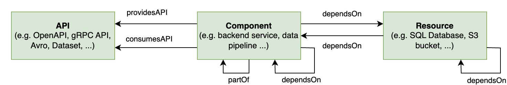

## Introduction

The Harness Internal Developer Portal's systems model is based on the [Backstage System Model](https://backstage.io/docs/features/software-catalog/system-model). It helps to manage and understand complex software ecosystems. This model is important for DevOps and microservices, where many connected parts can be hard to manage.

The System Model in Harness IDP helps us manage dependencies by organizing software components, services, and tools in our technical landscape. This model shows how everything connects and works together within the system. It provides a clear structure for understanding and navigating the different parts of the system.



## Example Architecture

Let's create a map of a city-like software ecosystem. The IDP's service catalog is like a central hub, organizing and sharing important information about the software assets. This ecosystem, with its interconnected neighborhoods (Domains), buildings (Systems), services (APIs), establishments (Components), and utilities (Resources), mirrors the complex yet structured world of software development and operations. 

By using the Harness IDP System Model, we can effectively manage and maintain the dependencies within Harness IDP Catalog. It structures around five key concepts: Domains, Systems, APIs, Components, and Resources.


## Harness IDP System Model

### Components and Dependencies

#### Core Backend: 

Let's start with a core backend service, like a central office in a building, providing specific functionalities.

```YAML
kind: Component
type: service
name: core-backend
```

#### Core Queueing Library: 

Now let's start adding a library component, akin to a specialized tool used within the office.

```YAML
kind: Component
type: library
name: core-queueing-library
```

### Dependency Representation: 

Showing how the Core Backend depends on the Core Queueing Library.

```YAML
providesApi:
  - core-api
```

### APIs and Their Consumption

Core API: Represented as a service provided by the Core Backend.

```YAML
kind: API
type: openapi
name: core-api
```

#### API Provision: Indicating that the Core Backend exposes the Core API.

```YAML
providesApi:
  - core-api
```

### Systems and Their Components

#### Core System: 
A system that includes the Core Backend and Core API.

```YAML
kind: System
name: core
```

#### System Association: 

Linking the Core Backend and API to the Core System.

```YAML
system: core
```

### City Domains and Expansion

**The city is expanding and creating a new Domain AI as a new part of the city.**

```YAML
kind: Domain
name: ai
```


To set up the backend service in the software catalog, we create an IDP YAML file. This file includes concepts such as dependencies and ownership.

### Neighborhoods: Domains

1. **Function:** Domains are like neighborhoods, each with its unique character, housing systems that share common goals or technical requirements.

2. **Example:** The "Data Analytics District" could be a Domain, grouping systems related to data processing and analysis.

```YAML
kind: Domain
name: data-analytics-district
```

### Buildings: Systems
1. **Structure:** Systems are akin to buildings, each encapsulating a set of functionalities provided by various components.

2. **Example:** The "Customer Insights Tower" in the Data Analytics District represents a System comprising data processing services, analytics tools, and customer feedback components.

```YAML
kind: System
name: customer-insights-tower
```

### Services: APIs
1. **Interactions:** APIs are the services that allow different systems and components to communicate, much like the utilities in a city.

2. **Example:** The Customer Insights Tower might offer a RESTful API for querying processed customer data.

```YAML
kind: API
type: openapi
name: customer-query-api
```

### Establishments: Components
1. **Specific Functions:** Components are like the different offices or shops in a building, each serving a specific function.

2. **Example:** Within the Customer Insights Tower, there's a "Feedback Analysis Suite," a component dedicated to analyzing customer feedback.

```YAML
kind: Component
type: service
name: feedback-analysis-suite
```

### Utilities: Resources
1. **Support Infrastructure:** Resources are the essential infrastructure elements that support the systems, similar to a city's utilities.

2. **Example:** The Customer Insights Tower relies on cloud storage and computing resources to handle large datasets.

```YAML
kind: Resource
type: cloud-service
name: cloud-storage
```

## Relations

This is a (non-exhaustive) list of relations that are known to be in active use.

Each relation has a _source_ (implicitly: the entity that holds the relation), a _target_ (the entity to which the source has a relation), and a _type_ that tells what relation the source has with the target. The relation is directional; there are commonly pairs of relation types and the entity at the other end will have the opposite relation in the opposite direction (e.g. when querying for `A`, you will see `A.ownedBy.B`, and when querying `B`, you will see `B.ownerOf.A`).

### `ownedBy` and `ownerOf`

An ownership relation where the owner is usually an organizational entity [User Group](https://developer.harness.io/docs/platform/role-based-access-control/add-user-groups/). 

In IDP, the owner of an entity is the singular entity (commonly a User Group in Harness) that bears ultimate responsibility for the entity, and has the authority and capability to develop and maintain it. They will be the point of contact if something goes wrong, or if features are to be requested. The main purpose of this relation is for display purposes in IDP, so that people looking at catalog entities can get an understanding of to whom this entity belongs. It is not to be used by automated processes to for example assign authorization in runtime systems. There may be others that also develop or otherwise touch the entity, but there will always be one ultimate owner.

This relation is commonly generated based on `spec.owner` of the owned entity, where present.

### `providesApi` and `apiProvidedBy`

A relation with an [API](https://developer.harness.io/docs/internal-developer-portal/catalog/system-model#3-api) entity, typically from a
[Component](https://developer.harness.io/docs/internal-developer-portal/catalog/system-model#4-component).

These relations express that a component exposes an API - meaning that it hosts callable endpoints from which you can consume that API.

This relation is commonly generated based on `spec.providesApis` of the component or system in question.

### `consumesApi` and `apiConsumedBy`

A relation with an [API](https://developer.harness.io/docs/internal-developer-portal/catalog/system-model#3-api) entity, typically from a
[Component](https://developer.harness.io/docs/internal-developer-portal/catalog/system-model#4-component).

These relations express that a component consumes an API - meaning that it depends on endpoints of the API.

This relation is commonly generated based on `spec.consumesApis` of the component or system in question.

### `dependsOn` and `dependencyOf`

A relation denoting a dependency on another entity.

This relation is a general expression of being in need of that other entity for an entity to function. It can for example be used to express that a website
component needs a library component as part of its build, or that a service component uses a persistent storage resource.

This relation is commonly generated based on `spec.dependsOn` of the component or resource in question.

### `parentOf` and `childOf`

A parent/child relation to build up a tree, used for example to describe the organizational structure between [ User Groups](https://developer.harness.io/docs/platform/role-based-access-control/add-user-groups/).

This relation is commonly based on `spec.parent` and/or `spec.children`.

### `memberOf` and `hasMember`

A membership relation, typically for Users in [Groups](https://developer.harness.io/docs/platform/role-based-access-control/add-user-groups/).

This relation is commonly based on `spec.memberOf`.

### `partOf` and `hasPart`

A relation with a [Domain](https://developer.harness.io/docs/internal-developer-portal/catalog/system-model#1-domain), [System](https://developer.harness.io/docs/internal-developer-portal/catalog/system-model#2-system) or [Component](https://developer.harness.io/docs/internal-developer-portal/catalog/system-model#4-component) entity, typically from a
[Component](https://developer.harness.io/docs/internal-developer-portal/catalog/system-model#4-component),
[API](https://developer.harness.io/docs/internal-developer-portal/catalog/system-model#3-api), or
[System](https://developer.harness.io/docs/internal-developer-portal/catalog/system-model#2-system).

These relations express that a component belongs to a larger component; a component, API or resource belongs to a system; or that a system is grouped
under a domain.

This relation is commonly based on `spec.system` or `spec.domain`.

```YAML
# Example catalog-info.yaml
...
spec:
  type: service
  lifecycle: experimental
  owner: group:pet-managers
  dependsOn:
    - Component:manager
    - Component:ng-manager
    - Resource:sample-s3-bucket
  providesApis:
    - accesscontrol-service
    - petstore
    - internal/streetlights
    - hello-world
  subcomponentOf: sample-service  
...
```

## Definitions and Reference

### 1. Domain
#### Definition: 
A Domain is a high-level organizational unit in the Backstage model, grouping together systems that share common characteristics such as business goals, domain models, terminology, or documentation.
#### Purpose: 
To create a bounded context for easier management and understanding of related systems.
#### Example: 
The "Payments" Domain includes systems related to payment processing, sharing common documentation, API entity types, and integration standards.

### 2. System
#### Definition: 
A System is an abstraction layer encapsulating the implementation details of specific functionalities. It consists of a collection of resources and components and exposes one or several APIs.
#### Purpose: 
To reduce complexity by allowing consumers to interact with functionalities without needing to understand the underlying implementation details.
#### Example: 
A playlist management system includes backend services for playlist management and a database, exposing functionalities through various APIs like RPC, datasets, and event streams.

### 3. API
#### Definition: 
APIs are the primary means of interaction within the software ecosystem. They are implemented by components and define the boundaries between different components and systems.
#### Purpose: 
To facilitate interaction and discovery within the software ecosystem, ensuring scalability and manageability.
#### Example: 
A public API exposed by a system for other Spotify components, documented and discoverable in Backstage.

### 4. Component
#### Definition: 
A Component is a discrete unit of software, such as a mobile feature, website, backend service, or data pipeline.
#### Purpose: 
To implement specific functionalities and APIs, encapsulating code dependencies and interacting with system resources.
#### Example: 
A backend service for user data processing, implementing specific APIs and relying on system resources like databases.

### 5. Resource
#### Definition: 
Resources are the infrastructure elements required for a system's operation, including databases, cloud storage, CDN services, etc.
#### Purpose: 
To support the operational needs of systems, allowing for a clear visualization of resource usage and facilitating targeted tooling development.
#### Example: 
Cloud storage buckets and CDN services used by a video streaming system.

## Conclusion 

In everyday situations, utilizing a systems model such as Backstage's involves creating a central catalog or storage location. This catalog contains all information regarding systems, parts, and their connections. This dependency management in IDP Catalog System Model, enables developers to have service onboarding using seamless integrations.
