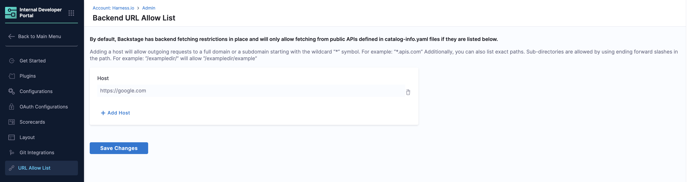
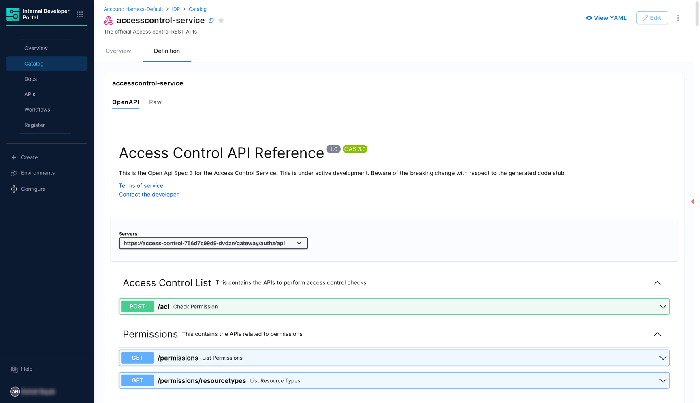
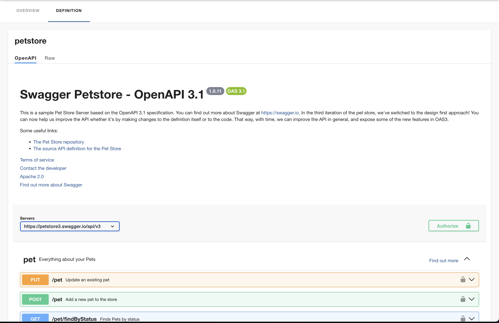
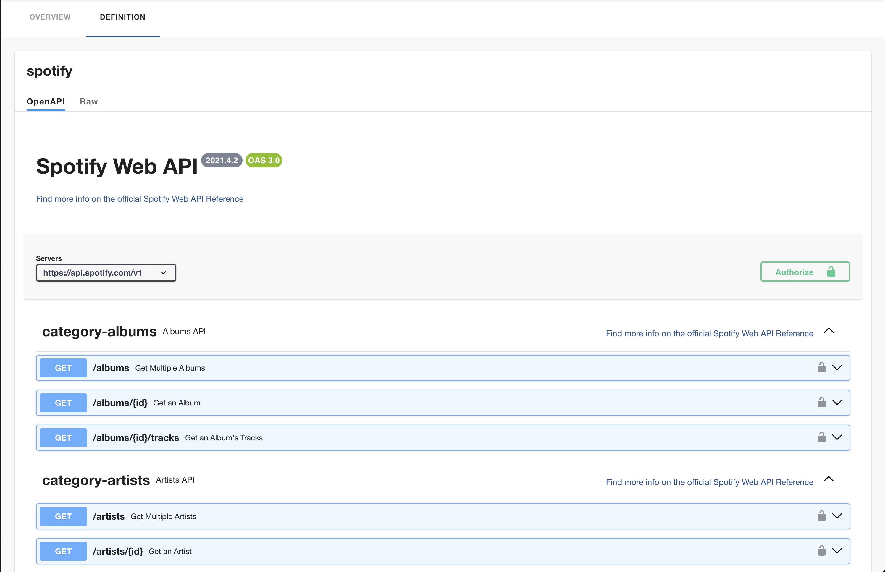
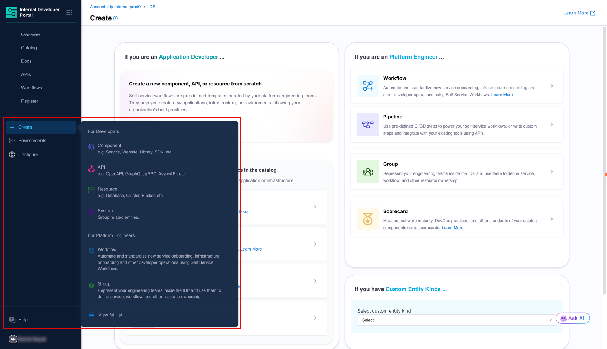
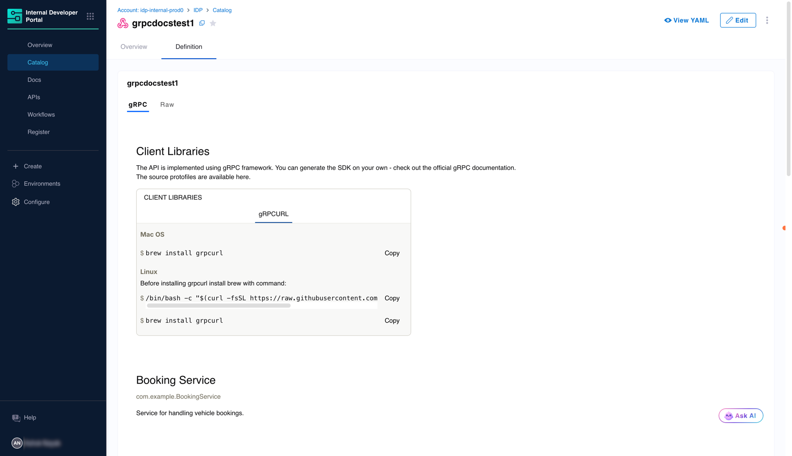
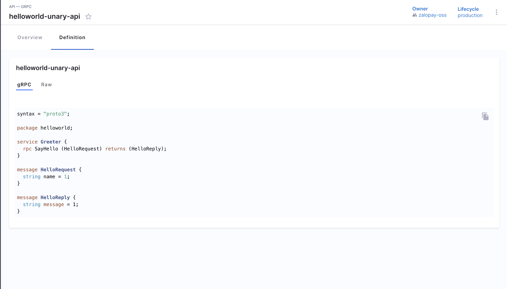

import Tabs from '@theme/Tabs';
import TabItem from '@theme/TabItem';

<DocsTag  backgroundColor= "#cbe2f9" text="Tutorial"  textColor="#0b5cad"  />

The Harness IDP Software Catalog provides comprehensive support for defining and managing API entities. This guide shows you how to add API specifications in various formats to your catalog.

---

## Supported API Types

Harness IDP supports the following API specification formats:

1. **OpenAPI** - API definitions in YAML or JSON format based on [OpenAPI](https://swagger.io/specification/) version 2 or version 3
2. **AsyncAPI** - API definitions based on the [AsyncAPI specification](https://www.asyncapi.com/docs/reference/specification/latest)
3. **GraphQL** - API definitions based on [GraphQL schemas](https://spec.graphql.org/)
4. **gRPC** - API definitions based on [Protocol Buffers](https://protobuf.dev/) for use with [gRPC](https://grpc.io/)

---

## Prerequisites

To fetch API specifications from external sources, you must configure the URL Allow List.

**Steps:**
1. Navigate to **Admin** > **URL Allow List** in your IDP portal
2. Add the domains or URLs where your API specifications are hosted
3. Use wildcards (e.g., `*.github.com`) to allow multiple subdomains



:::note Backend URL Allow List
By default, Harness IDP restricts backend fetching and only allows requests to explicitly allowed domains.

**To enable access:**
- Go to **Configuration** > **URL Allow List**
- Add full domains or use wildcards (e.g., `*.apis.com`) for subdomains
- List specific paths with trailing slashes (e.g., `/exampledir/` allows `/exampledir/example`)

Ensure your API spec host or path is included in this list for successful import.
:::

---

## Add API Entities

### OpenAPI Specifications

```YAML
apiVersion: harness.io/v1
kind: API
type: openapi
identifier: cenextgen
name: cenextgen
owner: johndoe
spec:
  lifecycle: production
  definition:
    $text: https://github.com/OAI/OpenAPI-Specification/blob/main/examples/v2.0/json/api-with-examples.json
metadata:
  description: The official CE NEXTGEN service REST APIs
```

:::info
In the above example we import all the API specs in `json` format as a `$text` embedding, and it's a suggested hack to import multiple APIs in openapi format. 
:::

:::note Backend URL Allow List

By default, Backstage restricts backend fetching and only allows requests to public APIs defined in `catalog-info.yaml` files if the domains are explicitly allowed.

To enable access:
- Go to your IDP portal and navigate to `Configuration` > `URL Allow List`.
- Add full domains or use wildcards (e.g., `*.apis.com`) to allow subdomains.
- You can also list specific paths. Subdirectories are supported using a trailing slash (e.g., `/exampledir/` allows `/exampledir/example`).

Make sure the host or path for your OpenAPI spec is included in this list to allow successful API documentation import.
:::


:::caution
In IDP 2.0, API entity creation now supports OpenAPI specifications referenced via both **absolute URLs** (e.g., `https://github.com/swagger-api/swagger-petstore/blob/master/src/main/resources/openapi.yaml`) and **relative paths** (e.g., `./openapi.yaml`) in the `spec.definition.$text` field. 
These paths are interpreted relative to the location specified by the `backstage.io/managed-by-location` annotation. This typically aligns with the path of your entity YAML file. When not explicitly set, `managed-by-location` is automatically derived from the `backstage.io/source-location` annotation, ensuring correct resolution even for inline or centrally managed entities.

For external URLs, ensure the domain is included in the **Backend URL Allow List** under *Configure > URL Allow List* to enable proper API documentation rendering.

:::


The above-mentioned `catalog-info.yaml` when registered in the catalog would display all the APIs in the following format. 



### Import API spec for a single API defined in openapi spec in swagger

```YAML
apiVersion: harness.io/v1
kind: API
type: openapi
identifier: petstore
name: petstore
owner: Harness_Partners
spec:
  lifecycle: dev
  definition:
    $text: https://github.com/swagger-api/swagger-petstore/blob/master/src/main/resources/openapi.yaml
metadata:
  description: The petstore API
  links:
    - url: https://github.com/swagger-api/swagger-petstore
      title: GitHub Repo
      icon: github
    - url: https://github.com/swagger-api/swagger-petstore/blob/master/src/main/resources/openapi.yaml
      title: API Spec
      icon: code
  tags:
    - store
    - rest
```

The above-mentioned `catalog-info.yaml` when registered in the catalog would display all the APIs in the following format.



### Define API spec for a single API openapi format and import the same

```YAML
apiVersion: harness.io/v1
kind: API
type: openapi
identifier: artistapi
name: artistapi
owner: artist-relations-team
spec:
  lifecycle: production
  definition: |
    openapi: "3.0.0"
    info:
      version: 1.0.0
      title: Artist API
      license:
        name: MIT
    servers:
      - url: http://artist.spotify.net/v1
    paths:
      /artists:
        get:
          summary: List all artists
    ...
metadata:
  description: Retrieve artist details

```

The above-mentioned `catalog-info.yaml` when registered in the catalog would display all the APIs in the following format.



## Creating an API entity 

There are two ways to add and create a new API entity in your catalog:

- **[Create an entity via the Harness IDP UI](/docs/internal-developer-portal/catalog/create-entity/create-manually)**: Use the Harness UI to create entities directly—no YAML required. This method offers a streamlined, code-free experience for adding entities.
- **[Create an entity using your catalog YAML](/docs/internal-developer-portal/catalog/create-entity/create-manually)**: You can still create entities using your existing catalog YAML files. Harness will automatically convert legacy Backstage YAML into the new Harness Catalog Entity Model and register the corresponding entity.



## Defining an API Entity

You can refer to the entity definition format [here](/docs/internal-developer-portal/catalog/catalog-yaml.md#common-to-all-kinds-the-envelope-idp-20). Here's the common envelope: 

1. `apiVersion`: With IDP 2.0, we've introduced a Harness-native entity schema. As part of this change, all entities now use an apiVersion prefixed with `harness.io/`.
2. `kind`: The kind field defines the high-level type of entity being described in the YAML file. For API, `kind` is `API`. 
3. `identifier`: The `identifier` field is a unique, machine-readable reference for the entity. It serves as the primary key for identifying and interacting with the entity.
4. `name`: The `name` field represents the display name of the entity shown in the UI.
5. `type`: The `type` field represents the type of entity (e.g., website, service, library, API, etc). The kind and type fields together define entity behavior and should always appear together.
6. `projectIdentifier`: In IDP 2.0, legacy System entities are now mapped to Harness Projects. Thus the `projectIdentifier` field indicates which project the entity belongs to.
7. `orgIdentifier`: In IDP 2.0, legacy Domain entities are now mapped to Harness Orgs. Thus the field `orgIdentifier` indicates which Org the entity belongs to.
8. `owner`: The `owner` field indicates the owner of that entity and maps to Harness Users or User Groups depending on the scope.
9. `metadata`: A container for auxiliary data that is not part of the entity’s specification. Additional metadata helps enhance platform-level processing or categorization
10. `spec`: Defines the actual specification data that describes the entity. This is the core configuration and varies depending on the kind.


## API Specification

### Kind: API  
An **API** describes an interface that can be exposed by a component. APIs can be defined using formats such as OpenAPI, AsyncAPI, GraphQL, gRPC, or others.

#### Entity Structure  
All the fields mentioned below are the mandatory parameters required to define an API:

| **Field** | **Value** |
| --------- | --------- |
| `apiVersion` | **harness.io/v1** |
| `kind` | **API** |
| `type` | You can find out more about the `type` key here. |
| `spec.lifecycle` | You can find out more about the `lifecycle` key here. |
| `spec.definition` | You can find out more about the `definition` key here. |

#### `type` Definition  
The type of the `API` definition as a string (e.g., `openapi`):

1. `openapi` – A definition in YAML or JSON based on OpenAPI v2 or v3.
2. `asyncapi` – A definition based on the AsyncAPI specification.
3. `graphql` – A definition using GraphQL schemas.
4. `grpc` – A definition based on Protocol Buffers for use with gRPC.

#### Example YAML
```yaml
apiVersion: harness.io/v1
kind: API
type: openapi
identifier: petstore
name: petstore
owner: Harness_Partners
spec:
  lifecycle: dev
  definition:
    $text: https://github.com/swagger-api/swagger-petstore/blob/master/src/main/resources/openapi.yaml
metadata:
  description: The petstore API
  links:
    - url: https://github.com/swagger-api/swagger-petstore
      title: GitHub Repo
      icon: github
    - url: https://github.com/swagger-api/swagger-petstore/blob/master/src/main/resources/openapi.yaml
      title: API Spec
      icon: code
  tags:
    - store
    - rest
```

## Substitutions in Descriptor
1. Supports `$text`, `$json`, `$yaml` for embedding external content.
2. Useful for loading API definitions from external sources.

### Example

```YAML
apiVersion: harness.io/v1
kind: API
type: openapi
identifier: petstore
name: petstore
owner: Harness_Partners
spec:
  lifecycle: dev
  definition:
    $text: https://github.com/swagger-api/swagger-petstore/blob/master/src/main/resources/openapi.yaml
metadata:
  description: The petstore API
  links:
    - url: https://github.com/swagger-api/swagger-petstore
      title: GitHub Repo
      icon: github
    - url: https://github.com/swagger-api/swagger-petstore/blob/master/src/main/resources/openapi.yaml
      title: API Spec
      icon: code
  tags:
    - store
    - rest
```

## gRPC Docs

You can render gRPC documentation by using the [protoc-gen-doc plugin](https://github.com/backstage/backstage/tree/master/plugins/api-docs-module-protoc-gen-doc), which contains `ApiDefinitionWidgets` for [grpc-docs](https://github.com/gendocu-com/grpc-docs)to enable Swagger UI for gRPC APIs. 


### JSON Format

:::info

You can render gRPC documentation when the `type` is set to `grpc-doc` or `grpc` **and** the `definition` is provided in JSON format. 

:::

#### Type: `grpc`

```YAML
##Example
apiVersion: harness.io/v1
kind: API
type: grpc
identifier: grpcdocstest1
name: grpcdocstest1
owner: group:engineering
spec:
  lifecycle: production
  definition:
    $text: https://github.com/pseudomuto/protoc-gen-doc/blob/master/examples/doc/example.json

```

#### Rendered Output for JSON Format




#### Type: `grpc-docs`

[Example catalog-info.yaml](https://github.com/harness-community/idp-samples/blob/main/demo-prorto-api.yaml)


```YAML
apiVersion: harness.io/v1
kind: API
type: grpc-docs
identifier: grpcdocstest
name: grpcdocstest
owner: group:engineering
spec:
  lifecycle: production
  definition:
    $text: https://github.com/pseudomuto/protoc-gen-doc/blob/master/examples/doc/example.json
```

#### Rendered Output for JSON Format


### proto file Format

```YAML
## Example
apiVersion: harness.io/v1
kind: API
type: grpc
identifier: helloworldunaryapi
name: helloworldunaryapi
owner: zalopay-oss
spec:
  lifecycle: production
  files:
    - file_name: helloworld.proto
      file_path: examples/unary/helloworld.proto
      url: https://github.com/zalopay-oss/backstage-grpc-playground/blob/main/examples/unary/helloworld.proto
  definition:
    $text: https://github.com/zalopay-oss/backstage-grpc-playground/blob/main/examples/unary/helloworld.proto
  targets:
    dev:
      host: 0.0.0.0
      port: 8084
metadata:
  description: helloworld unary gRPC
```

#### Rendered Output for proto file



