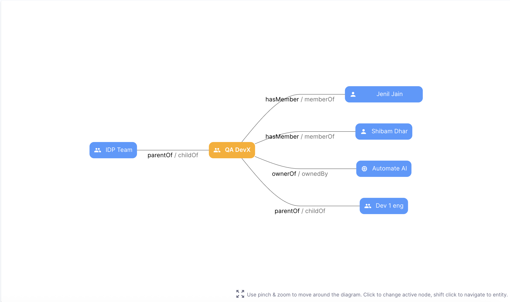

# Custom User Group Entity

Custom User Groups in Harness IDP extend the catalog model to include organizational teams and hierarchies as **first-class entities**. These groups allow companies to represent real-world structures such as teams, departments, or cross-functional squads, directly inside the developer portal.

Unlike **platform user groups** which are typically synchronized from an identity provider (LDAP, SCIM, SSO), **custom user groups** are created and managed entirely within IDP. This distinction matters because it allows engineering and platform teams to enrich group definitions with metadata that may not exist in the identity provider but is valuable for context inside IDP.

insert image here of conceptual diagram showing platform user groups vs custom user groups

## Key Concepts

**1. Group Entity**

* Each group is represented as an IDP entity with its own YAML definition.
* A group can include members, a parent relationship, lifecycle state, and optional metadata.
* Groups can serve as owners of services, systems, and other catalog entities.

**2. Parent–Child Hierarchies**

* Groups support hierarchical relationships (e.g., “Backend Team” as a child of “Engineering Org”).
* Parent groups automatically infer their children; explicit child definitions are not needed.

**3. Metadata Enrichment**

* Beyond basic member lists, custom groups can include metadata such as team lead, manager, geographic region, or contact email.
* This metadata can be surfaced in catalog cards, dashboards, and reporting.

**4. Source of Truth**

* IDP becomes the **ultimate source of truth** for group modeling.
* Platform-synced groups continue to appear but will not overwrite custom groups if a conflict in identifiers exists.
* This ensures invested effort in creating and enriching groups inside IDP is preserved.

<!-- insert image here of IDP catalog page showing a group profile card with metadata and members -->


## Creating Custom User Groups


There are two ways to create a group:

1. **Through the UI** – A guided creation page in the IDP Catalog allows platform engineers or admins to define groups with fields such as members, parent groups, and metadata. Members and parent groups can be added through searchable dropdowns that surface both users and groups.

   <!-- * insert image here of UI creation screen with searchable dropdowns -->
2. **Through YAML Definition** – Groups can also be created and registered by authoring YAML. The structure aligns with IDP 2.0’s entity model while retaining compatibility with the original Backstage semantics.

Here is a representative YAML snippet for creating a group:

```yaml
apiVersion: harness.io/v1
kind: Group
name: QA DevX
identifier: QA_DevX
type: custom
scope: ACCOUNT
spec:
  members:
    - user:account/shibam.dhar@harness.io
    - user:account/jenil.jain@harness.io
  lifecycle: ""
  parent: group:account/idp_team
  profile:
    email: idp_play@harness.io
metadata:
  tags:
    - user
  description: IDP Harness specific custom User Group
```

This example defines a **QA DevX** team, scoped at the account level, with two members, a parent group (`idp_team`), and rich metadata including tags and a description.

:::note 
At present, the User Group entity can only be created at the account level.
:::

#### Key Attributes in Group YAML

* **apiVersion / kind** – Always `harness.io/v1` and `Group`
* **identifier and name** – Unique reference and display name for the group
* **type** – Arbitrary classification, e.g., `team` or `custom`
* **scope** – Currently only `ACCOUNT` scope is supported
* **spec.members** – List of users belonging to the group
* **spec.parent** – Reference to a parent group, enabling hierarchy
* **spec.profile** – Optional metadata like email, profile picture
* **metadata** – Arbitrary tags and description for discoverability

Groups can be created with **zero members**, making it possible to scaffold team structures first and populate them later.-

## Relationships and Hierarchies





### Parent and Child Groups

Groups can be linked together through **hierarchical relationships**. In YAML, the creator specifies only the `parent` field. The IDP ingestion process then automatically generates the inverse relationships (`childOf` and `parentOf`) so that hierarchies are consistent and visible in the Catalog Graph.

For example:

```yaml
apiVersion: harness.io/v1
kind: Group
type: team
identifier: idp_team
name: IDP Team
scope: ACCOUNT
spec:
  parent: group:account/harness
  members:
    - user:account/user1@harness.io
    - user:account/user2@harness.io
```

In this setup:

* `idp_team` is explicitly linked to the `harness` group as its parent.
* IDP automatically infers and persists these relationships:

  * `idp_team → childOf → harness`
  * `harness → parentOf → idp_team`

This ensures that users see a **two-way relationship** in the Catalog Graph without having to manually declare `children`.


### User Relationships

Groups connect to users through **membership relationships**. These are expressed in YAML under `spec.members`.

Example:

```yaml
spec:
  members:
    - user:account/shibam.dhar@harness.io
    - user:account/jenil.jain@harness.io
```

This creates:

* `QA_DevX → hasMember → shibam.dhar@harness.io`
* `shibam.dhar@harness.io → memberOf → QA_DevX`

These relationships are also surfaced in the Catalog Graph, enabling visual exploration of who belongs to which group.

### Ownership Mapping

Groups are first-class entities for **owning other Catalog entities**. Ownership is established when a group is referenced in another entity’s YAML.

For example, a service YAML might designate a group as its owner:

```yaml
apiVersion: harness.io/v1
kind: Component
identifier: payments_service
name: Payments Service
spec:
  type: service
  owner: group:account/QA_DevX
```

This results in:

* `payments_service → ownedBy → QA_DevX`
* `QA_DevX → ownerOf → payments_service`

On the service’s Catalog page, the owner group is prominently displayed, making accountability clear.

:::info User Group Conflict Resolution
Harness IDP allows two sources of User Groups to coexist in the catalog:

1. **IDP User Groups** - Created directly within IDP (custom user groups)
2. **Platform User Groups** - Synced from the Harness Platform

When both types of User Groups exist, the following conflict resolution rules apply:

* **IDP User Groups take precedence over Platform User Groups** - Custom groups created directly in IDP are considered the ultimate source of truth.
* **Identifier conflict handling** - If an IDP User Group and a Platform User Group share the same identifier, the platform user group will not be synced.
* **Precedence order**:
  1. IDP User Groups (directly created)
  2. Platform User Groups (synced from Harness Platform)

This approach ensures that any custom metadata, relationships, and configurations you've invested time in creating for IDP User Groups are preserved and not overwritten during platform synchronization.
:::
:::note
Information about conflicts may be available in the audit trail. Platform user groups with the same ID as existing IDP User Groups will not be synced, while all other platform groups will continue to be synchronized normally.
:::

## Search and Discovery

Once created, User Groups are fully discoverable inside the IDP Catalog. You can look them up directly by name or identifier using the catalog search bar. For example, searching for **QA DevX** quickly brings up the corresponding group entity.

Opening a group shows a detailed **Overview** page:

* **Profile Information**: Includes the group name, description, type (custom or platform), scope (account, org, or project), and metadata such as email or tags.
* **Relations Panel**: Displays the parent group, child groups, and members connected through the `parentOf`, `childOf`, and `hasMember` relations. This is shown as both a list and an interactive graph.

  * You can click into related entities (parent group, child group, or member) to navigate further in the catalog.
  * For example, the **QA DevX** group shows its parent **IDP Team**, two members, and a child group **Dev 1 eng**.
* **Members Section**: Lists all the individual users associated with the group, along with their identifiers and contact details.


This layout makes it easy for developers, platform engineers, and admins to understand the context of a group at a glance and explore connected entities with just a click.

## Metadata Enrichment 

Custom User Groups in IDP are not limited to listing members. They can carry **rich metadata** that makes them more useful for discovery, reporting, and ownership tracking. This metadata sits under the `metadata` field in the entity YAML and can include fields such as:

* **Description** of the group
* **Team Lead** or manager
* **Geographic region**
* **Tags** for classification or filtering
* Any other key-value pairs that make sense for your organization

Example:

```yaml
apiVersion: harness.io/v1
kind: group
name: QA DevX
identifier: QA_DevX
type: custom
scope: ACCOUNT
metadata:
  description: IDP Harness specific custom User Group
  teamLead: Monkey D Luffy
  region: East Blue
  tags:
    - user
    - qa
spec:
  members:
    - user:account/shibam.dhar@harness.io
    - user:account/jenil.jain@harness.io
  lifecycle: active
  parent: group:account/idp_team
  profile:
    email: idp_play@harness.io
```

This metadata can be surfaced in **catalog cards**, **dashboards**, and **reporting views**, giving platform engineers and leadership more context about each group.
For example: a sales engineer could quickly find the right **geo-aligned team**, or a developer could identify the **team lead** directly from the group’s catalog page.


## Configuring the Custom Group Layout in Group Entities

By default, IDP provides a standard view for all **Group entities**, showing the profile, members, and graph. However, administrators can customize the layout to highlight the metadata that matters most to their organization.


You can configure layouts from:
`Admin → Layout → Group Entities → Custom Group`

This allows you to define what cards and panels appear on the group’s entity page. For example, you might want to show the **team lead** or **region** metadata prominently, alongside the member list and hierarchy graph.


Example configuration:

```yaml
page:
  name: EntityLayout
  tabs:
    - name: Overview
      path: /
      title: Overview
      contents:
        - component: EntityGroupProfileCard
          specs:
            gridProps:
              xs: 12
              md: 6
        - component: EntityCatalogGraphCard
          specs:
            gridProps:
              xs: 12
              md: 6
        - component: EntityAdditionalInfoCard
          specs:
            props:
              title: Additional Info
              items:
                - label: Team Lead
                  value: <+metadata.teamLead>
                  type: string
                  style:
                    bold: true
                - label: Region
                  value: <+metadata.region>
                  type: string
            gridProps:
              xs: 12
              md: 6
        - component: EntityMembersListCard
          specs:
            gridProps:
              xs: 12
              md: 6
```

In this example:

* The **Group Profile** and **Graph** remain visible for structure and relationships.
* An **Additional Info Card** surfaces metadata fields (`teamLead`, `region`).
* The **Members List** card continues to show assigned users.

<!-- 👉 insert image here of **Admin configuring layout for Custom Group entities**
👉 insert image here of **resulting group entity page with custom cards** -->


