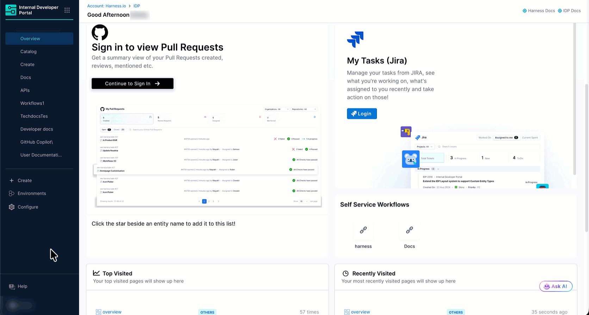
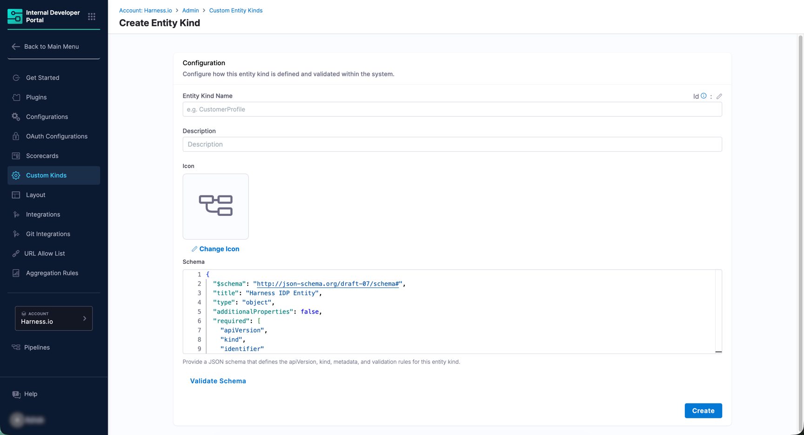
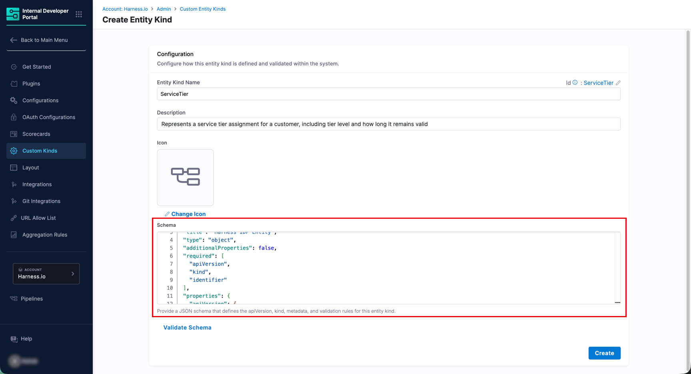
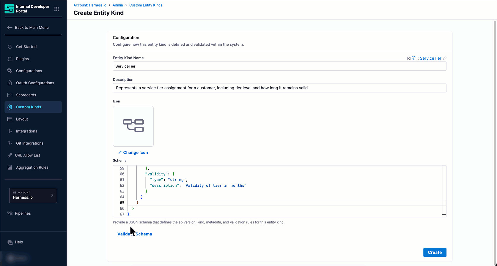

:::info
Custom Entity Kinds are managed from the **Configure** section by the Admin. Navigate to **Configure** → **Custom Kinds** in the left sidebar.
:::

## Navigate to Custom Entity Kinds

1. In Harness, open the **Internal Developer Portal**.

2. From the left sidebar, click **Configure**.

3. In the left navigation menu, click **Custom Kinds**.

   
   <center>Figure 1: The Custom Entity Kinds page</center>

   The **Custom Entity Kinds** page opens showing built-in and custom kinds (if any).

4. Click **Create Kind** at the top right.

---

## Configure the Kind

The **Configuration** section captures the kind's identity.


<center>Figure 2: Create Entity Kind - Configuration section</center>

1. Enter a name in the **Entity Kind Name** field. Use PascalCase (e.g., `CustomerProfile`, `MLModel`, `ETLJob`). This value becomes the `kind` field in catalog YAML.

   :::info
   If required, you can change the kind name after creation, but not its identifier.
   :::

2. Enter a **Description**. This appears on the kind's card on the Custom Entity Kinds page.

3. Under **Icon**, a default icon is pre-selected. Click **Change Icon** to open the icon picker and select a different one.


### Define the Schema

The **Schema** section defines the structure and validation rules for entities of this kind. It uses [JSON Schema (Draft-07)](https://json-schema.org/specification-links#draft-7).


<center>Figure 3: Create Entity Kind - Schema editor with the default schema</center>

A base schema is pre-filled in the editor. It contains the standard IDP entity fields (`apiVersion`, `kind`, `identifier`, `name`, `type`, `owner`, `spec`, and `metadata`) that every entity needs. Leave these as they are.

:::caution
Your custom fields must always go inside `spec` or `metadata` in the base schema. Adding or removing fields at the root level of the entity YAML is not supported.
:::

For example, to add a `tier` property to `metadata` and make it mandatory, update the `metadata` block in the schema like this:


```json
    "metadata": {
      "type": "object",
      "description": "Metadata of the entity",
      "additionalProperties": true,
      "required": ["tier"],
      "properties": {
        "tier": {
          "type": "string",
          "description": "Service tier, e.g. gold, silver, bronze"
        },
        "validity": {
          "type": "string",
          "description": "Validity of tier in months"
        }
      }
    }
```

---

## Validate and Create

1. Once you have configured the schema, click **Validate Schema**.

   
   <center>Figure 4: The green 'Schema is valid' banner confirming a valid schema</center>

   If the schema is valid, a green success banner appears at the top of the page. If there are errors, fix them and click **Validate Schema** again before proceeding.

2. Click **Create**. Your new kind now appears in the list of Custom Entity Kinds.

---

## Next Steps

* [Configure a layout or update the schema](./manage-custom-kind.md)
* [Create entities of your new custom kind](./create-entities.md)
