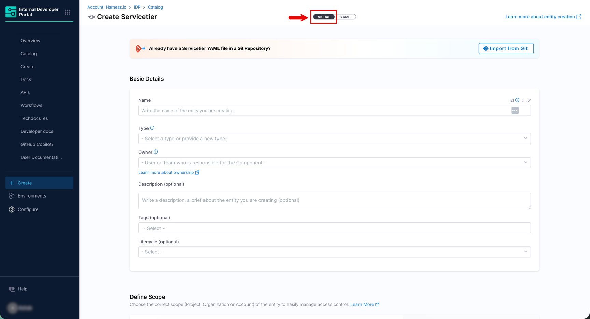
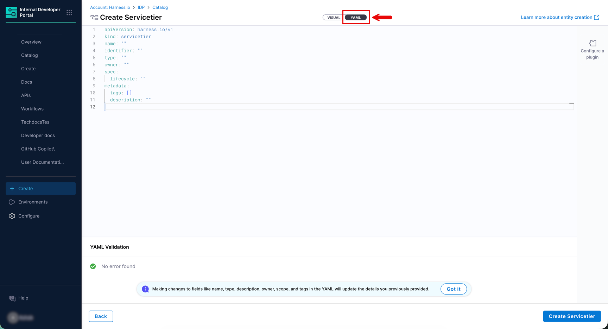
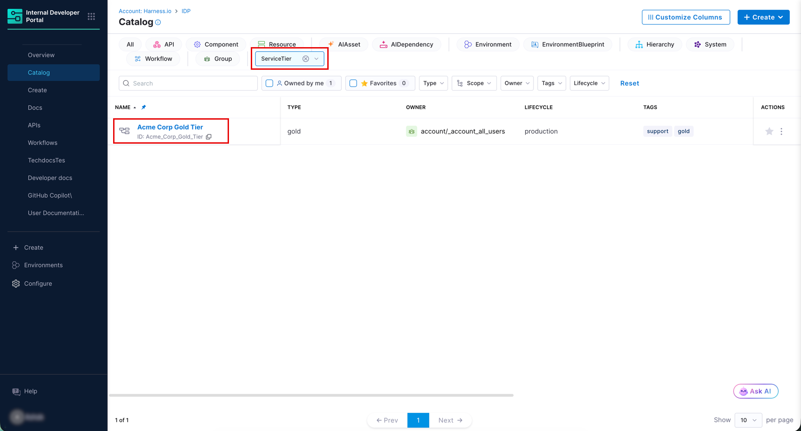

Once a custom kind exists, any user with catalog write access can create entities of that kind, through the catalog UI or via a YAML file.

<DocVideo src="https://www.youtube.com/embed/0cZwEBFM2V4" />

---

## From the Catalog UI (Visual)


<center>Figure 1: Creating Entity Visually in Catalog UI</center>

1. Go to **Catalog** and click **+ Create**.

2. Under **If you have Custom Entity Kinds**, select your kind from the dropdown.

3. Fill in the form fields: **Name**, **Type**, **Owner**, **Tags**, **Description**, **Lifecycle**, and **System**.

4. Choose the **Scope** (Account, Organization, or Project) and storage location (Inline or Remote Git).

5. Click **Review YAML** to preview the generated YAML, fix errors if any, and then click **Create Component** to finish.

---

## From a YAML file


<center>Figure 2: Creating Entity in YAML</center>

Write a YAML file where `kind` matches your custom kind name exactly (case-sensitive). All custom fields must go under `spec` or `metadata`, not at the root level.
 
```yaml
apiVersion: harness.io/v1
kind: ServiceTier
type: gold
identifier: Acme_Corp_Gold_Tier
name: Acme Corp Gold Tier
owner: group:account/_account_all_users
spec:
  lifecycle: production
metadata:
  tier: gold
  tags:
    - support
    - gold
```
 
Register this file through the catalog registration flow, the ingestion API, or by pushing it to a connected Git repository.

Your new entity will be available in the catalog as shown below:


<center>Figure 3: New Entity of Custom Kind shown in Catalog</center>

