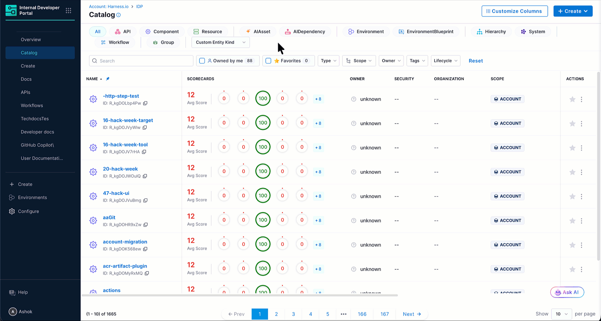
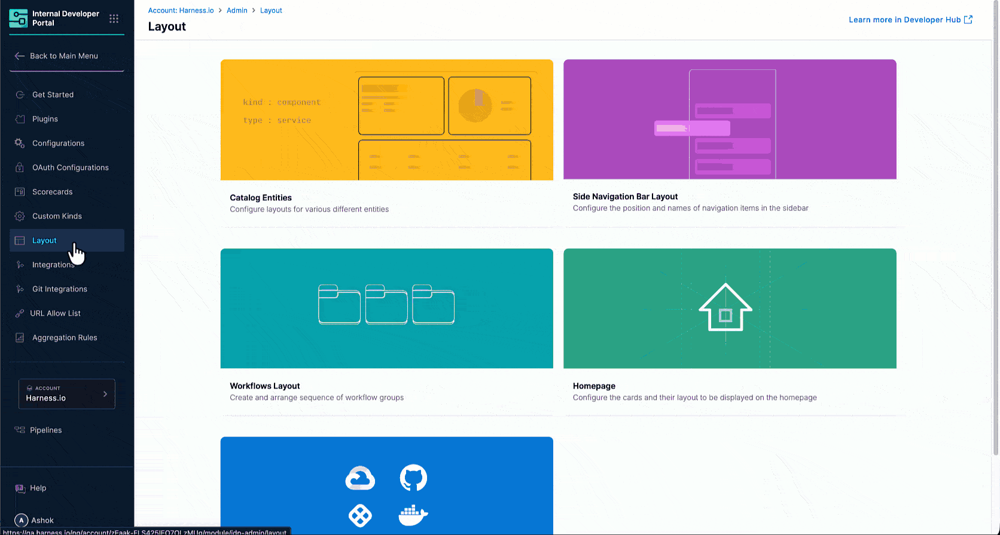
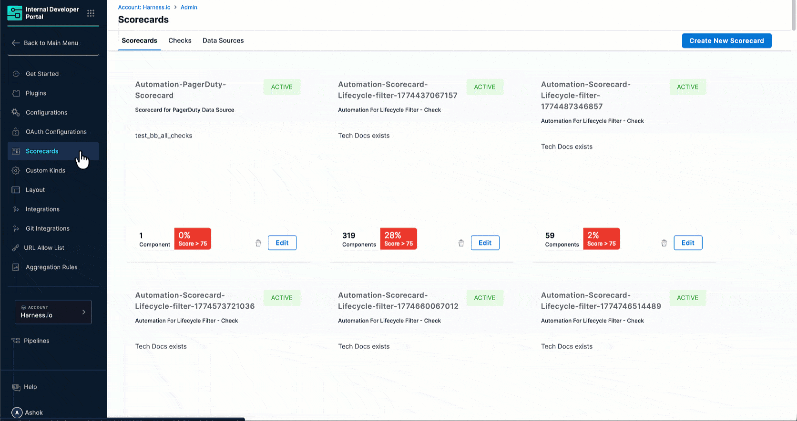

Once you create a custom kind and register entities of that kind, they are available across IDP the same way built-in kind entities are. In short, if a feature works for `Component` or `API`, it works for your custom kind too.

---

## Catalog

Custom kind entities appear in the IDP Catalog like any other entity. Users can search, filter by kind, view entity detail pages, and manage ownership and lifecycle, all the same as built-in kinds.

Figure 1: Entity of Custom Kind

---

## Layouts

You can define a dedicated catalog layout for each custom kind and scope it further by entity type. This controls what tabs and plugins appear on the entity detail page for entities of that kind.

Figure 2: Layout for Custom Kind and its Entities

To configure a layout for your custom kind, see [Manage a Custom Kind](./manage-custom-kind.md#configure-a-layout).

---

## Scorecards

Custom kind entities are fully supported in Scorecards. When creating a scorecard, select your custom kind as the target entity kind. All check types such as annotations, metadata fields, plugin data, pipeline results, work the same way they do for built-in kinds.

Figure 3: Scorecard for Custom Kind and its Entities

---

## Plugins and Ingestion APIs

[Plugins](/docs/internal-developer-portal/plugins/overview.md) that render on entity pages work with custom kind entities through the same annotation-driven approach used for built-in kinds. Add the relevant annotations to the entity's `metadata` block, then configure the plugin's visibility rules to include your custom kind.

Custom kind entities can be created and updated programmatically via the [Harness IDP Catalog Ingestion API](/docs/internal-developer-portal/catalog/integrate-tools/catalog-ingestion-api.md). The payload follows the same structure as any other entity. Just set `kind` to your custom kind name. Entities that don't conform to the kind's schema are rejected at ingestion time.

