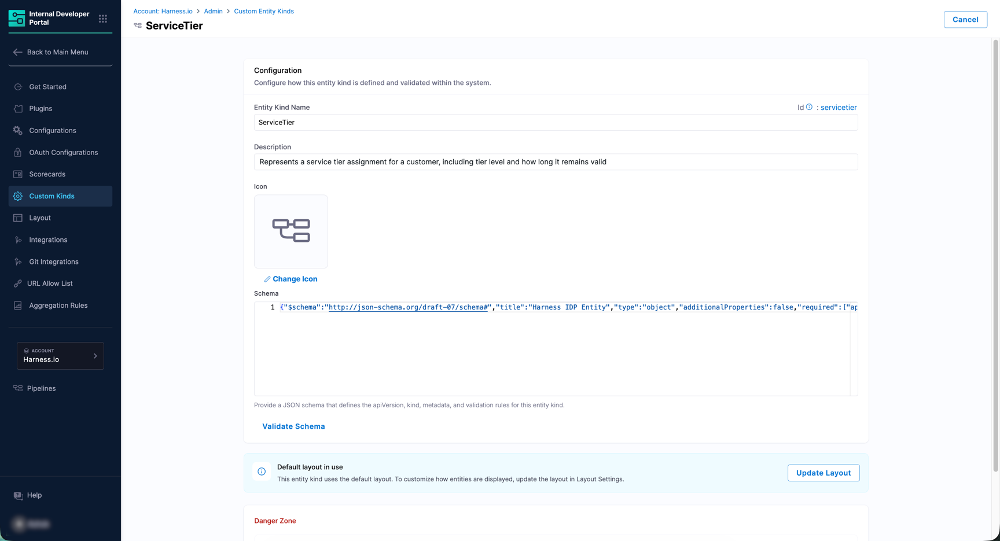
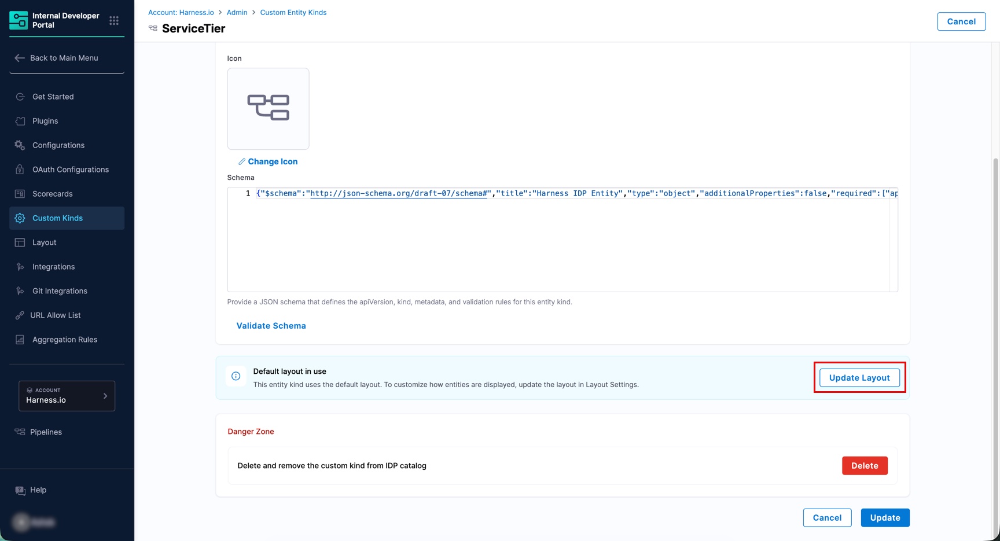
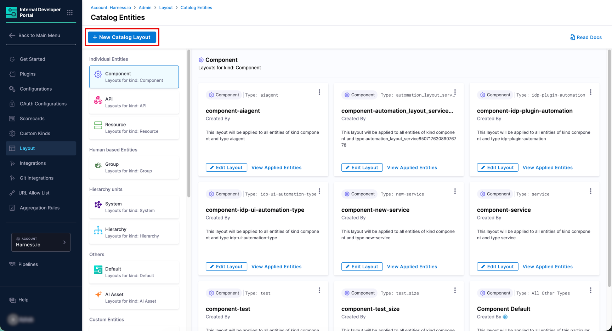
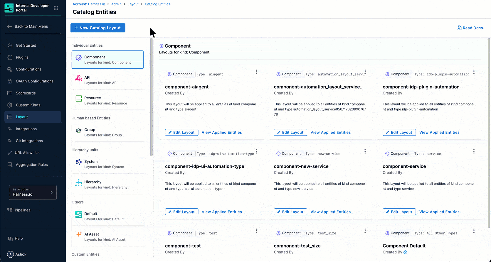
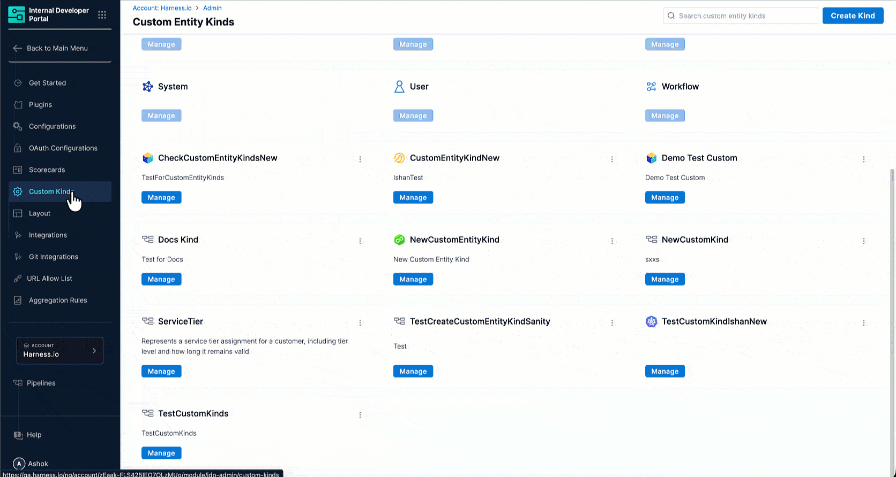

To manage an existing custom kind, go to **Custom Kinds**, find the kind in the list, and click **Manage**. The kind's management page opens showing the icon, schema editor, layout status, and more.

Figure 1: The 'Manage' page for a Custom Kind

---

## Edit the Schema or Icon

1. To change the icon, click **Change Icon** and select a new one from the picker.

2. To update the schema, edit the JSON directly in the editor, then click **Validate Schema** to confirm it is valid.

3. Click **Update** to save your changes, or **Cancel** to discard them.

:::warning What happens to existing entities
* If your updated schema makes existing entities non-conformant, you will see a warning but you can still proceed. Affected entities will show a **"kind updated: action required"** banner on their catalog page until the entity owner updates them.

* There is no schema rollback. Communicate planned schema changes to your team before applying them, and make sure entity owners know to update their records afterwards.
:::

---

## Configure a Layout

By default, entities of a custom kind use the IDP default catalog layout. The **Default layout in use** notice on the Manage page shows this status.

1. Click **Update Layout** to go to the **Catalog Entities** layout page.

   
   
Figure 2: Changing Default Layout

   Your custom kinds appear under the **Custom Entities** section in the left panel.

2. Click **+ New Catalog Layout**. A dialog opens.

   
   
Figure 3: New Layout for Custom Kind Entity

3. From the **Select Entity Kind** dropdown, choose your custom kind. Both built-in and custom kinds are listed here.

4. In the **Specify Entity Type** field, enter an entity type to scope this layout to a specific type (e.g., `library`).

   
   
Figure 4: Specifying an Entity Type for the Layout

   :::info
   Entity type is case-insensitive and comes from `spec.type` in the catalog entity YAML. Leave this field empty to apply the layout to all types of this kind.
   :::

5. Click **Continue** to open the [layout editor](/docs/internal-developer-portal/layout-and-appearance/catalog.md#layout-editor) and build your layout.

---

## Delete a Kind

:::danger
Deleting a kind permanently removes it from the catalog along with all its entities, layout configuration, scorecard configurations, and related settings. This action cannot be undone.
:::

You can delete a kind in two ways:

* **From the Kinds' listing page** - Hover over the kind's card, click the **⋮** context menu, and click **Delete**.
* **From the Manage page** - Scroll to the **Danger Zone** section and click the red **Delete** button.

Either way, a confirmation dialog appears showing an **Entities affected** list so you can see exactly what will be removed.

   
   
Figure 5: Deletion of Custom Kind

Click **Delete** to confirm, or **Cancel** to go back.

